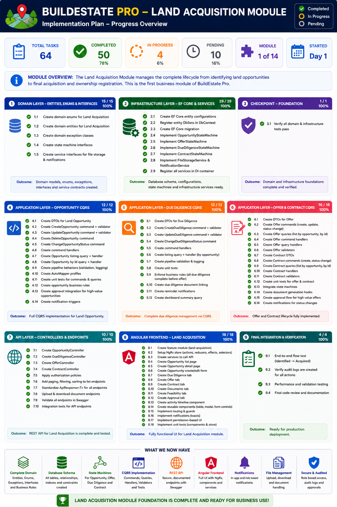
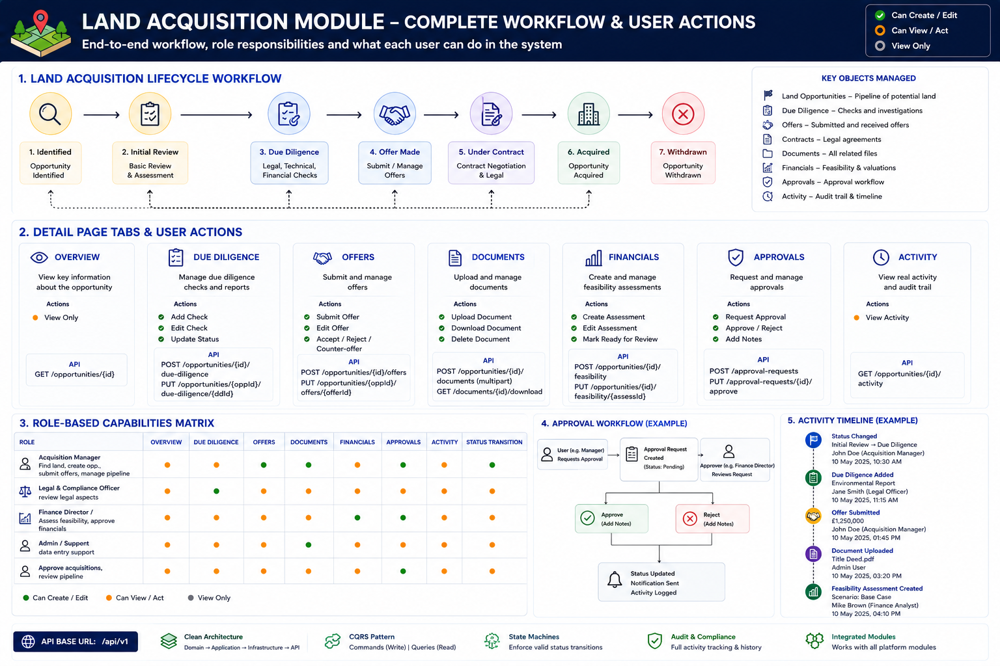
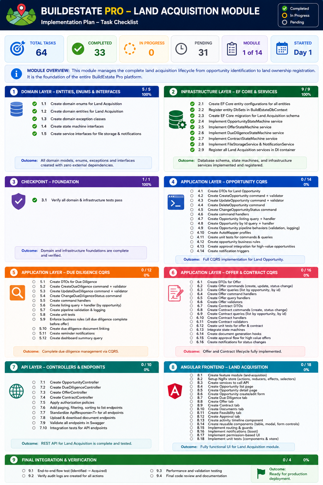

# Land Acquisition Module — Complete Reference

[← Back to Main README](../../README.md)

---

## Module Overview

The Land Acquisition module is the **foundation module** of BuildEstate Pro. Every development project starts here — finding, evaluating, and purchasing land before anything else can happen.

---

## What This Module Does

It manages the entire journey of a land opportunity:

1. **Identify** — A potential site is found
2. **Review** — Initial assessment of viability
3. **Due Diligence** — Legal, environmental, planning, and financial checks
4. **Offer** — Formal offer submitted and negotiated
5. **Contract** — Contracts exchanged, legal completion in progress
6. **Acquired** — Purchase complete, land registered

At any point, an opportunity can be **Withdrawn** (with a recorded reason).

---

## Complete Workflow & User Actions

This diagram shows:
- The 7 lifecycle statuses with transition paths
- Every tab on the detail page and what actions each contains
- The API endpoints used by each feature
- The role-based capabilities matrix (who can do what)
- The approval workflow (Request → Review → Approve/Reject)
- An example activity timeline showing all tracked events

---

## Implementation Plan

---

## Key Roles

| Role | Responsibilities |
|------|-----------------|
| **Acquisition Manager** | Finds land, creates opportunities, submits offers, manages pipeline |
| **Legal & Compliance Officer** | Conducts due diligence (legal, environmental, planning), reviews contracts |
| **Finance Director** | Creates feasibility assessments, approves investments |
| **Valuation Analyst** | Financial analysis, ROI calculations |
| **Admin / Support** | Document uploads, data entry |
| **Project Director** | Reviews pipeline, approves acquisitions |

---

## Pages & Features

| Page | Purpose |
|------|---------|
| **Dashboard** | KPI overview — cycle time, conversion rate, DD pass rate, pipeline summary |
| **Pipeline** | Kanban board — all opportunities arranged by status columns |
| **Opportunities List** | Searchable, filterable, sortable data grid |
| **Create Opportunity** | Form to capture new land leads |
| **Opportunity Detail** | Full detail view with 7 tabs (Overview, DD, Offers, Documents, Financials, Activity, Approvals) |

---

## Detail Page Tabs

| Tab | What's Inside | Actions Available |
|-----|---------------|-------------------|
| **Overview** | Opportunity details + Land Owner info | View |
| **Due Diligence** | Legal, Environmental, Planning, Utilities, Valuation checks | Add Check, Edit Status |
| **Offers** | All submitted offers with negotiation history | Submit Offer, Accept, Reject, Counter |
| **Documents** | Uploaded files (title deeds, reports, contracts) | Upload, Download, Delete |
| **Financials** | Feasibility assessment with costs/revenue/profit/ROI | Create, Edit, Mark Ready for Review |
| **Activity** | Timeline of all actions taken | View |
| **Approvals** | Investment approval requests and decisions | Request Approval, Approve, Reject |

---

## Data Entities

| Entity | Key Fields |
|--------|-----------|
| **LandOpportunity** | Name, Location, LandSize, Status, Source, ExpectedAcquisition |
| **LandOwner** | Name, ContactDetails, Address, OwnershipType |
| **DueDiligence** | Type, Status, Findings, ReportDate |
| **Offer** | Amount, Currency, OfferDate, ValidUntil, Status, CounterOfferAmount |
| **Document** | DocType, FileName, FilePath, ContentType, FileSizeBytes |
| **FeasibilityAssessment** | LandCost, BuildCost, Fees, FinanceCosts, Revenue, Profit, ROI, Scenario |
| **ApprovalRequest** | RequestedAmount, Status, ApprovalNotes, RejectionReason |

---

## API Endpoints

| Endpoint | Method | Purpose |
|----------|--------|---------|
| `/api/v1/opportunities` | GET | List all (paginated, filtered) |
| `/api/v1/opportunities` | POST | Create new opportunity |
| `/api/v1/opportunities/{id}` | GET | Get full detail with all related entities |
| `/api/v1/opportunities/{id}` | PUT | Update opportunity |
| `/api/v1/opportunities/{id}` | DELETE | Soft-delete |
| `/api/v1/opportunities/{id}/status` | PATCH | Transition status |
| `/api/v1/opportunities/{id}/due-diligence` | POST | Add DD check |
| `/api/v1/opportunities/{id}/due-diligence/{ddId}/status` | PATCH | Update DD status |
| `/api/v1/opportunities/{id}/offers` | POST | Submit offer |
| `/api/v1/opportunities/{id}/offers/{offerId}/status` | PATCH | Accept/Reject/Counter offer |
| `/api/v1/opportunities/{id}/documents` | POST | Upload document |
| `/api/v1/opportunities/{id}/documents/{docId}/download` | GET | Download document |
| `/api/v1/opportunities/{id}/feasibility` | POST | Create/Update feasibility |
| `/api/v1/approvals` | POST | Request approval |
| `/api/v1/approvals/{id}` | PATCH | Approve or reject |
| `/api/v1/dashboard/metrics` | GET | Dashboard KPIs |

---

## Detailed Developer Notes

For in-depth technical documentation, see these files:

| Document | Content |
|----------|---------|
| [00-INDEX.md](00-INDEX.md) | Table of contents and quick stats |
| [01-OVERVIEW.md](01-OVERVIEW.md) | Big picture — what the module does |
| [02-DATA-FOUNDATIONS.md](02-DATA-FOUNDATIONS.md) | Database entities, relationships, and constraints |
| [03-BUSINESS-RULES.md](03-BUSINESS-RULES.md) | State machines, validation rules, automation |
| [04-BACKEND-OPERATIONS.md](04-BACKEND-OPERATIONS.md) | CQRS commands, queries, handlers |
| [05-API-ENDPOINTS.md](05-API-ENDPOINTS.md) | Full API reference with request/response examples |
| [06-FRONTEND.md](06-FRONTEND.md) | Angular components, NgRx store, routing |
| [07-TESTING.md](07-TESTING.md) | Property-based tests, integration tests |
| [08-INTEGRATION.md](08-INTEGRATION.md) | Background services, notifications, audit |
| [09-SIGN-OFF-CHECKLIST.md](09-SIGN-OFF-CHECKLIST.md) | Stakeholder sign-off criteria |

---

## User Onboarding

For a non-technical user guide on how to use this module day-to-day, see:

📖 [**Staff Onboarding Guide — Land Acquisition**](../../docs/onboarding-land-module.md)

---

## What Must Be Complete Before Next Module

Before moving an opportunity to the Planning & Approvals module:

- [ ] Status must be **Acquired**
- [ ] All due diligence checks **Completed**
- [ ] At least one **accepted offer**
- [ ] Feasibility assessment exists and is **Ready for Review**
- [ ] Required documents uploaded (Title Deed minimum)
- [ ] Approval request **Approved** by Finance Director

---

[← Back to Main README](../../README.md)
