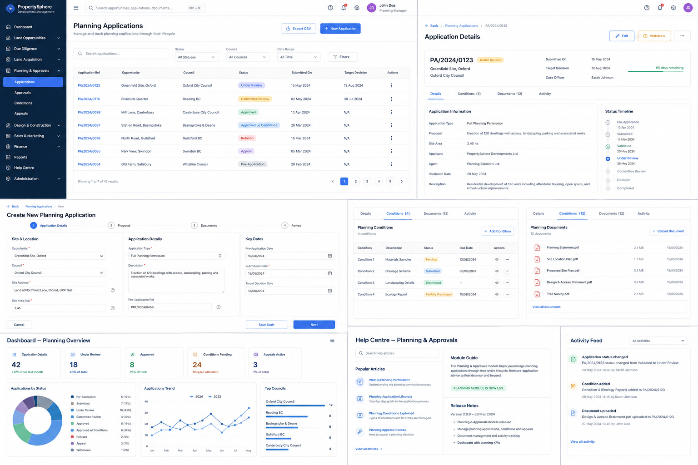
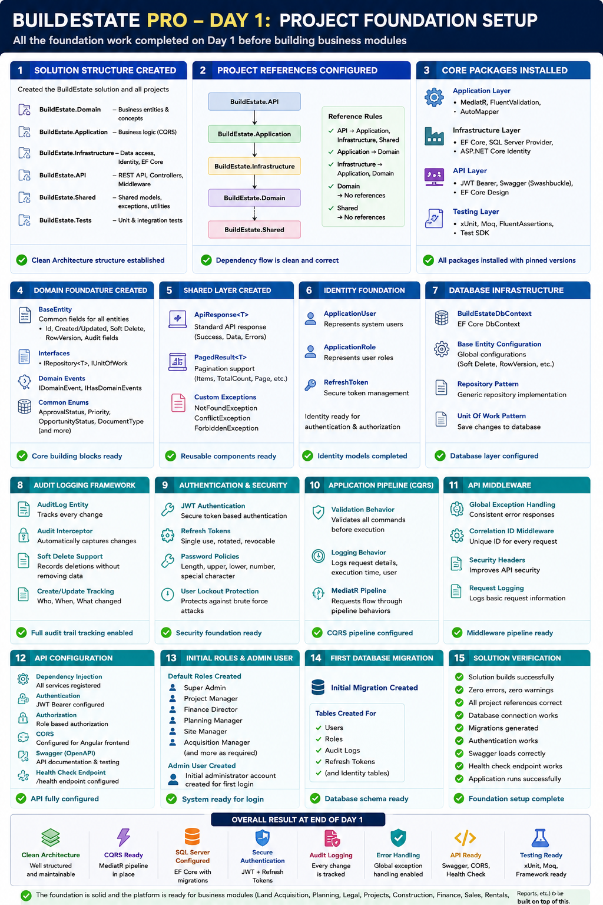

# 📖 BuildEstate Pro — Documentation Portal

> Welcome to the BuildEstate Pro Documentation Portal. This is the central navigation hub for all technical, architectural, and product documentation. Whether you're an architect reviewing the system design, a developer onboarding to a module, or a stakeholder exploring the product vision — start here.

---

## 🗺️ Navigation Map

### 🏗️ Architecture & System Design

| Document | Description |
|----------|-------------|
| [Master Architecture](ARCHITECTURE.md) | Clean Architecture, CQRS, layers, dependency flow, module boundaries |
| [Module Design](MODULE-DESIGN.md) | Module structure patterns, entity design, integration contracts |
| [Implementation Log](IMPLEMENTATION-LOG.md) | Chronological record of what was built and when |

---

### 🔒 Security & Authorization

| Document | Description |
|----------|-------------|
| [Security Master Document](../developer-notes/Security-authentication-authorization-feature/security-authentication-authorization-full-feature-details.md) | JWT, RBAC, 43 permissions, session management, policy enforcement |
| [Security Architecture Image](../developer-notes/Security-authentication-authorization-feature/security-authentication-authorization-feature.png) | Visual overview of the security architecture |

---

### 🔍 Global Search

| Document | Description |
|----------|-------------|
| [Frontend Architecture](features/global-search-front-end-features.md) | Components, NgRx, services, accessibility, performance |
| [Backend Architecture](features/global-search-back-end-features.md) | Providers, scoring, aggregation, caching, security |
| [Developer Guide — Adding Search](guides/adding-search-to-new-module.md) | Step-by-step guide for registering new modules |
| [Search Provider Template](templates/search-provider-template.md) | Copy-and-fill template for new providers |
| [Search Relevancy](search/search-relevancy.md) | Scoring algorithms, field weights, boosting rules |
| [Search Architecture (Backend)](backend/search-architecture.md) | Infrastructure-level search design |
| [Implementation Proof](audits/global-search-implementation-proof.md) | Audit evidence of search implementation |

---

### 🔔 Notifications

| Document | Description |
|----------|-------------|
| [Enterprise Notification System](../developer-notes/notification-system-module/enterprise-notification-system.md) | Rule-based engine, templates, admin UI, delivery audit |

---

### 👥 User Management

| Document | Description |
|----------|-------------|
| [User Management Feature](../developer-notes/user-management-feature/README.md) | Enterprise identity console, roles, bulk ops, sessions |
| [User Management Overview](user-management-feature.md) | Feature summary and capabilities |
| [Role Definitions](RoleName.md) | All 13 enterprise roles with responsibilities |

---

### 🏞️ Business Modules

| Module | Master Document | Description |
|--------|----------------|-------------|
| Land Acquisition | [developer-notes/land-acquisition-module/](../developer-notes/land-acquisition-module/00-INDEX.md) | Pipeline, due diligence, offers, contracts, feasibility |
| Planning & Approvals | [developer-notes/planning-approvals-module/](../developer-notes/planning-approvals-module/) | Applications, conditions, milestones, council submissions |
| Legal & Compliance | [docs/legal-compliance/](legal-compliance/README.md) | Cases, contracts, compliance, insurance, retention |

---

### 🎨 Design System & Frontend

| Document | Description |
|----------|-------------|
| [Executive Summary](frontend/showcase/00-EXECUTIVE-SUMMARY.md) | 49 components, 188 tests, 28 correctness proofs |
| [Architecture Deep Dive](frontend/showcase/01-ARCHITECTURE-DEEP-DIVE.md) | Standalone components, theming, barrel exports |
| [Component Showcase](frontend/showcase/02-COMPONENT-SHOWCASE.md) | Visual tour of every component category |
| [Accessibility & UX](frontend/showcase/03-ACCESSIBILITY-AND-UX.md) | WCAG 2.1 AA compliance, keyboard nav, screen readers |
| [Testing & Correctness](frontend/showcase/04-TESTING-AND-CORRECTNESS.md) | Property-based testing with fast-check |
| [Governance & Process](frontend/showcase/05-GOVERNANCE-AND-PROCESS.md) | Review checklist, PR gates, duplication rules |
| [Developer Quick Start](frontend/showcase/06-DEVELOPER-QUICK-START.md) | How to use the design system in your module |
| [Component Catalog](frontend/component-catalog.md) | Full inventory of all shared components |
| [Component Library](frontend/component-library.md) | Detailed component documentation |
| [Component Governance](frontend/component-governance.md) | Rules for creating and maintaining components |
| [Design System Overview](frontend/design-system.md) | Tokens, themes, scale, spacing |
| [Global Search (Frontend)](frontend/global-search.md) | Search overlay component documentation |
| [UX Modal-First Review](ux/modal-first-review.md) | Modal-based workflow design decisions |

---

### 🛠️ Developer Portal

| Document | Description |
|----------|-------------|
| [Adding Search to a New Module](guides/adding-search-to-new-module.md) | Step-by-step developer guide |
| [Search Provider Template](templates/search-provider-template.md) | Boilerplate template for new search providers |
| [Setup Commands](../SETUP-COMMANDS.md) | Getting started — build, run, seed, test |
| [Project Foundation (Day 1)](../developer-notes/Project%20Foundation%20Setup%20-%20day%201.md) | Initial project scaffolding notes |

---

### 📊 Product Vision & Roadmap

| Document | Description |
|----------|-------------|
| [Project Vision](PROJECT-VISION.md) | Why BuildEstate Pro exists, business context, target market |
| [Future Application Map](FUTURE-APPLICATION-MAP.md) | Planned modules, integrations, expansion roadmap |
| [Reported Bugs](reported-bugs.md) | Known issues and bug tracking |

---

### ⚖️ Legal & Compliance Module Documentation

| Document | Description |
|----------|-------------|
| [Module Guide](legal-compliance/module-guide.md) | Architecture, entities, workflows |
| [User Guide](legal-compliance/user-guide.md) | End-user instructions |
| [Workflow Guide](legal-compliance/workflow-guide.md) | Status transitions, approval flows |
| [API Reference](legal-compliance/api-reference.md) | Endpoints, request/response contracts |
| [Role & Permissions](legal-compliance/role-permissions.md) | Who can do what |
| [FAQ](legal-compliance/faq.md) | Frequently asked questions |
| [Release Notes](legal-compliance/release-notes.md) | Version history and changes |

---

## ⚡ Quick Links

| Area | Master Document | Status | Description |
|------|----------------|--------|-------------|
| Architecture | [ARCHITECTURE.md](ARCHITECTURE.md) | ✅ Complete | System-wide architecture decisions |
| Security | [Security Feature](../developer-notes/Security-authentication-authorization-feature/security-authentication-authorization-full-feature-details.md) | ✅ Complete | JWT, RBAC, 43 permissions |
| Global Search | [Frontend](features/global-search-front-end-features.md) / [Backend](features/global-search-back-end-features.md) | ✅ Complete | 7-layer scoring, 14 providers |
| Notifications | [Notification System](../developer-notes/notification-system-module/enterprise-notification-system.md) | ✅ Complete | Rule-based, template-driven engine |
| User Management | [User Management](../developer-notes/user-management-feature/README.md) | ✅ Complete | Identity console, 13 roles |
| Land Acquisition | [Land Module](../developer-notes/land-acquisition-module/00-INDEX.md) | ✅ Complete | Full lifecycle — pipeline to registry |
| Planning & Approvals | [Planning Module](../developer-notes/planning-approvals-module/) | ✅ Complete | Applications, conditions, appeals |
| Legal & Compliance | [Legal Module](legal-compliance/README.md) | ✅ Complete | Cases, contracts, compliance |
| Design System | [Executive Summary](frontend/showcase/00-EXECUTIVE-SUMMARY.md) | ✅ Complete | 49 components, WCAG 2.1 AA |
| Product Vision | [PROJECT-VISION.md](PROJECT-VISION.md) | ✅ Complete | Business context and goals |
| Future Roadmap | [FUTURE-APPLICATION-MAP.md](FUTURE-APPLICATION-MAP.md) | ✅ Complete | Planned modules and integrations |

---

## 🖼️ Architecture & Feature Gallery

| Image | Description |
|-------|-------------|
|  | Original project vision and module map |
|  | Full detail of all 14 project domains |
|  | User workflow across all lifecycle phases |
|  | Land Acquisition module deep dive |
|  | Planning & Approvals module architecture |
|  | Handover & value realisation process |
|  | Full planning application module details |
|  | Security architecture diagram |
|  | Framework implementation plan |
|  | Notification engine architecture |
|  | User management listing page |

---

## 📏 No Duplication Rule

> **Each topic has ONE master document. All other references link to it.**

This documentation portal follows a strict single-source-of-truth principle:

1. Every architectural decision, feature specification, and module design lives in exactly **one** master file.
2. All other documents that reference that topic **link** to the master — they do not copy, summarise, or paraphrase it.
3. When updating information, update the **master document only**. All links remain correct automatically.
4. If you find duplicate content, raise it immediately — consolidate into the master and replace duplicates with links.

This ensures documentation never drifts out of sync, reduces maintenance burden, and guarantees that anyone reading any document is seeing the current truth.

---

## 🧭 How to Use This Portal

- **New to the project?** Start with [Project Vision](PROJECT-VISION.md) → [Architecture](ARCHITECTURE.md) → [Setup Commands](../SETUP-COMMANDS.md)
- **Building a new module?** Read [Module Design](MODULE-DESIGN.md) → [Developer Quick Start](frontend/showcase/06-DEVELOPER-QUICK-START.md) → [Adding Search](guides/adding-search-to-new-module.md)
- **Working on frontend?** Start with [Component Catalog](frontend/component-catalog.md) → [Design System](frontend/design-system.md)
- **Reviewing security?** Go to [Security Master Document](../developer-notes/Security-authentication-authorization-feature/security-authentication-authorization-full-feature-details.md)
- **Understanding a module?** Use the Business Modules section above to find the master document

---

*Last updated: July 2025*
