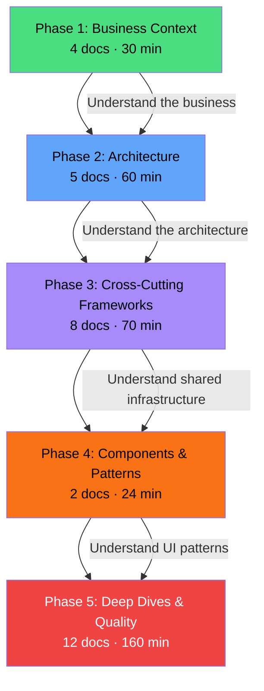

# BuildEstate Pro — Developer Academy Learning Path

**Estimated Reading Time:** 5 minutes

---

## WHY

BuildEstate Pro is an enterprise platform with 14 modules, cross-cutting frameworks, and strict architectural standards. Jumping into code without understanding the business domain, architecture decisions, and established patterns leads to wasted effort and rejected PRs. This learning path provides a structured progression from business context through architecture to hands-on implementation. Follow it sequentially and you'll be productive within a week.

---

## WHAT

The academy is organized into 5 progressive phases. Each phase builds upon the previous one. Start at Phase 1 regardless of experience level — understanding the business domain is essential for making correct architectural decisions.

### Learning Progression



---

## HOW

### Phase 1: Business Context (30 minutes)

**Purpose:** Understand what BuildEstate Pro does, who uses it, and why it exists. You cannot build correct software without understanding the business domain.

**Prerequisites:** None — start here.

| # | Document | Reading Time |
|---|----------|-------------|
| 01 | [Business Vision](./01-business-vision.md) | 8 min |
| 02 | [Property Development Lifecycle](./02-property-development-lifecycle.md) | 8 min |
| 03 | [Users and Personas](./03-users-and-personas.md) | 7 min |
| 04 | [Enterprise Capabilities](./04-enterprise-capabilities.md) | 7 min |

**After this phase you can:** Explain the platform's purpose, name the 14 modules, identify the key user roles, and describe the end-to-end property development workflow.

---

### Phase 2: Architecture (60 minutes)

**Purpose:** Understand the technical decisions, layered architecture, CQRS pattern, and state management approach. These decisions inform every line of code you write.

**Prerequisites:** Phase 1 (Business Context)

| # | Document | Reading Time |
|---|----------|-------------|
| 05 | [Architecture Philosophy](./05-architecture-philosophy.md) | 12 min |
| 06 | [Technology Decisions](./06-technology-decisions.md) | 10 min |
| 07 | [Clean Architecture Explained](./07-clean-architecture-explained.md) | 14 min |
| 08 | [CQRS and MediatR](./08-cqrs-and-mediatr.md) | 14 min |
| 09 | [NgRx and State Management](./09-ngrx-and-state-management.md) | 10 min |

**After this phase you can:** Explain why Clean Architecture was chosen, describe the CQRS pattern, identify which layer code belongs in, and explain how NgRx manages frontend state.

---

### Phase 3: Cross-Cutting Frameworks (70 minutes)

**Purpose:** Understand the shared infrastructure that every module uses — security, search, notifications, audit, documents, state machines, and error handling.

**Prerequisites:** Phase 2 (Architecture)

| # | Document | Reading Time |
|---|----------|-------------|
| 10 | [Cross-Cutting Framework Overview](./10-cross-cutting-framework.md) | 8 min |
| 11 | [Security Framework](./11-security-framework.md) | 10 min |
| 12 | [Search Framework](./12-search-framework.md) | 10 min |
| 13 | [Notification Framework](./13-notification-framework.md) | 8 min |
| 14 | [Audit Framework](./14-audit-framework.md) | 8 min |
| 15 | [Document Framework](./15-document-framework.md) | 8 min |
| 16 | [State Machines](./16-state-machines.md) | 10 min |
| 17 | [Error Handling Framework](./17-error-handling-framework.md) | 8 min |

**After this phase you can:** Implement audit logging, register a search provider, trigger notifications, manage state transitions, handle errors correctly, and enforce security policies.

---

### Phase 4: Components & Patterns (24 minutes)

**Purpose:** Understand the reusable UI component library and the standard module implementation pattern. These ensure consistency across all 14 modules.

**Prerequisites:** Phase 3 (Cross-Cutting Frameworks)

| # | Document | Reading Time |
|---|----------|-------------|
| 18 | [Reusable Components](./18-reusable-components.md) | 12 min |
| 19 | [Module Pattern](./19-module-pattern.md) | 12 min |

**After this phase you can:** Use shared design system components, follow the standard module structure, avoid duplicating existing components, and implement a feature end-to-end following established patterns.

---

### Phase 5: Deep Dives & Quality (160 minutes)

**Purpose:** Study implemented modules in detail, learn how to build new modules, understand quality standards, and prepare for production deployment.

**Prerequisites:** Phase 4 (Components & Patterns)

| # | Document | Reading Time |
|---|----------|-------------|
| 20 | [Land Acquisition Deep Dive](./20-land-acquisition-deep-dive.md) | 20 min |
| 21 | [Planning & Approvals Deep Dive](./21-planning-deep-dive.md) | 18 min |
| 22 | [Legal & Compliance Deep Dive](./22-legal-compliance-deep-dive.md) | 18 min |
| 23 | [User Management Deep Dive](./23-user-management-deep-dive.md) | 16 min |
| 24 | [How to Build the Next Module](./24-how-to-build-the-next-module.md) | 18 min |
| 25 | [Definition of Done](./25-definition-of-done.md) | 8 min |
| 26 | [Common Mistakes](./26-common-mistakes.md) | 12 min |
| 27 | [Code Review Checklist](./27-code-review-checklist.md) | 10 min |
| 28 | [Debugging Guide](./28-debugging-guide.md) | 14 min |
| 29 | [Testing Strategy](./29-testing-strategy.md) | 14 min |
| 30 | [Production Readiness](./30-production-readiness.md) | 10 min |
| 31 | [Future Roadmap](./31-future-roadmap.md) | 10 min |

**After this phase you can:** Build a new module from scratch following the 8-phase playbook, write comprehensive tests, pass code reviews, debug full-stack issues, and ship production-ready code.

---

## WHEN

- **Day 1-2 (New Developer):** Complete Phases 1-3 (business, architecture, frameworks)
- **Day 3 (New Developer):** Complete Phase 4 (components & patterns)
- **Day 4-5 (New Developer):** Work through Phase 5 documents relevant to your assigned module
- **Ongoing reference:** Use docs 24-31 as daily reference during feature development
- **Before code review:** Re-read doc 27 (Code Review Checklist)
- **Before shipping:** Re-read docs 25 and 30 (DoD and Production Readiness)

---

## WHERE

### Codebase Location

| Resource | Path |
|----------|------|
| All Academy Documents | `docs/academy/` |
| This Learning Path | `docs/academy/00-learning-path.md` |
| Backend Source | `src/BuildEstate.Domain/`, `src/BuildEstate.Application/`, `src/BuildEstate.Infrastructure/`, `src/BuildEstate.API/` |
| Frontend Source | `client-app/src/app/` |
| Steering Documents | `.kiro/steering/` |
| Spec Documents | `.kiro/specs/` |

---

## WHO

| Audience | Recommended Path |
|----------|-----------------|
| New Backend Developer | Phases 1 → 2 → 3 → 5 (docs 20, 24, 25, 26, 27, 29) |
| New Frontend Developer | Phases 1 → 2 → 3 → 4 → 5 (docs 20, 24, 25, 26, 27, 29) |
| New Full-Stack Developer | All phases sequentially |
| Tech Lead / Architect | Phases 1 → 2, then docs 24, 25, 27, 30, 31 |
| QA Engineer | Phases 1 → 2, then docs 25, 28, 29 |
| AI Coding Agent | All phases (required context for correct code generation) |

---

## WHAT NEXT

Start with Phase 1:
- [Business Vision](./01-business-vision.md) — Your first document

Quick reference links:
- [How to Build the Next Module](./24-how-to-build-the-next-module.md) — When you're ready to code
- [Code Review Checklist](./27-code-review-checklist.md) — Before submitting a PR
- [Common Mistakes](./26-common-mistakes.md) — Avoid these pitfalls

---

## Integration Steps

1. **Bookmark this page** — Return here whenever you need to find a specific topic
2. **Follow sequentially** — Resist the urge to skip to Phase 5 without the foundation
3. **Practice alongside** — Open the codebase while reading deep dive documents
4. **Ask questions** — If something is unclear, the answer is likely in an earlier phase
5. **Contribute back** — If you find gaps, update the relevant document

### Verification — Backend builds after reading Phase 2+

```csharp
// After completing Phase 2, you should understand why this follows Clean Architecture:
// Controller (API Layer) → MediatR (Application Layer) → Entity (Domain Layer)
[HttpGet("{id:guid}")]
public async Task<IActionResult> GetById(Guid id, CancellationToken cancellationToken)
{
    var query = new GetOpportunityByIdQuery { Id = id };
    var result = await _mediator.Send(query, cancellationToken);
    return result is not null ? Ok(result) : NotFound();
}
```

### Verification — Frontend patterns after reading Phase 3+

```typescript
// After completing Phase 3, you should understand why effects handle side effects:
loadOpportunities$ = createEffect(() =>
  this.actions$.pipe(
    ofType(OpportunityActions.loadOpportunities),
    switchMap(({ params }) =>
      this.service.getAll(params).pipe(
        map(response => OpportunityActions.loadOpportunitiesSuccess({ data: response })),
        catchError(error => of(OpportunityActions.loadOpportunitiesFailure({ error: error.message })))
      )
    )
  )
);
```

---

## Total Academy Statistics

| Metric | Value |
|--------|-------|
| Total Documents | 31 |
| Total Reading Time | ~344 minutes (~5.7 hours) |
| Phase 1 (Business) | 4 docs, 30 min |
| Phase 2 (Architecture) | 5 docs, 60 min |
| Phase 3 (Frameworks) | 8 docs, 70 min |
| Phase 4 (Patterns) | 2 docs, 24 min |
| Phase 5 (Deep Dives) | 12 docs, 160 min |

---

## Common Mistakes

### Mistake 1: Skipping Business Context (Phase 1)

❌ **WRONG**

```
Developer: "I'm experienced with Angular and .NET, I'll skip to the code."
Result: Builds features that don't match business workflows.
         Names entities incorrectly. Misses domain-specific validation.
         PR rejected because state machine doesn't reflect real lifecycle.
```

✅ **CORRECT**

```
Developer: "Let me understand the property development lifecycle first."
Result: Correctly models opportunity → DD → offer → contract → acquisition.
         Uses correct business terminology. Validates against real constraints.
         Understands why the state machine prevents skipping due diligence.
```

### Mistake 2: Not Using the Playbook for New Modules

❌ **WRONG**

```
Developer: "I'll figure out the module structure as I go."
Result: Creates domain entities without audit columns.
         Forgets to register search provider.
         Skips FluentValidation validators.
         Builds Angular pages without NgRx state management.
         PR rejected at 10 different checkpoints.
```

✅ **CORRECT**

```
Developer: "Let me follow the 8-phase playbook in doc 24."
Phase 1: Domain entities with BaseAuditableEntity ✅
Phase 2: EF configuration with indexes ✅
Phase 3: CQRS with validators ✅
Phase 4: Thin controller with auth ✅
Phase 5: Typed Angular service + NgRx ✅
Phase 6: Pages with loading/empty/error states ✅
Phase 7: Audit + search + notifications ✅
Phase 8: All tests pass, DoD met ✅
```
