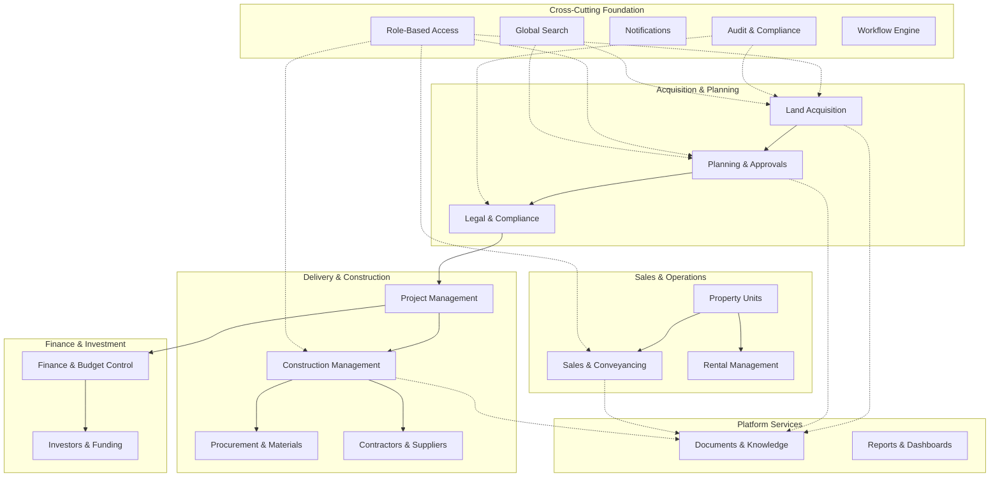

# Business Vision

> **Estimated Reading Time:** 8 minutes

## WHY

Real estate development is one of the most capital-intensive, multi-disciplinary, and risk-laden industries in the world. A single project spans years, involves dozens of stakeholders, crosses legal and financial boundaries, and requires meticulous coordination from land identification through to long-term asset management.

Despite this complexity, most real estate developers still operate with fragmented systems — spreadsheets for finance, separate email threads for legal, standalone project management tools for construction, and disconnected CRMs for sales. The result is poor visibility, duplicated effort, lost documents, missed deadlines, compliance gaps, and ultimately, eroded profit margins.

**BuildEstate Pro** exists to solve this fragmentation problem. It provides a single, integrated platform where every phase of property development is managed, tracked, audited, and reported — from identifying a land opportunity through construction, sales, handover, and long-term asset operations. The platform tagline captures this ambition:

> *"End-to-End Management of Real Estate Development Projects — From Land to Legacy"*

Without a unified system, developers face:

- **Information silos** — each department works in isolation with no shared data
- **Decision delays** — executives lack real-time visibility into project health
- **Compliance risk** — audit trails are incomplete or non-existent
- **Cost overruns** — budget tracking happens after the fact, not in real-time
- **Sales leakage** — leads fall through cracks between disconnected tools
- **Knowledge loss** — when staff leave, institutional knowledge leaves with them

BuildEstate Pro eliminates these problems by providing a single source of truth for the entire property development lifecycle.

## WHAT

BuildEstate Pro is a **corporate enterprise SaaS platform** built for real estate developers who manage the full lifecycle of property development projects. It is not a simple project management tool or a basic CRM — it is a purpose-built platform that understands the unique workflows, regulations, and data relationships of property development.

### Target Market

The primary users are **property development companies** that:

- Acquire land and manage planning applications
- Build residential, commercial, or mixed-use developments
- Sell or lease completed units
- Manage ongoing property operations and maintenance
- Report to investors and comply with regulatory standards

### Business Value Propositions

BuildEstate Pro delivers seven core value propositions to its users:

| # | Value Proposition | Business Impact |
|---|-------------------|-----------------|
| 1 | **360° Project Visibility** | Executives see every project's status, risks, and financials in real-time |
| 2 | **Better Cost Control** | Budget vs. actual tracking prevents cost overruns before they escalate |
| 3 | **On-Time Delivery** | Milestone tracking and alerts keep construction on schedule |
| 4 | **Risk Management** | Risks are identified, scored, and escalated systematically |
| 5 | **Higher Sales Performance** | Integrated sales pipeline from lead through to legal completion |
| 6 | **Stakeholder Collaboration** | All parties (legal, finance, construction, sales) work from shared data |
| 7 | **Data-Driven Decisions** | Dashboards and reports replace gut-feel with evidence |

### The 14 Core Modules

The platform is organized into 14 functional modules, each addressing a distinct phase or capability of the development lifecycle:

| # | Module | Purpose |
|---|--------|---------|
| 1 | **Land Acquisition** | Find, evaluate, and secure land opportunities |
| 2 | **Planning & Approvals** | Manage planning applications and council approvals |
| 3 | **Legal & Compliance** | Contracts, land registry, title deeds, audit trail |
| 4 | **Project Management** | Planning, milestones, timelines, tasks, risks |
| 5 | **Construction Management** | Stages, progress tracking, inspections, snagging |
| 6 | **Procurement & Materials** | Purchase orders, suppliers, materials tracking |
| 7 | **Contractors & Suppliers** | Contractor database, performance, payments |
| 8 | **Finance & Budget Control** | Budget planning, cost tracking, cash flow |
| 9 | **Investors & Funding** | Investor profiles, funding rounds, returns |
| 10 | **Property Units** | Unit configuration, details, status, availability |
| 11 | **Sales & Conveyancing** | Leads, viewings, reservations, sales pipeline |
| 12 | **Rental Management** | Tenants, leases, rent collection, maintenance |
| 13 | **Documents & Knowledge** | Document repository, version control, templates |
| 14 | **Reports & Dashboards** | Executive dashboards, financial/sales/construction reports |

These modules are not independent applications — they are deeply interconnected, sharing data entities (projects, contacts, documents, financials) and cross-cutting capabilities (audit, search, notifications, permissions).



## HOW

BuildEstate Pro supports the business by modelling the real-world property development lifecycle as a structured sequence of phases. Data flows from one module to the next as a project progresses, ensuring continuity and traceability.

### The 9-Phase Development Lifecycle

1. **Opportunity** — Land is identified and entered into the acquisition pipeline
2. **Due Diligence** — Legal, environmental, and financial checks are performed
3. **Planning** — Applications are submitted to local councils for approval
4. **Design & Prep** — Architects and engineers prepare construction documents
5. **Construction** — Physical building takes place with progress monitoring
6. **Sales & Marketing** — Units are marketed, reserved, and sold
7. **Completion** — Legal completion, handover, and key exchange
8. **Operations** — Ongoing property management, tenancies, and maintenance
9. **Analysis** — Performance reviews, ROI calculations, and lessons learned

### Domain Entity Model

Each module owns specific business entities that represent real-world concepts. For example, the Land Acquisition module manages `LandOpportunity` entities that track potential sites through a defined lifecycle:

```csharp
// src/BuildEstate.Domain/Entities/LandAcquisition/LandOpportunity.cs
namespace BuildEstate.Domain.Entities.LandAcquisition;

public class LandOpportunity : BaseEntity
{
    public string Name { get; set; } = string.Empty;
    public string Location { get; set; } = string.Empty;
    public string? County { get; set; }
    public decimal LandSize { get; set; }
    public string? SiteType { get; set; }
    public string? CurrentUse { get; set; }
    public string? Tenure { get; set; }
    public string? Description { get; set; }
    public OpportunityStatus Status { get; set; } = OpportunityStatus.Identified;
    public string? Source { get; set; }
    public DateTime? ExpectedAcquisition { get; set; }

    // Navigation properties
    public LandOwner? LandOwner { get; set; }
    public ICollection<DueDiligence> DueDiligences { get; set; } = new List<DueDiligence>();
    public ICollection<Offer> Offers { get; set; } = new List<Offer>();
    public Contract? Contract { get; set; }
    public ICollection<Document> Documents { get; set; } = new List<Document>();
    public LandAcquisitionRecord? Acquisition { get; set; }
    public FeasibilityAssessment? FeasibilityAssessment { get; set; }
    public ICollection<ApprovalRequest> ApprovalRequests { get; set; } = new List<ApprovalRequest>();
}
```

This entity demonstrates how the platform models business reality — a land opportunity has owners, requires due diligence checks, receives offers, enters contracts, collects documents, undergoes feasibility assessment, and eventually becomes an acquired asset.

Similarly, the Planning & Approvals module tracks planning applications through their own lifecycle from pre-application through to approval or refusal:

```csharp
// src/BuildEstate.Domain/Entities/PlanningApprovals/PlanningApplication.cs
namespace BuildEstate.Domain.Entities.PlanningApprovals;

public class PlanningApplication : BaseEntity
{
    public Guid OpportunityId { get; set; }
    public string Description { get; set; } = string.Empty;
    public PlanningApplicationType ApplicationType { get; set; }
    public PlanningApplicationStatus Status { get; set; } = PlanningApplicationStatus.PreApplication;
    public string? ApplicationReference { get; set; }
    public string CouncilName { get; set; } = string.Empty;
    public DateTime? SubmissionDate { get; set; }
    public DateTime? TargetDecisionDate { get; set; }
    public DateTime? ActualDecisionDate { get; set; }

    // Navigation properties
    public ICollection<PlanningCondition> Conditions { get; set; } = new List<PlanningCondition>();
    public ICollection<PlanningAppeal> Appeals { get; set; } = new List<PlanningAppeal>();
    public ICollection<PlanningDocument> Documents { get; set; } = new List<PlanningDocument>();
    public ICollection<PlanningFee> Fees { get; set; } = new List<PlanningFee>();
    public ICollection<PlanningMilestone> Milestones { get; set; } = new List<PlanningMilestone>();
}
```

Notice how `PlanningApplication` links back to `OpportunityId` — this is the cross-module data flow in action. When a land opportunity is secured, it naturally transitions into the planning phase, and the platform maintains that relationship.

### Cross-Cutting Capabilities

Every module benefits from shared platform infrastructure:

- **Role-Based Access Control** — Each user sees only what their role permits
- **Workflow & Approvals Engine** — Standardized submit → review → approve/reject flow
- **Document Management** — Upload, version, categorize, and retrieve documents
- **Notifications & Alerts** — Real-time and email notifications for key business events
- **Audit Logs** — Immutable record of every create, update, and delete action
- **Global Search** — Find any entity across all modules with intelligent ranking

## WHEN

Understanding when each module becomes relevant helps developers grasp the platform's sequential nature:

| Project Phase | Active Modules | Duration (Typical) |
|---------------|---------------|---------------------|
| Land identification & evaluation | Land Acquisition, Legal & Compliance | 2–6 months |
| Planning & design | Planning & Approvals, Project Management | 6–18 months |
| Construction | Construction, Procurement, Contractors, Finance | 12–36 months |
| Sales & completion | Property Units, Sales & Conveyancing, Finance | 6–18 months |
| Operations | Rental Management, Documents & Knowledge | Ongoing |
| Throughout all phases | Reports & Dashboards, Investors & Funding | Continuous |

A single project may span 3–5 years from land identification to full occupancy. The platform must support this long lifecycle while allowing multiple concurrent projects at different phases.

## WHERE

The platform's 14 modules map to the codebase as follows:

- **Backend:** `src/BuildEstate.Domain/Entities/` — Domain entities organized by module
- **Application Logic:** `src/BuildEstate.Application/Features/` — CQRS commands, queries, and handlers per module
- **API Layer:** `src/BuildEstate.API/Controllers/` — REST endpoints per module
- **Frontend Features:** `client-app/src/app/features/` — Angular pages, components, and state per module
- **Shared Infrastructure:** `src/BuildEstate.Infrastructure/` — Database, identity, services
- **Documentation:** `docs/` — Technical and business documentation

Each module follows a consistent implementation pattern across all layers, making it predictable for developers to navigate and extend.

## WHO

The platform serves 12 distinct professional roles, each responsible for different modules:

| Role | Primary Modules | Key Responsibility |
|------|----------------|-------------------|
| Acquisition Manager | Land Acquisition | Find and evaluate land opportunities |
| Legal & Compliance Officer | Legal & Compliance | Contracts, due diligence, regulatory checks |
| Planning Manager | Planning & Approvals | Submit and track planning applications |
| Project Manager | Project Management | Coordinate budgets, timelines, and resources |
| Site Manager | Construction Management | Oversee physical construction and quality |
| Sales Manager | Sales & Conveyancing | Manage leads, reservations, and completions |
| Completion Manager | Sales & Conveyancing | Coordinate handover and legal completion |
| Property Manager | Rental Management | Manage tenants, leases, and maintenance |
| Finance Director | Finance & Budget Control, Investors & Funding | Monitor financial performance and returns |
| Valuation Analyst | Land Acquisition (Feasibility) | Assess financial viability of opportunities |
| Surveyor / Consultant | Construction, Planning | Technical assessments and site reports |
| Admin / Support | All modules (data entry) | Documentation, data entry, coordination |

## WHAT NEXT

Now that you understand what BuildEstate Pro does and why it exists, the next documents will progressively deepen your understanding:

1. **[Property Development Lifecycle](./02-property-development-lifecycle.md)** — Detailed breakdown of each lifecycle phase, the handoffs between them, and how data flows through the system
2. **[Users and Personas](./03-users-and-personas.md)** — Deep dive into each role, their daily workflows, and which platform features they depend on
3. **[Enterprise Capabilities](./04-enterprise-capabilities.md)** — The shared infrastructure (RBAC, audit, search, notifications) that powers all modules

These business context documents (01–04) form the foundation you need before moving into architecture and technical patterns.

## Common Mistakes

### Mistake 1: Treating modules as independent applications

**The incorrect assumption:**

A developer builds a new module in isolation, creating its own document storage, its own notification system, and its own audit mechanism — duplicating platform capabilities.

```csharp
// ❌ WRONG — Each module inventing its own audit trail
public class ConstructionService
{
    public async Task UpdateProgress(Guid stageId, int percentage)
    {
        var stage = await _context.Stages.FindAsync(stageId);
        stage.Progress = percentage;

        // Module-specific audit — duplicates platform capability
        var auditEntry = new ConstructionAuditLog
        {
            EntityId = stageId,
            Action = "ProgressUpdated",
            Timestamp = DateTime.UtcNow
        };
        _context.ConstructionAuditLogs.Add(auditEntry);
        await _context.SaveChangesAsync();
    }
}
```

**Why this is wrong:** BuildEstate Pro has a platform-level audit interceptor that automatically captures every mutation. Modules should leverage shared infrastructure, not reinvent it. Creating separate audit tables per module makes compliance reporting impossible and fragments the audit trail.

```csharp
// ✅ CORRECT — Use the platform audit middleware (automatic)
// The audit interceptor in Infrastructure captures all changes
// automatically — no module-level code needed for auditing.
public class UpdateStageProgressCommandHandler : IRequestHandler<UpdateStageProgressCommand, StageDto>
{
    public async Task<StageDto> Handle(
        UpdateStageProgressCommand request,
        CancellationToken cancellationToken)
    {
        var stage = await _context.Stages.FindAsync(request.StageId, cancellationToken);
        stage.Progress = request.Percentage;
        await _context.SaveChangesAsync(cancellationToken);
        // Audit trail is captured automatically by the interceptor
        return _mapper.Map<StageDto>(stage);
    }
}
```

### Mistake 2: Building technical features without understanding the business context

**The incorrect assumption:**

A developer jumps straight into coding API endpoints and database tables without understanding the business workflow, regulatory requirements, or user expectations for that module.

```typescript
// ❌ WRONG — Generic CRUD with no business awareness
interface LandRecord {
  id: string;
  name: string;
  status: string;  // Free-text status — no state machine
  data: any;       // Unstructured blob
}
```

**Why this is wrong:** Property development has strict regulatory requirements, defined workflow stages, and compliance obligations. A "status" field that accepts any string value means the system cannot enforce valid transitions (e.g., you cannot jump from "Identified" directly to "Acquired" without due diligence). The business domain must drive the technical model.

```typescript
// ✅ CORRECT — Domain-driven model reflecting business reality
interface LandOpportunity {
  id: string;
  name: string;
  location: string;
  landSize: number;
  status: OpportunityStatus; // Enum with defined states
  county: string;
  siteType: string;
  tenure: string;
  source: string;
  expectedAcquisition: Date;
}

// The status enum enforces valid business states
enum OpportunityStatus {
  Identified = 0,
  InitialReview = 1,
  DueDiligence = 2,
  OfferMade = 3,
  UnderContract = 4,
  Acquired = 5,
  Withdrawn = 6
}
```

### Mistake 3: Ignoring the sequential nature of the lifecycle

**The incorrect assumption:**

A developer treats all 14 modules as equal peers that can be used in any order, ignoring the fact that data flows sequentially through the platform.

**Why this is wrong:** You cannot create a planning application without first having a land opportunity. You cannot start construction without planning approval. You cannot sell units that have not been built. The platform enforces these business rules through foreign key relationships (e.g., `PlanningApplication.OpportunityId`) and workflow state machines. Understanding this sequential dependency is essential for implementing correct cross-module data flows.

**Correct understanding:** Data flows through the platform in a defined sequence:

Land Acquisition → Planning & Approvals → Legal & Compliance → Project Management → Construction → Sales & Conveyancing → Rental Management → Reports & Dashboards

Each module consumes data produced by the previous phase and produces data for the next.
