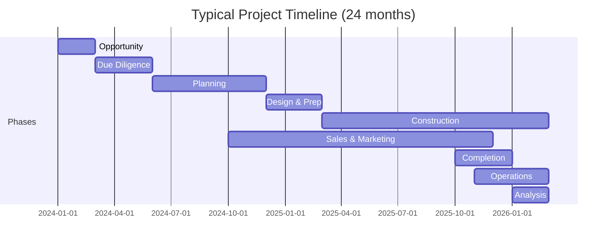

# Property Development Lifecycle

## WHY

Real estate development is not a single event — it is a structured journey that transforms raw land into income-generating assets over months or years. Every decision made in one phase has downstream consequences for the next. A developer who does not understand this lifecycle will build features in isolation, create data models that cannot flow between modules, and design UIs that confuse users who think in terms of phases and milestones.

BuildEstate Pro exists to digitise this entire lifecycle. Understanding the 9 business phases is the foundation for understanding why the platform has 14 modules, why data flows sequentially, and why each role exists. Before you touch a single line of code, you must understand the business you are building software for.

---

## WHAT

The Property Development Lifecycle is the end-to-end business process that takes a piece of land from initial identification through construction, sales, and long-term asset management. In BuildEstate Pro, this lifecycle is modelled as **9 sequential phases**, each with distinct activities, responsible roles, and data outputs that feed the next phase.


### The 9 Phases at a Glance

| # | Phase | Business Goal | Duration (Typical) |
|---|-------|--------------|-------------------|
| 1 | Opportunity | Find viable land | 2–8 weeks |
| 2 | Due Diligence | Validate the opportunity | 4–12 weeks |
| 3 | Planning | Secure legal permission to build | 8–52 weeks |
| 4 | Design & Prep | Prepare for construction | 4–16 weeks |
| 5 | Construction | Build the physical asset | 12–104 weeks |
| 6 | Sales & Marketing | Sell or let the units | Ongoing from Phase 4 |
| 7 | Completion | Hand over to buyers/tenants | 4–12 weeks per unit |
| 8 | Operations | Manage retained assets | Ongoing |
| 9 | Analysis | Measure performance | Post-completion |

---

## HOW

Each phase below is documented with its business activities, key roles, and the data it hands off to the next phase.

### Phase 1: Opportunity (Land Identified)

**Business Purpose:** Identify and capture potential land opportunities that could become development projects.

**Activities:**
- Source land leads from agents, brokers, auctions, and direct approaches
- Capture basic site information (location, size, current use, asking price)
- Perform initial desktop research (planning history, flood maps, access)
- Score and rank opportunities against investment criteria
- Add to the opportunity pipeline for tracking

**Key Roles:**
- **Acquisition Manager** — Owns the pipeline, sources and evaluates leads
- **Surveyor/Consultant** — Provides initial technical opinion on viability
- **Admin/Support** — Enters and maintains opportunity data

**Data Handed to Next Phase:**
- Land location and boundaries
- Estimated land size and asking price
- Initial feasibility score
- Land owner contact details
- Source and agent information
- Preliminary planning history

**Status Transitions:**

The `LandOpportunity` entity progresses through defined statuses as it moves through this phase:

```csharp
// Domain entity status values for the Opportunity phase
// File: src/BuildEstate.Domain/Entities/LandAcquisition/LandOpportunity.cs
public enum OpportunityStatus
{
    Identified,       // Lead captured, basic info recorded
    InitialReview,    // Desktop research underway
    DueDiligence,     // Promoted to formal due diligence
    OfferMade,        // Offer submitted to land owner
    UnderContract,    // Contracts exchanged
    Acquired          // Completion achieved
}
```

---

### Phase 2: Due Diligence (Evaluate & Approve)

**Business Purpose:** Validate that the land opportunity is legally, environmentally, and financially viable before committing capital.

**Activities:**
- Commission legal searches (title, local authority, environmental)
- Conduct environmental assessments (contamination, flood risk, ecology)
- Review planning potential and constraints
- Assess utility connections and infrastructure capacity
- Perform financial feasibility modelling (costs, revenue, ROI)
- Compile risk register and issue formal recommendation

**Key Roles:**
- **Legal & Compliance Officer** — Manages legal checks and searches
- **Valuation Analyst** — Runs financial feasibility models
- **Surveyor/Consultant** — Provides technical reports (ground conditions, access)
- **Acquisition Manager** — Coordinates and presents findings to decision-makers

**Data Handed to Next Phase:**
- Due diligence reports (legal, environmental, planning, utilities, valuation)
- Risk register with mitigations
- Feasibility assessment with ROI projections
- Go/No-Go decision with approver sign-off
- Updated land valuation
- Identified planning constraints

---

### Phase 3: Planning (Approvals & Permits)

**Business Purpose:** Obtain formal planning permission from the local authority to develop the land.

**Activities:**
- Prepare and submit pre-application enquiry
- Commission architectural drawings and planning statement
- Submit full planning application to local authority
- Respond to consultee objections and requests for information
- Attend planning committee if required
- Discharge planning conditions post-approval
- Manage appeals if application is refused

**Key Roles:**
- **Planning Manager** — Owns the application process and council relationship
- **Project Manager** — Coordinates timeline and resource allocation
- **Legal & Compliance Officer** — Reviews Section 106 agreements and obligations
- **Admin/Support** — Tracks conditions and documentation

**Data Handed to Next Phase:**
- Approved planning permission reference
- Planning conditions and discharge schedule
- Section 106 / CIL obligations
- Approved site layout and unit mix
- Maximum building heights and density
- Access and infrastructure requirements

---

### Phase 4: Design & Prep (Plan & Prepare)

**Business Purpose:** Translate planning permission into detailed construction-ready designs, procurement plans, and project schedules.

**Activities:**
- Develop detailed architectural and engineering drawings
- Prepare structural, mechanical, and electrical specifications
- Procure contractors and suppliers (tender process)
- Develop construction programme and critical path
- Secure building regulations approval
- Establish site compound and welfare facilities
- Finalise project budget and cash flow forecast

**Key Roles:**
- **Project Manager** — Owns the programme, budget, and contractor appointments
- **Site Manager** — Plans site logistics and welfare setup
- **Finance Director** — Approves budget and cash flow forecast
- **Acquisition Manager** — Ensures handover from land to project is complete

**Data Handed to Next Phase:**
- Detailed construction drawings and specifications
- Contractor appointments and contracts
- Construction programme with milestones
- Approved project budget
- Cash flow forecast
- Building regulations approval reference

---

### Phase 5: Construction (Build & Monitor)

**Business Purpose:** Physically build the development to approved designs, on time and on budget.

**Activities:**
- Execute construction stages (groundworks, frame, envelope, fit-out)
- Monitor progress against programme milestones
- Conduct quality inspections at each stage
- Manage variations and change orders
- Track costs against budget with monthly valuations
- Ensure health & safety compliance on site
- Manage snagging and remediation before handover

**Key Roles:**
- **Site Manager** — Day-to-day construction oversight and quality control
- **Project Manager** — Programme monitoring, cost control, risk management
- **Finance Director** — Monitors cash flow and cost overruns
- **Surveyor/Consultant** — Conducts valuations and inspections

**Data Handed to Next Phase:**
- Completed unit details (specifications, finishes, fixtures)
- Building control sign-off certificates
- EPC ratings for each unit
- As-built drawings
- O&M manuals and warranties
- Snagging completion records

---

### Phase 6: Sales & Marketing (Sell Units)

**Business Purpose:** Generate buyer interest, secure reservations, and progress sales through to exchange of contracts.

**Activities:**
- Develop marketing strategy and materials (brochures, CGIs, show homes)
- Launch sales campaign (off-plan or post-construction)
- Manage sales leads and enquiries
- Conduct viewings and negotiate offers
- Process reservations and collect deposits
- Progress conveyancing with buyer solicitors
- Manage sales pipeline and forecast revenue

**Key Roles:**
- **Sales Manager** — Owns the pipeline, leads team, manages reservations
- **Completion Manager** — Coordinates solicitor progress and exchange dates
- **Finance Director** — Forecasts revenue and monitors exchange rates
- **Admin/Support** — Maintains CRM data and sales documentation

**Data Handed to Next Phase:**
- Reserved and exchanged unit records
- Buyer details and solicitor information
- Agreed sale prices and deposit amounts
- Anticipated completion dates
- Outstanding conveyancing actions
- Revenue forecast vs. budget

---

### Phase 7: Completion (Handover & Close)

**Business Purpose:** Deliver finished units to buyers or tenants with all legal, financial, and physical obligations fulfilled.

**Activities:**
- Conduct pre-completion inspections (snagging resolution)
- Coordinate legal completion with buyer solicitors
- Execute key handover appointments with orientation guides
- Collect final payments and issue completion certificates
- Compile handover packs (warranties, manuals, certificates)
- Manage defects liability period and aftercare
- Close out contractor final accounts and retention releases

**Key Roles:**
- **Completion Manager** — Owns the handover process and client relationship
- **Site Manager** — Resolves snagging items and ensures build quality
- **Sales Manager** — Ensures smooth buyer communication
- **Finance Director** — Reconciles final costs and releases retentions

**Data Handed to Next Phase:**
- Completion certificates and dates
- Client satisfaction scores
- Defects liability schedule
- Warranty information per unit
- Final cost reconciliation
- Lessons learned register

---

### Phase 8: Operations (Manage & Maintain)

**Business Purpose:** Manage retained assets (rental units, commercial spaces) to maximise income and asset value.

**Activities:**
- Market and let available rental units
- Manage tenant onboarding, leases, and rent collection
- Handle maintenance requests and planned preventive maintenance
- Conduct periodic property inspections
- Manage service charges and communal area maintenance
- Track occupancy rates and rental yield
- Renew leases and manage tenant turnover

**Key Roles:**
- **Property Manager** — Day-to-day operations, tenant relationships, maintenance
- **Finance Director** — Monitors rental income and operational costs
- **Legal & Compliance Officer** — Manages lease agreements and regulatory compliance
- **Admin/Support** — Tenant communication and documentation

**Data Handed to Next Phase:**
- Occupancy and void rate metrics
- Rental income vs. forecast
- Maintenance cost history
- Tenant satisfaction data
- Asset condition reports
- Lease renewal schedule

---

### Phase 9: Analysis (Performance & Insights)

**Business Purpose:** Measure project performance against targets, extract lessons, and inform future investment decisions.

**Activities:**
- Calculate actual ROI vs. projected ROI
- Analyse cost variances (budget vs. actual)
- Review programme performance (planned vs. actual dates)
- Compile client satisfaction analysis
- Document lessons learned for future projects
- Produce investor reports and portfolio performance dashboards
- Benchmark against industry standards and prior projects

**Key Roles:**
- **Finance Director** — Owns financial performance analysis and investor reporting
- **Project Manager** — Reviews programme performance and lessons learned
- **Valuation Analyst** — Assesses asset value and portfolio positioning
- **Admin/Support** — Compiles and archives final project documentation

**Data Produced:**
- Project performance report (cost, time, quality, safety)
- ROI analysis and profit margin breakdown
- Investor returns summary
- Lessons learned register
- Benchmarking data for future feasibility models
- Portfolio-level insights and trends

---

## WHEN

The lifecycle phases are **sequential but overlapping**. In practice:

- **Sales & Marketing** often begins during **Construction** (off-plan sales)
- **Design & Prep** may overlap with the final stages of **Planning** (building regs)
- **Analysis** runs continuously but intensifies post-completion
- **Operations** only applies to retained assets (not all units are sold)

A typical residential development project spanning all 9 phases takes **18–36 months** from Opportunity to Analysis.



---

## WHERE

In BuildEstate Pro, each lifecycle phase maps to one or more platform modules:

| Phase | Primary Module(s) | Supporting Module(s) |
|-------|-------------------|---------------------|
| Opportunity | Land Acquisition | Documents & Knowledge |
| Due Diligence | Land Acquisition, Legal & Compliance | Finance & Budget Control |
| Planning | Planning & Approvals | Legal & Compliance, Documents |
| Design & Prep | Project Management, Procurement | Finance, Contractors |
| Construction | Construction Management | Procurement, Finance, H&S |
| Sales & Marketing | Sales & Conveyancing | Property Units, Finance |
| Completion | Sales & Conveyancing | Construction, Documents |
| Operations | Rental Management | Property Units, Finance |
| Analysis | Reports & Dashboards | Finance, All modules |

---

## WHO

Each phase has a **primary owner** — the role accountable for phase completion:

| Phase | Primary Owner | Accountable For |
|-------|--------------|-----------------|
| Opportunity | Acquisition Manager | Pipeline quality and conversion rate |
| Due Diligence | Legal & Compliance Officer | Risk identification and legal clearance |
| Planning | Planning Manager | Securing permission within target timeline |
| Design & Prep | Project Manager | Construction-ready deliverables on time |
| Construction | Site Manager | Build quality, safety, and programme adherence |
| Sales & Marketing | Sales Manager | Revenue targets and reservation rates |
| Completion | Completion Manager | Smooth handover and client satisfaction |
| Operations | Property Manager | Occupancy rates and income maximisation |
| Analysis | Finance Director | Accurate performance reporting and investor returns |

---

## WHAT NEXT

Now that you understand the 9 business phases, you should:

1. Read [03-users-and-personas.md](./03-users-and-personas.md) to understand how each role interacts with the platform across these phases
2. Read [04-enterprise-capabilities.md](./04-enterprise-capabilities.md) to understand the cross-cutting capabilities (RBAC, audit, workflows) that support all phases
3. When you later read module deep-dives (documents 20–23), you will see how each module implements its portion of this lifecycle

The key insight to carry forward: **data flows downstream**. Every entity created in Phase 1 (a `LandOpportunity`) eventually becomes the foundation for a `Project`, which contains `ConstructionStages`, which produce `PropertyUnits`, which are sold as `Sales` or let as `Tenancies`. The platform is not 14 independent modules — it is one connected lifecycle.

---

## Common Mistakes

### Mistake 1: Treating modules as independent CRUD applications

**The Wrong Approach:**

Building each module (Land Acquisition, Planning, Construction, Sales) as a standalone system with its own disconnected data, requiring manual re-entry of information at each phase boundary.

```typescript
// WRONG: Creating a planning application with no link to the opportunity
// that originated it. The user must manually re-enter site details.
export interface CreatePlanningApplicationDto {
  siteName: string;        // Manually typed — duplicates LandOpportunity.Name
  siteAddress: string;     // Manually typed — duplicates LandOpportunity.Location
  siteArea: number;        // Manually typed — duplicates LandOpportunity.LandSize
  applicantName: string;   // No connection to existing data
}
```

**Why It's Wrong:**

The business lifecycle is sequential. Data captured in Opportunity should flow into Due Diligence, then Planning, then Construction. Requiring manual re-entry creates inconsistency, duplication, and user frustration. It also breaks the audit trail — you cannot trace a completed project back to its originating opportunity.

**The Correct Approach:**

```typescript
// CORRECT: Planning application references the opportunity it originated from,
// inheriting site details and maintaining traceability across the lifecycle.
export interface CreatePlanningApplicationDto {
  opportunityId: string;          // Links back to the land opportunity
  // Site details inherited from LandOpportunity automatically
  applicationType: string;        // Phase-specific data only
  localAuthorityId: string;       // Phase-specific data only
  proposedDevelopment: string;    // Phase-specific data only
}
```

---

### Mistake 2: Allowing arbitrary status transitions

**The Wrong Approach:**

Letting any user move an opportunity from any status to any other status without validating that prerequisite conditions are met.

```csharp
// WRONG: No validation — allows jumping from Identified straight to Acquired
public async Task<Unit> Handle(
    UpdateOpportunityStatusCommand command,
    CancellationToken cancellationToken)
{
    var opportunity = await _repository.GetByIdAsync(command.Id, cancellationToken);
    opportunity.Status = command.NewStatus;  // Any transition allowed!
    await _repository.UpdateAsync(opportunity, cancellationToken);
    return Unit.Value;
}
```

**Why It's Wrong:**

The lifecycle phases are sequential for business reasons. You cannot acquire land without completing due diligence. You cannot hand over a unit that has not been built. Allowing arbitrary transitions means data integrity is lost, compliance is broken, and the audit trail becomes meaningless.

**The Correct Approach:**

```csharp
// CORRECT: State machine validates that the transition is permitted
// and that prerequisite data exists before allowing the change.
public async Task<Unit> Handle(
    TransitionOpportunityStatusCommand command,
    CancellationToken cancellationToken)
{
    var opportunity = await _repository.GetByIdAsync(command.Id, cancellationToken);

    // State machine enforces valid transitions
    if (!OpportunityStateMachine.CanTransition(opportunity.Status, command.TargetStatus))
    {
        throw new InvalidStatusTransitionException(
            opportunity.Status, command.TargetStatus);
    }

    // Validate prerequisites for the target status
    if (command.TargetStatus == OpportunityStatus.DueDiligence)
    {
        // Must have basic land details before progressing
        if (string.IsNullOrEmpty(opportunity.Location) || opportunity.LandSize <= 0)
        {
            throw new PrerequisiteNotMetException(
                "Location and land size are required before entering Due Diligence.");
        }
    }

    opportunity.Status = command.TargetStatus;
    await _repository.UpdateAsync(opportunity, cancellationToken);
    return Unit.Value;
}
```

---

### Mistake 3: Designing UI without phase context

**The Wrong Approach:**

Building a generic list page that shows all opportunities regardless of where they are in the lifecycle, with no visual indication of phase or progress.

**Why It's Wrong:**

Business users think in terms of phases. An Acquisition Manager wants to see "What's in Due Diligence?" not "Show me all records sorted by date." Without phase context, the user cannot quickly identify what needs attention, what is blocked, and what is ready to progress.

**The Correct Approach:**

Design dashboards and pipeline views that group entities by their lifecycle phase, show progress indicators, highlight blockers, and provide clear actions for moving items to the next phase. The platform's pipeline view (Kanban board) is the correct pattern — columns represent phases, and cards move left to right as they progress.
