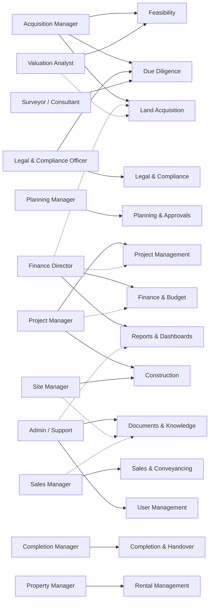

# Users and Personas

## WHY

BuildEstate Pro serves a complex ecosystem of professionals who each contribute specialized expertise to the property development lifecycle. Understanding who uses the platform — and what they need from it — is fundamental to making sound technical decisions.

Without a clear picture of platform roles, developers risk building features that don't serve real workflows, creating permission models that are too broad or too restrictive, and designing UIs that confuse rather than guide. Every controller you authorize, every route you guard, and every dashboard you build exists to serve one or more of these 12 roles.

The role model also underpins the platform's security architecture. BuildEstate Pro enforces Role-Based Access Control (RBAC) across all modules — meaning every API endpoint, every Angular route, and every sidebar item is scoped to specific roles. If you don't understand who can do what, you'll write insecure code.

## WHAT

BuildEstate Pro defines 12 platform roles that map directly to real-world positions in a property development company. Each role has:

- **Primary responsibilities** — the business outcomes they own
- **Module access** — which parts of the platform they interact with
- **Key workflows** — the day-to-day tasks they perform
- **Permission scope** — what they can create, read, update, or delete

These roles are enforced at two levels:
1. **Backend** — ASP.NET Core authorization policies on every controller endpoint
2. **Frontend** — Angular route guards and sidebar visibility rules

The 12 roles are:

| # | Role | Business Focus | Primary Module(s) |
|---|------|----------------|-------------------|
| 1 | Acquisition Manager | Land pipeline & opportunities | Land Acquisition |
| 2 | Legal & Compliance Officer | Due diligence & contracts | Legal & Compliance |
| 3 | Planning Manager | Planning applications & approvals | Planning & Approvals |
| 4 | Project Manager | Budgets, timelines & resources | Project Management |
| 5 | Site Manager | Construction progress & quality | Construction |
| 6 | Sales Manager | Marketing, leads & reservations | Sales & Conveyancing |
| 7 | Completion Manager | Handover & project closeout | Completion |
| 8 | Property Manager | Rentals, tenants & maintenance | Rental Management |
| 9 | Finance Director | Financial performance & returns | Finance & Budget |
| 10 | Valuation Analyst | Feasibility & financial review | Land Acquisition (Feasibility) |
| 11 | Surveyor / Consultant | Technical assessments & reports | Land Acquisition (Due Diligence) |
| 12 | Admin / Support | Documentation & data entry | Cross-cutting |

## HOW

### Role Definitions in the Codebase

Roles are stored as ASP.NET Identity roles and referenced throughout the platform by string constants. The following enum captures the Land Acquisition module's role model used in property-based tests:

```csharp
// File: tests/BuildEstate.Tests/PropertyTests/RbacEnforcementPropertyTests.cs
public enum LandAcquisitionRole
{
    AcquisitionManager,
    LegalComplianceOfficer,
    ValuationAnalyst,
    FinanceDirector,
    AdminSupport
}
```

On the frontend, roles are referenced as string arrays in route data and checked by the configurable `roleGuard`:

```typescript
// File: client-app/src/app/core/guards/role.guard.ts
export const roleGuard: CanActivateFn = (route) => {
  const authService = inject(AuthService);
  const router = inject(Router);
  const store = inject(Store);
  const toastService = inject(ToastService);

  // In dev mode, allow all access
  if (authService.isDevMode) {
    return true;
  }

  // Read allowed roles from route data
  const allowedRoles = route.data?.['roles'] as string[] | undefined;

  if (!allowedRoles || allowedRoles.length === 0) {
    return true;
  }

  return store.select(selectUserRoles).pipe(
    take(1),
    map((userRoles) => {
      const hasRequiredRole = allowedRoles.some(role => userRoles.includes(role));
      if (hasRequiredRole) {
        return true;
      }
      toastService.showError('Access denied. You do not have the required permissions.');
      router.navigate(['/home']);
      return false;
    })
  );
};
```

Routes are then configured with role requirements in the `data` property:

```typescript
// File: client-app/src/app/features/land-acquisition/land-acquisition.routes.ts
{
  path: 'create',
  loadComponent: () =>
    import('./pages/opportunity-create/opportunity-create.component')
      .then(m => m.OpportunityCreateComponent),
  canActivate: [roleGuard],
  canDeactivate: [unsavedChangesGuard],
  data: { breadcrumb: 'Create Opportunity', roles: ['AcquisitionManager', 'AdminSupport', 'SuperAdmin'] }
}
```

### Role-to-Module Relationship Diagram



### Detailed Role Profiles

#### 1. Acquisition Manager

| Attribute | Detail |
|-----------|--------|
| **Primary Responsibility** | Find land opportunities, evaluate viability, manage acquisition pipeline |
| **Modules** | Land Acquisition, Due Diligence, Feasibility, Documents |
| **Key Workflows** | Create opportunity → Evaluate → Submit for approval → Manage offers |
| **Can Create** | Opportunities, Offers, Due Diligence checks, Feasibility assessments |
| **Can Transition** | Opportunity status (Identified → Initial Review → Due Diligence → Offer Made → Under Contract → Acquired) |
| **Read Access** | Contracts (read-only), Portfolio (read-only) |

#### 2. Legal & Compliance Officer

| Attribute | Detail |
|-----------|--------|
| **Primary Responsibility** | Perform due diligence, manage contracts, ensure legal compliance |
| **Modules** | Legal & Compliance, Due Diligence, Contracts, Documents |
| **Key Workflows** | Create legal case → Conduct checks → Draft contracts → Exchange & complete |
| **Can Create** | Legal cases, Compliance checks, Contracts, Due Diligence items |
| **Can Transition** | Contract status (Draft → Under Legal Review → Approved → Signed → Exchanged → Completed) |
| **Read Access** | Opportunities (read-only) |

#### 3. Planning Manager

| Attribute | Detail |
|-----------|--------|
| **Primary Responsibility** | Handle planning applications, manage council interactions, track approvals |
| **Modules** | Planning & Approvals, Documents |
| **Key Workflows** | Create application → Submit → Track review → Manage conditions → Handle appeals |
| **Can Create** | Planning applications, Conditions, Appeals |
| **Can Transition** | Application status (Pre-Application → Submitted → Validated → Under Review → Approved / Refused) |
| **Read Access** | Opportunities (read-only, for context) |

#### 4. Project Manager

| Attribute | Detail |
|-----------|--------|
| **Primary Responsibility** | Plan projects, manage budgets, timelines, resources, and risks |
| **Modules** | Project Management, Construction, Design, Procurement, Finance (read), Documents, Reports |
| **Key Workflows** | Create project → Set milestones → Track progress → Manage risks → Coordinate teams |
| **Can Create** | Projects, Milestones, Tasks, Risks, Construction stages, Design packages, Purchase orders |
| **Can Transition** | Project status (Planning → In Progress → On Hold → Completed) |
| **Read Access** | Finance (read-only), Property Units (read-only), Contractors (read-only) |

#### 5. Site Manager

| Attribute | Detail |
|-----------|--------|
| **Primary Responsibility** | Oversee physical construction, track progress, ensure quality and safety |
| **Modules** | Construction, Defects, Procurement (read), Contractors (read), Documents |
| **Key Workflows** | Update stage progress → Conduct inspections → Log snags → Report defects |
| **Can Create** | Inspections, Snag items, Defects, Progress updates |
| **Can Transition** | Construction stage progress |
| **Read Access** | Procurement (read-only), Contractors (read-only) |

#### 6. Sales Manager

| Attribute | Detail |
|-----------|--------|
| **Primary Responsibility** | Manage marketing campaigns, sales leads, pipeline, and unit reservations |
| **Modules** | Sales & Conveyancing, Property Units, Documents, Reports |
| **Key Workflows** | Capture leads → Schedule viewings → Process reservations → Track conveyancing → Complete sale |
| **Can Create** | Sales leads, Reservations |
| **Can Transition** | Lead status, Reservation status |
| **Read Access** | Property Units (with edit access to price/status) |

#### 7. Completion Manager

| Attribute | Detail |
|-----------|--------|
| **Primary Responsibility** | Coordinate handover, manage snagging, ensure project closeout |
| **Modules** | Completion & Handover, Defects, Projects (read), Units (read), Documents |
| **Key Workflows** | Verify practical completion → Manage snagging → Coordinate handover appointments → Financial closeout |
| **Can Create** | Defects (snagging items), Handover records |
| **Can Transition** | Handover status |
| **Read Access** | Projects (read-only), Property Units (read-only) |

#### 8. Property Manager

| Attribute | Detail |
|-----------|--------|
| **Primary Responsibility** | Manage retained rental properties, tenants, maintenance, and day-to-day operations |
| **Modules** | Rental Management, Defects, Property Units (read), Documents |
| **Key Workflows** | Onboard tenants → Manage leases → Collect rent → Handle maintenance requests → Conduct inspections |
| **Can Create** | Tenancies, Maintenance requests, Rental inspections |
| **Can Transition** | Tenancy status, Maintenance request status |
| **Read Access** | Property Units (read-only) |

#### 9. Finance Director

| Attribute | Detail |
|-----------|--------|
| **Primary Responsibility** | Monitor financial performance, profitability, investor returns, and budget control |
| **Modules** | Finance & Budget, Investors, Portfolio, Reports, Approval workflows |
| **Key Workflows** | Review budgets → Track costs → Manage investors → Approve acquisitions → Generate financial reports |
| **Can Create** | Transactions, Investors, Budget items, Reports |
| **Special Permission** | Approve/reject acquisition approval requests |
| **Read Access** | Projects (read-only), Opportunities (read-only) |

#### 10. Valuation Analyst

| Attribute | Detail |
|-----------|--------|
| **Primary Responsibility** | Financial review, feasibility analysis, ROI calculations |
| **Modules** | Feasibility, Opportunities (read), Finance (read), Reports |
| **Key Workflows** | Create feasibility assessment → Model scenarios → Calculate ROI → Mark ready for review |
| **Can Create** | Feasibility assessments |
| **Can Transition** | Feasibility status |
| **Read Access** | Opportunities (read-only), Finance (read-only) |

#### 11. Surveyor / Consultant

| Attribute | Detail |
|-----------|--------|
| **Primary Responsibility** | Technical assessments, site surveys, professional reports |
| **Modules** | Due Diligence (read), Construction (read), Opportunities (read), Documents |
| **Key Workflows** | Review site data → Conduct surveys → Upload technical reports |
| **Can Create** | Documents (survey reports, technical assessments) |
| **Can Transition** | None (advisory role) |
| **Read Access** | Opportunities, Due Diligence, Construction (all read-only) |

#### 12. Admin / Support

| Attribute | Detail |
|-----------|--------|
| **Primary Responsibility** | Documentation, data entry, system administration support |
| **Modules** | Documents, Reports, Administration, all modules (read) |
| **Key Workflows** | Upload documents → Manage data → Support other roles → Access admin panel |
| **Can Create** | Documents, Acquisition records, Land owner records |
| **Special Permission** | Delete documents, Create acquisition registry records |
| **Read Access** | Opportunities, Projects, Contractors (read-only) |

### Permission Matrix (Land Acquisition Module)

The following matrix shows which roles can perform which operations within the Land Acquisition module — the pattern repeats across all modules:

```csharp
// File: tests/BuildEstate.Tests/PropertyTests/RbacEnforcementPropertyTests.cs
private static readonly Dictionary<LandAcquisitionOperation, HashSet<LandAcquisitionRole>> PermissionMatrix = new()
{
    // Opportunity CRUD: AcquisitionManager, AdminSupport
    [LandAcquisitionOperation.CreateOpportunity] = new() { LandAcquisitionRole.AcquisitionManager, LandAcquisitionRole.AdminSupport },
    [LandAcquisitionOperation.UpdateOpportunity] = new() { LandAcquisitionRole.AcquisitionManager, LandAcquisitionRole.AdminSupport },
    [LandAcquisitionOperation.DeleteOpportunity] = new() { LandAcquisitionRole.AcquisitionManager, LandAcquisitionRole.AdminSupport },
    [LandAcquisitionOperation.TransitionOpportunityStatus] = new() { LandAcquisitionRole.AcquisitionManager, LandAcquisitionRole.AdminSupport },

    // Due Diligence: LegalComplianceOfficer, AdminSupport
    [LandAcquisitionOperation.CreateDueDiligence] = new() { LandAcquisitionRole.LegalComplianceOfficer, LandAcquisitionRole.AdminSupport },
    [LandAcquisitionOperation.TransitionDueDiligenceStatus] = new() { LandAcquisitionRole.LegalComplianceOfficer, LandAcquisitionRole.AdminSupport },

    // Feasibility: ValuationAnalyst, FinanceDirector
    [LandAcquisitionOperation.CreateOrUpdateFeasibility] = new() { LandAcquisitionRole.ValuationAnalyst, LandAcquisitionRole.FinanceDirector },

    // Approvals: FinanceDirector only
    [LandAcquisitionOperation.ApproveOrRejectApproval] = new() { LandAcquisitionRole.FinanceDirector },

    // Read: All roles
    [LandAcquisitionOperation.ReadOpportunities] = new()
    {
        LandAcquisitionRole.AcquisitionManager,
        LandAcquisitionRole.AdminSupport,
        LandAcquisitionRole.LegalComplianceOfficer,
        LandAcquisitionRole.ValuationAnalyst,
        LandAcquisitionRole.FinanceDirector
    }
};
```

## WHEN

Understanding roles matters at specific points during development:

- **Before writing a controller** — Ask: which roles should access this endpoint? Apply the correct `[Authorize]` attribute.
- **Before creating a route** — Ask: which roles should reach this page? Add `roleGuard` with the correct `data.roles` array.
- **Before building a dashboard** — Ask: what does this role need to see first? Design KPIs and alerts for that persona.
- **Before designing a form** — Ask: who fills this form? What's their expertise level? What guidance do they need?
- **When writing property tests** — Test that the RBAC matrix holds for every role-operation pair.
- **When adding sidebar items** — Only show items relevant to the user's role.

## WHERE

Role-related code lives in these locations:

| Concern | Backend Location | Frontend Location |
|---------|------------------|-------------------|
| Role definitions | `src/BuildEstate.Infrastructure/` (Identity seed) | Route `data.roles` arrays |
| Authorization policies | Controller `[Authorize]` attributes | `client-app/src/app/core/guards/role.guard.ts` |
| Module-specific guards | N/A | `client-app/src/app/features/{module}/guards/` |
| Permission matrix | `src/BuildEstate.Application/` (per-module) | Sidebar visibility logic |
| Role assignment | `src/BuildEstate.Infrastructure/Services/UserIdentityService.cs` | Admin → Users → Create/Edit |
| RBAC property tests | `tests/BuildEstate.Tests/PropertyTests/RbacEnforcementPropertyTests.cs` | N/A |
| Search permissions | `tests/BuildEstate.Tests/PropertyTests/Search/SearchPermissionFilteringPropertyTests.cs` | N/A |

## WHO

The following table maps each role to the person responsible in a typical BuildEstate Pro deployment:

| Role | Typical Job Title | Reports To |
|------|-------------------|-----------|
| Acquisition Manager | Head of Land / Land Director | Managing Director |
| Legal & Compliance Officer | In-house Solicitor / Compliance Lead | Legal Director |
| Planning Manager | Planning Consultant / Head of Planning | Development Director |
| Project Manager | Construction PM / Development Manager | Operations Director |
| Site Manager | Site Foreman / Construction Lead | Project Manager |
| Sales Manager | Head of Sales / Sales Director | Commercial Director |
| Completion Manager | Handover Coordinator | Operations Director |
| Property Manager | Estates Manager / Lettings Manager | Asset Director |
| Finance Director | CFO / Head of Finance | CEO |
| Valuation Analyst | Investment Analyst / Surveyor | Finance Director |
| Surveyor / Consultant | External Consultant / Technical Advisor | Project Manager |
| Admin / Support | Office Manager / PA | Operations Director |

From a development perspective:
- **Backend developers** implement `[Authorize]` policies and permission checks in handlers.
- **Frontend developers** configure route guards and sidebar visibility.
- **QA/Test engineers** write property tests verifying the RBAC matrix.
- **Platform architects** design the role hierarchy and cross-module permission model.

## WHAT NEXT

Now that you understand who uses the platform and what they need, continue with:

- [04-enterprise-capabilities.md](./04-enterprise-capabilities.md) — Learn about the cross-cutting capabilities (RBAC, workflow engine, notifications, audit) that support all roles
- [11-security-framework.md](./11-security-framework.md) — Deep-dive into how authentication, authorization, guards, and policies are implemented in code
- [19-module-pattern.md](./19-module-pattern.md) — See how the standard module pattern incorporates role-based access at every layer

## Common Mistakes

### Mistake 1: Hardcoding role strings without constants

**The problem:** Scattering raw role strings like `"AcquisitionManager"` across the codebase leads to typos and makes refactoring impossible.

```typescript
// ❌ WRONG — hardcoded role string, easily mistyped
canActivate: [roleGuard],
data: { roles: ['AquisitionManager'] }  // Typo: missing 'c' — guard silently fails
```

**Why it's wrong:** A misspelled role name means the guard never matches, silently locking out authorized users or — worse — allowing unauthorized access if the guard falls through.

**The correct approach:**

```typescript
// ✅ CORRECT — use constants defined in one place
import { PlatformRoles } from '@core/constants/roles';

canActivate: [roleGuard],
data: { roles: [PlatformRoles.AcquisitionManager, PlatformRoles.SuperAdmin] }
```

### Mistake 2: Checking permissions only on the frontend

**The problem:** Relying solely on Angular route guards for security while leaving backend endpoints unprotected.

```csharp
// ❌ WRONG — no authorization on controller
[HttpPost("opportunities")]
public async Task<IActionResult> Create([FromBody] CreateOpportunityCommand command, CancellationToken ct)
{
    var result = await _mediator.Send(command, ct);
    return CreatedAtAction(nameof(GetById), new { id = result.Id }, result);
}
```

**Why it's wrong:** Frontend guards are a UX convenience, not a security boundary. Anyone with Postman or curl can bypass them entirely. The backend is the only true security enforcement point.

**The correct approach:**

```csharp
// ✅ CORRECT — backend enforces authorization
[Authorize(Roles = "AcquisitionManager,AdminSupport,SuperAdmin")]
[HttpPost("opportunities")]
public async Task<IActionResult> Create([FromBody] CreateOpportunityCommand command, CancellationToken ct)
{
    var result = await _mediator.Send(command, ct);
    return CreatedAtAction(nameof(GetById), new { id = result.Id }, result);
}
```

### Mistake 3: Giving all roles read access by default

**The problem:** Assuming every role should see every entity because "it's just reading."

**Why it's wrong:** In property development, financial data, legal documents, and investor information are commercially sensitive. A Site Manager has no business seeing investor returns, and a Sales Manager shouldn't access legal compliance records. The principle of least privilege applies to reads too.

**The correct approach:** Grant read access only to roles that genuinely need the data to perform their workflows. When in doubt, restrict and expand later based on actual need — not assumption.
