# Enterprise Capabilities

> **Reading Time:** ~18 minutes
> **Prerequisites:** [01-business-vision.md](./01-business-vision.md), [02-property-development-lifecycle.md](./02-property-development-lifecycle.md), [03-users-and-personas.md](./03-users-and-personas.md)

BuildEstate Pro is not simply 14 isolated modules bolted together. Beneath every module sits a layer of shared enterprise capabilities that provide consistent behaviour across the entire platform. This document introduces those capabilities at a business level — what they do, why they exist, and which modules rely on them. The deep technical implementation details live in documents 10–17.

---

## WHY

Real estate development is a heavily regulated, multi-stakeholder, document-intensive industry. A project can span 2–5 years, involve dozens of professionals, and generate thousands of documents. Without shared enterprise capabilities, each module would need to reinvent access control, approval workflows, document storage, notifications, audit trails, and search — leading to inconsistency, security gaps, and maintenance nightmares.

Enterprise capabilities exist to solve these cross-cutting business problems once and make the solution available to every module consistently. They ensure that:

- **Compliance** is met without per-module effort (audit, access control)
- **Productivity** is maximised through consistent search and notifications
- **Governance** is enforced through standardised workflow and approval patterns
- **Trust** is built through immutable audit trails and permission-aware data access

When an Acquisition Manager creates an opportunity, the same notification system alerts stakeholders, the same audit trail records the action, the same RBAC engine enforces who can see it, and the same search infrastructure makes it discoverable — regardless of whether the action occurred in Land Acquisition, Planning, or Finance.

---

## WHAT

BuildEstate Pro provides six cross-cutting enterprise capabilities that every module consumes:

| # | Capability | Business Purpose |
|---|-----------|-----------------|
| 1 | Role-Based Access Control (RBAC) | Controls who can see and do what across the platform |
| 2 | Workflow & Approvals Engine | Manages status transitions and multi-level approval chains |
| 3 | Document Management | Handles upload, versioning, storage, and retrieval of all files |
| 4 | Notifications & Alerts | Delivers real-time in-app and email notifications to stakeholders |
| 5 | Audit Logs & Activity Tracking | Maintains an immutable record of every action for compliance |
| 6 | Global Search | Provides platform-wide intelligent search across all modules |

These capabilities are **infrastructure** — they are not optional features. A module is not considered complete until it integrates with all six.

```mermaid
graph TD
    subgraph "Enterprise Capabilities Layer"
        RBAC[Role-Based Access Control]
        WF[Workflow & Approvals Engine]
        DM[Document Management]
        NT[Notifications & Alerts]
        AU[Audit Logs & Activity Tracking]
        GS[Global Search]
    end

    subgraph "Business Modules"
        LA[Land Acquisition]
        PA[Planning & Approvals]
        LC[Legal & Compliance]
        PM[Project Management]
        CM[Construction]
        FN[Finance & Budget]
        SL[Sales & Conveyancing]
        RM[Rental Management]
    end

    LA --> RBAC
    LA --> WF
    LA --> DM
    LA --> NT
    LA --> AU
    LA --> GS

    PA --> RBAC
    PA --> WF
    PA --> DM
    PA --> NT
    PA --> AU
    PA --> GS

    LC --> RBAC
    LC --> WF
    LC --> DM
    LC --> NT
    LC --> AU
    LC --> GS

    PM --> RBAC
    PM --> WF
    PM --> NT
    PM --> AU
    PM --> GS

    CM --> RBAC
    CM --> WF
    CM --> DM
    CM --> NT
    CM --> AU
    CM --> GS

    FN --> RBAC
    FN --> WF
    FN --> DM
    FN --> NT
    FN --> AU
    FN --> GS

    SL --> RBAC
    SL --> WF
    SL --> DM
    SL --> NT
    SL --> AU
    SL --> GS

    RM --> RBAC
    RM --> WF
    RM --> DM
    RM --> NT
    RM --> AU
    RM --> GS
```



---

## HOW

Each capability integrates into modules through a consistent pattern: the module registers itself with the capability, and the capability provides its services transparently. Below is a business-level overview of each.

### 1. Role-Based Access Control (RBAC)

**Business Purpose:** RBAC ensures that users only see data and perform actions appropriate to their role. A Site Manager should not approve financial acquisitions. A Sales Manager should not modify legal contracts. RBAC protects sensitive data and enforces governance boundaries.

**How it works for the business:**
- Each user is assigned one or more roles (Acquisition Manager, Finance Director, Admin, etc.)
- Each role carries a set of permissions (can create opportunities, can approve offers, can view financial reports)
- Every screen, button, and API endpoint checks the user's permissions before granting access
- Data is filtered so users only see entities relevant to their role and scope

**Modules that consume RBAC:** All 14 modules. RBAC is universal — no module operates without it.

**Integration overview:**
- Backend: Every controller endpoint is decorated with authorization policies
- Frontend: Route guards prevent navigation to unauthorised pages; UI elements are conditionally rendered based on user permissions
- Data layer: Queries filter results based on the authenticated user's role

The following example shows how a business rule maps to an RBAC policy entry. This is the conceptual structure — full implementation details are in [11-security-framework.md](./11-security-framework.md).

```csharp
// Business rule: Only Acquisition Managers and SuperAdmins can create land opportunities
// This translates to a policy that protects the create endpoint
[Authorize(Roles = "SuperAdmin,AcquisitionManager")]
[HttpPost("opportunities")]
public async Task<IActionResult> CreateOpportunity(
    [FromBody] CreateOpportunityCommand command,
    CancellationToken cancellationToken)
{
    var result = await _mediator.Send(command, cancellationToken);
    return CreatedAtAction(nameof(GetById), new { id = result.Id }, result);
}
```

**Role Hierarchy:**

| Level | Roles | Access Scope |
|-------|-------|-------------|
| Platform | SuperAdmin | Full platform access, user management |
| Executive | Finance Director | Cross-module financial visibility |
| Domain | Acquisition Manager, Planning Manager, Sales Manager, etc. | Full access to their module, read access to related modules |
| Specialist | Valuation Analyst, Surveyor/Consultant | Specific capabilities within their expertise |
| Support | Admin/Support | Data entry and documentation across modules |

---

### 2. Workflow & Approvals Engine

**Business Purpose:** Real estate development involves critical decisions that require oversight — purchasing land, approving budgets, signing contracts. The Workflow & Approvals Engine ensures that every significant action follows a defined process with appropriate sign-off, preventing unauthorised decisions and maintaining a clear chain of accountability.

**How it works for the business:**
- Entities move through defined statuses (e.g., an opportunity goes from Identified → Initial Review → Due Diligence → Offer Made → Under Contract → Acquired)
- Status transitions are governed by rules — only valid transitions are allowed
- Certain transitions require approval from authorised users (e.g., Finance Director must approve offers above a threshold)
- If approvals are not completed within an SLA, escalation occurs automatically

**Modules that consume Workflow & Approvals:**

| Module | Workflow Example |
|--------|----------------|
| Land Acquisition | Opportunity status progression, offer approval chain |
| Planning & Approvals | Application status (Submitted → Validated → Approved/Refused) |
| Legal & Compliance | Contract lifecycle (Draft → Review → Approved → Signed → Exchanged) |
| Construction | Stage progression (Groundworks → Foundations → Frame → ... → Handover) |
| Finance | Budget approval, invoice payment authorisation |
| Sales | Reservation → Exchange → Completion pipeline |

**Integration overview:**
- Each module defines its state machine (valid statuses and transitions)
- The workflow engine validates every transition before allowing it
- Approval requests are created when transitions require sign-off
- Notifications trigger automatically when approvals are requested or completed

```typescript
// Business pattern: Status transition request structure
// This is what a module sends when requesting a state change
interface StatusTransitionRequest {
  entityType: 'Opportunity' | 'PlanningApplication' | 'Contract';
  entityId: string;
  currentStatus: string;       // e.g., "DueDiligence"
  targetStatus: string;        // e.g., "OfferMade"
  requestedBy: string;         // User ID
  requiresApproval: boolean;   // Does this transition need sign-off?
  approverRoles: string[];     // e.g., ["FinanceDirector", "SuperAdmin"]
  notes: string;               // Business justification
}
```

**Standard Approval Pattern (all modules follow this):**

1. **Submitted** — User submits item for approval
2. **Under Review** — Assigned reviewer evaluates
3. **Approved / Rejected** — Decision recorded with notes
4. **Escalation** — Auto-escalate if no response within SLA

---

### 3. Document Management

**Business Purpose:** Property development generates enormous volumes of documents — title deeds, planning applications, environmental reports, contracts, inspection certificates, financial statements, warranties. Document Management provides a single, secure, version-controlled repository so that the right document is always findable, current, and linked to its business context.

**How it works for the business:**
- Users upload documents against any entity (opportunity, planning application, contract, etc.)
- Documents are categorised by type (Legal, Environmental, Financial, Planning, etc.)
- Version history is maintained — previous versions are accessible but clearly superseded
- Access to documents respects RBAC — users can only see documents for entities they have permission to view
- Documents can be downloaded, previewed, and linked to multiple entities

**Modules that consume Document Management:**

| Module | Document Types |
|--------|---------------|
| Land Acquisition | Title deeds, search reports, environmental assessments, valuation reports |
| Planning & Approvals | Planning drawings, application forms, council correspondence |
| Legal & Compliance | Contracts, compliance certificates, insurance policies |
| Construction | Inspection reports, progress photos, health & safety files |
| Finance | Invoices, budget spreadsheets, audit reports |
| Sales | Reservation forms, conveyancing correspondence, mortgage documents |

**Integration overview:**
- Each module provides upload capabilities within its entity detail screens
- Documents are stored centrally with metadata linking them to their parent entity
- Search indexes document filenames, types, and descriptions for discoverability
- Audit trails record who uploaded, downloaded, or deleted documents

```csharp
// Business pattern: Document metadata structure
// Every document stored in the platform carries this information
public class DocumentMetadata
{
    public Guid Id { get; set; }
    public string FileName { get; set; }           // "title-deed-croydon-site.pdf"
    public string DocType { get; set; }            // "Title Deed", "Environmental Report"
    public string EntityType { get; set; }         // "LandOpportunity", "Contract"
    public Guid EntityId { get; set; }             // Which entity it belongs to
    public string UploadedBy { get; set; }         // User who uploaded
    public DateTime UploadedAt { get; set; }       // When it was uploaded
    public int Version { get; set; }               // Version number (1, 2, 3...)
    public long FileSizeBytes { get; set; }        // File size for display
    public string ContentType { get; set; }        // "application/pdf"
}
```

---

### 4. Notifications & Alerts

**Business Purpose:** In a multi-user platform where actions in one module affect stakeholders across the organisation, timely communication is critical. Notifications ensure that the right people know about the right events at the right time — without requiring them to constantly check every screen.

**How it works for the business:**
- When a significant event occurs (opportunity created, approval requested, contract signed, deadline approaching), the system generates notifications
- Notifications are delivered through two channels: real-time in-app notifications and email
- Users configure their preferences — which events they want to be notified about and how
- Critical notifications (SLA breaches, approval deadlines) cannot be muted
- Digest mode available for users who prefer daily/weekly summaries

**Modules that consume Notifications:**

| Module | Notification Triggers |
|--------|----------------------|
| Land Acquisition | New opportunity created, approval requested/granted/rejected, offer status change |
| Planning & Approvals | Application status change, condition discharged, appeal decision |
| Legal & Compliance | Contract signed, compliance check due, legal case status change |
| Construction | Milestone reached, inspection overdue, snagging item raised |
| Finance | Budget variance threshold exceeded, invoice payment due |
| Sales | New reservation, exchange date approaching, completion confirmed |

**Integration overview:**
- Modules raise domain events when significant actions occur
- The notification engine subscribes to these events and generates notifications
- Recipients are determined by role, ownership, and subscription preferences
- In-app notifications appear in real-time via the notification panel
- Email notifications are sent asynchronously for configured events

```typescript
// Business pattern: Notification structure as seen by the frontend
interface NotificationItem {
  id: string;
  title: string;                    // "Offer Approved"
  message: string;                  // "The offer for Croydon Site A has been approved by Finance Director"
  type: 'info' | 'success' | 'warning' | 'error';
  module: string;                   // "Land Acquisition"
  entityType: string;               // "Offer"
  entityId: string;                 // Links to the relevant entity
  createdAt: string;                // ISO timestamp
  isRead: boolean;                  // Has the user seen it?
  actionUrl: string;                // "/land-acquisition/opportunities/abc-123"
}
```

---

### 5. Audit Logs & Activity Tracking

**Business Purpose:** BuildEstate Pro operates in a regulated industry where compliance requires an immutable record of every action taken. Audit logs answer the fundamental governance questions: Who did what? When? What changed? The audit trail cannot be deleted or modified — it is the ultimate source of truth for regulatory compliance, dispute resolution, and operational accountability.

**How it works for the business:**
- Every create, update, and delete action is automatically captured
- The audit log records: who performed the action, when, what entity was affected, what the old values were, and what the new values are
- Audit data is immutable — even administrators cannot alter or remove audit records
- Audit logs are exportable for compliance reviews, legal proceedings, and regulatory submissions
- Activity timelines on entity detail pages show the complete history of changes

**Modules that consume Audit Logs:** All 14 modules. Audit logging is universal and automatic — it operates via middleware, so modules get audit trail support without explicit implementation beyond standard entity patterns.

**Integration overview:**
- An interceptor captures all state-changing operations automatically
- No module code is needed to enable basic auditing — it happens at the infrastructure level
- Modules can query audit data to display activity timelines on their detail pages
- Compliance reports aggregate audit data across modules for regulatory review

The following example shows the structure of a single audit log entry — the atomic unit of the audit trail:

```json
{
  "id": "a1b2c3d4-e5f6-7890-abcd-ef1234567890",
  "userId": "user-001",
  "userName": "John Smith",
  "userRole": "AcquisitionManager",
  "action": "Update",
  "entityName": "LandOpportunity",
  "entityId": "opp-456",
  "timestamp": "2025-01-15T14:30:00Z",
  "ipAddress": "192.168.1.50",
  "correlationId": "req-789",
  "changes": [
    {
      "field": "Status",
      "oldValue": "InitialReview",
      "newValue": "DueDiligence"
    },
    {
      "field": "AssignedTo",
      "oldValue": null,
      "newValue": "Legal Team"
    }
  ]
}
```

**Compliance standards supported by audit logging:**
- ISO 27001 (Information Security — access and change tracking)
- GDPR (Data Protection — right to know what data was accessed)
- AML (Anti Money Laundering — transaction audit trail)
- RICS (Real Estate Standards — professional accountability)

---

### 6. Global Search

**Business Purpose:** With thousands of entities across 14 modules — opportunities, applications, contracts, documents, projects, units — users need to find information instantly. Global Search provides a unified, intelligent search experience that works across the entire platform, respects permissions, and delivers relevant results in under 300ms.

**How it works for the business:**
- Users press Ctrl+K or click the search bar from any page
- They type what they're looking for — a project name, a reference number, a person's name, a document title
- Results are returned instantly, grouped by module/category with relevance ranking
- Each result shows an icon, title, status, and quick actions (View, Edit)
- Results are permission-filtered — users only see entities they have access to

**Modules that consume Global Search:**

Every module registers its searchable entities with the search infrastructure. Currently registered:

| Module | Searchable Entities |
|--------|-------------------|
| Land Acquisition | Opportunities, Land Owners, Due Diligence, Offers, Contracts, Acquisitions |
| Planning & Approvals | Applications, Conditions |
| Legal & Compliance | Legal Cases, Compliance Checks |
| User Management | Users, Roles |
| Documents | All uploaded documents |
| Notifications | Notification history |

**Integration overview:**
- Each module implements a search provider that declares its searchable fields and their relative importance (weights)
- The search engine queries all registered providers in parallel
- Results are scored, ranked, and grouped before presentation
- Permission filtering happens server-side — no information leakage through search

```typescript
// Business pattern: Search result structure as displayed to users
interface SearchResult {
  entityType: string;           // "Land Opportunity"
  icon: string;                 // "landscape" (Material Symbols)
  category: string;             // "Land Acquisition"
  title: string;                // "Croydon Development Site"
  subtitle: string;             // "CR0 1AB • 2.5 acres • Under Review"
  status: string;               // "Due Diligence"
  lastUpdated: string;          // "2 hours ago"
  relevanceScore: number;       // 0.95 (used for ranking)
  navigationUrl: string;        // "/land-acquisition/opportunities/abc-123"
  quickActions: QuickAction[];  // [{ label: "View", icon: "visibility" }]
}
```

**Search quality standards:**
- Response time: < 300ms for all search operations
- Relevancy: Top 3 results must contain the intended item 95%+ of the time
- Availability: Accessible from every page via Ctrl+K
- Security: Permission-aware results only — zero information leakage

---

## WHEN

Enterprise capabilities are consumed at every point in a user's interaction with the platform:

| User Action | Capabilities Triggered |
|------------|----------------------|
| User logs in | RBAC (authenticate, load permissions) |
| User navigates to a page | RBAC (route guard checks), Search (available from header) |
| User creates an entity | Audit (log creation), Notifications (alert stakeholders), Search (index new entity) |
| User changes entity status | Workflow (validate transition), Audit (log change), Notifications (alert approvers) |
| User uploads a document | Document Management (store file), Audit (log upload), Search (index document) |
| User searches for something | Search (query providers), RBAC (filter results by permission) |
| User approves a request | Workflow (record approval), Audit (log decision), Notifications (alert requestor) |

These capabilities are not invoked manually — they operate automatically through middleware, interceptors, and event subscriptions. A developer building a new module gets these behaviours by following the standard integration pattern.

---

## WHERE

Enterprise capabilities are implemented as shared infrastructure in the codebase:

| Capability | Backend Location | Frontend Location |
|-----------|-----------------|-------------------|
| RBAC | `src/BuildEstate.Infrastructure/Identity/` | `client-app/src/app/core/guards/`, `client-app/src/app/core/services/auth.service.ts` |
| Workflow Engine | `src/BuildEstate.Domain/` (state machines), `src/BuildEstate.Application/` (handlers) | `client-app/src/app/features/*/store/` (state management) |
| Document Management | `src/BuildEstate.Infrastructure/Services/` (file storage) | `client-app/src/app/shared/components/` (upload controls) |
| Notifications | `src/BuildEstate.Infrastructure/Services/` (delivery), `src/BuildEstate.API/Controllers/NotificationsController.cs` | `client-app/src/app/core/services/notification.service.ts` |
| Audit Logs | `src/BuildEstate.Infrastructure/Middleware/` (interceptor) | `client-app/src/app/features/*/components/` (activity timeline) |
| Global Search | `src/BuildEstate.Application/Features/Search/` (providers, handlers) | `client-app/src/app/core/` (search store, service, components) |

Detailed file paths and implementation patterns are documented in the framework deep-dive documents: [10-cross-cutting-framework.md](./10-cross-cutting-framework.md) through [17-error-handling-framework.md](./17-error-handling-framework.md).

---

## WHO

Each enterprise capability has clear ownership and stakeholder responsibilities:

| Capability | Owned By | Used By | Governed By |
|-----------|----------|---------|-------------|
| RBAC | Platform Engineering Team | All roles | Security Architect, CTO |
| Workflow Engine | Platform Engineering Team | Domain Managers (each module defines its own workflows) | Enterprise Architect |
| Document Management | Platform Engineering Team | All roles (especially Legal, Planning, Construction) | Compliance Officer |
| Notifications | Platform Engineering Team | All roles (as recipients), Domain modules (as publishers) | Product Owner |
| Audit Logs | Platform Engineering Team | Compliance Officers, Auditors, SuperAdmins | Compliance Officer, Legal |
| Global Search | Platform Engineering Team | All roles | Technical Director |

**For developers:** When building a new module, you are responsible for integrating with all six capabilities. The platform team maintains the infrastructure; you maintain the module's registration and configuration.

---

## WHAT NEXT

Now that you understand **what** enterprise capabilities exist and **why** they matter to the business, the next documents in your learning path will cover:

1. **[05-architecture-philosophy.md](./05-architecture-philosophy.md)** — Understand the Clean Architecture and CQRS patterns that make these capabilities possible
2. **[10-cross-cutting-framework.md](./10-cross-cutting-framework.md)** — Technical overview of all shared infrastructure components
3. **[11-security-framework.md](./11-security-framework.md)** — Deep dive into RBAC implementation (JWT, policies, guards)
4. **[14-audit-framework.md](./14-audit-framework.md)** — Deep dive into the audit interceptor and querying audit data
5. **[12-search-framework.md](./12-search-framework.md)** — Deep dive into search provider implementation and algorithms
6. **[13-notification-framework.md](./13-notification-framework.md)** — Deep dive into notification delivery and integration

The key takeaway from this document: **enterprise capabilities are infrastructure, not features.** Every module you build will integrate with all six. Understanding them at a business level now will make the technical deep-dives far more meaningful.

---

## Common Mistakes

### Mistake 1: Treating Search as an Afterthought

**The mistake:** A developer builds an entire module — entities, commands, queries, pages — and only thinks about search integration at the end, or skips it entirely.

**Why it's wrong:** Search is how users discover entities across the platform. An entity that isn't searchable is effectively invisible to users who don't know its exact location. Additionally, search registration affects the data model (indexes on searchable fields) — adding it later can require expensive migrations.

**The correct approach:**

```typescript
// WRONG: Build module first, add search "later" (which often means never)
// Result: Users can't find entities, help desk burden increases

// CORRECT: Define searchable fields BEFORE writing the first line of module code
// Step 1: What will users search for?
// Step 2: What fields are most important? (assign weights)
// Step 3: What icon and category represent this entity?
// Step 4: Implement search provider alongside the module, not after it
```

A module is NOT complete until its entities appear in global search results.

---

### Mistake 2: Implementing Custom Approval Logic Per Module

**The mistake:** A developer builds a bespoke approval mechanism for their module instead of using the shared Workflow & Approvals Engine — perhaps with custom "approved" boolean fields or hardcoded email notifications.

**Why it's wrong:** Custom approval logic fragments the governance model. The platform loses visibility into what's pending approval across modules. Reporting becomes impossible. Escalation rules don't apply. The audit trail for approvals becomes inconsistent.

**The correct approach:**

```csharp
// WRONG: Custom approval field on the entity
public class PlanningApplication
{
    public bool IsApproved { get; set; }        // No audit trail of who approved
    public string ApprovedBy { get; set; }      // No workflow, no escalation
    public DateTime? ApprovalDate { get; set; } // No SLA tracking
}

// CORRECT: Use the shared approval workflow pattern
// 1. Define valid status transitions in your state machine
// 2. Mark transitions that require approval
// 3. The workflow engine handles: approval requests, reviewer assignment,
//    SLA tracking, escalation, audit trail, notifications
// Result: Consistent governance, full visibility, automatic escalation
```

---

### Mistake 3: Bypassing RBAC for "Convenience"

**The mistake:** During development, a developer disables authorization checks to speed up testing, then forgets to re-enable them — or creates overly broad policies ("anyone can do anything in this module").

**Why it's wrong:** Every endpoint without proper authorization is a data breach waiting to happen. In a regulated industry, improper access control can result in compliance violations, financial penalties, and loss of client trust.

**The correct approach:** Always implement RBAC from the start of module development. Use the development mode bypass (available in dev environment only) for testing, but ensure policies are correctly configured before any code review. The principle of least privilege applies: users get the minimum permissions needed for their role, never more.

---

### Mistake 4: Logging Business Events Without Structured Context

**The mistake:** A developer adds generic log messages like "entity updated" or "action performed" without including the entity ID, user ID, old values, or new values.

**Why it's wrong:** When a compliance officer needs to trace who changed a contract's value from £2M to £5M, a generic "entity updated" log is useless. The audit trail must answer: Who? What? When? What changed? Without this context, the platform fails its compliance obligations.

**The correct approach:** The audit interceptor handles this automatically for standard CRUD operations. For custom operations (status transitions, bulk actions), ensure you pass sufficient context. The interceptor captures old values, new values, user identity, timestamp, and correlation ID automatically — your job is to ensure your entities follow the standard patterns that the interceptor can detect.
