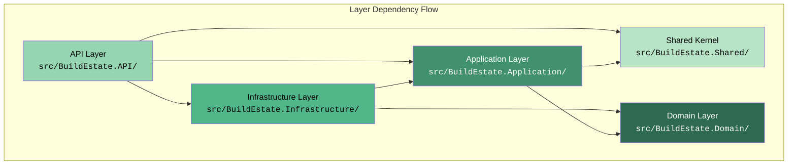

# Architecture Philosophy

> Estimated reading time: 12 minutes

## WHY

### The Problem

Enterprise software that survives 5–15 years of continuous development faces three recurring challenges:

1. **Coupled layers** — Business logic leaks into controllers, UI components, and database code. Changing a database provider or UI framework means rewriting business rules. A single change ripples unpredictably through unrelated parts of the system.

2. **Read/write contention** — Optimising a database schema for fast writes (normalised, minimal indexes) often conflicts with what reporting and search queries need (denormalised, heavily indexed, projected). Trying to serve both through one model creates performance compromises everywhere and satisfies neither.

3. **Discovery and ownership problems** — When code is organised by technical type (all controllers in one folder, all services in another, all models in a third), a developer working on Land Acquisition must open 8+ folders to understand one feature. Merge conflicts spike because unrelated teams edit the same structural files. Onboarding new developers takes weeks instead of days.

BuildEstate Pro addresses these three challenges with three interlocking architectural patterns:

- **Clean Architecture** solves layer coupling
- **CQRS (Command Query Responsibility Segregation)** solves read/write contention
- **Feature-based organisation** solves discovery and ownership

### Why This Matters to You

As a developer on this platform, you will add features, fix bugs, and extend modules. Without understanding *why* the code is structured the way it is, you risk:

- Putting business logic in the wrong layer
- Bypassing the MediatR pipeline (and losing validation + audit)
- Creating circular dependencies between projects
- Building a "quick fix" that breaks the architecture for the next developer

This document gives you the reasoning behind the rules so you can make good decisions in ambiguous situations.

## WHAT

### Clean Architecture

Clean Architecture organises code into concentric layers where **dependencies point inward**. The innermost layer (Domain) knows nothing about the outer layers. The outermost layer (API) knows about everything below it but nothing above.

### CQRS

CQRS separates the model used to update state (Commands) from the model used to read state (Queries). Each side can be optimised independently — commands validate and enforce business rules while queries use projections, `AsNoTracking()`, and denormalised DTOs for speed.

### Feature-Based Organisation

Instead of grouping by technical role (all controllers together, all services together), code is grouped by business capability. Everything related to "Create Opportunity" lives in one folder: the command, its handler, its validator, and its DTO.

### How They Work Together



## HOW

### Dependency Rules

The following table defines which project may reference which. Violations break the architecture and will be rejected in code review.

| Layer | Project | May Reference | Must NOT Reference |
|-------|---------|---------------|-------------------|
| Domain | `BuildEstate.Domain` | Nothing (only `MediatR.Contracts` for domain events) | Application, Infrastructure, API |
| Application | `BuildEstate.Application` | Domain, Shared | Infrastructure, API |
| Infrastructure | `BuildEstate.Infrastructure` | Application, Domain | API |
| API | `BuildEstate.API` | Application, Infrastructure, Shared | — (composition root) |
| Shared | `BuildEstate.Shared` | Nothing | Domain, Application, Infrastructure, API |

These rules are enforced by .csproj `<ProjectReference>` declarations. The Domain project file proves this — it has **zero** project references:

```xml
<!-- src/BuildEstate.Domain/BuildEstate.Domain.csproj -->
<Project Sdk="Microsoft.NET.Sdk">
  <PropertyGroup>
    <TargetFramework>net8.0</TargetFramework>
    <ImplicitUsings>enable</ImplicitUsings>
    <Nullable>enable</Nullable>
  </PropertyGroup>
  <ItemGroup>
    <PackageReference Include="MediatR.Contracts" Version="2.0.1" />
  </ItemGroup>
</Project>
```

The Application layer references only Domain and Shared:

```xml
<!-- src/BuildEstate.Application/BuildEstate.Application.csproj (relevant section) -->
<ItemGroup>
  <ProjectReference Include="..\BuildEstate.Domain\BuildEstate.Domain.csproj" />
  <ProjectReference Include="..\BuildEstate.Shared\BuildEstate.Shared.csproj" />
</ItemGroup>
```

### Rationale — Clean Architecture Benefits

1. **Testability** — Business logic in the Application layer can be unit-tested by mocking interfaces (`IRepository<>`, `ICurrentUserService`). No database, no HTTP server, no Angular — just pure logic under test.
2. **Independence from frameworks** — The Domain layer has no dependency on ASP.NET Core, Entity Framework, or Angular. If Microsoft releases a new ORM or we migrate to a different web framework, Domain entities remain unchanged.
3. **Independence from database** — EF Core configurations live in Infrastructure. The Application layer talks through `IRepository<T>` and `IUnitOfWork` interfaces. Switching from SQL Server to PostgreSQL requires changes only in Infrastructure — zero changes to business logic.

### Rationale — CQRS Benefits

1. **Separate read/write models** — Commands enforce invariants and emit domain events. Queries bypass all that and project directly to DTOs with `AsNoTracking()`.
2. **Optimised queries** — Read handlers can use materialised views, composite indexes, or even a different data source without affecting the write side.
3. **Clear command boundaries** — Each command is a single unit of work with its own validator, making it easy to reason about, test, and audit.

### Rationale — Feature-Based Organisation Benefits

1. **Discoverable code** — A new developer working on Offers opens `src/BuildEstate.Application/Features/LandAcquisition/Offers/` and finds everything: commands, queries, DTOs, handlers, validators.
2. **Reduced merge conflicts** — Two developers working on different features (Offers vs. DueDiligence) never touch the same folder.
3. **Team scalability** — As the team grows, each developer (or team) can own a feature folder. Boundaries are physically visible in the file system.

### The Dependency Inversion Pattern

The Application layer defines **interfaces** — the Infrastructure layer provides **implementations**. This is how the inner layers stay unaware of databases and external services.

The following interface is defined in the Application layer:

```csharp
// src/BuildEstate.Application/Interfaces/ICurrentUserService.cs
namespace BuildEstate.Application.Interfaces;

public interface ICurrentUserService
{
    string? UserId { get; }
    string? UserName { get; }
    bool IsInRole(string role);
}
```

The Infrastructure layer provides the concrete implementation that reads from HTTP context. The API layer wires them together in `DependencyInjection.cs`:

```csharp
// src/BuildEstate.Infrastructure/DependencyInjection.cs (excerpt)
services.AddScoped(typeof(IRepository<>), typeof(Repository<>));
services.AddScoped<IUnitOfWork, UnitOfWork>();
services.AddScoped<IAccountLockoutService, AccountLockoutService>();
services.AddScoped<ISessionService, SessionService>();
```

### Domain Layer — Pure Business Concepts

The Domain contains entities, enums, value objects, exceptions, and domain events. It depends on nothing external:

```csharp
// src/BuildEstate.Domain/Common/BaseEntity.cs
namespace BuildEstate.Domain.Common;

public abstract class BaseEntity : IHasDomainEvents, IAuditableEntity
{
    public Guid Id { get; set; } = Guid.NewGuid();
    public DateTime CreatedAt { get; set; }
    public string CreatedBy { get; set; } = string.Empty;
    public DateTime? UpdatedAt { get; set; }
    public string? UpdatedBy { get; set; }
    public bool IsDeleted { get; set; } = false;
    public DateTime? DeletedAt { get; set; }
    public string? DeletedBy { get; set; }
    public byte[] RowVersion { get; set; } = Array.Empty<byte>();

    private readonly List<IDomainEvent> _domainEvents = new();
    public IReadOnlyCollection<IDomainEvent> DomainEvents => _domainEvents.AsReadOnly();
    protected void AddDomainEvent(IDomainEvent domainEvent) => _domainEvents.Add(domainEvent);
    public void ClearDomainEvents() => _domainEvents.Clear();
}
```

Notice: no `using Microsoft.EntityFrameworkCore`, no `using Microsoft.AspNetCore`, no infrastructure namespace. This entity can be tested with zero setup.

## WHEN

Apply these architectural rules **from the first line of code** in any new feature:

- **Before writing a handler**, confirm it lives in `Application/Features/{Module}/{Operation}/`
- **Before adding a NuGet package to Domain**, stop and ask: "Does the Domain truly need this?" (The answer is almost always no)
- **Before calling DbContext directly from a controller**, stop — that bypasses CQRS, validation, and audit
- **Before creating a "Helpers" class**, stop — find the correct layer and feature folder

## WHERE

### Codebase Structure

```
src/
├── BuildEstate.Domain/              ← Innermost: entities, enums, events, interfaces
│   ├── Common/                      ← BaseEntity, IRepository<T>, IUnitOfWork
│   ├── Entities/                    ← Business entities grouped by module
│   │   ├── LandAcquisition/         ← LandOpportunity, Offer, Contract, etc.
│   │   ├── PlanningApprovals/
│   │   ├── LegalCompliance/
│   │   ├── UserManagement/
│   │   └── ...
│   ├── Enums/                       ← Status enumerations
│   ├── Events/                      ← Domain events
│   ├── Exceptions/                  ← Domain-specific exceptions
│   └── Services/                    ← Domain service interfaces (state machines)
│
├── BuildEstate.Application/         ← Use cases: commands, queries, handlers
│   ├── Behaviors/                   ← MediatR pipeline (validation, logging)
│   ├── Features/                    ← Feature folders grouped by module
│   │   ├── LandAcquisition/
│   │   │   ├── Opportunities/       ← Commands/, Queries/, DTOs/
│   │   │   ├── Offers/
│   │   │   ├── Contracts/
│   │   │   └── ...
│   │   ├── PlanningApprovals/
│   │   ├── LegalCompliance/
│   │   ├── UserManagement/
│   │   └── Search/
│   ├── Interfaces/                  ← Contracts for Infrastructure to implement
│   ├── Authorization/               ← Policy definitions
│   └── Common/                      ← Shared application-layer abstractions
│
├── BuildEstate.Infrastructure/      ← Implementations: EF Core, Identity, Search
│   ├── Persistence/                 ← DbContext, configurations, migrations
│   ├── Identity/                    ← ASP.NET Identity implementation
│   ├── Search/                      ← ISearchProvider implementations
│   ├── Services/                    ← Service implementations
│   └── DependencyInjection.cs       ← Wiring: interface → implementation
│
├── BuildEstate.API/                 ← Composition root: controllers, middleware
│   ├── Controllers/                 ← Thin controllers dispatching via MediatR
│   ├── Middleware/                  ← Exception handling, audit, correlation ID
│   ├── Services/                    ← API-layer services (CurrentUserService)
│   └── Program.cs                   ← DI composition, pipeline configuration
│
└── BuildEstate.Shared/              ← Cross-cutting DTOs and exceptions
    ├── ApiResponse.cs               ← Standard API response envelope
    ├── PagedResult.cs               ← Pagination wrapper
    └── Exceptions/                  ← Shared exception types
```

## WHO

| Role | Responsibility |
|------|---------------|
| **Enterprise Architect** | Defines and enforces layer boundaries, reviews dependency rules |
| **Backend Developers** | Implement features within correct layers, follow CQRS patterns |
| **Frontend Developers** | Interact only with API contracts, never bypass layers |
| **Tech Lead / Code Reviewer** | Validates architectural compliance in every PR |
| **New Developers** | Understand the rules before writing code (that's you reading this) |

## WHAT NEXT

Now that you understand *why* the architecture is structured this way, continue with:

- [06-technology-decisions.md](./06-technology-decisions.md) — Understand *which* technologies implement each layer and why they were chosen
- [07-clean-architecture-explained.md](./07-clean-architecture-explained.md) — Deep-dive into each layer with more class examples
- [08-cqrs-and-mediatr.md](./08-cqrs-and-mediatr.md) — See complete command/query examples from the Land Acquisition module
- [19-module-pattern.md](./19-module-pattern.md) — The standard template every new module follows

## Common Mistakes

### Mistake 1: Business Logic in Controllers

**The problem:** A developer puts validation, entity construction, or state transition logic directly in a controller action.

```csharp
// ❌ WRONG — Controller doing too much
[HttpPost]
public async Task<IActionResult> Create([FromBody] CreateDto dto)
{
    if (string.IsNullOrEmpty(dto.Name))
        return BadRequest("Name required");

    var entity = new LandOpportunity { Name = dto.Name, Location = dto.Location };
    _context.LandOpportunities.Add(entity);
    await _context.SaveChangesAsync();
    return Ok(entity);
}
```

**Why it's wrong:** This bypasses FluentValidation (losing structured error responses), bypasses the MediatR pipeline (losing audit logging), exposes a domain entity directly (coupling API contract to internal model), and makes the logic untestable without an HTTP server.

```csharp
// ✅ CORRECT — Controller dispatches to MediatR
[HttpPost]
public async Task<IActionResult> Create(
    [FromBody] CreateOpportunityCommand command,
    CancellationToken cancellationToken)
{
    var result = await _mediator.Send(command, cancellationToken);
    return CreatedAtAction(nameof(GetById), new { id = result.Id }, result);
}
```

### Mistake 2: Domain Layer Referencing Infrastructure

**The problem:** A developer adds `using Microsoft.EntityFrameworkCore` or `using Microsoft.AspNetCore.Identity` to a domain entity because they want navigation property loading or identity integration.

**Why it's wrong:** The Domain layer must remain framework-agnostic. If you add EF Core attributes to entities, those entities can no longer be tested without EF Core. The entire point of Clean Architecture collapses — you can't swap implementations, and you can't test business logic in isolation.

**The fix:** Define interfaces in Domain (`IRepository<T>`) or Application (`ICurrentUserService`). Let Infrastructure implement them. The Domain never knows *how* data is persisted — only *what* data exists.

### Mistake 3: Circular Dependencies Between Projects

**The problem:** A developer creates a class in Application that references a type in Infrastructure (e.g., importing `BuildEstateDbContext` directly into a handler).

```csharp
// ❌ WRONG — Application referencing Infrastructure directly
using BuildEstate.Infrastructure.Persistence;

public class CreateOpportunityHandler : IRequestHandler<CreateOpportunityCommand, OpportunityDto>
{
    private readonly BuildEstateDbContext _context; // VIOLATION
}
```

**Why it's wrong:** Application must not reference Infrastructure. This creates a circular dependency and eliminates the ability to test handlers without a real database.

```csharp
// ✅ CORRECT — Application references its own interface
using BuildEstate.Domain.Common;

public class CreateOpportunityHandler : IRequestHandler<CreateOpportunityCommand, OpportunityDto>
{
    private readonly IRepository<LandOpportunity> _repository;
    private readonly IUnitOfWork _unitOfWork;
}
```

### Mistake 4: Organising by Technical Type Instead of Feature

**The problem:** Creating folders like `Commands/`, `Queries/`, `Handlers/` at the top level, with all commands from all features mixed together.

**Why it's wrong:** A developer working on Offers must scan through files for Opportunities, DueDiligence, Contracts, and Acquisitions to find their code. Merge conflicts increase. Discoverability drops.

**The fix:** Organise by feature first, then by technical concern within that feature:

```
Features/
└── LandAcquisition/
    ├── Opportunities/
    │   ├── Commands/CreateOpportunity/
    │   ├── Queries/GetOpportunities/
    │   └── DTOs/
    └── Offers/
        ├── Commands/CreateOffer/
        ├── Queries/GetOffers/
        └── DTOs/
```
