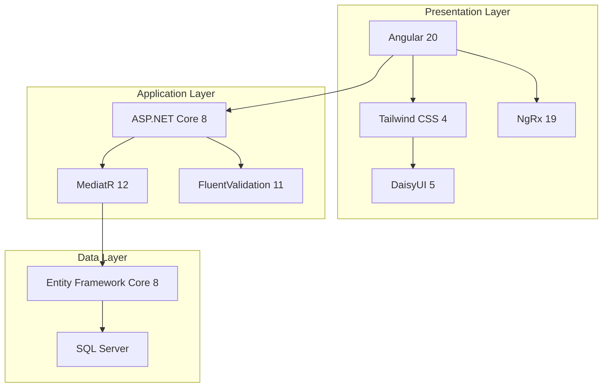

# Technology Decisions

> **Estimated Reading Time:** 17 minutes

## WHY

Every technology choice in BuildEstate Pro was made deliberately — not because something was trending, but because it solved a specific problem better than the alternatives. Understanding *why* each technology was selected helps you make informed decisions when extending the platform, evaluating new libraries, or debugging integration issues.

Technology decisions are expensive to reverse. A framework choice made in week one lives with the team for years. This document records our reasoning so that future developers can understand the constraints we operated under and avoid re-litigating settled decisions without new evidence.

If you ever wonder "why didn't we just use React?" or "couldn't we have used Dapper instead of EF Core?" — this document has the answer.

## WHAT

This document records the 9 foundational technology choices that form BuildEstate Pro's stack. Each decision follows a consistent format:

- **Technology name and version** — what we selected
- **Purpose** — what role it plays in the platform
- **Alternatives considered** — what else was evaluated
- **Reasons for selection** — why this technology won

These 9 choices span the full stack from database through to UI component library:



## HOW

Each technology decision below documents the evaluation process. When reading these, notice how each choice reinforces the others — Angular's reactive model complements NgRx, MediatR's pipeline supports FluentValidation, and EF Core's LINQ integrates with SQL Server's query engine.

---

### 1. ASP.NET Core 8

| Attribute | Detail |
|-----------|--------|
| **Version** | .NET 8 (LTS) |
| **Purpose** | Backend web framework — hosts REST APIs, middleware pipeline, dependency injection, authentication |
| **NuGet Packages** | `Microsoft.AspNetCore.Authentication.JwtBearer 8.0.11`, `Swashbuckle.AspNetCore 6.6.2` |

**Alternatives Considered:**

| Alternative | Why Not |
|-------------|---------|
| **Django (Python)** | Slower runtime performance for CPU-bound operations; Python's dynamic typing makes large-scale refactoring riskier; ORM less suited to complex domain models |
| **Express.js (Node.js)** | No built-in DI container; lacks structured middleware pipeline; TypeScript support is opt-in rather than native; weaker ecosystem for enterprise patterns (CQRS, mediator) |
| **Spring Boot (Java)** | Heavier startup time and memory footprint; verbose boilerplate compared to C# records and minimal APIs; team expertise favoured .NET |

**Reasons for Selection:**

1. **Built-in enterprise features** — ASP.NET Core ships with dependency injection, middleware pipeline, authentication/authorization, model binding, and API versioning out of the box. No need to assemble these from separate packages.
2. **Performance** — ASP.NET Core consistently ranks among the fastest web frameworks in the TechEmpower benchmarks, handling 7M+ requests/second for plaintext workloads.
3. **Long-Term Support** — .NET 8 is an LTS release supported until November 2026, giving the team a stable foundation without forced upgrade pressure.
4. **C# language features** — Records for immutable DTOs, pattern matching for cleaner control flow, nullable reference types for compile-time null safety, and `async/await` as a first-class citizen.

**Codebase Reference:**

```csharp
// src/BuildEstate.API/Program.cs — Application bootstrap
var builder = WebApplication.CreateBuilder(args);

builder.Services.AddAuthentication(JwtBearerDefaults.AuthenticationScheme)
    .AddJwtBearer(options =>
    {
        options.TokenValidationParameters = new TokenValidationParameters
        {
            ValidateIssuer = true,
            ValidateAudience = true,
            ValidateLifetime = true,
            ValidateIssuerSigningKey = true
        };
    });

builder.Services.AddAuthorization();
builder.Services.AddControllers();
```

---

### 2. Angular 20

| Attribute | Detail |
|-----------|--------|
| **Version** | Angular 20 (Standalone Components) |
| **Purpose** | Frontend SPA framework — component architecture, routing, forms, HTTP client, dependency injection |
| **npm Package** | `@angular/core ^20.0.0` |

**Alternatives Considered:**

| Alternative | Why Not |
|-------------|---------|
| **React 19** | No built-in router, forms, or DI; requires assembling many third-party libraries; less opinionated structure leads to inconsistency across teams |
| **Vue 3** | Smaller enterprise ecosystem; fewer enterprise-grade libraries for state management and form validation; less TypeScript-first than Angular |
| **Blazor (WASM)** | Browser download size concerns; less mature component ecosystem; fewer developers with Blazor experience compared to Angular |

**Reasons for Selection:**

1. **Opinionated architecture** — Angular enforces consistent structure (modules, components, services, guards, interceptors) which is critical for a 14-module enterprise platform where multiple developers work in parallel.
2. **TypeScript-first** — Angular requires TypeScript with strict mode, catching entire categories of bugs at compile time rather than runtime.
3. **Built-in tooling** — Router with lazy loading, reactive forms with typed validators, HttpClient with interceptors, and a powerful CLI for code generation — all maintained by the same team.
4. **Enterprise adoption** — Google, Microsoft, and large financial institutions use Angular for internal tools, proving its fitness for complex business applications.

**Codebase Reference:**

```typescript
// client-app/src/app/app.config.ts — Application configuration
import { ApplicationConfig } from '@angular/core';
import { provideRouter } from '@angular/router';
import { provideStore } from '@ngrx/store';
import { provideEffects } from '@ngrx/effects';
import { routes } from './app.routes';

export const appConfig: ApplicationConfig = {
  providers: [
    provideRouter(routes),
    provideStore({}),
    provideEffects([])
  ]
};
```

---

### 3. NgRx 19

| Attribute | Detail |
|-----------|--------|
| **Version** | NgRx 19 (Store, Effects, Entity) |
| **Purpose** | Predictable state management — single source of truth for application state, unidirectional data flow |
| **npm Packages** | `@ngrx/store ^19.0.0`, `@ngrx/effects ^19.0.0`, `@ngrx/entity ^19.0.0` |

**Alternatives Considered:**

| Alternative | Why Not |
|-------------|---------|
| **Akita** | Less community support; documentation gaps; no entity adapter equivalent; smaller team maintaining it |
| **NGXS** | Decorator-based approach creates tight coupling between state logic and class structure; less mature DevTools integration |
| **RxJS BehaviorSubject services** | No DevTools, no time-travel debugging, no action history; state mutations become untraceable in large applications; no standardized patterns across teams |

**Reasons for Selection:**

1. **Predictable state mutations** — Reducers are pure functions, making state changes deterministic and testable in isolation.
2. **DevTools integration** — Time-travel debugging, action replay, and state diff inspection dramatically reduce debugging time for complex UI state issues.
3. **Separation of concerns** — Actions describe intent, reducers handle state transitions, effects handle side effects (API calls, navigation). Each piece is independently testable.
4. **Entity adapter** — `@ngrx/entity` provides normalized state management for collections, eliminating manual array manipulation and O(n) lookups.

**Codebase Reference:**

```typescript
// client-app/src/app/features/land-acquisition/store/opportunities.actions.ts
import { createAction, props } from '@ngrx/store';
import { OpportunityDto } from '../models/opportunity.model';

export const loadOpportunities = createAction(
    '[Opportunities] Load Opportunities'
);
export const loadOpportunitiesSuccess = createAction(
    '[Opportunities] Load Opportunities Success',
    props<{ opportunities: OpportunityDto[] }>()
);
export const loadOpportunitiesFailure = createAction(
    '[Opportunities] Load Opportunities Failure',
    props<{ error: string }>()
);
```

---

### 4. MediatR 12

| Attribute | Detail |
|-----------|--------|
| **Version** | MediatR 12.4.1 |
| **Purpose** | In-process mediator / CQRS dispatcher — decouples controllers from business logic handlers |
| **NuGet Package** | `MediatR 12.4.1` |

**Alternatives Considered:**

| Alternative | Why Not |
|-------------|---------|
| **Direct service injection** | Controllers become tightly coupled to handler classes; no pipeline behavior support; adding cross-cutting concerns (logging, validation) requires modifying every handler |
| **Wolverine** | Newer library with less community adoption; more opinionated about hosting; fewer examples and documentation for enterprise patterns |
| **Custom dispatcher** | Maintenance burden on the team; re-inventing pipeline behaviors, request/response typing, and assembly scanning that MediatR already solves |

**Reasons for Selection:**

1. **Pipeline behaviors** — MediatR's pipeline allows injecting cross-cutting concerns (validation, logging, transaction management) without modifying individual handlers.
2. **Thin controllers** — Controllers dispatch commands/queries and return responses. Zero business logic leaks into the API layer.
3. **Single Responsibility** — Each handler owns exactly one operation. No 500-line service classes with 20 methods.
4. **Testability** — Handlers are simple classes with a single `Handle` method that can be unit tested without HTTP context, routing, or controller instantiation.

**Codebase Reference:**

```csharp
// src/BuildEstate.Application/Features/LandAcquisition/Opportunities/Commands/CreateOpportunity/CreateOpportunityCommandHandler.cs
public class CreateOpportunityCommandHandler
    : IRequestHandler<CreateOpportunityCommand, OpportunityDto>
{
    private readonly IApplicationDbContext _context;
    private readonly IMapper _mapper;

    public CreateOpportunityCommandHandler(
        IApplicationDbContext context,
        IMapper mapper)
    {
        _context = context;
        _mapper = mapper;
    }

    public async Task<OpportunityDto> Handle(
        CreateOpportunityCommand request,
        CancellationToken cancellationToken)
    {
        var entity = _mapper.Map<LandOpportunity>(request);
        _context.LandOpportunities.Add(entity);
        await _context.SaveChangesAsync(cancellationToken);
        return _mapper.Map<OpportunityDto>(entity);
    }
}
```

---

### 5. FluentValidation 11

| Attribute | Detail |
|-----------|--------|
| **Version** | FluentValidation 11.11.0 |
| **Purpose** | Command and query validation — strongly-typed validation rules that execute before handlers via MediatR pipeline |
| **NuGet Packages** | `FluentValidation 11.11.0`, `FluentValidation.DependencyInjectionExtensions 11.11.0` |

**Alternatives Considered:**

| Alternative | Why Not |
|-------------|---------|
| **Data Annotations** | Mixes validation logic with DTO definitions; limited expressiveness for complex rules; cannot access services (database uniqueness checks) |
| **Manual validation in handlers** | Scatters validation across handlers; no consistent error format; makes handlers responsible for two concerns (validation + business logic) |
| **Guard clauses (Ardalis.GuardClauses)** | Good for invariant checks but throws exceptions for invalid input; no structured error collection; not designed for request validation |

**Reasons for Selection:**

1. **Separation of concerns** — Validators are dedicated classes, keeping handlers focused purely on business logic.
2. **Expressive rule syntax** — `RuleFor(x => x.Name).NotEmpty().MaximumLength(200)` reads like a specification, making validation logic self-documenting.
3. **MediatR pipeline integration** — A single pipeline behavior runs the appropriate validator before each handler, returning 400 Bad Request with structured errors automatically.
4. **Testability** — Validators can be tested in isolation: instantiate, pass a command, assert validation result — no HTTP context required.

**Codebase Reference:**

```csharp
// src/BuildEstate.Application/Features/LandAcquisition/Opportunities/Commands/CreateOpportunity/CreateOpportunityCommandValidator.cs
public class CreateOpportunityCommandValidator
    : AbstractValidator<CreateOpportunityCommand>
{
    public CreateOpportunityCommandValidator()
    {
        RuleFor(x => x.Name)
            .NotEmpty().WithMessage("Opportunity name is required")
            .MaximumLength(200).WithMessage("Name must not exceed 200 characters");

        RuleFor(x => x.Location)
            .NotEmpty().WithMessage("Location is required");

        RuleFor(x => x.LandSize)
            .GreaterThan(0).WithMessage("Land size must be greater than zero");
    }
}
```

---

### 6. Entity Framework Core 8

| Attribute | Detail |
|-----------|--------|
| **Version** | EF Core 8.0.11 |
| **Purpose** | ORM and data access — Code-First migrations, LINQ queries, change tracking, relationship mapping |
| **NuGet Packages** | `Microsoft.EntityFrameworkCore 8.0.11`, `Microsoft.EntityFrameworkCore.SqlServer 8.0.11` |

**Alternatives Considered:**

| Alternative | Why Not |
|-------------|---------|
| **Dapper** | Requires writing raw SQL for every query; no change tracking; no automatic migration generation; relationship management is manual |
| **NHibernate** | Heavier, more complex configuration; XML-based mapping (though Fluent exists); slower community adoption in .NET Core era; steeper learning curve |
| **RepoDB** | Less mature; smaller community; fewer enterprise features like interceptors, value converters, and owned entities |

**Reasons for Selection:**

1. **Code-First migrations** — Schema evolves alongside the code. `dotnet ef migrations add` generates versioned migration files that can be reviewed in PRs, applied to staging, and rolled back if needed.
2. **LINQ integration** — Queries are written in C# with full IntelliSense and compile-time type checking. No SQL string typos, no runtime query failures from mismatched column names.
3. **Soft delete via query filters** — `builder.HasQueryFilter(x => !x.IsDeleted)` globally excludes soft-deleted records from all queries without remembering to add `WHERE IsDeleted = 0` everywhere.
4. **Audit interceptor support** — `SaveChangesInterceptor` captures all entity mutations in one place, enabling automatic audit trail population without touching individual handlers.

**Codebase Reference:**

```csharp
// src/BuildEstate.Infrastructure/Persistence/Configurations/LandOpportunityConfiguration.cs
public class LandOpportunityConfiguration : IEntityTypeConfiguration<LandOpportunity>
{
    public void Configure(EntityTypeBuilder<LandOpportunity> builder)
    {
        builder.ToTable("LandOpportunities");
        builder.HasKey(x => x.Id);

        builder.Property(x => x.Name).IsRequired().HasMaxLength(200);
        builder.Property(x => x.Location).IsRequired().HasMaxLength(500);
        builder.Property(x => x.LandSize).HasPrecision(18, 2);

        builder.HasIndex(x => x.Status);
        builder.HasIndex(x => x.CreatedAt);
        builder.HasQueryFilter(x => !x.IsDeleted);
    }
}
```

---

### 7. SQL Server

| Attribute | Detail |
|-----------|--------|
| **Version** | SQL Server (via `Microsoft.EntityFrameworkCore.SqlServer 8.0.11`) |
| **Purpose** | Relational database — persistent storage, ACID transactions, full-text search, indexing |

**Alternatives Considered:**

| Alternative | Why Not |
|-------------|---------|
| **PostgreSQL** | Excellent database, but less integrated with .NET ecosystem tooling (Azure SQL, SSMS, SSRS); team expertise favoured SQL Server |
| **MongoDB** | Document databases sacrifice JOIN performance; relational data (opportunities → offers → contracts) is inherently relational; schema-less design creates drift over time in a multi-developer team |
| **Azure Cosmos DB** | Over-engineered for a single-region application; cost model is unpredictable for relational workloads; complex partitioning strategy required |

**Reasons for Selection:**

1. **Relational integrity** — Property development data is highly relational (opportunities have owners, offers, contracts, documents). SQL Server enforces these relationships at the database level.
2. **Full-text search** — SQL Server Full-Text Search powers the global search feature without requiring a separate search infrastructure (Elasticsearch) in the initial deployment.
3. **Azure integration** — Azure SQL Database provides managed hosting with automatic backups, scaling, and geo-replication when the platform moves to cloud deployment.
4. **Tooling ecosystem** — SQL Server Management Studio, Azure Data Studio, and SQL Server Profiler provide mature tooling for query optimization, execution plan analysis, and production debugging.

---

### 8. Tailwind CSS 4

| Attribute | Detail |
|-----------|--------|
| **Version** | Tailwind CSS 4.3.1 |
| **Purpose** | Utility-first CSS framework — rapid UI development with consistent spacing, typography, and responsive design |
| **npm Package** | `tailwindcss ^4.3.1`, `@tailwindcss/postcss ^4.3.1` |

**Alternatives Considered:**

| Alternative | Why Not |
|-------------|---------|
| **Bootstrap 5** | Component-based approach creates specificity wars; harder to customize without overriding styles; produces larger bundles for enterprise apps |
| **Angular Material** | Heavy component library with opinionated Material Design aesthetic; difficult to customize beyond Material Design guidelines; bundle size impact |
| **Plain SCSS with BEM** | Requires writing and maintaining thousands of custom classes; naming conventions diverge across developers; no built-in responsive utilities |

**Reasons for Selection:**

1. **Consistency without convention enforcement** — Spacing scale (`p-4`, `mt-2`, `gap-6`), colour palette, and typography are predefined. Developers cannot invent random `padding: 13px` values.
2. **Tiny production bundles** — Tailwind 4 tree-shakes unused utilities, producing CSS files 10-50x smaller than component-library stylesheets.
3. **Responsive design built-in** — `sm:`, `md:`, `lg:`, `xl:` prefixes make responsive layouts declarative without custom media queries.
4. **Composable with component libraries** — Tailwind's utility classes compose perfectly with DaisyUI's component classes, giving us both low-level control and high-level components.

**Codebase Reference:**

```css
/* client-app/src/styles.css — Tailwind integration */
@import "tailwindcss";
@import "./app/shared/design-system/design-system-tokens.css";

@plugin "daisyui" {
  themes: light --default, dark, corporate, business;
}
```

---

### 9. DaisyUI 5

| Attribute | Detail |
|-----------|--------|
| **Version** | DaisyUI 5.5.23 |
| **Purpose** | Component library built on Tailwind — provides pre-styled semantic component classes (buttons, cards, modals, badges, tables) with theme support |
| **npm Package** | `daisyui ^5.5.23` |

**Alternatives Considered:**

| Alternative | Why Not |
|-------------|---------|
| **Headless UI** | Provides accessibility but zero styling; requires building every component's visual design from scratch; slower time-to-market |
| **PrimeNG** | Heavy bundle size; Angular-specific with tight coupling to its own design system; harder to customize with Tailwind utilities |
| **Shadcn/ui** | React-only; copy-paste model requires manual Angular port; no official Angular support |

**Reasons for Selection:**

1. **Theme system** — DaisyUI's `data-theme` attribute provides instant light/dark/corporate theme switching without writing custom CSS variables for every component.
2. **Tailwind-native** — DaisyUI classes (`btn`, `card`, `badge`, `modal`) are Tailwind plugins, composable with utility classes (`btn btn-primary btn-sm`). No CSS specificity conflicts.
3. **Semantic class names** — `badge-success`, `alert-warning`, `btn-error` are self-documenting in templates, making code reviews faster.
4. **Minimal JavaScript** — DaisyUI is CSS-only. No JavaScript runtime, no framework lock-in, no bundle size impact beyond CSS classes.

**Codebase Reference:**

```html
<!-- Example: DaisyUI + Tailwind in an Angular template -->
<div class="card bg-base-100 shadow-sm border border-base-300">
  <div class="card-body p-4">
    <h3 class="card-title text-lg font-semibold">
      {{ opportunity.name }}
    </h3>
    <div class="flex gap-2 mt-2">
      <span class="badge badge-success badge-sm">{{ opportunity.status }}</span>
      <span class="badge badge-ghost badge-sm">{{ opportunity.source }}</span>
    </div>
  </div>
</div>
```

---

## WHEN

Use this document when:

- **Evaluating a new library** — Check if an existing technology already solves the problem. Adding a new dependency to a 9-technology stack requires strong justification.
- **Debugging integration issues** — Understanding why technologies were paired helps diagnose where integration boundaries might fail.
- **Onboarding** — Read this after [05-architecture-philosophy.md](./05-architecture-philosophy.md) and before diving into framework-specific documents (08, 09, 10+).
- **Proposing a technology change** — Any proposal should address: what problem does the new choice solve that the current choice doesn't? What migration cost does it introduce?

## WHERE

The technology choices manifest across the codebase:

| Technology | Primary Locations |
|------------|-------------------|
| ASP.NET Core 8 | `src/BuildEstate.API/` — controllers, middleware, Program.cs |
| Angular 20 | `client-app/src/app/` — components, routing, services |
| NgRx 19 | `client-app/src/app/features/*/store/` and `client-app/src/app/core/store/` |
| MediatR 12 | `src/BuildEstate.Application/Features/` — commands, queries, handlers |
| FluentValidation 11 | `src/BuildEstate.Application/Features/*/Commands/*/` — validator classes |
| EF Core 8 | `src/BuildEstate.Infrastructure/Persistence/` — DbContext, configurations, migrations |
| SQL Server | Connection string in `appsettings.json`; schema in `Migrations/` |
| Tailwind CSS 4 | `client-app/src/styles.css`, component templates (utility classes) |
| DaisyUI 5 | `client-app/src/styles.css` (plugin), component templates (semantic classes) |

## WHO

| Role | Responsibility |
|------|----------------|
| **Tech Lead / Architect** | Evaluates and approves technology changes; maintains this document |
| **Backend Developers** | Work with ASP.NET Core, MediatR, FluentValidation, EF Core, SQL Server |
| **Frontend Developers** | Work with Angular, NgRx, Tailwind CSS, DaisyUI |
| **DevOps** | Manages SQL Server instances, .NET runtime deployment, Angular build pipeline |
| **All Developers** | Must understand the full stack to trace requests end-to-end |

## WHAT NEXT

Now that you understand *what* technologies we use and *why*, continue to:

- [07-clean-architecture-explained.md](./07-clean-architecture-explained.md) — See how these technologies are organized into architectural layers
- [08-cqrs-and-mediatr.md](./08-cqrs-and-mediatr.md) — Deep-dive into MediatR's role in the CQRS pattern
- [09-ngrx-and-state-management.md](./09-ngrx-and-state-management.md) — Deep-dive into NgRx state management

## Common Mistakes

### Mistake 1: Adding a Technology Without Updating This Document

**The Problem:** A developer adds a new npm package or NuGet library to solve a problem, but doesn't document why it was chosen or what alternatives were considered. Six months later, another developer adds a competing library for the same purpose because they didn't know the first one existed.

```json
// ❌ WRONG — package.json grows with undocumented dependencies
{
  "dependencies": {
    "lodash": "^4.17.21",
    "ramda": "^0.29.0",
    "underscore": "^1.13.6"
  }
}
```

**Why it's wrong:** Three utility libraries doing overlapping work. No one knows which to use for what. Bundle size grows. Maintenance burden triples.

```json
// ✅ CORRECT — One choice, documented and enforced
{
  "dependencies": {
    // No utility library — use native JS/TS methods
    // Decision: Modern TypeScript (Array.map, Object.entries, optional chaining)
    // covers 95% of use cases without external dependencies.
  }
}
```

**Fix:** Every new dependency requires a PR description answering: What problem does it solve? What alternatives exist? Why this one? Update this document if it represents a foundational choice.

---

### Mistake 2: Using a Technology Against Its Design Philosophy

**The Problem:** A developer uses EF Core but writes raw SQL strings everywhere, bypassing LINQ, change tracking, and query filters. Or uses NgRx but mutates state directly in components instead of dispatching actions.

```csharp
// ❌ WRONG — Using EF Core like Dapper (defeats the purpose of the ORM)
public async Task<List<OpportunityDto>> GetAll()
{
    var sql = "SELECT * FROM LandOpportunities WHERE IsDeleted = 0";
    var results = await _context.Database
        .SqlQueryRaw<OpportunityDto>(sql)
        .ToListAsync();
    return results;
}
```

**Why it's wrong:** Bypasses query filters (soft delete), loses compile-time type safety, can't benefit from EF Core's projection optimization, and creates SQL injection risk if parameters are concatenated.

```csharp
// ✅ CORRECT — Use the technology as designed
public async Task<List<OpportunityDto>> GetAll(CancellationToken ct)
{
    return await _context.LandOpportunities
        .AsNoTracking()
        .Select(x => new OpportunityDto
        {
            Id = x.Id,
            Name = x.Name,
            Status = x.Status,
            Location = x.Location
        })
        .ToListAsync(ct);
}
```

**Fix:** Before using a technology, read its documentation. If you find yourself fighting the framework, you're probably using it wrong. Ask a senior developer before inventing workarounds.

---

### Mistake 3: Mixing Tailwind Utilities with Inline Styles or Custom CSS

**The Problem:** A developer uses Tailwind for some elements but sprinkles `style="color: #3b82f6"` or custom SCSS files for others. The result is an inconsistent codebase where theme changes don't propagate everywhere.

```html
<!-- ❌ WRONG — Hardcoded colors bypass DaisyUI theming -->
<button style="background-color: #3b82f6; color: white; padding: 8px 16px;">
  Save
</button>
```

**Why it's wrong:** When the user switches to dark theme, this button remains unchanged. The hardcoded color doesn't adapt. It also ignores the spacing scale and creates visual inconsistency.

```html
<!-- ✅ CORRECT — DaisyUI + Tailwind utilities respect theming -->
<button class="btn btn-primary btn-sm">
  Save
</button>
```

**Fix:** Never use inline `style` attributes or hardcoded hex colors. Use DaisyUI semantic classes for components and Tailwind utilities for layout/spacing. The theme system handles color adaptation automatically.
