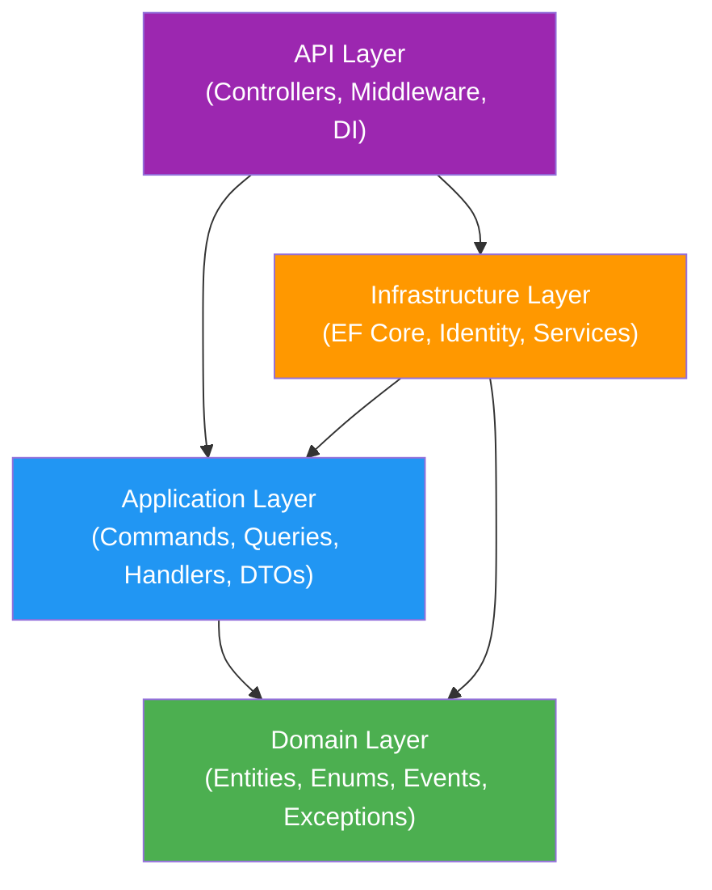

# Clean Architecture Explained

> Estimated reading time: 12 minutes

## WHY

Clean Architecture exists because software that mixes business logic with infrastructure concerns becomes impossible to maintain, test, and evolve over time. In a platform like BuildEstate Pro — which spans 14 modules, hundreds of entities, and years of planned development — architectural discipline is the difference between a codebase that scales gracefully and one that collapses under its own weight.

Without strict layer separation:
- A database change forces you to rewrite API controllers
- A UI framework upgrade requires touching business logic
- Testing a business rule means spinning up SQL Server and HTTP servers
- New developers cannot understand what code does without tracing through unrelated infrastructure

Clean Architecture solves these problems by enforcing a **dependency rule**: outer layers depend on inner layers, never the reverse. Business rules sit at the core, untouched by the mechanics of databases, web frameworks, or UI libraries.

## WHAT

Clean Architecture organises code into concentric layers with strict dependency rules. BuildEstate Pro implements four layers:



**The Dependency Rule:** Dependencies always point inward. The Domain layer knows nothing about the Application, Infrastructure, or API layers. The Application layer knows nothing about Infrastructure or API. Only outer layers reference inner layers.

### The Four Layers

| Layer | Project | Purpose | Depends On |
|-------|---------|---------|------------|
| **Domain** | `BuildEstate.Domain` | Business entities, enums, domain events, exceptions | Nothing |
| **Application** | `BuildEstate.Application` | Commands, queries, handlers, validators, DTOs, interfaces | Domain |
| **Infrastructure** | `BuildEstate.Infrastructure` | EF Core, Identity, external services, persistence | Application, Domain |
| **API** | `BuildEstate.API` | Controllers, middleware, DI configuration | Application, Infrastructure |

Additionally, `BuildEstate.Shared` provides cross-cutting contracts (like `ApiResponse<T>` and `PagedResult<T>`) consumed by multiple layers.

## HOW

### Layer 1: Domain — The Business Core

The Domain layer contains the purest expression of business concepts. It has **zero** project references and depends on nothing external — no NuGet packages for frameworks, no infrastructure concerns.

**Purpose:** Define what the business IS — entities, value objects, enums representing business states, domain events signalling what happened, and exceptions representing business rule violations.

**Location:** `src/BuildEstate.Domain/`

**Structure:**
```
BuildEstate.Domain/
├── Common/          → Base classes (BaseEntity, IAuditableEntity, IRepository)
├── Entities/        → Business entities grouped by module
├── Enums/           → Business status values and type classifications
├── Events/          → Domain events (things that happened)
├── Exceptions/      → Business rule violation exceptions
└── Services/        → Domain service interfaces (state machines)
```

**Example 1 — `BaseEntity` (the foundation for all domain entities):**

The following class from `src/BuildEstate.Domain/Common/BaseEntity.cs` shows how every entity in the system inherits standard audit columns, soft-delete support, optimistic concurrency, and domain event capability:

```csharp
public abstract class BaseEntity : IHasDomainEvents, IAuditableEntity
{
    public Guid Id { get; set; } = Guid.NewGuid();
    public DateTime CreatedAt { get; set; }
    public string CreatedBy { get; set; } = string.Empty;
    public DateTime? UpdatedAt { get; set; }
    public string? UpdatedBy { get; set; }
    public bool IsDeleted { get; set; } = false;
    public DateTime? DeletedAt { get; set; }
    public string? DeletedBy { get; set; }
    public byte[] RowVersion { get; set; } = Array.Empty<byte>();

    private readonly List<IDomainEvent> _domainEvents = new();
    public IReadOnlyCollection<IDomainEvent> DomainEvents => _domainEvents.AsReadOnly();
    protected void AddDomainEvent(IDomainEvent domainEvent) => _domainEvents.Add(domainEvent);
    public void ClearDomainEvents() => _domainEvents.Clear();
}
```

**Example 2 — `LandOpportunity` entity:**

From `src/BuildEstate.Domain/Entities/LandAcquisition/LandOpportunity.cs`, this is the primary aggregate root for the Land Acquisition module:

```csharp
public class LandOpportunity : BaseEntity
{
    public string Name { get; set; } = string.Empty;
    public string Location { get; set; } = string.Empty;
    public string? County { get; set; }
    public decimal LandSize { get; set; }
    public string? SiteType { get; set; }
    public string? CurrentUse { get; set; }
    public string? Tenure { get; set; }
    public string? Description { get; set; }
    public OpportunityStatus Status { get; set; } = OpportunityStatus.Identified;
    public string? Source { get; set; }
    public DateTime? ExpectedAcquisition { get; set; }
    public string? WithdrawalReason { get; set; }

    // Navigation properties
    public LandOwner? LandOwner { get; set; }
    public ICollection<DueDiligence> DueDiligences { get; set; } = new List<DueDiligence>();
    public ICollection<Offer> Offers { get; set; } = new List<Offer>();
    public Contract? Contract { get; set; }
    public ICollection<Document> Documents { get; set; } = new List<Document>();
    public LandAcquisitionRecord? Acquisition { get; set; }
    public FeasibilityAssessment? FeasibilityAssessment { get; set; }
    public ICollection<ApprovalRequest> ApprovalRequests { get; set; } = new List<ApprovalRequest>();
}
```

**Example 3 — `OpportunityStatus` enum:**

From `src/BuildEstate.Domain/Enums/OpportunityStatus.cs`, this enum defines the valid business states for an opportunity:

```csharp
public enum OpportunityStatus
{
    Identified = 0,
    InitialReview = 1,
    DueDiligence = 2,
    OfferMade = 3,
    UnderContract = 4,
    Acquired = 5,
    Withdrawn = 6
}
```

**Example 4 — `DomainException` base class:**

From `src/BuildEstate.Domain/Exceptions/DomainException.cs`, all domain-level exceptions inherit from this:

```csharp
public abstract class DomainException : Exception
{
    protected DomainException(string message)
        : base(message) { }

    protected DomainException(string message, Exception innerException)
        : base(message, innerException) { }
}
```

---

### Layer 2: Application — Business Workflows

The Application layer orchestrates business operations through CQRS (Command Query Responsibility Segregation). It defines what the system DOES — commands that mutate state, queries that read state, and the handlers that execute them.

**Purpose:** Commands, queries, handlers, validators, DTOs, mapping profiles, and interface definitions for services the Infrastructure layer implements.

**Dependency rule:** Depends ONLY on Domain. Defines interfaces that Infrastructure implements (Dependency Inversion).

**Location:** `src/BuildEstate.Application/`

**Structure:**
```
BuildEstate.Application/
├── Behaviors/        → MediatR pipeline behaviors (validation, logging)
├── Common/           → Shared types (PagedResult, common interfaces)
├── Features/         → Feature-based organisation per module
│   └── LandAcquisition/
│       └── Opportunities/
│           ├── Commands/    → CreateOpportunity/, UpdateOpportunity/, etc.
│           ├── Queries/     → GetOpportunities/, GetOpportunityById/
│           ├── DTOs/        → OpportunityDto, OpportunityListItemDto
│           └── Mappings/    → AutoMapper profiles
├── Interfaces/       → Abstractions (ICurrentUserService, IAuditLogService, etc.)
└── Settings/         → Configuration models
```

**Example 1 — `CreateOpportunityCommand`:**

From `src/BuildEstate.Application/Features/LandAcquisition/Opportunities/Commands/CreateOpportunity/CreateOpportunityCommand.cs`:

```csharp
public sealed record CreateOpportunityCommand : IRequest<OpportunityDto>
{
    public string Name { get; init; } = string.Empty;
    public string Location { get; init; } = string.Empty;
    public string? County { get; init; }
    public decimal LandSize { get; init; }
    public string? SiteType { get; init; }
    public string? CurrentUse { get; init; }
    public string? Tenure { get; init; }
    public string? Description { get; init; }
    public string? Source { get; init; }
    public DateTime? ExpectedAcquisition { get; init; }
}
```

**Example 2 — `GetOpportunitiesQuery`:**

From `src/BuildEstate.Application/Features/LandAcquisition/Opportunities/Queries/GetOpportunities/GetOpportunitiesQuery.cs`:

```csharp
public sealed record GetOpportunitiesQuery : IRequest<PagedResult<OpportunityListItemDto>>
{
    public int PageNumber { get; init; } = 1;
    public int PageSize { get; init; } = 10;
    public OpportunityStatus? Status { get; init; }
    public string? Location { get; init; }
    public string? Source { get; init; }
    public DateTime? ExpectedAcquisitionFrom { get; init; }
    public DateTime? ExpectedAcquisitionTo { get; init; }
    public string? SortBy { get; init; }
    public string? SortDirection { get; init; }
    public string? SearchTerm { get; init; }
}
```

**Example 3 — `ValidationBehavior` (MediatR pipeline):**

From `src/BuildEstate.Application/Behaviors/ValidationBehavior.cs`, this pipeline behavior automatically validates every command before the handler runs:

```csharp
public class ValidationBehavior<TRequest, TResponse> : IPipelineBehavior<TRequest, TResponse>
    where TRequest : notnull
{
    private readonly IEnumerable<IValidator<TRequest>> _validators;

    public ValidationBehavior(IEnumerable<IValidator<TRequest>> validators)
    {
        _validators = validators;
    }

    public async Task<TResponse> Handle(
        TRequest request,
        RequestHandlerDelegate<TResponse> next,
        CancellationToken cancellationToken)
    {
        if (!_validators.Any())
            return await next();

        var validationResults = await Task.WhenAll(
            _validators.Select(v => v.ValidateAsync(
                new ValidationContext<TRequest>(request), cancellationToken)));

        var failures = validationResults
            .SelectMany(result => result.Errors)
            .Where(failure => failure is not null)
            .ToList();

        if (failures.Count > 0)
            throw new ValidationException(failures);

        return await next();
    }
}
```

---

### Layer 3: Infrastructure — Technical Implementation

The Infrastructure layer provides concrete implementations of the interfaces defined in the Application layer. It handles the "how" of persistence, identity, external services, and background processing.

**Purpose:** EF Core `DbContext`, entity configurations, Identity configuration, external service integrations, background services, and search providers.

**Dependency rule:** Implements Application layer interfaces. References both Application and Domain. This is the only layer that knows about SQL Server, EF Core, and external APIs.

**Location:** `src/BuildEstate.Infrastructure/`

**Structure:**
```
BuildEstate.Infrastructure/
├── Identity/           → ApplicationUser, ApplicationRole, seeder
├── Migrations/         → EF Core database migrations
├── Persistence/
│   ├── Configurations/ → Entity type configurations per module
│   ├── Interceptors/   → AuditInterceptor (captures changes before SaveChanges)
│   ├── Seeds/          → Demo/test data seeders
│   └── Services/       → State machine implementations
├── Search/             → Search provider implementations
├── Services/           → Service implementations (Token, Notification, FileStorage, etc.)
└── DependencyInjection.cs → All DI registrations
```

**Example 1 — `LandOpportunityConfiguration`:**

From `src/BuildEstate.Infrastructure/Persistence/Configurations/LandAcquisition/LandOpportunityConfiguration.cs`, this maps the domain entity to the database schema:

```csharp
public class LandOpportunityConfiguration : IEntityTypeConfiguration<LandOpportunity>
{
    public void Configure(EntityTypeBuilder<LandOpportunity> builder)
    {
        builder.ToTable("LandOpportunities");
        builder.HasKey(x => x.Id);

        builder.Property(x => x.Name).HasMaxLength(200).IsRequired();
        builder.Property(x => x.Location).HasMaxLength(500).IsRequired();
        builder.Property(x => x.LandSize).HasPrecision(18, 4).IsRequired();
        builder.Property(x => x.Status).HasConversion<int>().IsRequired();
        builder.Property(x => x.RowVersion).IsRowVersion();

        // Unique constraint: Name + Location (active records only)
        builder.HasIndex(x => new { x.Name, x.Location })
            .IsUnique()
            .HasFilter("[IsDeleted] = 0");

        // Query performance indexes
        builder.HasIndex(x => x.Status);
        builder.HasIndex(x => x.CreatedAt);
        builder.HasIndex(x => new { x.Status, x.CreatedAt });

        // Soft delete filter — automatically excludes deleted records
        builder.HasQueryFilter(x => !x.IsDeleted);

        // Relationships
        builder.HasMany(x => x.DueDiligences)
            .WithOne(x => x.Opportunity)
            .HasForeignKey(x => x.OpportunityId)
            .OnDelete(DeleteBehavior.Restrict);
    }
}
```

**Example 2 — `DependencyInjection.cs` (service registration):**

From `src/BuildEstate.Infrastructure/DependencyInjection.cs`, this is where all Infrastructure services are wired into the DI container:

```csharp
public static IServiceCollection AddInfrastructure(
    this IServiceCollection services,
    IConfiguration configuration)
{
    // DbContext with SQL Server
    services.AddDbContext<BuildEstateDbContext>((serviceProvider, options) =>
    {
        var auditInterceptor = serviceProvider.GetRequiredService<AuditInterceptor>();
        options.UseSqlServer(connectionString, sqlOptions =>
        {
            sqlOptions.MigrationsAssembly("BuildEstate.Infrastructure");
        });
        options.AddInterceptors(auditInterceptor);
    });

    // Repository pattern (open generic registration)
    services.AddScoped(typeof(IRepository<>), typeof(Repository<>));
    services.AddScoped<IUnitOfWork, UnitOfWork>();

    // State machines (stateless — Singleton)
    services.AddSingleton<IOpportunityStateMachine, OpportunityStateMachine>();
    services.AddSingleton<IOfferStateMachine, OfferStateMachine>();

    // Search providers (scoped — they use DbContext)
    services.AddScoped<ISearchProvider, LandOpportunitySearchProvider>();
    services.AddScoped<ISearchProvider, UserSearchProvider>();

    return services;
}
```

---

### Layer 4: API — The Entry Point

The API layer is the outermost layer. It receives HTTP requests, dispatches them to the Application layer via MediatR, and returns HTTP responses. Controllers are deliberately **thin** — they contain no business logic.

**Purpose:** Controllers, middleware (exception handling, CORS, security headers), Swagger configuration, and DI registration that wires everything together.

**Dependency rule:** References Application (to dispatch commands/queries) and Infrastructure (to register DI services at startup). Controllers never call repositories or DbContext directly.

**Location:** `src/BuildEstate.API/`

**Structure:**
```
BuildEstate.API/
├── Controllers/
│   ├── LandAcquisition/   → OpportunitiesController, OffersController, etc.
│   ├── LegalCompliance/   → LegalCasesController, ComplianceController
│   ├── PlanningApprovals/ → PlanningApplicationsController
│   ├── Admin/             → UsersController, RolesController
│   ├── AuthController.cs
│   ├── NotificationsController.cs
│   └── SearchController.cs
├── Middleware/
│   ├── GlobalExceptionHandlerMiddleware.cs
│   ├── CorrelationIdMiddleware.cs
│   ├── SecurityHeadersMiddleware.cs
│   └── SessionValidationMiddleware.cs
├── Services/              → CurrentUserService (resolves user from JWT)
└── Program.cs             → Application startup and pipeline configuration
```

**Example 1 — `OpportunitiesController`:**

From `src/BuildEstate.API/Controllers/LandAcquisition/OpportunitiesController.cs`, notice how the controller only dispatches via MediatR:

```csharp
[Route("api/v1/opportunities")]
public class OpportunitiesController : BaseApiController
{
    [HttpPost]
    [Authorize(Policy = "opportunities.create")]
    public async Task<IActionResult> Create(
        [FromBody] CreateOpportunityCommand command,
        CancellationToken cancellationToken)
    {
        var result = await Mediator.Send(command, cancellationToken);
        return CreatedAtAction(nameof(GetById), new { id = result.Id }, result);
    }

    [HttpGet]
    public async Task<IActionResult> GetAll(
        [FromQuery] GetOpportunitiesQuery query,
        CancellationToken cancellationToken)
    {
        var result = await Mediator.Send(query, cancellationToken);
        return Ok(result);
    }

    [HttpGet("{id:guid}")]
    public async Task<IActionResult> GetById(Guid id, CancellationToken cancellationToken)
    {
        var result = await Mediator.Send(
            new GetOpportunityByIdQuery { Id = id }, cancellationToken);
        return Ok(result);
    }
}
```

**Example 2 — `GlobalExceptionHandlerMiddleware`:**

From `src/BuildEstate.API/Middleware/GlobalExceptionHandlerMiddleware.cs`, this middleware catches all unhandled exceptions and maps them to structured API responses:

```csharp
public class GlobalExceptionHandlerMiddleware
{
    private readonly RequestDelegate _next;
    private readonly ILogger<GlobalExceptionHandlerMiddleware> _logger;

    public async Task InvokeAsync(HttpContext context)
    {
        try
        {
            await _next(context);
        }
        catch (Exception ex)
        {
            await HandleExceptionAsync(context, ex);
        }
    }

    private async Task HandleExceptionAsync(HttpContext context, Exception exception)
    {
        var (statusCode, errors) = exception switch
        {
            ValidationException ex => (HttpStatusCode.BadRequest,
                ex.Errors.Select(f => $"{f.PropertyName}: {f.ErrorMessage}").ToList()),
            EntityNotFoundException ex => (HttpStatusCode.NotFound,
                new List<string> { ex.Message }),
            InvalidStateTransitionException ex => (HttpStatusCode.BadRequest,
                new List<string> { ex.Message }),
            _ => (HttpStatusCode.InternalServerError,
                new List<string> { "An internal server error has occurred." })
        };

        context.Response.StatusCode = (int)statusCode;
        var response = ApiResponse<object>.FailureResult(errors);
        await context.Response.WriteAsJsonAsync(response);
    }
}
```

---

### The Shared Layer

**Location:** `src/BuildEstate.Shared/`

This small project provides contracts shared across layers — notably the API response envelope and pagination types. It is intentionally minimal.

**Example — `ApiResponse<T>`:**

From `src/BuildEstate.Shared/ApiResponse.cs`:

```csharp
public class ApiResponse<T>
{
    public T? Data { get; set; }
    public bool Success { get; set; }
    public List<string> Errors { get; set; } = new();

    public static ApiResponse<T> SuccessResult(T data)
        => new() { Data = data, Success = true, Errors = new() };

    public static ApiResponse<T> FailureResult(List<string> errors)
        => new() { Data = default, Success = false, Errors = errors };
}
```

## WHEN

Apply Clean Architecture principles:

- **Always** when creating a new module or feature — follow the established layer structure
- **When defining business rules** — put them in the Domain layer (entities, enums, state machines)
- **When writing command/query handlers** — they belong in the Application layer
- **When implementing persistence or external services** — they belong in Infrastructure
- **When adding API endpoints** — controllers stay thin, dispatching to Application via MediatR
- **When you need to test business logic** — the Domain and Application layers can be tested without any Infrastructure dependencies

## WHERE

| Layer | Project Path | Key Files |
|-------|-------------|-----------|
| Domain | `src/BuildEstate.Domain/` | `Common/BaseEntity.cs`, `Entities/LandAcquisition/LandOpportunity.cs`, `Enums/OpportunityStatus.cs`, `Exceptions/DomainException.cs` |
| Application | `src/BuildEstate.Application/` | `Features/LandAcquisition/Opportunities/Commands/CreateOpportunity/`, `Behaviors/ValidationBehavior.cs`, `Interfaces/ICurrentUserService.cs` |
| Infrastructure | `src/BuildEstate.Infrastructure/` | `Persistence/BuildEstateDbContext.cs`, `Persistence/Configurations/LandAcquisition/LandOpportunityConfiguration.cs`, `DependencyInjection.cs` |
| API | `src/BuildEstate.API/` | `Controllers/LandAcquisition/OpportunitiesController.cs`, `Middleware/GlobalExceptionHandlerMiddleware.cs`, `Program.cs` |
| Shared | `src/BuildEstate.Shared/` | `ApiResponse.cs`, `PagedResult.cs` |

## WHO

| Role | Responsibility |
|------|---------------|
| **Enterprise Architect** | Defines and enforces layer boundaries; reviews project references |
| **Backend Developer** | Implements features within the correct layer; never violates dependency rules |
| **Tech Lead** | Reviews PRs for layer violations; ensures new modules follow the pattern |
| **DevOps Engineer** | Understands project structure for build configuration and deployment |

## WHAT NEXT

Now that you understand the four layers and their dependency rules, continue to:

- [CQRS and MediatR](./08-cqrs-and-mediatr.md) — Deep dive into how commands and queries flow through the Application layer
- [Module Pattern](./19-module-pattern.md) — The standard folder structure every new module follows
- [Architecture Philosophy](./05-architecture-philosophy.md) — The broader rationale behind these architectural decisions

## Common Mistakes

### Mistake 1: Putting business logic in controllers

**Incorrect** — The controller validates data and calls the DbContext directly:

```csharp
// WRONG — src/BuildEstate.API/Controllers/...
[HttpPost]
public async Task<IActionResult> Create([FromBody] CreateDto dto)
{
    if (string.IsNullOrEmpty(dto.Name))
        return BadRequest("Name is required");

    var entity = new LandOpportunity { Name = dto.Name, Location = dto.Location };
    _context.LandOpportunities.Add(entity);
    await _context.SaveChangesAsync();
    return Ok(entity); // Exposing domain entity!
}
```

**Why it's wrong:** The controller now has validation logic, entity construction, persistence, and data shaping. It cannot be tested without a database. It bypasses the validation pipeline. It exposes the domain entity directly.

**Correct** — The controller only dispatches:

```csharp
// CORRECT — src/BuildEstate.API/Controllers/LandAcquisition/OpportunitiesController.cs
[HttpPost]
public async Task<IActionResult> Create(
    [FromBody] CreateOpportunityCommand command,
    CancellationToken cancellationToken)
{
    var result = await Mediator.Send(command, cancellationToken);
    return CreatedAtAction(nameof(GetById), new { id = result.Id }, result);
}
```

---

### Mistake 2: Domain layer referencing Infrastructure

**Incorrect** — A domain entity imports EF Core:

```csharp
// WRONG — Domain entity using EF Core attributes
using System.ComponentModel.DataAnnotations.Schema;
using Microsoft.EntityFrameworkCore;

public class LandOpportunity : BaseEntity
{
    [Column("opportunity_name")]
    [MaxLength(200)]
    public string Name { get; set; } = string.Empty;
}
```

**Why it's wrong:** The Domain layer now depends on Entity Framework. If you switch databases or ORMs, you must change your business entities. The Domain should be persistence-ignorant.

**Correct** — Keep the entity pure; configure persistence in Infrastructure:

```csharp
// CORRECT — Domain entity (src/BuildEstate.Domain/Entities/LandAcquisition/LandOpportunity.cs)
public class LandOpportunity : BaseEntity
{
    public string Name { get; set; } = string.Empty;
}

// CORRECT — EF Configuration (src/BuildEstate.Infrastructure/Persistence/Configurations/...)
public class LandOpportunityConfiguration : IEntityTypeConfiguration<LandOpportunity>
{
    public void Configure(EntityTypeBuilder<LandOpportunity> builder)
    {
        builder.Property(x => x.Name).HasMaxLength(200).IsRequired();
    }
}
```

---

### Mistake 3: Application layer creating Infrastructure dependencies directly

**Incorrect** — A command handler instantiates a DbContext or external service:

```csharp
// WRONG — Handler creates its own DbContext
public class CreateOpportunityCommandHandler
{
    public async Task<OpportunityDto> Handle(CreateOpportunityCommand request, ...)
    {
        using var context = new BuildEstateDbContext(new DbContextOptions<BuildEstateDbContext>());
        // ...
    }
}
```

**Why it's wrong:** The handler is tightly coupled to SQL Server. It cannot be unit tested. It bypasses DI lifetimes and audit interceptors.

**Correct** — Depend on the interface; let DI provide the implementation:

```csharp
// CORRECT — Handler depends on IRepository<T> from Domain
public class CreateOpportunityCommandHandler : IRequestHandler<CreateOpportunityCommand, OpportunityDto>
{
    private readonly IRepository<LandOpportunity> _repository;
    private readonly IUnitOfWork _unitOfWork;

    public CreateOpportunityCommandHandler(IRepository<LandOpportunity> repository, IUnitOfWork unitOfWork)
    {
        _repository = repository;
        _unitOfWork = unitOfWork;
    }
}
```
