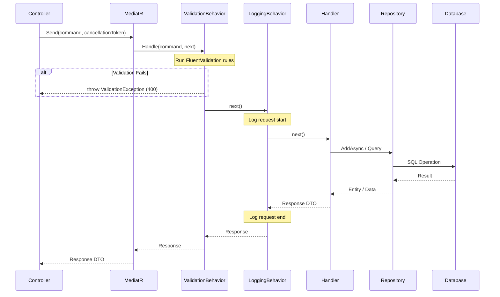

# CQRS and MediatR

> **Estimated Reading Time:** 12 minutes
> **Prerequisites:** [07 — Clean Architecture Explained](./07-clean-architecture-explained.md)

---

## WHY

Traditional CRUD architectures hit a wall when business complexity grows. A single service class handling both reads and writes becomes a maintenance nightmare: read operations need optimised queries with projections, while write operations need validation, business rules, domain events, and audit trails.

CQRS (Command Query Responsibility Segregation) solves this by separating the **intent to change state** (commands) from the **intent to read state** (queries). Each side can evolve independently — queries optimise for speed with `AsNoTracking()` and projections, while commands focus on correctness with validation pipelines and domain rules.

In BuildEstate Pro, MediatR implements the mediator pattern to dispatch commands and queries to their handlers. This removes direct coupling between controllers and business logic, keeps controllers thin, and enables cross-cutting concerns (validation, logging) to run automatically via pipeline behaviors.

---

## WHAT

### CQRS — Command Query Responsibility Segregation

CQRS is an architectural pattern that separates read and write operations into distinct models:

| Concept | Purpose | Example |
|---------|---------|---------|
| **Command** | Represents intent to change state | `CreateOpportunityCommand` |
| **Query** | Represents intent to read state | `GetOpportunitiesQuery` |
| **Handler** | Executes the command or query logic | `CreateOpportunityCommandHandler` |
| **Validator** | Validates input before the handler runs | `CreateOpportunityCommandValidator` |

Key rules:
- Commands **mutate** state and return a DTO or ID (never a domain entity)
- Queries **never** mutate state — they are pure reads
- Each command/query has exactly **one** handler (Single Responsibility)
- Validators run **before** handlers via MediatR pipeline behaviors

### MediatR — The Mediator Pattern

MediatR is a library that decouples the sender of a request from its handler. Instead of a controller calling a service directly, it sends a message (command/query) through MediatR, which routes it to the correct handler.

This gives us:
- **Decoupling** — Controllers know nothing about handlers
- **Pipeline behaviors** — Cross-cutting concerns (validation, logging) execute automatically
- **Single Responsibility** — One handler per operation, no mega-services
- **Testability** — Handlers are simple classes with injected dependencies

---

## HOW

### The Request Pipeline

When a controller dispatches a command or query, it flows through MediatR's pipeline before reaching the handler:



### Pipeline Behavior Registration

Pipeline behaviors are registered in DI and run automatically for every request. The order matters — validation runs first, then logging:

```csharp
// File: src/BuildEstate.Application/DependencyInjection.cs

services.AddMediatR(cfg =>
{
    cfg.RegisterServicesFromAssembly(assembly);
    cfg.AddBehavior(typeof(IPipelineBehavior<,>), typeof(ValidationBehavior<,>));
    cfg.AddBehavior(typeof(IPipelineBehavior<,>), typeof(LoggingBehavior<,>));
});

// Validators are discovered automatically via assembly scanning
services.AddValidatorsFromAssembly(assembly);
```

### The Validation Pipeline Behavior

This is the mechanism that runs FluentValidation validators **before** any handler executes. If validation fails, a `ValidationException` is thrown and the handler never runs:

```csharp
// File: src/BuildEstate.Application/Behaviors/ValidationBehavior.cs

public class ValidationBehavior<TRequest, TResponse> : IPipelineBehavior<TRequest, TResponse>
    where TRequest : notnull
{
    private readonly IEnumerable<IValidator<TRequest>> _validators;

    public ValidationBehavior(IEnumerable<IValidator<TRequest>> validators)
    {
        _validators = validators;
    }

    public async Task<TResponse> Handle(
        TRequest request,
        RequestHandlerDelegate<TResponse> next,
        CancellationToken cancellationToken)
    {
        if (!_validators.Any())
        {
            return await next();
        }

        var validationResults = await Task.WhenAll(
            _validators.Select(v => v.ValidateAsync(
                new ValidationContext<TRequest>(request), cancellationToken)));

        var failures = validationResults
            .SelectMany(result => result.Errors)
            .Where(failure => failure is not null)
            .ToList();

        if (failures.Count > 0)
        {
            throw new ValidationException(failures);
        }

        return await next();
    }
}
```

How it works:
1. MediatR resolves **all** `IValidator<TRequest>` implementations from DI
2. Each validator runs asynchronously against the request
3. If any validation errors exist, a `ValidationException` is thrown (caught by global exception middleware, returned as 400)
4. If validation passes, `next()` is called — which invokes the next behavior or the handler

---

### Complete Command Example: CreateOpportunity

This example shows the full command flow from the Land Acquisition module — the command class, its validator, and its handler.

#### 1. The Command

The command is a simple record that carries the data needed to perform the operation. It implements `IRequest<TResponse>` to tell MediatR what response type to expect:

```csharp
// File: src/BuildEstate.Application/Features/LandAcquisition/Opportunities/Commands/CreateOpportunity/CreateOpportunityCommand.cs

public sealed record CreateOpportunityCommand : IRequest<OpportunityDto>
{
    public string Name { get; init; } = string.Empty;
    public string Location { get; init; } = string.Empty;
    public string? County { get; init; }
    public decimal LandSize { get; init; }
    public string? SiteType { get; init; }
    public string? CurrentUse { get; init; }
    public string? Tenure { get; init; }
    public string? Description { get; init; }
    public string? Source { get; init; }
    public DateTime? ExpectedAcquisition { get; init; }
}
```

#### 2. The Validator

The validator runs **automatically** before the handler (via `ValidationBehavior`). It uses FluentValidation's fluent API to define rules:

```csharp
// File: src/BuildEstate.Application/Features/LandAcquisition/Opportunities/Commands/CreateOpportunity/CreateOpportunityCommandValidator.cs

public sealed class CreateOpportunityCommandValidator : AbstractValidator<CreateOpportunityCommand>
{
    public CreateOpportunityCommandValidator()
    {
        RuleFor(x => x.Name)
            .NotEmpty().WithMessage("Name is required.")
            .MinimumLength(3).WithMessage("Name must be at least 3 characters.")
            .MaximumLength(200).WithMessage("Name must not exceed 200 characters.");

        RuleFor(x => x.Location)
            .NotEmpty().WithMessage("Location is required.")
            .MinimumLength(3).WithMessage("Location must be at least 3 characters.")
            .MaximumLength(500).WithMessage("Location must not exceed 500 characters.");

        RuleFor(x => x.LandSize)
            .GreaterThan(0).WithMessage("Land size must be greater than zero.");

        RuleFor(x => x.Description)
            .MaximumLength(500).WithMessage("Description must not exceed 500 characters.")
            .When(x => !string.IsNullOrEmpty(x.Description));

        RuleFor(x => x.County)
            .MaximumLength(100).WithMessage("County must not exceed 100 characters.")
            .When(x => !string.IsNullOrEmpty(x.County));
    }
}
```

#### 3. The Handler

The handler contains the actual business logic. It checks for duplicates, creates the entity, persists it, and returns a DTO:

```csharp
// File: src/BuildEstate.Application/Features/LandAcquisition/Opportunities/Commands/CreateOpportunity/CreateOpportunityCommandHandler.cs

public sealed class CreateOpportunityCommandHandler : IRequestHandler<CreateOpportunityCommand, OpportunityDto>
{
    private readonly IRepository<LandOpportunity> _opportunityRepository;
    private readonly IUnitOfWork _unitOfWork;
    private readonly ICurrentUserService _currentUserService;
    private readonly IMapper _mapper;

    public CreateOpportunityCommandHandler(
        IRepository<LandOpportunity> opportunityRepository,
        IUnitOfWork unitOfWork,
        ICurrentUserService currentUserService,
        IMapper mapper)
    {
        _opportunityRepository = opportunityRepository;
        _unitOfWork = unitOfWork;
        _currentUserService = currentUserService;
        _mapper = mapper;
    }

    public async Task<OpportunityDto> Handle(
        CreateOpportunityCommand request, CancellationToken cancellationToken)
    {
        // Business rule: no duplicate Name + Location
        var duplicateExists = await _opportunityRepository.Query()
            .AnyAsync(o => o.Name == request.Name
                        && o.Location == request.Location
                        && !o.IsDeleted,
                cancellationToken);

        if (duplicateExists)
        {
            throw new DuplicateEntityException(nameof(LandOpportunity), "Name and Location");
        }

        var opportunity = new LandOpportunity
        {
            Name = request.Name,
            Location = request.Location,
            County = request.County,
            LandSize = request.LandSize,
            SiteType = request.SiteType,
            CurrentUse = request.CurrentUse,
            Tenure = request.Tenure,
            Description = request.Description,
            Status = OpportunityStatus.Identified,
            Source = request.Source,
            ExpectedAcquisition = request.ExpectedAcquisition,
            CreatedAt = DateTime.UtcNow,
            CreatedBy = _currentUserService.UserId ?? string.Empty
        };

        await _opportunityRepository.AddAsync(opportunity, cancellationToken);
        await _unitOfWork.SaveChangesAsync(cancellationToken);

        return _mapper.Map<OpportunityDto>(opportunity);
    }
}
```

#### 4. The Controller (dispatch only)

The controller is thin — it only dispatches to MediatR and returns the HTTP response:

```csharp
// File: src/BuildEstate.API/Controllers/LandAcquisition/OpportunitiesController.cs

[HttpPost]
[Authorize(Policy = "opportunities.create")]
public async Task<IActionResult> Create(
    [FromBody] CreateOpportunityCommand command,
    CancellationToken cancellationToken)
{
    var result = await Mediator.Send(command, cancellationToken);
    return CreatedAtAction(nameof(GetById), new { id = result.Id }, result);
}
```

---

### Complete Query Example: GetOpportunities

Queries follow the same pattern but are optimised for reads — no mutations, `AsNoTracking()`, and projections to DTOs.

#### 1. The Query

```csharp
// File: src/BuildEstate.Application/Features/LandAcquisition/Opportunities/Queries/GetOpportunities/GetOpportunitiesQuery.cs

public sealed record GetOpportunitiesQuery : IRequest<PagedResult<OpportunityListItemDto>>
{
    public int PageNumber { get; init; } = 1;
    public int PageSize { get; init; } = 10;
    public OpportunityStatus? Status { get; init; }
    public string? Location { get; init; }
    public string? Source { get; init; }
    public DateTime? ExpectedAcquisitionFrom { get; init; }
    public DateTime? ExpectedAcquisitionTo { get; init; }
    public string? SortBy { get; init; }
    public string? SortDirection { get; init; }
    public string? SearchTerm { get; init; }
}
```

#### 2. The Handler

The query handler uses `AsNoTracking()` for performance (no change tracking overhead), applies filters/search/sort dynamically, and projects to DTOs with `.Select()` to avoid loading unnecessary columns:

```csharp
// File: src/BuildEstate.Application/Features/LandAcquisition/Opportunities/Queries/GetOpportunities/GetOpportunitiesQueryHandler.cs

public sealed class GetOpportunitiesQueryHandler
    : IRequestHandler<GetOpportunitiesQuery, PagedResult<OpportunityListItemDto>>
{
    private readonly IRepository<LandOpportunity> _repository;

    public GetOpportunitiesQueryHandler(IRepository<LandOpportunity> repository)
    {
        _repository = repository;
    }

    public async Task<PagedResult<OpportunityListItemDto>> Handle(
        GetOpportunitiesQuery request, CancellationToken cancellationToken)
    {
        var query = _repository.Query().AsNoTracking();

        // Apply filters
        if (request.Status.HasValue)
            query = query.Where(o => o.Status == request.Status.Value);

        if (!string.IsNullOrWhiteSpace(request.Location))
            query = query.Where(o => o.Location.Contains(request.Location));

        // Apply free-text search
        if (!string.IsNullOrWhiteSpace(request.SearchTerm))
        {
            var term = request.SearchTerm.Trim();
            query = query.Where(o =>
                o.Name.Contains(term) ||
                o.Location.Contains(term) ||
                (o.Source != null && o.Source.Contains(term)));
        }

        // Get total count before pagination
        var totalCount = await query.CountAsync(cancellationToken);

        // Apply sorting (defaults to newest first)
        query = request.SortBy?.ToLowerInvariant() switch
        {
            "name" => query.OrderBy(o => o.Name),
            "landsize" => query.OrderBy(o => o.LandSize),
            _ => query.OrderByDescending(o => o.CreatedAt)
        };

        // Project to DTO (never return domain entities)
        var items = await query
            .Skip((request.PageNumber - 1) * request.PageSize)
            .Take(request.PageSize)
            .Select(o => new OpportunityListItemDto
            {
                Id = o.Id,
                Name = o.Name,
                Location = o.Location,
                LandSize = o.LandSize,
                Status = o.Status.ToString(),
                Source = o.Source,
                ExpectedAcquisition = o.ExpectedAcquisition,
                CreatedAt = o.CreatedAt
            })
            .ToListAsync(cancellationToken);

        return PagedResult<OpportunityListItemDto>.Create(
            items, totalCount, request.PageNumber, request.PageSize);
    }
}
```

---

## WHEN

Use CQRS + MediatR in BuildEstate Pro:

| Situation | Use |
|-----------|-----|
| Any state change (create, update, delete, status transition) | **Command** |
| Any data retrieval (list, detail, dashboard metrics) | **Query** |
| Input validation before processing | **Validator** (auto-runs via pipeline) |
| Cross-cutting concerns (logging, performance timing) | **Pipeline Behavior** |

You do **not** need CQRS for:
- Simple utility/helper operations
- Infrastructure-level concerns (DI registration, middleware)
- Frontend-only logic

---

## WHERE

### Folder Structure

```
src/BuildEstate.Application/
├── Behaviors/
│   ├── ValidationBehavior.cs          ← Pipeline: validates every request
│   └── LoggingBehavior.cs             ← Pipeline: logs every request
├── DependencyInjection.cs             ← Registers MediatR + behaviors
└── Features/
    └── LandAcquisition/
        └── Opportunities/
            ├── Commands/
            │   ├── CreateOpportunity/
            │   │   ├── CreateOpportunityCommand.cs
            │   │   ├── CreateOpportunityCommandHandler.cs
            │   │   └── CreateOpportunityCommandValidator.cs
            │   ├── UpdateOpportunity/
            │   │   ├── UpdateOpportunityCommand.cs
            │   │   ├── UpdateOpportunityCommandHandler.cs
            │   │   └── UpdateOpportunityCommandValidator.cs
            │   └── DeleteOpportunity/
            │       └── ...
            ├── Queries/
            │   ├── GetOpportunities/
            │   │   ├── GetOpportunitiesQuery.cs
            │   │   └── GetOpportunitiesQueryHandler.cs
            │   └── GetOpportunityById/
            │       ├── GetOpportunityByIdQuery.cs
            │       └── GetOpportunityByIdQueryHandler.cs
            └── DTOs/
                ├── OpportunityDto.cs
                ├── OpportunityDetailDto.cs
                └── OpportunityListItemDto.cs
```

### Key File Locations

| File | Path |
|------|------|
| ValidationBehavior | `src/BuildEstate.Application/Behaviors/ValidationBehavior.cs` |
| LoggingBehavior | `src/BuildEstate.Application/Behaviors/LoggingBehavior.cs` |
| DI Registration | `src/BuildEstate.Application/DependencyInjection.cs` |
| CreateOpportunityCommand | `src/BuildEstate.Application/Features/LandAcquisition/Opportunities/Commands/CreateOpportunity/CreateOpportunityCommand.cs` |
| CreateOpportunityCommandValidator | `src/BuildEstate.Application/Features/LandAcquisition/Opportunities/Commands/CreateOpportunity/CreateOpportunityCommandValidator.cs` |
| CreateOpportunityCommandHandler | `src/BuildEstate.Application/Features/LandAcquisition/Opportunities/Commands/CreateOpportunity/CreateOpportunityCommandHandler.cs` |
| GetOpportunitiesQuery | `src/BuildEstate.Application/Features/LandAcquisition/Opportunities/Queries/GetOpportunities/GetOpportunitiesQuery.cs` |
| GetOpportunitiesQueryHandler | `src/BuildEstate.Application/Features/LandAcquisition/Opportunities/Queries/GetOpportunities/GetOpportunitiesQueryHandler.cs` |
| OpportunitiesController | `src/BuildEstate.API/Controllers/LandAcquisition/OpportunitiesController.cs` |

---

## WHO

| Role | Responsibility |
|------|---------------|
| **Backend Developer** | Creates commands, queries, validators, and handlers for new features |
| **Tech Lead** | Reviews handler complexity and ensures Single Responsibility |
| **Architect** | Defines pipeline behaviors and cross-cutting concerns |
| **QA Engineer** | Tests each handler in isolation (unit tests) and via API (integration tests) |

---

## WHAT NEXT

Now that you understand how commands and queries flow through MediatR:

- Read [09 — NgRx and State Management](./09-ngrx-and-state-management.md) to see how the Angular frontend dispatches actions and communicates with these API endpoints
- Review [07 — Clean Architecture Explained](./07-clean-architecture-explained.md) to understand how CQRS fits within the layered architecture
- Explore the full Land Acquisition module at `src/BuildEstate.Application/Features/LandAcquisition/` to see dozens of real command and query implementations

---

## Common Mistakes

### 1. Putting business logic in the controller

```csharp
// ❌ WRONG — controller doing too much
[HttpPost]
public async Task<IActionResult> Create([FromBody] CreateDto dto)
{
    var entity = new LandOpportunity { Name = dto.Name };
    _context.Add(entity);
    await _context.SaveChangesAsync();
    return Ok(entity); // Exposing domain entity!
}

// ✅ CORRECT — controller dispatches to MediatR
[HttpPost]
public async Task<IActionResult> Create(
    [FromBody] CreateOpportunityCommand command,
    CancellationToken cancellationToken)
{
    var result = await Mediator.Send(command, cancellationToken);
    return CreatedAtAction(nameof(GetById), new { id = result.Id }, result);
}
```

### 2. Mutating state inside a query handler

```csharp
// ❌ WRONG — query handler changing data
public async Task<OpportunityDto> Handle(GetOpportunityByIdQuery request, ...)
{
    var entity = await _repo.GetByIdAsync(request.Id);
    entity.LastViewedAt = DateTime.UtcNow; // NO — queries must not mutate
    await _unitOfWork.SaveChangesAsync();
    return _mapper.Map<OpportunityDto>(entity);
}

// ✅ CORRECT — query handler reads only
public async Task<OpportunityDto> Handle(GetOpportunityByIdQuery request, ...)
{
    var entity = await _repo.Query()
        .AsNoTracking()
        .FirstOrDefaultAsync(o => o.Id == request.Id);
    return _mapper.Map<OpportunityDto>(entity);
}
```

### 3. Returning domain entities from commands

```csharp
// ❌ WRONG — exposes internal domain model
public sealed record CreateCommand : IRequest<LandOpportunity> { ... }

// ✅ CORRECT — returns a DTO
public sealed record CreateCommand : IRequest<OpportunityDto> { ... }
```

### 4. Performing validation inside the handler

```csharp
// ❌ WRONG — validation in handler (bypasses pipeline)
public async Task<OpportunityDto> Handle(CreateOpportunityCommand request, ...)
{
    if (string.IsNullOrEmpty(request.Name))
        throw new ArgumentException("Name required");
    // ...
}

// ✅ CORRECT — use a validator class (runs automatically via pipeline)
public sealed class CreateOpportunityCommandValidator : AbstractValidator<CreateOpportunityCommand>
{
    public CreateOpportunityCommandValidator()
    {
        RuleFor(x => x.Name).NotEmpty().WithMessage("Name is required.");
    }
}
```

### 5. Forgetting CancellationToken

```csharp
// ❌ WRONG — no cancellation support
public async Task<OpportunityDto> Handle(CreateOpportunityCommand request)
{
    await _repo.AddAsync(opportunity);
    await _unitOfWork.SaveChangesAsync();
}

// ✅ CORRECT — pass CancellationToken all the way down
public async Task<OpportunityDto> Handle(
    CreateOpportunityCommand request, CancellationToken cancellationToken)
{
    await _repo.AddAsync(opportunity, cancellationToken);
    await _unitOfWork.SaveChangesAsync(cancellationToken);
}
```
