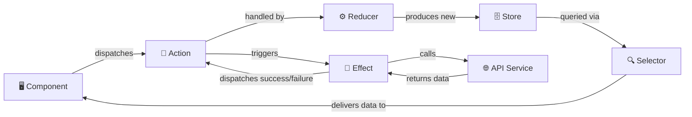
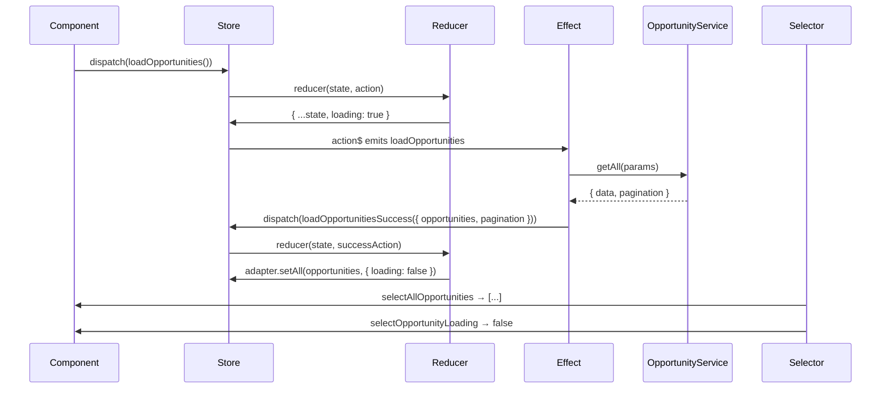

# NgRx & State Management

> ⏱️ Estimated reading time: 18 minutes

## WHY

Enterprise applications like BuildEstate Pro deal with complex, interconnected UI state — loading indicators, paginated lists, filter selections, selected entities, error messages, and toast notifications all happening simultaneously. Without a structured approach, this state becomes scattered across components, leading to race conditions, stale data, and debugging nightmares.

NgRx provides a **single source of truth** for application state. Every component reads from the same store, every mutation flows through predictable channels, and every side effect is isolated and testable. This makes BuildEstate Pro's Land Acquisition pipeline views, real-time dashboard metrics, and multi-step forms reliable and maintainable.

The benefits for our team:

- **Predictability** — State transitions are explicit, logged, and debuggable via Redux DevTools
- **Consistency** — Multiple components always display the same data without manual synchronisation
- **Testability** — Reducers are pure functions; effects are isolated side-effect handlers
- **Scalability** — Each feature module manages its own state slice independently

## WHAT

NgRx is a reactive state management library for Angular based on the Redux pattern and powered by RxJS. It consists of five core building blocks:

| Concept | Role | Analogy |
|---------|------|---------|
| **Store** | Single source of truth — an immutable state tree | A read-only database for the frontend |
| **Actions** | Describe events that happened — "what occurred" | Log entries or domain events |
| **Reducers** | Pure functions that produce new state from actions | Event handlers that compute new state |
| **Effects** | Handle side effects — API calls, navigation, toasts | Background workers responding to events |
| **Selectors** | Memoized queries that derive data from the store | Database views or computed columns |

### Architecture Overview



### Data Flow in Detail



## HOW

### Store Structure Convention

Every feature module in BuildEstate Pro organises its NgRx files in a consistent folder structure:

```
client-app/src/app/features/land-acquisition/store/
├── opportunity/
│   ├── opportunity.actions.ts      ← Event definitions
│   ├── opportunity.reducer.ts      ← State transitions
│   ├── opportunity.effects.ts      ← Side effects (API calls, toasts)
│   ├── opportunity.selectors.ts    ← Memoized queries
│   ├── opportunity.state.ts        ← State interface & initial values
│   └── index.ts                    ← Barrel exports
└── dashboard/
    ├── dashboard.actions.ts
    ├── dashboard.reducer.ts
    ├── dashboard.effects.ts
    ├── dashboard.selectors.ts
    └── dashboard.state.ts
```

### Step 1: Define the State Interface

The state interface declares the shape of your feature's store slice. We use `@ngrx/entity` for normalised collections.

**File:** `client-app/src/app/features/land-acquisition/store/opportunity/opportunity.state.ts`

```typescript
import { EntityState } from '@ngrx/entity';
import { IOpportunityListItem, OpportunityStatus } from '../../models/opportunity.model';

export interface IPaginationMeta {
  readonly pageNumber: number;
  readonly pageSize: number;
  readonly totalCount: number;
  readonly totalPages: number;
}

export interface IOpportunityFilters {
  readonly status: OpportunityStatus | null;
  readonly search: string;
  readonly location: string;
  readonly source: string;
  readonly dateFrom: string | null;
  readonly dateTo: string | null;
  readonly sortBy: string;
  readonly sortDirection: 'asc' | 'desc';
}

export interface OpportunityState extends EntityState<IOpportunityListItem> {
  readonly loading: boolean;
  readonly error: string | null;
  readonly selectedId: string | null;
  readonly pagination: IPaginationMeta;
  readonly filters: IOpportunityFilters;
  readonly bulkDeleteInProgress: boolean;
}
```

Key design decisions:
- `EntityState` provides normalised storage — entities stored in a dictionary by ID, with an ordered `ids` array
- All properties are `readonly` — enforcing immutability at the type level
- Loading and error states are tracked per feature slice

### Step 2: Define Actions

Actions describe **what happened** — they are event-like objects with a source tag and optional payload.

**File:** `client-app/src/app/features/land-acquisition/store/opportunity/opportunity.actions.ts`

```typescript
import { createActionGroup, emptyProps, props } from '@ngrx/store';
import {
  IOpportunityListItem,
  ICreateOpportunity,
  IUpdateOpportunity,
  OpportunityStatus
} from '../../models/opportunity.model';
import { IPaginationMeta, IOpportunityFilters } from './opportunity.state';
import { IOpportunityQueryParams } from '../../services/opportunity.service';

export const OpportunityActions = createActionGroup({
  source: 'Opportunities',
  events: {
    'Load Opportunities': emptyProps(),
    'Load Opportunities Success': props<{
      opportunities: readonly IOpportunityListItem[];
      pagination: IPaginationMeta
    }>(),
    'Load Opportunities Failure': props<{ error: string }>(),

    'Create Opportunity': props<{ opportunity: ICreateOpportunity }>(),
    'Create Opportunity Success': props<{ opportunity: IOpportunityListItem }>(),
    'Create Opportunity Failure': props<{ error: string }>(),

    'Update Opportunity': props<{ id: string; changes: IUpdateOpportunity }>(),
    'Update Opportunity Success': props<{ opportunity: IOpportunityListItem }>(),
    'Update Opportunity Failure': props<{ error: string }>(),

    'Delete Opportunity': props<{ id: string }>(),
    'Delete Opportunity Success': props<{ id: string }>(),
    'Delete Opportunity Failure': props<{ error: string }>(),

    'Transition Status': props<{
      id: string;
      targetStatus: OpportunityStatus;
      reason?: string
    }>(),
    'Transition Status Success': props<{ opportunity: IOpportunityListItem }>(),
    'Transition Status Failure': props<{ error: string }>(),

    'Select Opportunity': props<{ id: string | null }>(),

    'Load Opportunities With Params': props<{ params: IOpportunityQueryParams }>(),

    'Bulk Delete Opportunities': props<{ ids: string[] }>(),
    'Bulk Delete Opportunities Success': props<{ ids: string[]; count: number }>(),
    'Bulk Delete Opportunities Failure': props<{ error: string; failedIds: string[] }>(),

    'Update Filters': props<{ filters: Partial<IOpportunityFilters> }>(),
    'Reset Filters': emptyProps(),

    'Reload Opportunities': emptyProps(),
  }
});
```

Notice the pattern:
- Every async operation has three actions: **trigger**, **success**, **failure**
- The `source` field tags actions with `[Opportunities]` — making Redux DevTools easy to filter
- `emptyProps()` for events with no payload; `props<T>()` for typed payloads
- `createActionGroup` groups related actions and auto-generates type discriminants

### Step 3: Implement the Reducer

Reducers are **pure functions** — given the current state and an action, they return a new state. They must never mutate the existing state or call APIs.

**File:** `client-app/src/app/features/land-acquisition/store/opportunity/opportunity.reducer.ts`

```typescript
import { createReducer, on } from '@ngrx/store';
import { createEntityAdapter, EntityAdapter } from '@ngrx/entity';
import { IOpportunityListItem } from '../../models/opportunity.model';
import { OpportunityState, IOpportunityFilters, IPaginationMeta } from './opportunity.state';
import { OpportunityActions } from './opportunity.actions';

export const opportunityAdapter: EntityAdapter<IOpportunityListItem> =
  createEntityAdapter<IOpportunityListItem>({
    selectId: (opportunity) => opportunity.id,
    sortComparer: (a, b) =>
      new Date(b.createdAt).getTime() - new Date(a.createdAt).getTime()
  });

const defaultPagination: IPaginationMeta = {
  pageNumber: 1,
  pageSize: 20,
  totalCount: 0,
  totalPages: 0
};

const defaultFilters: IOpportunityFilters = {
  status: null,
  search: '',
  location: '',
  source: '',
  dateFrom: null,
  dateTo: null,
  sortBy: 'createdAt',
  sortDirection: 'desc'
};

export const initialOpportunityState: OpportunityState =
  opportunityAdapter.getInitialState({
    loading: false,
    error: null,
    selectedId: null,
    pagination: defaultPagination,
    filters: defaultFilters,
    bulkDeleteInProgress: false
  });

export const opportunityReducer = createReducer(
  initialOpportunityState,

  // Load
  on(OpportunityActions.loadOpportunities, (state): OpportunityState => ({
    ...state,
    loading: true,
    error: null
  })),
  on(OpportunityActions.loadOpportunitiesSuccess,
    (state, { opportunities, pagination }): OpportunityState =>
      opportunityAdapter.setAll([...opportunities], {
        ...state,
        loading: false,
        error: null,
        pagination
      })
  ),
  on(OpportunityActions.loadOpportunitiesFailure,
    (state, { error }): OpportunityState => ({
      ...state,
      loading: false,
      error
    })
  ),

  // Create
  on(OpportunityActions.createOpportunitySuccess,
    (state, { opportunity }): OpportunityState =>
      opportunityAdapter.addOne(opportunity, {
        ...state,
        loading: false,
        error: null
      })
  ),

  // Update
  on(OpportunityActions.updateOpportunitySuccess,
    (state, { opportunity }): OpportunityState =>
      opportunityAdapter.upsertOne(opportunity, {
        ...state,
        loading: false,
        error: null
      })
  ),

  // Delete
  on(OpportunityActions.deleteOpportunitySuccess,
    (state, { id }): OpportunityState =>
      opportunityAdapter.removeOne(id, {
        ...state,
        loading: false,
        error: null
      })
  ),

  // Filters
  on(OpportunityActions.updateFilters,
    (state, { filters }): OpportunityState => ({
      ...state,
      filters: { ...state.filters, ...filters }
    })
  ),
  on(OpportunityActions.resetFilters, (state): OpportunityState => ({
    ...state,
    filters: defaultFilters
  }))
);
```

The `EntityAdapter` provides pre-built CRUD methods (`addOne`, `setAll`, `upsertOne`, `removeOne`, `removeMany`) that handle normalised state updates without manual dictionary manipulation.

### Step 4: Handle Side Effects

Effects listen for specific actions, perform async work (API calls, navigation, notifications), and dispatch new actions with the results.

**File:** `client-app/src/app/features/land-acquisition/store/opportunity/opportunity.effects.ts`

```typescript
import { Injectable, inject } from '@angular/core';
import { Actions, createEffect, ofType } from '@ngrx/effects';
import { Store } from '@ngrx/store';
import { of } from 'rxjs';
import { map, exhaustMap, catchError, tap, withLatestFrom } from 'rxjs/operators';
import { OpportunityActions } from './opportunity.actions';
import { OpportunityService } from '../../services/opportunity.service';
import { ToastService } from '@core/services/toast.service';
import { selectFilters } from './opportunity.selectors';

@Injectable()
export class OpportunityEffects {
  private readonly actions$ = inject(Actions);
  private readonly store = inject(Store);
  private readonly opportunityService = inject(OpportunityService);
  private readonly toastService = inject(ToastService);

  readonly loadOpportunities$ = createEffect(() =>
    this.actions$.pipe(
      ofType(OpportunityActions.loadOpportunities),
      exhaustMap(() =>
        this.opportunityService.getAll().pipe(
          map((response) => {
            const items = response.data ?? [];
            const pagination = response.pagination ?? {
              pageNumber: 1,
              pageSize: 20,
              totalCount: items.length,
              totalPages: items.length > 0 ? 1 : 0
            };
            return OpportunityActions.loadOpportunitiesSuccess({
              opportunities: items,
              pagination
            });
          }),
          catchError((error: { message: string }) =>
            of(OpportunityActions.loadOpportunitiesFailure({
              error: error.message
            }))
          )
        )
      )
    )
  );

  readonly showErrorToast$ = createEffect(
    () =>
      this.actions$.pipe(
        ofType(
          OpportunityActions.loadOpportunitiesFailure,
          OpportunityActions.createOpportunityFailure,
          OpportunityActions.updateOpportunityFailure,
          OpportunityActions.deleteOpportunityFailure,
          OpportunityActions.transitionStatusFailure
        ),
        tap(({ error }) => {
          this.toastService.showError(error);
        })
      ),
    { dispatch: false }
  );

  readonly reloadOpportunities$ = createEffect(() =>
    this.actions$.pipe(
      ofType(OpportunityActions.reloadOpportunities),
      withLatestFrom(this.store.select(selectFilters)),
      map(([, filters]) => {
        const params = {
          pageNumber: 1,
          pageSize: 20,
          status: filters.status ?? undefined,
          search: filters.search || undefined,
          sortBy: filters.sortBy || undefined,
          sortDirection: filters.sortDirection || undefined
        };
        return OpportunityActions.loadOpportunitiesWithParams({ params });
      })
    )
  );
}
```

Key patterns:
- `exhaustMap` — prevents duplicate API calls while one is in-flight (ideal for load actions)
- `catchError` — always returns an observable so the effect stream survives errors
- `{ dispatch: false }` — marks effects that only produce side effects (toasts, navigation) without dispatching actions
- `withLatestFrom` — combines the action with the current store state for context-aware operations

### Step 5: Create Selectors

Selectors are memoized pure functions that extract and derive data from the store. They recompute only when their inputs change.

**File:** `client-app/src/app/features/land-acquisition/store/opportunity/opportunity.selectors.ts`

```typescript
import { createFeatureSelector, createSelector } from '@ngrx/store';
import { OpportunityState } from './opportunity.state';
import { opportunityAdapter } from './opportunity.reducer';
import { IOpportunityListItem, OpportunityStatus } from '../../models/opportunity.model';

export const selectOpportunityState =
  createFeatureSelector<OpportunityState>('opportunities');

const { selectAll, selectEntities } = opportunityAdapter.getSelectors();

export const selectAllOpportunities = createSelector(
  selectOpportunityState,
  selectAll
);

export const selectOpportunityEntities = createSelector(
  selectOpportunityState,
  selectEntities
);

export const selectSelectedOpportunityId = createSelector(
  selectOpportunityState,
  (state) => state.selectedId
);

export const selectSelectedOpportunity = createSelector(
  selectOpportunityEntities,
  selectSelectedOpportunityId,
  (entities, selectedId): IOpportunityListItem | undefined =>
    selectedId ? entities[selectedId] : undefined
);

export const selectOpportunitiesByStatus = createSelector(
  selectAllOpportunities,
  (opportunities): Record<OpportunityStatus, readonly IOpportunityListItem[]> => {
    const grouped: Record<OpportunityStatus, IOpportunityListItem[]> = {
      [OpportunityStatus.Identified]: [],
      [OpportunityStatus.InitialReview]: [],
      [OpportunityStatus.DueDiligence]: [],
      [OpportunityStatus.OfferMade]: [],
      [OpportunityStatus.UnderContract]: [],
      [OpportunityStatus.Acquired]: [],
      [OpportunityStatus.Withdrawn]: []
    };
    for (const opportunity of opportunities) {
      grouped[opportunity.status].push(opportunity);
    }
    return grouped;
  }
);

export const selectOpportunityLoading = createSelector(
  selectOpportunityState,
  (state) => state.loading
);

export const selectOpportunityError = createSelector(
  selectOpportunityState,
  (state) => state.error
);

export const selectPagination = createSelector(
  selectOpportunityState,
  (state) => state.pagination
);

export const selectFilters = createSelector(
  selectOpportunityState,
  (state) => state.filters
);

export const selectTotalCount = createSelector(
  selectPagination,
  (pagination) => pagination.totalCount
);
```

The `selectOpportunitiesByStatus` selector is a great example of **derived state** — it takes the flat list and groups it by status for the pipeline Kanban board, recomputing only when the list changes.

### Step 6: Use in Components

Smart (container) components connect to the store. They dispatch actions and subscribe to selectors:

```typescript
// In a container component
@Component({
  selector: 'app-opportunity-list-page',
  template: `
    <app-loading-spinner *ngIf="loading$ | async" />
    <app-opportunity-table
      [opportunities]="opportunities$ | async"
      [pagination]="pagination$ | async"
      (pageChange)="onPageChange($event)"
      (delete)="onDelete($event)"
    />
  `,
  changeDetection: ChangeDetectionStrategy.OnPush
})
export class OpportunityListPageComponent implements OnInit {
  private readonly store = inject(Store);

  readonly opportunities$ = this.store.select(selectAllOpportunities);
  readonly loading$ = this.store.select(selectOpportunityLoading);
  readonly pagination$ = this.store.select(selectPagination);

  ngOnInit(): void {
    this.store.dispatch(OpportunityActions.loadOpportunities());
  }

  onPageChange(page: number): void {
    this.store.dispatch(
      OpportunityActions.loadOpportunitiesWithParams({
        params: { pageNumber: page, pageSize: 20 }
      })
    );
  }

  onDelete(id: string): void {
    this.store.dispatch(OpportunityActions.deleteOpportunity({ id }));
  }
}
```

## WHEN

Use NgRx state management when:

| Scenario | Use NgRx? | Why |
|----------|-----------|-----|
| Data shared across multiple components | ✅ Yes | Single source of truth eliminates sync bugs |
| Server-side paginated lists | ✅ Yes | Store tracks page, filters, sort, and items together |
| Loading/error state UI | ✅ Yes | Centralised loading flags drive consistent UX |
| Complex async workflows (bulk delete, chained calls) | ✅ Yes | Effects orchestrate multi-step operations |
| Simple local form state | ❌ No | Use Reactive Forms — keep it in the component |
| UI-only toggle (sidebar open/closed) | ❌ No | Component-level signal or property |
| Modal open/close state | ❌ No | Component-level boolean |

Rule of thumb: if the data outlives the component or is needed by siblings/parent, it belongs in the store.

## WHERE

### Store Files in the Codebase

| File | Path |
|------|------|
| State Interface | `client-app/src/app/features/land-acquisition/store/opportunity/opportunity.state.ts` |
| Actions | `client-app/src/app/features/land-acquisition/store/opportunity/opportunity.actions.ts` |
| Reducer | `client-app/src/app/features/land-acquisition/store/opportunity/opportunity.reducer.ts` |
| Effects | `client-app/src/app/features/land-acquisition/store/opportunity/opportunity.effects.ts` |
| Selectors | `client-app/src/app/features/land-acquisition/store/opportunity/opportunity.selectors.ts` |
| Dashboard Store | `client-app/src/app/features/land-acquisition/store/dashboard/` |
| Admin Users Store | `client-app/src/app/features/admin/store/` |
| Core Auth Store | `client-app/src/app/core/store/` |

### Store Registration

Stores are registered in the feature route configuration via `provideState`:

```typescript
// In land-acquisition.routes.ts
import { provideState } from '@ngrx/store';
import { provideEffects } from '@ngrx/effects';
import { opportunityReducer } from './store/opportunity/opportunity.reducer';
import { OpportunityEffects } from './store/opportunity/opportunity.effects';

export const LAND_ACQUISITION_ROUTES: Routes = [
  {
    path: '',
    providers: [
      provideState('opportunities', opportunityReducer),
      provideEffects(OpportunityEffects)
    ],
    children: [/* ... */]
  }
];
```

## WHO

| Role | Responsibility |
|------|---------------|
| Frontend Developer | Creates actions, reducers, effects, selectors for feature modules |
| Tech Lead | Reviews state design for normalisation, naming, and separation of concerns |
| QA Engineer | Tests reducers as pure functions; validates effects with mocked services |
| DevOps | Ensures Redux DevTools are disabled in production builds |

## WHAT NEXT

Now that you understand NgRx state management, continue with:

- [Cross-Cutting Framework](./10-cross-cutting-framework.md) — How shared concerns (auth, notifications, audit) integrate across all modules
- [Module Pattern](./19-module-pattern.md) — The complete feature module structure including how store files fit in
- [Land Acquisition Deep-Dive](./20-land-acquisition-deep-dive.md) — Full-stack trace showing how NgRx connects UI to API

## Common Mistakes

### ❌ Mistake 1: Business Logic in Components

**Wrong** — calling the API directly from a component:

```typescript
// BAD: Component handles API calls directly
export class OpportunityListComponent {
  opportunities: IOpportunityListItem[] = [];

  constructor(private service: OpportunityService) {}

  ngOnInit() {
    this.service.getAll().subscribe(response => {
      this.opportunities = response.data;
    });
  }

  delete(id: string) {
    this.service.delete(id).subscribe(() => {
      this.opportunities = this.opportunities.filter(o => o.id !== id);
    });
  }
}
```

**Right** — component dispatches actions and subscribes to selectors:

```typescript
// GOOD: Component is a thin coordination layer
export class OpportunityListComponent {
  private readonly store = inject(Store);
  readonly opportunities$ = this.store.select(selectAllOpportunities);

  ngOnInit() {
    this.store.dispatch(OpportunityActions.loadOpportunities());
  }

  delete(id: string) {
    this.store.dispatch(OpportunityActions.deleteOpportunity({ id }));
  }
}
```

### ❌ Mistake 2: Mutating State in Reducers

**Wrong** — modifying the existing state object:

```typescript
// BAD: Mutation breaks change detection and time-travel debugging
on(OpportunityActions.loadOpportunitiesSuccess, (state, { opportunities }) => {
  state.loading = false;               // ← MUTATES existing state!
  state.entities = opportunities;       // ← MUTATES existing state!
  return state;
})
```

**Right** — always return a new object:

```typescript
// GOOD: Spread operator creates new state
on(OpportunityActions.loadOpportunitiesSuccess, (state, { opportunities, pagination }) =>
  opportunityAdapter.setAll([...opportunities], {
    ...state,
    loading: false,
    error: null,
    pagination
  })
)
```

### ❌ Mistake 3: Calling APIs Inside Reducers

**Wrong** — reducers must be pure functions (no side effects):

```typescript
// BAD: Side effects in a reducer
on(OpportunityActions.deleteOpportunity, (state, { id }) => {
  this.service.delete(id);              // ← SIDE EFFECT in reducer!
  return opportunityAdapter.removeOne(id, state);
})
```

**Right** — API calls belong in effects:

```typescript
// GOOD: Effect handles the API call
readonly deleteOpportunity$ = createEffect(() =>
  this.actions$.pipe(
    ofType(OpportunityActions.deleteOpportunity),
    exhaustMap(({ id }) =>
      this.opportunityService.delete(id).pipe(
        map(() => OpportunityActions.deleteOpportunitySuccess({ id })),
        catchError((error) =>
          of(OpportunityActions.deleteOpportunityFailure({ error: error.message }))
        )
      )
    )
  )
);
```

### ❌ Mistake 4: Not Using Selectors for Derived State

**Wrong** — computing derived state in components:

```typescript
// BAD: Filtering in component — recomputes on every change detection cycle
get identifiedOpportunities() {
  return this.allOpportunities.filter(o => o.status === 'Identified');
}
```

**Right** — use memoized selectors:

```typescript
// GOOD: Selector recomputes only when input state changes
export const selectOpportunitiesByStatus = createSelector(
  selectAllOpportunities,
  (opportunities) => {
    const grouped = { /* ... */ };
    for (const opp of opportunities) {
      grouped[opp.status].push(opp);
    }
    return grouped;
  }
);
```

### ❌ Mistake 5: Forgetting Error Handling in Effects

**Wrong** — no `catchError` means the effect stream dies permanently on first error:

```typescript
// BAD: One failed API call kills the effect forever
readonly load$ = createEffect(() =>
  this.actions$.pipe(
    ofType(OpportunityActions.loadOpportunities),
    exhaustMap(() =>
      this.service.getAll().pipe(
        map(response => OpportunityActions.loadOpportunitiesSuccess({ ... }))
        // ← Missing catchError! Effect stream dies on HTTP error
      )
    )
  )
);
```

**Right** — always catch errors and dispatch a failure action:

```typescript
// GOOD: Error is caught, failure action dispatched, effect survives
readonly load$ = createEffect(() =>
  this.actions$.pipe(
    ofType(OpportunityActions.loadOpportunities),
    exhaustMap(() =>
      this.service.getAll().pipe(
        map(response => OpportunityActions.loadOpportunitiesSuccess({ ... })),
        catchError((error) =>
          of(OpportunityActions.loadOpportunitiesFailure({ error: error.message }))
        )
      )
    )
  )
);
```

---

*Prerequisites: [CQRS & MediatR](./08-cqrs-and-mediatr.md), [Architecture Philosophy](./05-architecture-philosophy.md)*
