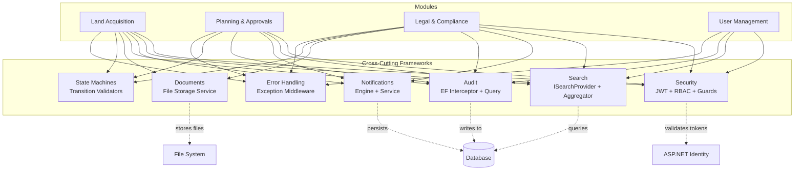

# Cross-Cutting Framework Overview

> **Estimated Reading Time:** 12 minutes

## WHY

Every module in BuildEstate Pro — Land Acquisition, Planning, Legal, and beyond — needs the same foundational capabilities: users must be authenticated, actions must be audited, errors must be handled consistently, and entities must be searchable. Without shared infrastructure, each module would reinvent these patterns differently, leading to inconsistent behaviour, security gaps, and maintenance nightmares.

Cross-cutting frameworks exist to provide a single, tested, governed implementation of each shared concern. When you build a new module, you do not write your own audit logger or your own error handler — you integrate with the framework that already exists. This approach delivers:

- **Consistency** — Every module behaves the same way when errors occur, when state transitions happen, or when audit records are created.
- **Security by default** — Authentication, authorization, and input validation are enforced through shared middleware, not per-module code.
- **Reduced development time** — You wire in existing infrastructure rather than building from scratch.
- **Compliance** — Immutable audit trails, structured logging, and permission enforcement satisfy enterprise governance requirements out of the box.

## WHAT

BuildEstate Pro has **7 shared infrastructure components** that cut across all modules:

| # | Framework | Purpose | Primary Concern |
|---|-----------|---------|-----------------|
| 1 | **Security** | Authentication (JWT), authorization (RBAC), guards, policies | Who can do what |
| 2 | **Search** | Global search, provider-based architecture, weighted scoring | Finding entities fast |
| 3 | **Notifications** | Real-time in-app and email notifications, rule-based dispatch | Keeping users informed |
| 4 | **Audit** | Immutable audit trail via EF Core interceptor, captures every mutation | Compliance and traceability |
| 5 | **Documents** | File upload, storage, download, document type management | Managing files |
| 6 | **State Machines** | Status transitions, workflow validation, domain-driven lifecycle | Controlling entity flow |
| 7 | **Error Handling** | Global exception middleware, structured responses, frontend interceptor | Graceful failure |

Each component is designed as a thin interface in the Application layer with an implementation in Infrastructure or API, meaning modules depend on abstractions — never on concrete infrastructure classes.



## HOW

Each framework follows a consistent integration pattern:

### 1. Security Framework

The security framework uses **JWT Bearer tokens** for API authentication and **ASP.NET Identity** for user management. Authorization is role-based (RBAC) with policy-based extensions for fine-grained permissions.

- Backend: `[Authorize]` attributes on controllers, policies defined in `Program.cs`
- Frontend: Route guards (`authGuard`, `roleGuard`, `permissionGuard`) protect Angular routes
- Identity is managed through `ApplicationUser` and `ApplicationRole` extending ASP.NET Identity classes

### 2. Search Framework

Search uses a **provider-based architecture** where each module registers one or more `ISearchProvider` implementations. A central `SearchAggregator` dispatches queries to all providers in parallel, merges results, and applies weighted scoring.

- Each provider declares searchable fields with weights (2.0+ for identifiers, 1.0 for standard)
- Results are permission-filtered server-side before being returned
- The frontend groups results by category with tab counts

### 3. Notification Framework

Notifications are dispatched through `INotificationService` (direct user notifications) and `INotificationEngine` (rule-based dispatch). Command handlers call the notification service after successful mutations.

- Notifications persist to the database for in-app display
- Email delivery is planned but not yet implemented
- Rules can be configured per event type via `NotificationRule` entities

### 4. Audit Framework

The audit trail is implemented as an **EF Core SaveChanges interceptor** (`AuditInterceptor`) that automatically captures every create, update, and delete operation without any code in the command handlers.

- Captures: who (user ID, name), what (action, entity, entity ID), when (UTC timestamp), from where (IP, correlation ID), what changed (old/new values)
- The trail is **immutable** — no update or delete operations on the `AuditLog` table
- Queryable via `IAuditLogQueryService` for compliance reports

### 5. Document Framework

File management is handled by `IFileStorageService` which provides upload, download, and delete operations. Documents are stored on disk with metadata persisted as `Document` entities linked to their parent (e.g., an opportunity).

- Validates file type and size before storage
- Files are stored in `src/BuildEstate.API/Storage/Documents/`
- Each document record tracks type, file path, upload timestamp, and uploader

### 6. State Machines

Every entity with a lifecycle (opportunities, offers, contracts, due diligence, planning applications) has a corresponding state machine interface in the Domain layer. State machines are registered as **singletons** because they are stateless rule engines.

- `CanTransition(from, to)` — checks if a transition is valid
- `GetPermittedTransitions(current)` — returns allowed next states
- `ValidateTransition(from, to)` — throws `InvalidStateTransitionException` if invalid

### 7. Error Handling

The `GlobalExceptionHandlerMiddleware` catches all unhandled exceptions and maps them to structured `ApiResponse` JSON with appropriate HTTP status codes. The frontend `httpErrorInterceptor` consumes these responses and dispatches NgRx error actions for consistent UI feedback.

- Never exposes stack traces or internal details to clients
- Validation errors (400) include field-level error messages
- Domain exceptions map to meaningful status codes (404, 409, 403)

## WHEN

Use cross-cutting frameworks in these situations:

| Situation | Framework to Use |
|-----------|-----------------|
| Building a new controller | Security (add `[Authorize]`) |
| Creating a new entity type | Audit (automatic via interceptor), State Machine (if entity has lifecycle) |
| Adding a new searchable entity | Search (implement `ISearchProvider`) |
| Performing a business action that others should know about | Notifications (`INotificationService`) |
| Handling file attachments | Documents (`IFileStorageService`) |
| Entity has status/workflow progression | State Machines (implement interface in Domain) |
| Any API endpoint | Error Handling (automatic via middleware) |

You integrate these frameworks **during module implementation**, not after. Security is configured at route definition time. Audit is automatic. Search providers are registered alongside the module's DI setup.

## WHERE

### Codebase Location

#### Security

| Component | Path |
|-----------|------|
| ASP.NET Identity Models | `src/BuildEstate.Infrastructure/Identity/ApplicationUser.cs` |
| | `src/BuildEstate.Infrastructure/Identity/ApplicationRole.cs` |
| Token Service | `src/BuildEstate.Infrastructure/Services/TokenService.cs` |
| Permission Handler | `src/BuildEstate.Application/Authorization/PermissionAuthorizationHandler.cs` |
| Permission Requirement | `src/BuildEstate.Application/Authorization/PermissionRequirement.cs` |
| Auth Controller | `src/BuildEstate.API/Controllers/AuthController.cs` |
| Security Headers Middleware | `src/BuildEstate.API/Middleware/SecurityHeadersMiddleware.cs` |
| Session Validation Middleware | `src/BuildEstate.API/Middleware/SessionValidationMiddleware.cs` |
| Frontend Auth Guard | `client-app/src/app/core/guards/auth.guard.ts` |
| Frontend Role Guard | `client-app/src/app/core/guards/role.guard.ts` |
| Frontend Permission Guard | `client-app/src/app/core/guards/permission.guard.ts` |
| Frontend Auth Service | `client-app/src/app/core/services/auth.service.ts` |
| Frontend Auth Interceptor | `client-app/src/app/core/interceptors/auth.interceptor.ts` |

#### Search

| Component | Path |
|-----------|------|
| ISearchProvider Interface | `src/BuildEstate.Application/Features/Search/Interfaces/ISearchProvider.cs` |
| ISearchAggregator Interface | `src/BuildEstate.Application/Features/Search/Interfaces/ISearchAggregator.cs` |
| ISearchScoringService | `src/BuildEstate.Application/Features/Search/Interfaces/ISearchScoringService.cs` |
| ISearchHighlightService | `src/BuildEstate.Application/Features/Search/Interfaces/ISearchHighlightService.cs` |
| ISearchSynonymService | `src/BuildEstate.Application/Features/Search/Interfaces/ISearchSynonymService.cs` |
| Search Settings | `src/BuildEstate.Application/Settings/SearchSettings.cs` |
| Search Providers (14 providers) | `src/BuildEstate.Infrastructure/Search/Providers/` |
| Provider Validation Service | `src/BuildEstate.Infrastructure/Search/SearchProviderValidationService.cs` |
| Search Controller | `src/BuildEstate.API/Controllers/SearchController.cs` |
| Search CQRS Handlers | `src/BuildEstate.Application/Features/Search/Queries/` |
| Search DTOs | `src/BuildEstate.Application/Features/Search/DTOs/` |
| Search Domain Entities | `src/BuildEstate.Domain/Entities/Search/` |

#### Notifications

| Component | Path |
|-----------|------|
| INotificationService Interface | `src/BuildEstate.Application/Common/Interfaces/INotificationService.cs` |
| INotificationEngine Interface | `src/BuildEstate.Application/Common/Interfaces/INotificationEngine.cs` |
| Notification Service Impl | `src/BuildEstate.Infrastructure/Services/NotificationService.cs` |
| Notification Engine Impl | `src/BuildEstate.Infrastructure/Services/NotificationEngine.cs` |
| Notification Domain Entities | `src/BuildEstate.Domain/Entities/Notifications/` |
| Notifications Controller | `src/BuildEstate.API/Controllers/NotificationsController.cs` |
| Frontend Notification Service | `client-app/src/app/core/services/notification.service.ts` |

#### Audit

| Component | Path |
|-----------|------|
| AuditInterceptor (EF Core) | `src/BuildEstate.Infrastructure/Persistence/Interceptors/AuditInterceptor.cs` |
| IAuditLogService Interface | `src/BuildEstate.Application/Interfaces/IAuditLogService.cs` |
| IAuditLogQueryService Interface | `src/BuildEstate.Application/Interfaces/IAuditLogQueryService.cs` |
| AuditLog Service Impl | `src/BuildEstate.Infrastructure/Services/AuditLogService.cs` |
| Audit Query Params | `src/BuildEstate.Application/Interfaces/AuditLogQueryParams.cs` |
| IAuditableEntity Interface | `src/BuildEstate.Domain/Common/IAuditableEntity.cs` |
| BaseEntity (audit columns) | `src/BuildEstate.Domain/Common/BaseEntity.cs` |

#### Documents

| Component | Path |
|-----------|------|
| IFileStorageService Interface | `src/BuildEstate.Application/Common/Interfaces/IFileStorageService.cs` |
| FileStorageService Impl | `src/BuildEstate.Infrastructure/Services/FileStorageService.cs` |
| Document Storage Directory | `src/BuildEstate.API/Storage/Documents/` |
| Document Domain Entity | `src/BuildEstate.Domain/Entities/LandAcquisition/` (Document entity) |
| Document Enum Types | `src/BuildEstate.Domain/Enums/DocumentType.cs` |

#### State Machines

| Component | Path |
|-----------|------|
| IOpportunityStateMachine | `src/BuildEstate.Domain/Services/IOpportunityStateMachine.cs` |
| IOfferStateMachine | `src/BuildEstate.Domain/Services/IOfferStateMachine.cs` |
| IDueDiligenceStateMachine | `src/BuildEstate.Domain/Services/IDueDiligenceStateMachine.cs` |
| IContractStateMachine | `src/BuildEstate.Domain/Services/IContractStateMachine.cs` |
| IPlanningStatusStateMachine | `src/BuildEstate.Domain/Services/IPlanningStatusStateMachine.cs` |
| IConditionStatusStateMachine | `src/BuildEstate.Domain/Services/IConditionStatusStateMachine.cs` |
| IAppealStatusStateMachine | `src/BuildEstate.Domain/Services/IAppealStatusStateMachine.cs` |
| ILegalCaseStateMachine | `src/BuildEstate.Domain/Services/ILegalCaseStateMachine.cs` |
| ILegalContractStateMachine | `src/BuildEstate.Domain/Services/ILegalContractStateMachine.cs` |
| IInsuranceStateMachine | `src/BuildEstate.Domain/Services/IInsuranceStateMachine.cs` |
| IAuditRecordStateMachine | `src/BuildEstate.Domain/Services/IAuditRecordStateMachine.cs` |
| InvalidStateTransitionException | `src/BuildEstate.Domain/Exceptions/InvalidStateTransitionException.cs` |
| Status Enums | `src/BuildEstate.Domain/Enums/OpportunityStatus.cs`, `OfferStatus.cs`, `ContractStatus.cs`, etc. |

#### Error Handling

| Component | Path |
|-----------|------|
| GlobalExceptionHandlerMiddleware | `src/BuildEstate.API/Middleware/GlobalExceptionHandlerMiddleware.cs` |
| CorrelationIdMiddleware | `src/BuildEstate.API/Middleware/CorrelationIdMiddleware.cs` |
| Domain Exceptions | `src/BuildEstate.Domain/Exceptions/` |
| Shared Exceptions | `src/BuildEstate.Shared/Exceptions/` |
| ApiResponse Envelope | `src/BuildEstate.Shared/ApiResponse.cs` |
| ValidationBehavior (MediatR) | `src/BuildEstate.Application/Behaviors/ValidationBehavior.cs` |
| Frontend HTTP Error Interceptor | `client-app/src/app/core/interceptors/http-error.interceptor.ts` |
| Frontend Toast Service | `client-app/src/app/core/services/toast.service.ts` |

## WHO

| Role | Responsibility |
|------|---------------|
| **Backend Developer** | Implements search providers, triggers notifications from handlers, defines state machine interfaces |
| **Frontend Developer** | Integrates route guards, handles error states from interceptors, renders search results |
| **Tech Lead / Architect** | Defines new state machine transitions, approves new search provider registrations |
| **Security Architect** | Reviews authorization policies, manages role hierarchies and permission mappings |
| **QA / Support** | Queries audit trails for incident investigation, verifies permission enforcement |

## WHAT NEXT

Each framework has a dedicated deep-dive document with full implementation details, multiple code examples, and step-by-step integration guides:

| Document | Topic | Link |
|----------|-------|------|
| 11 | Security Framework | [11-security-framework.md](./11-security-framework.md) |
| 12 | Search Framework | [12-search-framework.md](./12-search-framework.md) |
| 13 | Notification Framework | [13-notification-framework.md](./13-notification-framework.md) |
| 14 | Audit Framework | [14-audit-framework.md](./14-audit-framework.md) |
| 15 | Document Framework | [15-document-framework.md](./15-document-framework.md) |
| 16 | State Machines | [16-state-machines.md](./16-state-machines.md) |
| 17 | Error Handling Framework | [17-error-handling-framework.md](./17-error-handling-framework.md) |

After reading this overview, proceed to whichever framework is most relevant to your current task. If you are building a new module from scratch, read them in order (11 → 17) as they build on each other.

---

## Integration Steps

When building a new module, integrate with cross-cutting frameworks in this order:

1. **Security** — Add `[Authorize]` to your controller, define policies if needed, add Angular route guards
2. **Audit** — Automatic. Ensure your entities extend `BaseEntity` so the interceptor captures mutations
3. **Error Handling** — Automatic. Throw domain exceptions (`EntityNotFoundException`, `InvalidStateTransitionException`, etc.) and the middleware handles the rest
4. **State Machines** — Define an `I{Entity}StateMachine` interface in Domain, implement in Infrastructure, register as Singleton in DI
5. **Documents** — Inject `IFileStorageService`, create upload/download endpoints, link documents to your entity
6. **Notifications** — Inject `INotificationService` into your command handler, call `SendAsync()` after successful operations
7. **Search** — Implement `ISearchProvider` for each searchable entity, register in DI, define field weights

---

## Code Examples

### Example 1: Registering a Search Provider for a New Entity

This example shows how a module registers its search provider in the infrastructure DI container, making the entity discoverable through global search:

```csharp
// In src/BuildEstate.Infrastructure/DependencyInjection.cs
// Each provider implements ISearchProvider and is resolved via IEnumerable<ISearchProvider>
// in the SearchAggregator for parallel provider execution.

services.AddScoped<ISearchProvider, LandOpportunitySearchProvider>();
services.AddScoped<ISearchProvider, LandOwnerSearchProvider>();
services.AddScoped<ISearchProvider, DueDiligenceSearchProvider>();
services.AddScoped<ISearchProvider, OfferSearchProvider>();
services.AddScoped<ISearchProvider, ContractSearchProvider>();
services.AddScoped<ISearchProvider, AcquisitionSearchProvider>();
services.AddScoped<ISearchProvider, PlanningApplicationSearchProvider>();
services.AddScoped<ISearchProvider, PlanningConditionSearchProvider>();
services.AddScoped<ISearchProvider, LegalCaseSearchProvider>();
services.AddScoped<ISearchProvider, ComplianceCheckSearchProvider>();
services.AddScoped<ISearchProvider, UserSearchProvider>();
services.AddScoped<ISearchProvider, RoleSearchProvider>();
services.AddScoped<ISearchProvider, DocumentSearchProvider>();
services.AddScoped<ISearchProvider, NotificationSearchProvider>();
```

### Example 2: Sending a Notification from a Command Handler

This example demonstrates how a command handler triggers a notification after a successful business operation, using the `INotificationService` abstraction:

```csharp
// Inside a command handler (e.g., ApproveOfferCommandHandler)
// After persisting the state change, notify the relevant user.

await _notificationService.SendAsync(
    recipientUserId: opportunity.CreatedBy,
    eventType: "OfferApproved",
    message: $"Your offer for '{opportunity.Name}' has been approved.",
    relatedEntityId: opportunity.Id,
    ct: cancellationToken);

// For role-based notifications (all users with a specific role):
await _notificationService.SendToRoleAsync(
    roleName: "FinanceDirector",
    eventType: "ApprovalRequired",
    message: $"Opportunity '{opportunity.Name}' requires financial approval.",
    relatedEntityId: opportunity.Id,
    ct: cancellationToken);
```

### Example 3: State Machine Transition Validation

This shows how a command handler validates a state transition before applying it, leveraging the domain state machine interface:

```csharp
// In a status transition command handler:
public async Task<Unit> Handle(
    TransitionOpportunityStatusCommand request,
    CancellationToken cancellationToken)
{
    var opportunity = await _repository.GetByIdAsync(request.OpportunityId, cancellationToken)
        ?? throw new EntityNotFoundException(nameof(LandOpportunity), request.OpportunityId);

    // State machine validates the transition — throws InvalidStateTransitionException if invalid
    _opportunityStateMachine.ValidateTransition(opportunity.Status, request.TargetStatus);

    opportunity.Status = request.TargetStatus;
    await _unitOfWork.SaveChangesAsync(cancellationToken);

    return Unit.Value;
}
```

---

## Common Mistakes

### Mistake 1: Bypassing the Audit Interceptor with Raw SQL

**The Problem:** A developer uses raw SQL or `Database.ExecuteSqlRawAsync()` to update entities, bypassing EF Core change tracking. The audit interceptor never fires, and the mutation is invisible in the audit trail.

```csharp
// ❌ WRONG — Bypasses EF Core change tracking and audit interceptor
await _context.Database.ExecuteSqlRawAsync(
    "UPDATE LandOpportunities SET Status = 'Acquired' WHERE Id = @id",
    new SqlParameter("@id", opportunityId));
```

**Why It's Wrong:** The `AuditInterceptor` hooks into `SaveChangesAsync`. Raw SQL never triggers `SaveChanges`, so no audit log entry is created. This violates compliance requirements.

**The Fix:** Always load the entity, modify it through the tracked instance, and save via `SaveChangesAsync`:

```csharp
// ✅ CORRECT — EF Core tracks the change, audit interceptor fires automatically
var opportunity = await _context.LandOpportunities.FindAsync(opportunityId);
opportunity.Status = OpportunityStatus.Acquired;
await _context.SaveChangesAsync(cancellationToken);
```

### Mistake 2: Implementing Module-Specific Error Handling Instead of Using the Global Middleware

**The Problem:** A developer wraps their controller action in try/catch and returns a custom error response, creating inconsistent error formats across the API.

```csharp
// ❌ WRONG — Inconsistent error response format
[HttpPost]
public async Task<IActionResult> Create([FromBody] CreateCommand command)
{
    try
    {
        var result = await _mediator.Send(command);
        return Ok(result);
    }
    catch (Exception ex)
    {
        return StatusCode(500, new { error = ex.Message }); // Leaks internal details!
    }
}
```

**Why It's Wrong:** The `GlobalExceptionHandlerMiddleware` already handles all exceptions consistently. Per-controller try/catch duplicates logic, may expose stack traces, and uses a non-standard response envelope.

**The Fix:** Let exceptions propagate. Throw domain exceptions and trust the middleware:

```csharp
// ✅ CORRECT — Thin controller, middleware handles all errors
[HttpPost]
public async Task<IActionResult> Create([FromBody] CreateCommand command, CancellationToken ct)
{
    var result = await _mediator.Send(command, ct);
    return CreatedAtAction(nameof(GetById), new { id = result.Id }, result);
}
// If the command throws EntityNotFoundException → 404
// If validation fails → 400 with field errors
// If unexpected error → 500 with generic message
```

### Mistake 3: Not Registering a Search Provider When Adding a New Entity

**The Problem:** A developer implements full CRUD for a new entity but forgets to create and register an `ISearchProvider`. The entity is invisible in global search.

**Why It's Wrong:** Per the platform's governance standards, an entity is not complete until it is searchable. Users expect to find any entity through `Ctrl+K` global search. Missing providers create a disjointed user experience.

**The Fix:** Always implement `ISearchProvider` as part of your module's DoD (Definition of Done). Register it in `DependencyInjection.cs`:

```csharp
// ✅ CORRECT — Register alongside your other module services
services.AddScoped<ISearchProvider, YourNewEntitySearchProvider>();
```

---

## Further Reading

- [05-architecture-philosophy.md](./05-architecture-philosophy.md) — Understand why the codebase is structured this way
- [07-clean-architecture-explained.md](./07-clean-architecture-explained.md) — Layer boundaries that these frameworks respect
- [08-cqrs-and-mediatr.md](./08-cqrs-and-mediatr.md) — How commands and queries interact with cross-cutting concerns
- [19-module-pattern.md](./19-module-pattern.md) — Standard module structure that integrates all frameworks
- [24-how-to-build-the-next-module.md](./24-how-to-build-the-next-module.md) — Step-by-step playbook including framework integration
