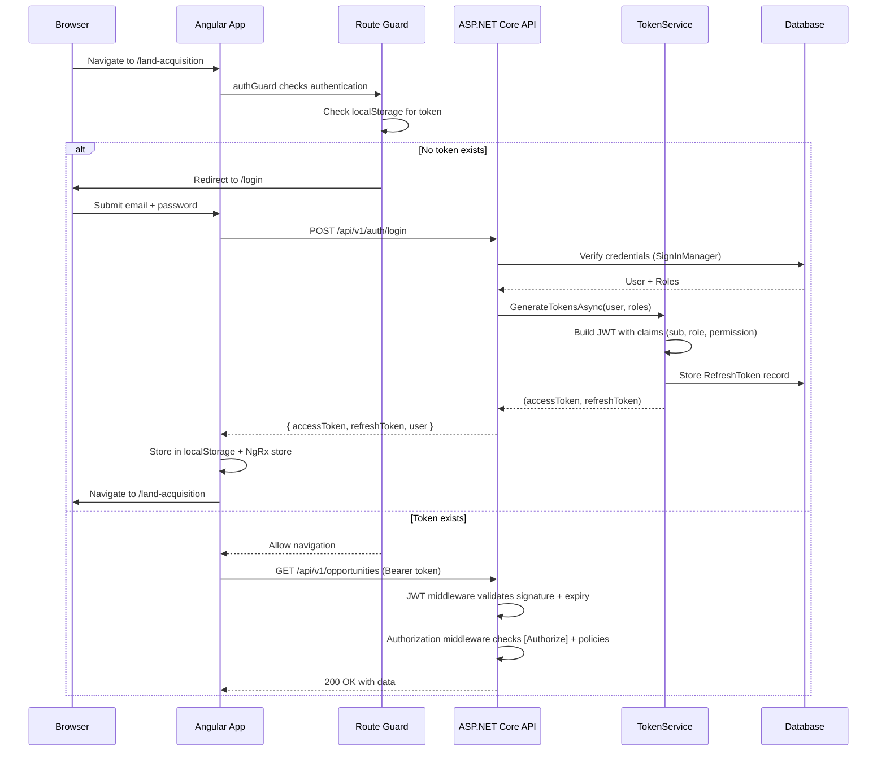

# Security Framework

> **Estimated Reading Time:** 18 minutes
> **Prerequisites:** [07 — Clean Architecture Explained](./07-clean-architecture-explained.md), [08 — CQRS and MediatR](./08-cqrs-and-mediatr.md)

---

## WHY

Enterprise real estate platforms manage sensitive financial data, personal information, legal documents, and strategic business intelligence. A single unauthorised access could expose land valuations before acquisition (destroying negotiating position), leak investor terms, or violate GDPR obligations.

BuildEstate Pro implements **defence in depth** — multiple layers of security that complement each other. If one layer fails (e.g., a guard misconfiguration), the next layer (backend policy enforcement) still blocks the request. This approach aligns with the security steering principle: *"Assume every public input is hostile. Validate everything. Trust nothing."*

The security framework solves three problems simultaneously:
1. **Authentication** — Proving who the user is (JWT bearer tokens)
2. **Authorization** — Controlling what they can do (RBAC + permissions)
3. **Token lifecycle** — Managing session validity without server-side state (refresh token rotation)

---

## WHAT

### Authentication: JWT Bearer Tokens

BuildEstate Pro uses stateless JWT authentication. On successful login, the server issues two tokens:

| Token | Purpose | Lifetime | Storage |
|-------|---------|----------|---------|
| Access Token | Proves identity on every API request | 60 minutes | localStorage (`be_access_token`) |
| Refresh Token | Obtains new access token without re-login | 7 days (30 with "Remember Me") | localStorage (`be_refresh_token`) |

The access token contains the user's identity, roles, and permissions as JWT claims — so the backend can authorise requests without a database round-trip on every call.

### Authorization: RBAC + Permission Policies

Authorization operates at two levels:

| Level | Mechanism | Scope | Example |
|-------|-----------|-------|---------|
| **Role-Based (RBAC)** | `[Authorize(Roles = "SuperAdmin")]` | Coarse — entire controller or admin section | Admin panel restricted to SuperAdmin |
| **Permission-Based** | `[Authorize(Policy = "legal.create")]` | Fine-grained — individual operations | Only users with "legal.create" permission can create cases |

Permissions are assigned to roles (not users directly), and embedded in the JWT token at login time. The `PermissionAuthorizationHandler` evaluates permission claims against the token — no database query required per request.

### Role Hierarchy

```
SuperAdmin > FinanceDirector > ProjectManager > [Domain Managers] > Admin > Viewer
```

SuperAdmin bypasses all permission checks automatically — this is hard-coded in the `PermissionAuthorizationHandler`.

### Frontend Guards

The Angular application mirrors backend authorization with three route guards:

| Guard | Purpose | Reads From |
|-------|---------|-----------|
| `authGuard` | Blocks unauthenticated users from protected routes | NgRx store + localStorage |
| `roleGuard` | Restricts routes to specific roles (from route `data`) | NgRx `selectUserRoles` |
| `permissionGuard` | Restricts routes to specific permissions (from route `data`) | NgRx `selectUserPermissions` |

Guards are **client-side convenience only** — they prevent UI navigation but never replace server-side enforcement.

### Token Rotation & Theft Detection

The refresh token system implements **single-use semantics** with a 30-second grace period:
- Each refresh token can only be used once
- If a used token is presented beyond the grace window, all user tokens are revoked (potential theft detected)
- Grace period handles race conditions from concurrent browser tabs

---

## HOW

### Authentication Flow



### Example 1: Protecting a Controller Endpoint with Policy Authorization

This is how the Legal & Compliance module restricts case creation to users with the `legal.create` permission:

```csharp
// File: src/BuildEstate.API/Controllers/LegalCompliance/LegalCasesController.cs

/// <summary>
/// Creates a new legal case linked to an opportunity or planning application.
/// </summary>
[HttpPost]
[Authorize(Policy = "legal.create")]
[ProducesResponseType(StatusCodes.Status201Created)]
[ProducesResponseType(StatusCodes.Status400BadRequest)]
public async Task<IActionResult> Create(
    [FromBody] CreateLegalCaseCommand command,
    CancellationToken cancellationToken)
{
    var result = await Mediator.Send(command, cancellationToken);
    return CreatedAtAction(nameof(GetById), new { id = result.Id }, result);
}
```

The `[Authorize(Policy = "legal.create")]` attribute triggers the `PermissionAuthorizationHandler` which checks the JWT "permission" claims. If the user's role has `legal.create` assigned, the claim exists in the token and access is granted.

### Example 2: Defining and Registering Permission Policies

Policies are registered in `Program.cs` and evaluated by a custom `IAuthorizationHandler`:

```csharp
// File: src/BuildEstate.API/Program.cs (lines 73–95)

builder.Services.AddAuthorization(options =>
{
    var permissionNames = new[]
    {
        "opportunities.create", "opportunities.read", "opportunities.update",
        "opportunities.delete", "opportunities.approve",
        "legal.create", "legal.read", "legal.update",
        "legal.delete", "legal.approve",
        "planning.create", "planning.read", "planning.update",
        "planning.delete", "planning.approve",
        // ... additional modules
    };

    foreach (var permission in permissionNames)
    {
        options.AddPolicy(permission, policy =>
            policy.Requirements.Add(new PermissionRequirement(permission)));
    }
});
```

```csharp
// File: src/BuildEstate.Application/Authorization/PermissionAuthorizationHandler.cs

public class PermissionAuthorizationHandler : AuthorizationHandler<PermissionRequirement>
{
    protected override Task HandleRequirementAsync(
        AuthorizationHandlerContext context, PermissionRequirement requirement)
    {
        // SuperAdmin bypasses all permission checks
        if (context.User.IsInRole("SuperAdmin"))
        {
            context.Succeed(requirement);
            return Task.CompletedTask;
        }

        // Check for the specific permission claim in the JWT
        if (context.User.HasClaim("permission", requirement.Permission))
        {
            context.Succeed(requirement);
        }

        return Task.CompletedTask;
    }
}
```

### Example 3: Frontend Route Guard with Role Restriction

Angular guards read required roles from route `data` and check against the NgRx store:

```typescript
// File: client-app/src/app/core/guards/role.guard.ts

export const roleGuard: CanActivateFn = (route) => {
  const authService = inject(AuthService);
  const router = inject(Router);
  const store = inject(Store);
  const toastService = inject(ToastService);

  // In dev mode (no explicit login), allow all access
  if (authService.isDevMode) {
    return true;
  }

  // Read allowed roles from route data
  const allowedRoles = route.data?.['roles'] as string[] | undefined;
  if (!allowedRoles || allowedRoles.length === 0) {
    return true;
  }

  return store.select(selectUserRoles).pipe(
    take(1),
    map((userRoles) => {
      const hasRequiredRole = allowedRoles.some(role => userRoles.includes(role));
      if (hasRequiredRole) {
        return true;
      }
      toastService.showError('Access denied. You do not have the required permissions.');
      router.navigate(['/home']);
      return false;
    })
  );
};
```

Route configuration usage:

```typescript
// File: client-app/src/app/features/admin/admin.routes.ts (example pattern)

{
  path: 'admin',
  canActivate: [authGuard, adminGuard],
  data: { roles: ['SuperAdmin'] },
  children: [...]
}
```

### Example 4: JWT Token Generation with Embedded Permissions

The `TokenService` embeds roles and permissions directly in the JWT payload, eliminating per-request database lookups:

```csharp
// File: src/BuildEstate.Infrastructure/Services/TokenService.cs (GenerateAccessToken method)

private string GenerateAccessToken(
    string userId, string email, string firstName, string lastName, IList<string> roles)
{
    var key = new SymmetricSecurityKey(Encoding.UTF8.GetBytes(secretKey));
    var credentials = new SigningCredentials(key, SecurityAlgorithms.HmacSha256);

    // Load all permission names for the user's roles
    var roleIds = _dbContext.Roles
        .Where(r => roles.Contains(r.Name!))
        .Select(r => r.Id)
        .ToList();

    var permissions = _dbContext.RolePermissions
        .Where(rp => roleIds.Contains(rp.RoleId))
        .Select(rp => rp.Permission.Name)
        .Distinct()
        .ToList();

    var tokenDescriptor = new SecurityTokenDescriptor
    {
        Claims = new Dictionary<string, object>
        {
            [JwtRegisteredClaimNames.Sub] = userId,
            [JwtRegisteredClaimNames.Jti] = Guid.NewGuid().ToString(),
            [JwtRegisteredClaimNames.Email] = email,
            ["full_name"] = $"{firstName} {lastName}".Trim(),
            ["role"] = roles.ToArray(),
            ["permission"] = permissions.ToArray()
        },
        Expires = DateTime.UtcNow.AddMinutes(60),
        Issuer = issuer,
        Audience = audience,
        SigningCredentials = credentials
    };

    var tokenHandler = new JwtSecurityTokenHandler();
    return tokenHandler.WriteToken(tokenHandler.CreateToken(tokenDescriptor));
}
```

---

## WHEN

Apply security at these decision points:

| Decision Point | Action | Example |
|---------------|--------|---------|
| New API controller | Inherit `BaseApiController` (includes `[Authorize]`) | All controllers except `AuthController` |
| New admin endpoint | Add `[Authorize(Roles = "SuperAdmin")]` | `UsersController`, `RolesController` |
| New module operation | Add `[Authorize(Policy = "module.action")]` | `[Authorize(Policy = "legal.create")]` |
| New Angular route | Add `canActivate: [authGuard]` | Every feature route |
| Role-restricted route | Add `roleGuard` + `data: { roles: [...] }` | Admin routes |
| Permission-restricted route | Add `permissionGuard` + `data: { permissions: [...] }` | Create/edit pages |
| Password change | Revoke all user tokens immediately | `ChangePassword` endpoint |
| Role change | User must re-login (token carries old roles) | Role management admin panel |
| Account deactivation | Reject at login and token refresh | `IsActive` check in `TokenService` |

---

## WHERE

### Codebase Location

| Component | Path | Purpose |
|-----------|------|---------|
| Identity User Model | `src/BuildEstate.Infrastructure/Identity/ApplicationUser.cs` | Extended ASP.NET Identity user with audit fields |
| Identity Role Model | `src/BuildEstate.Infrastructure/Identity/ApplicationRole.cs` | Role with metadata and permission navigation |
| Refresh Token Entity | `src/BuildEstate.Infrastructure/Identity/RefreshToken.cs` | Single-use refresh token with rotation support |
| Identity Seeder | `src/BuildEstate.Infrastructure/Identity/IdentitySeeder.cs` | Seeds default admin user (dev only) |
| Token Service | `src/BuildEstate.Infrastructure/Services/TokenService.cs` | JWT generation, refresh rotation, revocation |
| Auth Controller | `src/BuildEstate.API/Controllers/AuthController.cs` | Login, logout, refresh, me, change-password |
| Base Controller | `src/BuildEstate.API/Controllers/BaseApiController.cs` | Class-level `[Authorize]` for all controllers |
| Permission Requirement | `src/BuildEstate.Application/Authorization/PermissionRequirement.cs` | Custom `IAuthorizationRequirement` |
| Permission Handler | `src/BuildEstate.Application/Authorization/PermissionAuthorizationHandler.cs` | Evaluates permission claims from JWT |
| Current User Service | `src/BuildEstate.API/Services/CurrentUserService.cs` | Extracts user identity from HTTP context |
| Policy Registration | `src/BuildEstate.API/Program.cs` (lines 73–95) | Registers all permission policies in DI |
| Auth Guard (FE) | `client-app/src/app/core/guards/auth.guard.ts` | Blocks unauthenticated navigation |
| Role Guard (FE) | `client-app/src/app/core/guards/role.guard.ts` | Restricts by role from route data |
| Permission Guard (FE) | `client-app/src/app/core/guards/permission.guard.ts` | Restricts by permission from route data |
| Auth Service (FE) | `client-app/src/app/core/services/auth.service.ts` | Token storage, login/logout, role checks |
| Auth Store (FE) | `client-app/src/app/core/store/auth/` | NgRx state for authentication (actions, reducer, effects, selectors) |
| Auth Selectors (FE) | `client-app/src/app/core/store/auth/auth.selectors.ts` | `selectUserRoles`, `selectUserPermissions`, `selectHasPermission` |

### Namespace Map

```
Backend:
  BuildEstate.Infrastructure.Identity        → User/Role/Token entities
  BuildEstate.Infrastructure.Services        → TokenService implementation
  BuildEstate.Application.Authorization      → PermissionRequirement + Handler
  BuildEstate.Application.Interfaces         → ICurrentUserService, ITokenService
  BuildEstate.API.Controllers                → AuthController, BaseApiController
  BuildEstate.API.Services                   → CurrentUserService

Frontend:
  app/core/guards/                           → authGuard, roleGuard, permissionGuard
  app/core/services/auth.service.ts          → AuthService (login, logout, tokens)
  app/core/store/auth/                       → NgRx auth state management
```

---

## WHO

| Role | Security Responsibility |
|------|------------------------|
| **SuperAdmin** | Full system access, user management, role assignment, bypasses all permission checks |
| **Module Managers** (AcquisitionManager, LegalOfficer, etc.) | CRUD within their domain, restricted by permission policies |
| **Viewer** | Read-only access to assigned modules |
| **Backend Developer** | Must add `[Authorize(Policy = "...")]` on every new endpoint |
| **Frontend Developer** | Must add guards on every new route, check permissions before showing UI elements |
| **DevOps** | Manages JWT secret keys, token expiry configuration, CORS origins |

---

## WHAT NEXT

### Integration Steps: Securing a New Module

Follow this checklist when adding security to a new module:

1. **Define permissions** — Decide what operations need protection (e.g., `invoices.create`, `invoices.read`, `invoices.approve`)
2. **Register policies in Program.cs** — Add permission names to the `permissionNames` array in the authorization configuration
3. **Assign permissions to roles** — Add `RolePermission` seed data linking roles to the new permissions via EF Core migration
4. **Apply `[Authorize(Policy = "...")]`** — Decorate each controller action with the appropriate policy
5. **Inherit BaseApiController** — Ensures class-level `[Authorize]` is applied (deny by default)
6. **Add frontend route guards** — Apply `authGuard` and `roleGuard`/`permissionGuard` to new routes with appropriate `data` configuration
7. **Update NgRx selectors** — Use `selectHasPermission('module.action')` in components to show/hide UI elements based on permissions
8. **Test unauthorized access** — Verify 401 (no token) and 403 (insufficient permission) responses in integration tests
9. **Verify token content** — Confirm the new permissions appear in the JWT payload after login
10. **Document in module README** — List which roles have which permissions for the new module

### Recommended Next Reading

- [12 — Search Framework](./12-search-framework.md) — Permission-filtered search results
- [14 — Audit Framework](./14-audit-framework.md) — Who did what, when, and from where
- [19 — Module Pattern](./19-module-pattern.md) — Complete module implementation including security

---

## Common Mistakes

### Mistake 1: Relying Only on Frontend Guards

**Wrong — Frontend guard without backend enforcement:**

```typescript
// ❌ Only checking in the Angular guard — no backend protection
{
  path: 'users',
  canActivate: [roleGuard],
  data: { roles: ['SuperAdmin'] },
  component: UserListComponent
}
// Backend controller has NO [Authorize] attribute — anyone with a valid token can call the API directly
```

**Correct — Defence in depth (both layers):**

```typescript
// ✅ Frontend guard for UX
{
  path: 'users',
  canActivate: [authGuard, adminGuard],
  data: { roles: ['SuperAdmin'] },
  component: UserListComponent
}
```

```csharp
// ✅ Backend enforcement — this is the REAL gate
[Route("api/v1/users")]
[Authorize(Roles = "SuperAdmin")]
public class UsersController : BaseApiController { ... }
```

**Why:** An attacker can bypass Angular guards entirely using curl or Postman. The backend must always be the source of truth for access control.

---

### Mistake 2: Storing Sensitive Data in JWT Claims

**Wrong — Putting PII or secrets in the token:**

```csharp
// ❌ Address and phone number in JWT — visible to anyone who decodes the token
Claims = new Dictionary<string, object>
{
    ["address"] = "123 Secret Lane",
    ["phone"] = "+44 7700 900000",
    ["salary"] = 95000
}
```

**Correct — Only store identity and authorisation claims:**

```csharp
// ✅ Token carries only what's needed for auth decisions
Claims = new Dictionary<string, object>
{
    [JwtRegisteredClaimNames.Sub] = userId,
    [JwtRegisteredClaimNames.Email] = email,
    ["role"] = roles.ToArray(),
    ["permission"] = permissions.ToArray()
}
```

**Why:** JWTs are Base64-encoded (not encrypted). Anyone with the token can decode and read its claims. Keep tokens lean — identity + authorisation only.

---

### Mistake 3: Forgetting to Revoke Tokens After Role/Password Changes

**Wrong — User role changes but old token still carries previous permissions:**

```csharp
// ❌ Role updated in database but existing JWT still has old role claims
await _userManager.RemoveFromRoleAsync(user, "AcquisitionManager");
await _userManager.AddToRoleAsync(user, "Viewer");
// User's current token STILL has "AcquisitionManager" until it expires in 60 minutes!
```

**Correct — Revoke all tokens forcing re-authentication:**

```csharp
// ✅ Force re-login after security-sensitive change
await _userManager.RemoveFromRoleAsync(user, "AcquisitionManager");
await _userManager.AddToRoleAsync(user, "Viewer");
await _tokenService.RevokeAllUserTokensAsync(user.Id);
// User must login again — new token will reflect updated roles
```

**Why:** JWT claims are immutable once issued. Any security-sensitive change (role, password, deactivation) requires token invalidation.

---

### Mistake 4: Creating a Controller Without BaseApiController

**Wrong — Custom controller missing authorization:**

```csharp
// ❌ No [Authorize] — all endpoints are publicly accessible!
[ApiController]
[Route("api/v1/invoices")]
public class InvoicesController : ControllerBase
{
    [HttpGet]
    public async Task<IActionResult> GetAll() { ... }
}
```

**Correct — Inherit BaseApiController (includes [Authorize]):**

```csharp
// ✅ BaseApiController has [Authorize] at class level — deny by default
[Route("api/v1/invoices")]
public class InvoicesController : BaseApiController
{
    [HttpGet]
    [Authorize(Policy = "finance.read")]
    public async Task<IActionResult> GetAll() { ... }
}
```

**Why:** The only controller that skips `BaseApiController` is `AuthController` (which handles login). Every other controller must inherit it to enforce the "deny by default" principle.
