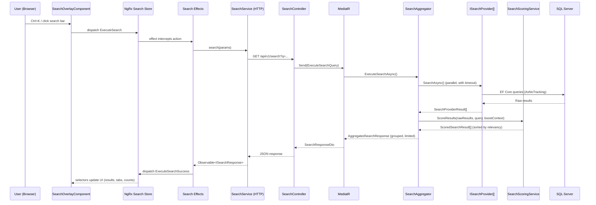

# Search Framework

> Estimated reading time: 18 minutes

## WHY

Search is not a secondary feature in BuildEstate Pro — it is flagship infrastructure. Users manage hundreds of land opportunities, planning applications, legal cases, and documents. Without intelligent search, corporate users waste minutes finding entities that should be discoverable in seconds.

The global search must feel fast, elegant, organised, and predictable. A user should type "Croydon" and immediately see land opportunities, planning applications, and legal cases in their respective categories — ranked by relevance, filtered by permission, and grouped for clarity.

Why this matters to you as a developer:

- Every new module you build must register with the search framework (it is a Definition of Done criterion).
- The search infrastructure is provider-based — you implement a single interface and the framework handles scoring, highlighting, caching, grouping, and permission filtering.
- Understanding the scoring algorithm helps you assign correct field weights so users find what they need.

## WHAT

The BuildEstate Pro Search Framework is a layered, provider-based architecture that delivers:

1. **Global search** across all registered modules with a single `Ctrl+K` shortcut
2. **Weighted relevancy scoring** using 7 matching layers (exact, starts-with, contains, token, fuzzy/Levenshtein, phonetic/Soundex, synonym)
3. **Permission-aware filtering** — users only see results they can access
4. **Parallel provider execution** with per-provider timeouts and graceful degradation
5. **Category-grouped results** with tab counts, quick actions, and match highlighting
6. **Advanced search** with module, status, date range, and creator filters
7. **User personalisation** — recent searches, saved searches, and pinned items

### Key Concepts

| Concept | Description |
|---------|-------------|
| `ISearchProvider` | Interface every module implements to make entities searchable |
| `SearchAggregator` | Orchestrates parallel provider execution, scoring, highlighting, and grouping |
| `SearchScoringService` | Calculates relevancy scores using 7 matching layers + boost rules |
| `SearchRequest` / `SearchResponse` | Standardised API contract between frontend and backend |
| `SearchSettings` | Configuration (timeouts, limits, feature toggles) bound from `appsettings.json` |
| NgRx Search Store | Frontend state management with actions, effects, reducer, and selectors |

### Scoring Formula

```
FinalScore = Σ (MatchScore × FieldWeight × LayerMultiplier) + BoostScore
```

**Layer multipliers:**

| Layer | Multiplier | Description |
|-------|-----------|-------------|
| Exact Match | 5.0× | Full query matches full field value |
| Starts With | 3.0× | Field value begins with the query |
| Contains | 1.5× | Query appears anywhere in the field |
| Token Match | 2.0× per token | Individual words matched independently |
| Fuzzy (Levenshtein) | 0.8× | Edit distance ≤ 2 (short words) or ≤ 3 (long words) |
| Phonetic (Soundex) | 0.5× | Words that sound similar |
| Synonym | 0.7× | Predefined synonym dictionary matches |

**Boost rules:**

| Condition | Boost |
|-----------|-------|
| Recently viewed by user | +2.0 |
| Modified within 7 days | +1.5 |
| Active status | +1.0 |
| Created by current user | +0.5 |
| Matches user department | +1.0 |
| Frequently accessed | +0.8 |

### Field Weight Guidelines

| Field Type | Recommended Weight |
|------------|-------------------|
| Unique identifiers (reference numbers) | 2.5 – 3.0 |
| Names / Titles | 2.0 – 2.5 |
| Locations / Addresses | 1.5 – 2.0 |
| Status values | 1.0 – 1.5 |
| Descriptions / Notes | 0.8 – 1.0 |
| Tags / Categories | 1.0 – 1.5 |
| Monetary values | 0.5 – 0.8 |
| Dates | 0.3 – 0.5 |

## HOW

### Architecture Overview



### Code Example 1: Implementing `ISearchProvider` for a New Entity

Below is the actual `LandOpportunitySearchProvider` from the codebase. When you add a new entity, follow this pattern:

```csharp
// File: src/BuildEstate.Infrastructure/Search/Providers/LandOpportunitySearchProvider.cs

using System.Security.Claims;
using BuildEstate.Application.Features.Search.Interfaces;
using BuildEstate.Application.Features.Search.Models;
using BuildEstate.Infrastructure.Persistence;
using Microsoft.EntityFrameworkCore;

namespace BuildEstate.Infrastructure.Search.Providers;

public class LandOpportunitySearchProvider : ISearchProvider
{
    private readonly BuildEstateDbContext _dbContext;

    public LandOpportunitySearchProvider(BuildEstateDbContext dbContext)
    {
        _dbContext = dbContext;
    }

    // --- Provider metadata (used for grouping and tab ordering) ---
    public string ModuleId => "land-acquisition";
    public string EntityName => "Land Opportunity";
    public string CategoryName => "Land Acquisition";
    public string Icon => "landscape";
    public int Priority => 1;

    public async Task<SearchProviderResult> SearchAsync(
        SearchRequest request,
        ClaimsPrincipal user,
        CancellationToken cancellationToken)
    {
        // Step 1: Permission check — return empty if user lacks access
        if (!HasAccess(user))
        {
            return new SearchProviderResult
            {
                ModuleId = ModuleId,
                CategoryName = CategoryName,
                Icon = Icon,
                Priority = Priority,
                Results = [],
                TotalCount = 0
            };
        }

        // Step 2: Query all entities and project to RawSearchResult
        var results = await _dbContext.LandOpportunities
            .AsNoTracking()
            .Select(o => new RawSearchResult
            {
                EntityId = o.Id,
                EntityType = EntityName,
                Title = o.Name,
                Subtitle = o.Location,
                Status = o.Status.ToString(),
                StatusVariant = GetStatusVariant(o.Status.ToString()),
                Icon = Icon,
                Category = CategoryName,
                ModuleBadge = "Land",
                NavigationRoute = $"/land-acquisition/opportunities/{o.Id}",
                ModifiedAt = o.UpdatedAt ?? o.CreatedAt,
                Breadcrumb = $"Land Acquisition > {o.Location}",
                CreatedBy = o.CreatedBy,
                // Step 3: Define searchable fields with weights
                SearchableFields = new List<SearchableField>
                {
                    new() { Name = "Name", Value = o.Name, Weight = 2.0 },
                    new() { Name = "Location", Value = o.Location, Weight = 1.5 },
                    new() { Name = "Status", Value = o.Status.ToString(), Weight = 1.0 },
                    new() { Name = "Source", Value = o.Source ?? string.Empty, Weight = 0.8 }
                },
                // Step 4: Define quick actions
                QuickActions = new List<SearchQuickAction>
                {
                    new() { Label = "View", Icon = "visibility",
                            Route = $"/land-acquisition/opportunities/{o.Id}" },
                    new() { Label = "Edit", Icon = "edit",
                            Route = $"/land-acquisition/opportunities/{o.Id}/edit",
                            Permission = "AcquisitionManager" }
                }
            })
            .ToListAsync(cancellationToken);

        return new SearchProviderResult
        {
            ModuleId = ModuleId,
            CategoryName = CategoryName,
            Icon = Icon,
            Priority = Priority,
            Results = results,
            TotalCount = results.Count
        };
    }

    public async Task<int> CountAsync(
        string query, ClaimsPrincipal user, CancellationToken cancellationToken)
    {
        if (!HasAccess(user)) return 0;
        return await _dbContext.LandOpportunities.AsNoTracking().CountAsync(cancellationToken);
    }

    private static bool HasAccess(ClaimsPrincipal user)
    {
        return user.IsInRole("AcquisitionManager") || user.IsInRole("SuperAdmin");
    }

    private static string? GetStatusVariant(string status) => status switch
    {
        "Identified" or "InitialReview" => "info",
        "DueDiligence" or "OfferMade" => "warning",
        "UnderContract" => "accent",
        "Acquired" => "success",
        "Withdrawn" => "error",
        _ => null
    };
}
```

### Code Example 2: Registering a Search Provider in DI

All search providers are registered in `src/BuildEstate.Infrastructure/DependencyInjection.cs`. The framework resolves them via `IEnumerable<ISearchProvider>` for parallel execution:

```csharp
// File: src/BuildEstate.Infrastructure/DependencyInjection.cs (excerpt)

// 17. Register Search Providers (scoped — they use DbContext)
// Each provider implements ISearchProvider and is resolved via IEnumerable<ISearchProvider>
// in the SearchAggregator for parallel provider execution.
services.AddScoped<ISearchProvider, LandOpportunitySearchProvider>();
services.AddScoped<ISearchProvider, LandOwnerSearchProvider>();
services.AddScoped<ISearchProvider, DueDiligenceSearchProvider>();
services.AddScoped<ISearchProvider, OfferSearchProvider>();
services.AddScoped<ISearchProvider, ContractSearchProvider>();
services.AddScoped<ISearchProvider, AcquisitionSearchProvider>();
services.AddScoped<ISearchProvider, PlanningApplicationSearchProvider>();
services.AddScoped<ISearchProvider, PlanningConditionSearchProvider>();
services.AddScoped<ISearchProvider, LegalCaseSearchProvider>();
services.AddScoped<ISearchProvider, ComplianceCheckSearchProvider>();
services.AddScoped<ISearchProvider, UserSearchProvider>();
services.AddScoped<ISearchProvider, RoleSearchProvider>();
services.AddScoped<ISearchProvider, DocumentSearchProvider>();
services.AddScoped<ISearchProvider, NotificationSearchProvider>();

// 18. Register search provider startup validation
services.AddHostedService<Search.SearchProviderValidationService>();
```

**Key insight**: Registering multiple implementations of the same interface uses the `IEnumerable<ISearchProvider>` DI pattern. The `SearchAggregator` receives all registered providers and queries them in parallel.

### Code Example 3: Frontend Search Result Rendering

The search overlay renders results using the `SearchResultCardComponent`. Each card displays the icon, highlighted title, status badge, module badge, breadcrumb, timestamp, and quick actions:

```typescript
// File: client-app/src/app/features/global-search/components/search-result-card/search-result-card.component.ts

@Component({
  selector: 'app-search-result-card',
  standalone: true,
  imports: [CommonModule, SearchHighlightPipe],
  changeDetection: ChangeDetectionStrategy.OnPush,
  template: `
    <div
      class="flex items-start gap-3 px-4 py-3 rounded-lg cursor-pointer
             transition-colors hover:bg-base-200"
      [class.bg-primary/10]="isSelected"
      role="option"
      [attr.aria-selected]="isSelected"
      (click)="onNavigate()"
      (mouseenter)="onSelect()"
    >
      <!-- Module icon -->
      <span class="material-symbols-outlined text-2xl text-primary"
            aria-hidden="true">{{ result.icon }}</span>

      <div class="flex-1 min-w-0">
        <!-- Highlighted title + badges -->
        <div class="flex items-center gap-2">
          <span class="font-medium truncate"
                [innerHTML]="result.highlightedTitle | searchHighlight"></span>
          @if (result.status) {
            <span class="badge badge-sm" [ngClass]="getStatusBadgeClass()">
              {{ result.status }}
            </span>
          }
          @if (result.moduleBadge) {
            <span class="badge badge-sm badge-outline badge-info">
              {{ result.moduleBadge }}
            </span>
          }
        </div>

        <!-- Subtitle -->
        @if (result.subtitle) {
          <p class="text-sm text-base-content/60 truncate mt-0.5">
            {{ result.subtitle }}
          </p>
        }

        <!-- Breadcrumb + timestamp -->
        <div class="flex items-center gap-2 mt-1 text-xs text-base-content/50">
          @if (result.breadcrumb) {
            <span class="truncate">{{ result.breadcrumb }}</span>
            <span aria-hidden="true">·</span>
          }
          <span>{{ result.lastUpdated | date:'mediumDate' }}</span>
        </div>
      </div>

      <!-- Quick actions (View, Pin, Open in new tab) -->
      <div class="flex items-center gap-1 shrink-0">
        <button class="btn btn-ghost btn-xs btn-square" aria-label="View"
                (click)="onNavigate(); $event.stopPropagation()">
          <span class="material-symbols-outlined text-sm">visibility</span>
        </button>
      </div>
    </div>
  `
})
export class SearchResultCardComponent {
  @Input({ required: true }) result!: ISearchResultItem;
  @Input() isSelected = false;
  @Input() index = 0;
  @Output() navigate = new EventEmitter<ISearchResultItem>();
  @Output() select = new EventEmitter<number>();
}
```

### Code Example 4: NgRx Search Store Actions

The search state management follows standard NgRx patterns with a comprehensive action group:

```typescript
// File: client-app/src/app/features/global-search/store/search.actions.ts

export const SearchActions = createActionGroup({
  source: 'Search',
  events: {
    'Open Overlay': emptyProps(),
    'Close Overlay': emptyProps(),
    'Execute Search': props<{ query: string }>(),
    'Execute Search Success': props<{ response: ISearchResponse }>(),
    'Execute Search Failure': props<{ error: string }>(),
    'Clear Search': emptyProps(),
    'Set Active Tab': props<{ tab: string }>(),
    'Add Recent Search': props<{ search: IRecentSearch }>(),
    'Load Recent Searches': emptyProps(),
    'Load Recent Searches Success': props<{ searches: IRecentSearch[] }>(),
    'Pin Item': props<{ entityId: string; entityType: string; title: string;
                        subtitle: string | null; icon: string; category: string;
                        navigationRoute: string }>(),
    'Pin Item Success': props<{ item: IPinnedItem }>(),
    'Unpin Item': props<{ id: string }>(),
    'Load Suggestions': props<{ prefix: string }>(),
    'Load Suggestions Success': props<{ suggestions: ISuggestion[] }>(),
    'Set Advanced Filters': props<{ filters: Partial<IAdvancedFilters> }>(),
    'Save Search': props<{ name: string; query: string; filters: IAdvancedFilters }>(),
    'Toggle Command Mode': props<{ enabled: boolean }>(),
  }
});
```

## WHEN

Use the search framework when:

- **Building a new module** — Register a search provider before marking the module complete. This is mandatory per the Definition of Done.
- **Adding a new entity** — Ask: "Should users be able to find this via global search?" If yes, implement `ISearchProvider`.
- **Modifying entity fields** — Review and update search field weights if important new fields are added.
- **Changing permissions** — Ensure the provider's `HasAccess()` method reflects current authorization rules.
- **Performance tuning** — If search response times exceed 300ms, add database indexes on searchable fields.

### When NOT to use search providers:

- Internal system entities that users never need to find (e.g., audit log entries are queryable via the audit trail UI, not global search)
- Transient or intermediate data (e.g., in-progress form drafts)

## WHERE

### Codebase Location

| Layer | Path | Purpose |
|-------|------|---------|
| **Interface** | `src/BuildEstate.Application/Features/Search/Interfaces/ISearchProvider.cs` | Core provider contract |
| **Interface** | `src/BuildEstate.Application/Features/Search/Interfaces/ISearchAggregator.cs` | Orchestration contract |
| **Interface** | `src/BuildEstate.Application/Features/Search/Interfaces/ISearchScoringService.cs` | Scoring contract |
| **Interface** | `src/BuildEstate.Application/Features/Search/Interfaces/ISearchHighlightService.cs` | Highlight contract |
| **Interface** | `src/BuildEstate.Application/Features/Search/Interfaces/ISearchSynonymService.cs` | Synonym expansion contract |
| **Models** | `src/BuildEstate.Application/Features/Search/Models/` | `SearchRequest`, `RawSearchResult`, `ScoredSearchResult`, `SearchProviderResult`, `SearchBoostContext` |
| **DTOs** | `src/BuildEstate.Application/Features/Search/DTOs/` | `SearchResponseDto`, `SearchResultDto`, `SearchCategoryDto`, `QuickActionDto` |
| **Services** | `src/BuildEstate.Application/Features/Search/Services/SearchAggregator.cs` | Parallel provider orchestration |
| **Services** | `src/BuildEstate.Application/Features/Search/Services/SearchScoringService.cs` | 7-layer scoring algorithm |
| **Services** | `src/BuildEstate.Application/Features/Search/Services/SearchNormalizationService.cs` | String normalisation |
| **Services** | `src/BuildEstate.Application/Features/Search/Services/SearchHighlightService.cs` | Match highlighting |
| **Services** | `src/BuildEstate.Application/Features/Search/Services/SearchSynonymService.cs` | Synonym dictionary |
| **Settings** | `src/BuildEstate.Application/Settings/SearchSettings.cs` | Configuration model |
| **Queries** | `src/BuildEstate.Application/Features/Search/Queries/ExecuteSearch/` | MediatR query handler |
| **Commands** | `src/BuildEstate.Application/Features/Search/Commands/` | `AddRecentSearch`, `PinItem`, `UnpinItem`, `SaveSearch`, `DeleteSavedSearch` |
| **Providers** | `src/BuildEstate.Infrastructure/Search/Providers/` | All 14 concrete provider implementations |
| **Validation** | `src/BuildEstate.Infrastructure/Search/SearchProviderValidationService.cs` | Startup validation of registered providers |
| **DI Registration** | `src/BuildEstate.Infrastructure/DependencyInjection.cs` | Service registration (section 17) |
| **API Controller** | `src/BuildEstate.API/Controllers/SearchController.cs` | HTTP endpoints (`/api/v1/search`) |
| **Frontend Service** | `client-app/src/app/features/global-search/services/search.service.ts` | HTTP client for search API |
| **Frontend Store** | `client-app/src/app/features/global-search/store/` | NgRx actions, reducer, effects, selectors, state |
| **Frontend Models** | `client-app/src/app/features/global-search/models/` | TypeScript interfaces |
| **Frontend Components** | `client-app/src/app/features/global-search/components/` | Overlay, result card, tabs, input, highlights, etc. |
| **Frontend Container** | `client-app/src/app/features/global-search/containers/search-container/` | Smart container component |
| **EF Configuration** | `src/BuildEstate.Infrastructure/Persistence/Configurations/Search/` | Database entity configurations for search tables |
| **Migration** | `src/BuildEstate.Infrastructure/Persistence/Migrations/20260720120000_AddSearchTables.cs` | Search tables migration |

### Currently Registered Providers (14)

| Provider | Module | Entity | Icon | Priority |
|----------|--------|--------|------|----------|
| `LandOpportunitySearchProvider` | land-acquisition | Land Opportunity | `landscape` | 1 |
| `LandOwnerSearchProvider` | land-acquisition | Land Owner | `person` | 2 |
| `DueDiligenceSearchProvider` | land-acquisition | Due Diligence | `fact_check` | 3 |
| `OfferSearchProvider` | land-acquisition | Offer | `local_offer` | 4 |
| `ContractSearchProvider` | land-acquisition | Contract | `description` | 5 |
| `AcquisitionSearchProvider` | land-acquisition | Acquisition | `real_estate_agent` | 6 |
| `PlanningApplicationSearchProvider` | planning-approvals | Planning Application | `assignment` | 7 |
| `PlanningConditionSearchProvider` | planning-approvals | Planning Condition | `checklist` | 8 |
| `LegalCaseSearchProvider` | legal-compliance | Legal Case | `gavel` | 9 |
| `ComplianceCheckSearchProvider` | legal-compliance | Compliance Check | `verified` | 10 |
| `UserSearchProvider` | user-management | User | `person` | 11 |
| `RoleSearchProvider` | user-management | Role | `admin_panel_settings` | 12 |
| `DocumentSearchProvider` | documents | Document | `article` | 13 |
| `NotificationSearchProvider` | notifications | Notification | `notifications` | 14 |

## WHO

| Role | Responsibility |
|------|---------------|
| **Module Developer** | Implements `ISearchProvider` for new entities, registers in DI, defines field weights |
| **Backend Architect** | Maintains scoring algorithm, synonym dictionary, and search infrastructure |
| **Frontend Developer** | Integrates new entity types into the search overlay result rendering |
| **DBA / Performance Engineer** | Ensures database indexes exist on all searchable fields |
| **Security Reviewer** | Verifies permission filtering is applied server-side in every provider |

## WHAT NEXT

After understanding the search framework, proceed to:

- [Notification Framework](./13-notification-framework.md) — the other primary cross-cutting system
- [Module Pattern](./19-module-pattern.md) — how to build a full module including search registration
- [How to Build the Next Module](./24-how-to-build-the-next-module.md) — end-to-end checklist (includes search steps)

## Integration Steps

Follow this numbered checklist when adding search to a new module:

### Backend

1. **Create the provider class**: `src/BuildEstate.Infrastructure/Search/Providers/{Entity}SearchProvider.cs` implementing `ISearchProvider`
2. **Define metadata**: Set `ModuleId`, `EntityName`, `CategoryName`, `Icon`, and `Priority` properties
3. **Implement `SearchAsync`**: Query entities with `AsNoTracking()`, project to `RawSearchResult`, include `SearchableFields` with appropriate weights
4. **Implement permission check**: Add a `HasAccess(ClaimsPrincipal user)` method checking relevant roles — return empty results for unauthorised users
5. **Implement `CountAsync`**: Return the total count of matching entities (permission-filtered)
6. **Define quick actions**: Add View and Edit routes with permissions
7. **Register in DI**: Add `services.AddScoped<ISearchProvider, {Entity}SearchProvider>();` to `DependencyInjection.cs` (section 17)
8. **Add database indexes**: Ensure all searchable fields have indexes in the EF Core configuration
9. **Update `appsettings.json`** (if needed): Adjust `Search` settings for new provider timeout requirements

### Frontend

10. **Add entity type handling**: Ensure the navigation route pattern works in `SearchResultCardComponent`
11. **Add icon mapping** (if new category): Register the Material Symbols Outlined icon in the search tabs component
12. **Verify route**: Confirm the `navigationRoute` resolves to an existing Angular route with proper guards
13. **Test end-to-end**: Search for the entity by name, verify it appears in the correct category tab, click to navigate

### Governance

14. **Update `search-module-registration.md`**: Add the entity to the module registry table with fields, weights, and icon
15. **Write relevancy tests**: Exact match → #1, partial match → top 5, misspelling → top 10
16. **PR review**: Verify the search review checklist passes before merge

## Common Mistakes

### ❌ Mistake 1: Forgetting permission filtering

```csharp
// WRONG — returns all results regardless of user role
public async Task<SearchProviderResult> SearchAsync(
    SearchRequest request, ClaimsPrincipal user, CancellationToken ct)
{
    var results = await _dbContext.Projects.AsNoTracking()
        .Select(p => new RawSearchResult { /* ... */ })
        .ToListAsync(ct);
    return new SearchProviderResult { Results = results };
}
```

```csharp
// CORRECT — check permissions first, return empty for unauthorised users
public async Task<SearchProviderResult> SearchAsync(
    SearchRequest request, ClaimsPrincipal user, CancellationToken ct)
{
    if (!user.IsInRole("ProjectManager") && !user.IsInRole("SuperAdmin"))
    {
        return new SearchProviderResult { ModuleId = ModuleId, Results = [], TotalCount = 0 };
    }
    // ... proceed with query
}
```

### ❌ Mistake 2: Using equal weights for all fields

```csharp
// WRONG — all fields weighted the same, results are poorly ranked
SearchableFields = new List<SearchableField>
{
    new() { Name = "Name", Value = o.Name, Weight = 1.0 },
    new() { Name = "ReferenceNumber", Value = o.RefNumber, Weight = 1.0 },
    new() { Name = "Notes", Value = o.Notes, Weight = 1.0 }
}
```

```csharp
// CORRECT — primary identifiers weighted higher for better relevancy
SearchableFields = new List<SearchableField>
{
    new() { Name = "ReferenceNumber", Value = o.RefNumber, Weight = 2.5 },
    new() { Name = "Name", Value = o.Name, Weight = 2.0 },
    new() { Name = "Notes", Value = o.Notes, Weight = 0.8 }
}
```

### ❌ Mistake 3: Not registering the provider in DI

You create a perfect `ISearchProvider` implementation but forget to add the DI registration line in `DependencyInjection.cs`. The `SearchProviderValidationService` will log a warning at startup, but your entity will be invisible in search results.

Always add the registration in the Infrastructure DI file and verify by searching for your entity after deployment.

### ❌ Mistake 4: Using tracking queries in search providers

```csharp
// WRONG — unnecessary change tracking overhead for read-only search
var results = await _dbContext.Opportunities
    .Select(o => new RawSearchResult { /* ... */ })
    .ToListAsync(ct);
```

```csharp
// CORRECT — always use AsNoTracking for search (read-only queries)
var results = await _dbContext.Opportunities
    .AsNoTracking()
    .Select(o => new RawSearchResult { /* ... */ })
    .ToListAsync(ct);
```

### ❌ Mistake 5: Hardcoding navigation routes that don't exist

Before registering a search provider, verify the `NavigationRoute` resolves to an actual Angular route. A search result linking to a non-existent page is worse than not being searchable at all.

```csharp
// WRONG — route doesn't exist yet in Angular routing
NavigationRoute = $"/construction/stages/{o.Id}"  // Module not built!

// CORRECT — only use routes that exist and have been verified
NavigationRoute = $"/land-acquisition/opportunities/{o.Id}"  // Exists with guards
```
