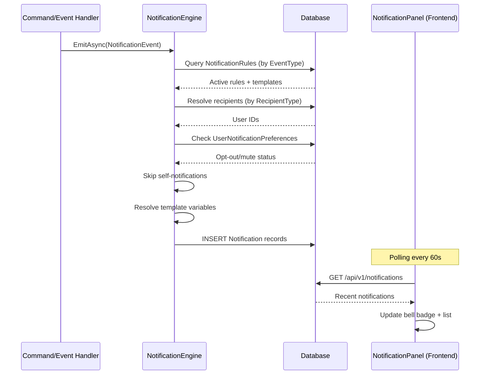
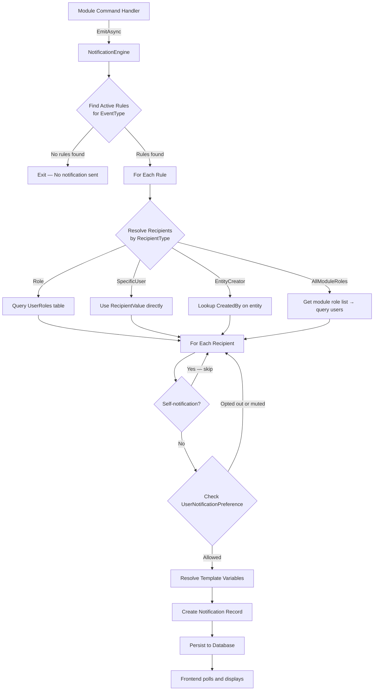

# Notification Framework

> **Reading time:** ~12 minutes
> **Prerequisites:** [07-clean-architecture-explained.md](./07-clean-architecture-explained.md), [08-cqrs-and-mediatr.md](./08-cqrs-and-mediatr.md), [10-cross-cutting-framework.md](./10-cross-cutting-framework.md)

---

## WHY

Every business event in BuildEstate Pro — an offer being submitted, a due diligence check failing, a contract being exchanged — needs to reach the right people at the right time. Without a centralized notification system, each module would independently implement its own messaging logic, leading to inconsistent delivery, impossible-to-manage routing rules, and duplication across the codebase.

The notification framework solves this by providing a **centrally-managed, rule-based, template-driven engine** that is fully decoupled from business modules. Modules emit events; the engine decides who receives what, through which channel, with what message content. This gives the platform:

- **Admin-configurable routing** — SuperAdmin controls recipients and channels without code changes
- **User autonomy** — Individual users can mute or opt-out of specific notification types
- **Multi-channel readiness** — In-app delivery today, with email/SMS/webhook extension points for the future
- **Self-notification prevention** — Users never receive notifications about their own actions
- **Auditability** — Every notification sent is persisted with delivery status for compliance

---

## WHAT

The notification framework is composed of five main parts:

| Component | Layer | Purpose |
|-----------|-------|---------|
| `INotificationEngine` | Application (interface) | Contract that modules call to emit events |
| `NotificationEngine` | Infrastructure (implementation) | Rule lookup, recipient resolution, template rendering, persistence |
| `NotificationRule` | Domain entity | Routing configuration — event type → recipient type + channel |
| `NotificationTemplate` | Domain entity | Message content with variable placeholders |
| `UserNotificationPreference` | Domain entity | Per-user opt-out/mute settings |

Supporting components:

| Component | Layer | Purpose |
|-----------|-------|---------|
| `INotificationService` | Application (interface) | Legacy simple notification API (send to user/role) |
| `NotificationService` | Infrastructure | Direct persistence without rule engine (backward compat) |
| `NotificationsController` | API | User-facing endpoints (get, mark-read, unread-count) |
| `NotificationTemplatesController` | API (Admin) | CRUD for message templates |
| `NotificationRulesController` | API (Admin) | CRUD + toggle for routing rules |
| `NotificationPanelComponent` | Frontend | Bell icon with dropdown notification list |

### Domain Entities

The `Notification` entity represents a single delivered notification:

```csharp
// src/BuildEstate.Domain/Entities/LandAcquisition/Notification.cs
public class Notification : BaseEntity
{
    public string RecipientUserId { get; set; } = string.Empty;
    public string EventType { get; set; } = string.Empty;
    public string Module { get; set; } = string.Empty;
    public string Title { get; set; } = string.Empty;
    public string Message { get; set; } = string.Empty;
    public string Icon { get; set; } = "notifications";
    public string Severity { get; set; } = "Info";
    public string Priority { get; set; } = "Normal";
    public Guid? RelatedEntityId { get; set; }
    public string RelatedEntityType { get; set; } = string.Empty;
    public string RelatedUrl { get; set; } = string.Empty;
    public bool IsRead { get; set; } = false;
    public DateTime? ReadAt { get; set; }
    public string Channel { get; set; } = "InApp";
    public string DeliveryStatus { get; set; } = "Delivered";
    public DateTime SentAt { get; set; }
}
```

### Enums

The framework uses four enums for type-safe configuration:

```csharp
// src/BuildEstate.Domain/Enums/NotificationSeverity.cs
public enum NotificationSeverity { Info = 0, Success = 1, Warning = 2, Error = 3 }

// src/BuildEstate.Domain/Enums/NotificationChannel.cs
public enum NotificationChannel { InApp = 0, Email = 1, Both = 2 }

// src/BuildEstate.Domain/Enums/NotificationPriority.cs
public enum NotificationPriority { Low = 0, Normal = 1, High = 2, Urgent = 3 }

// src/BuildEstate.Domain/Enums/RecipientType.cs
public enum RecipientType { Role = 0, SpecificUser = 1, EntityCreator = 2, EntityOwner = 3, AllModuleRoles = 4 }
```

---

## HOW

### Architecture Overview



### Notification Engine Processing Pipeline

When a module emits an event, the `NotificationEngine` executes these steps:

1. **Rule Lookup** — Find all active `NotificationRule` records matching the `EventType`
2. **Recipient Resolution** — For each rule, resolve target users based on `RecipientType` (role-based, entity creator, specific user, all module roles)
3. **Preference Check** — Query `UserNotificationPreference` to respect opt-outs and mute windows
4. **Self-Skip** — Exclude the `TriggeredByUserId` from recipients
5. **Template Resolution** — Substitute variables (`{opportunityName}`, `{amount}`) into template title and body
6. **Notification Creation** — Persist one `Notification` record per recipient

### Code Example 1: Triggering a Notification from a Command Handler

This is how the Land Acquisition module triggers a notification when an offer requires approval. The handler only needs to construct a `NotificationEvent` — it knows nothing about recipients, channels, or templates.

```csharp
// src/BuildEstate.Application/Features/LandAcquisition/Offers/Commands/CreateOffer/CreateOfferCommandHandler.cs

// After creating the approval request and saving to database:
await _notificationEngine.EmitAsync(new NotificationEvent
{
    EventType = "ApprovalRequested",
    Module = "LandAcquisition",
    EntityId = opportunity.Id,
    EntityType = "LandOpportunity",
    RelatedUrl = $"/land-acquisition/opportunities/{opportunity.Id}",
    Variables = new Dictionary<string, string>
    {
        ["opportunityName"] = opportunity.Name,
        ["amount"] = offerAmount.ToString("N2")
    },
    TriggeredByUserId = _currentUserService.UserId
}, cancellationToken);
```

The `NotificationEvent` record contains all the context the engine needs:

```csharp
// src/BuildEstate.Application/Common/Interfaces/INotificationEngine.cs
public sealed record NotificationEvent
{
    public string EventType { get; init; } = string.Empty;
    public string Module { get; init; } = string.Empty;
    public Guid? EntityId { get; init; }
    public string EntityType { get; init; } = string.Empty;
    public string RelatedUrl { get; init; } = string.Empty;
    public Dictionary<string, string> Variables { get; init; } = new();
    public string? TriggeredByUserId { get; init; }
}
```

### Code Example 2: Frontend Notification Handling

The `NotificationPanelComponent` displays a bell icon with an unread count badge and polls the API every 60 seconds for new notifications. When a user clicks a notification, it is marked as read and a navigation event is emitted.

```typescript
// client-app/src/app/shared/design-system/notifications/notification-panel/notification-panel.component.ts

@Component({
  selector: 'app-notification-panel',
  standalone: true,
  imports: [CommonModule],
  changeDetection: ChangeDetectionStrategy.OnPush,
  // Template renders bell icon, unread badge, dropdown list
})
export class NotificationPanelComponent implements OnInit, OnDestroy {
  @Output() navigate = new EventEmitter<{ entityId: string; entityType: string }>();

  notifications: INotification[] = [];
  unreadCount = 0;
  loading = false;

  private readonly destroy$ = new Subject<void>();
  private readonly POLL_INTERVAL_MS = 60_000;

  ngOnInit(): void {
    interval(this.POLL_INTERVAL_MS)
      .pipe(
        startWith(0),
        switchMap(() => this.notificationService.getRecent(20)),
        takeUntil(this.destroy$)
      )
      .subscribe({
        next: (response) => {
          if (response.success && response.data) {
            this.notifications = response.data;
            this.unreadCount = this.notifications.filter(n => !n.isRead).length;
          }
          this.cdr.markForCheck();
        }
      });
  }

  onNotificationClick(notification: INotification): void {
    if (!notification.isRead) {
      this.notificationService.markAsRead(notification.id).subscribe();
    }
    this.navigate.emit({
      entityId: notification.entityId,
      entityType: notification.entityType
    });
  }
}
```

The `NotificationService` in core provides the API client:

```typescript
// client-app/src/app/core/services/notification.service.ts

@Injectable({ providedIn: 'root' })
export class NotificationService {
  private readonly baseUrl = '/api/v1/notifications';

  constructor(private readonly http: HttpClient) {}

  getRecent(limit: number = 20): Observable<IApiResponse<INotification[]>> {
    const params = new HttpParams().set('limit', limit.toString());
    return this.http.get<IApiResponse<INotification[]>>(this.baseUrl, { params });
  }

  markAsRead(id: string): Observable<IApiResponse<void>> {
    return this.http.patch<IApiResponse<void>>(`${this.baseUrl}/${id}/read`, {});
  }

  getUnreadCount(): Observable<IApiResponse<{ count: number }>> {
    return this.http.get<IApiResponse<{ count: number }>>(`${this.baseUrl}/unread-count`);
  }
}
```

### Recipient Resolution

The engine resolves recipients differently based on the rule's `RecipientType`:

| RecipientType | Resolution Logic |
|---------------|-----------------|
| `Role` | Query all users assigned to the specified role name |
| `SpecificUser` | Direct user ID from `RecipientValue` |
| `EntityCreator` | Look up `CreatedBy` on the related entity |
| `EntityOwner` | Look up assigned owner of the entity |
| `AllModuleRoles` | Resolve module-specific role list, find all users in those roles |

### Template Variable Substitution

Templates use `{variableName}` placeholders that are replaced at emit time:

```
Title Template: "Approval Required: {opportunityName}"
Body Template:  "An offer of £{amount} requires your approval for {opportunityName}"

Variables passed: { opportunityName: "Croydon Site A", amount: "2,500,000.00" }

Resolved Title: "Approval Required: Croydon Site A"
Resolved Body:  "An offer of £2,500,000.00 requires your approval for Croydon Site A"
```

### API Endpoints

| Endpoint | Method | Auth | Purpose |
|----------|--------|------|---------|
| `/api/v1/notifications` | GET | User | Get recent notifications (limit param) |
| `/api/v1/notifications/{id}/read` | PATCH | User | Mark notification as read |
| `/api/v1/notifications/unread-count` | GET | User | Get unread count |
| `/api/v1/notifications/all` | GET | SuperAdmin | Admin view with filtering + pagination |
| `/api/v1/notification-templates` | CRUD | SuperAdmin | Manage message templates |
| `/api/v1/notification-rules` | CRUD + toggle | SuperAdmin | Manage routing rules |

---

## WHEN

Emit notifications when a business event occurs that **other users** need to know about. Typical triggers:

- **Status transitions** — Opportunity status changed, contract exchanged, DD completed/failed
- **Approval workflows** — Approval requested, approval decided (approved/rejected)
- **Deadline events** — Offer expired, milestone overdue, insurance expiring
- **Document events** — Document uploaded to shared entity
- **Compliance events** — Non-compliant check recorded, audit action overdue
- **Financial events** — Feasibility ready for review, fee requires approval

**Do NOT emit notifications for:**
- Read operations (viewing a page, running a query)
- Draft saves that only affect the current user
- System health/maintenance events (use logging instead)
- Events with no meaningful recipient other than the actor

---

## WHERE

### Codebase Location

| Component | Path |
|-----------|------|
| **Interface: INotificationEngine** | `src/BuildEstate.Application/Common/Interfaces/INotificationEngine.cs` |
| **Interface: INotificationService** | `src/BuildEstate.Application/Common/Interfaces/INotificationService.cs` |
| **Implementation: NotificationEngine** | `src/BuildEstate.Infrastructure/Services/NotificationEngine.cs` |
| **Implementation: NotificationService** | `src/BuildEstate.Infrastructure/Services/NotificationService.cs` |
| **Entity: Notification** | `src/BuildEstate.Domain/Entities/LandAcquisition/Notification.cs` |
| **Entity: NotificationRule** | `src/BuildEstate.Domain/Entities/Notifications/NotificationRule.cs` |
| **Entity: NotificationTemplate** | `src/BuildEstate.Domain/Entities/Notifications/NotificationTemplate.cs` |
| **Entity: UserNotificationPreference** | `src/BuildEstate.Domain/Entities/Notifications/UserNotificationPreference.cs` |
| **Enum: NotificationSeverity** | `src/BuildEstate.Domain/Enums/NotificationSeverity.cs` |
| **Enum: NotificationChannel** | `src/BuildEstate.Domain/Enums/NotificationChannel.cs` |
| **Enum: NotificationPriority** | `src/BuildEstate.Domain/Enums/NotificationPriority.cs` |
| **Enum: RecipientType** | `src/BuildEstate.Domain/Enums/RecipientType.cs` |
| **Controller: NotificationsController** | `src/BuildEstate.API/Controllers/NotificationsController.cs` |
| **Controller: NotificationTemplatesController** | `src/BuildEstate.API/Controllers/Admin/NotificationTemplatesController.cs` |
| **Controller: NotificationRulesController** | `src/BuildEstate.API/Controllers/Admin/NotificationRulesController.cs` |
| **EF Config: NotificationConfiguration** | `src/BuildEstate.Infrastructure/Persistence/Configurations/LandAcquisition/NotificationConfiguration.cs` |
| **EF Config: NotificationRuleConfiguration** | `src/BuildEstate.Infrastructure/Persistence/Configurations/Notifications/NotificationRuleConfiguration.cs` |
| **EF Config: NotificationTemplateConfiguration** | `src/BuildEstate.Infrastructure/Persistence/Configurations/Notifications/NotificationTemplateConfiguration.cs` |
| **Seed Data** | `src/BuildEstate.Infrastructure/Persistence/Seeds/NotificationSeedData.cs` |
| **Frontend Service: NotificationService** | `client-app/src/app/core/services/notification.service.ts` |
| **Frontend Component: NotificationPanel** | `client-app/src/app/shared/design-system/notifications/notification-panel/notification-panel.component.ts` |
| **Frontend Model: INotification** | `client-app/src/app/features/land-acquisition/models/notification.model.ts` |
| **Search Provider** | `src/BuildEstate.Infrastructure/Search/Providers/NotificationSearchProvider.cs` |

### Key Namespaces

| Namespace | Contains |
|-----------|----------|
| `BuildEstate.Application.Common.Interfaces` | `INotificationEngine`, `INotificationService`, `NotificationEvent` |
| `BuildEstate.Infrastructure.Services` | `NotificationEngine`, `NotificationService` |
| `BuildEstate.Domain.Entities.Notifications` | `NotificationRule`, `NotificationTemplate`, `UserNotificationPreference` |
| `BuildEstate.Domain.Entities.LandAcquisition` | `Notification` (delivery record) |
| `BuildEstate.Domain.Enums` | All notification-related enums |
| `BuildEstate.API.Controllers` | `NotificationsController` |
| `BuildEstate.API.Controllers.Admin` | `NotificationTemplatesController`, `NotificationRulesController` |

---

## WHO

| Role | Responsibility |
|------|---------------|
| **Module Developer** | Calls `_notificationEngine.EmitAsync()` in command/event handlers when business events occur |
| **SuperAdmin** | Configures notification rules (routing) and templates (content) via admin UI |
| **End User** | Receives notifications, marks as read, configures personal preferences |
| **Platform Architect** | Owns the `NotificationEngine` implementation and adds new channels |

---

## WHAT NEXT

After understanding the notification framework, continue with:

- [14-audit-framework.md](./14-audit-framework.md) — Understanding how actions are logged for compliance (notifications and audit often trigger together)
- [16-state-machines.md](./16-state-machines.md) — State transitions are the most common notification trigger
- [19-module-pattern.md](./19-module-pattern.md) — How to wire notifications when building a new module
- [24-how-to-build-the-next-module.md](./24-how-to-build-the-next-module.md) — Step-by-step playbook including notification integration

---

## Integration Steps

Follow this numbered checklist when adding notifications to a new module:

### 1. Define Event Types

Identify the business events in your module that require notification. Use a consistent naming convention: `{EntityAction}` (e.g., `InspectionFailed`, `MilestoneOverdue`, `ContractExecuted`).

### 2. Create Notification Templates

Use the admin API or seed data to create templates for each event type:

```csharp
new NotificationTemplate
{
    Name = "Inspection Failed Alert",
    EventType = "InspectionFailed",
    TitleTemplate = "Inspection Failed: {siteName}",
    BodyTemplate = "Inspection at {siteName} failed on {date}. Reason: {reason}",
    IconName = "error",
    Severity = NotificationSeverity.Error,
    Variables = "[\"siteName\", \"date\", \"reason\"]",
    IsActive = true
}
```

### 3. Create Notification Rules

Define routing rules that map events to recipients:

```csharp
new NotificationRule
{
    EventType = "InspectionFailed",
    Module = "Construction",
    Description = "Notify site manager and project manager when inspection fails",
    RecipientType = RecipientType.Role,
    RecipientValue = "SiteManager",
    Channel = NotificationChannel.InApp,
    Priority = NotificationPriority.High,
    TemplateId = templateId,
    IsActive = true
}
```

### 4. Inject INotificationEngine in Your Handler

Add the engine to your command handler or MediatR event handler constructor:

```csharp
private readonly INotificationEngine _notificationEngine;

public YourCommandHandler(
    INotificationEngine notificationEngine,
    // ... other dependencies
)
{
    _notificationEngine = notificationEngine;
}
```

### 5. Emit the Event After Business Logic Succeeds

Call `EmitAsync` after the core operation completes successfully:

```csharp
await _notificationEngine.EmitAsync(new NotificationEvent
{
    EventType = "InspectionFailed",
    Module = "Construction",
    EntityId = inspection.Id,
    EntityType = "SiteInspection",
    RelatedUrl = $"/construction/inspections/{inspection.Id}",
    Variables = new Dictionary<string, string>
    {
        ["siteName"] = inspection.SiteName,
        ["date"] = inspection.InspectionDate.ToString("dd MMM yyyy"),
        ["reason"] = inspection.FailureReason
    },
    TriggeredByUserId = _currentUserService.UserId
}, cancellationToken);
```

### 6. Add Module Role Mapping (If Using AllModuleRoles)

If your rules use `RecipientType.AllModuleRoles`, add your module to the `GetModuleRoles` switch in `NotificationEngine.cs`:

```csharp
"Construction" => new List<string> { "ProjectManager", "SiteManager", "Admin", "SuperAdmin" },
```

### 7. Update Frontend Icon Mapping (Optional)

If your events should use custom icons in the notification panel, add entries to `EVENT_TYPE_ICON_MAP` in `notification-panel.component.ts`:

```typescript
const EVENT_TYPE_ICON_MAP: Record<string, string> = {
  // ... existing entries
  'InspectionFailed': 'error',
  'MilestoneOverdue': 'schedule',
};
```

### 8. Verify End-to-End

1. Trigger the business event through the API or UI
2. Confirm the notification appears in the recipient's notification panel
3. Confirm the triggering user does NOT receive their own notification
4. Confirm the template variables are resolved correctly
5. Confirm the notification can be marked as read

---

## Notification Delivery Flow



---

## Real-Time Delivery

> 🚧 **Planned — Not Yet Implemented**
>
> The current implementation uses **polling** (every 60 seconds) for notification delivery to the frontend. SignalR real-time push is planned for a future iteration. The architecture supports this upgrade path — the `NotificationEngine` would publish to a SignalR hub after persisting, and the frontend would switch from polling to a WebSocket connection. No changes to the event emission pattern would be required from module developers.

The current polling approach:
- The `NotificationPanelComponent` calls `GET /api/v1/notifications` every 60 seconds
- Unread count is derived client-side from the response
- This is acceptable for MVP but will be replaced with SignalR for production scale

---

## Email Notifications

> 🚧 **Planned — Not Yet Implemented**
>
> The `NotificationChannel` enum already includes `Email` and `Both` values. The `NotificationEngine` currently only persists in-app notifications regardless of channel setting. Email delivery will be added by injecting an `IEmailService` into the engine and dispatching for rules with `Channel == Email` or `Channel == Both`. Templates will support both HTML email and plain-text in-app formats.

---

## Common Mistakes

### 1. Emitting notifications before the business operation succeeds

**Wrong:**
```csharp
await _notificationEngine.EmitAsync(notificationEvent, ct);
await _unitOfWork.SaveChangesAsync(ct); // If this fails, notification is orphaned
```

**Correct:**
```csharp
await _unitOfWork.SaveChangesAsync(ct); // Business operation commits first
await _notificationEngine.EmitAsync(notificationEvent, ct); // Then notify
```

Always emit notifications **after** the business operation has been committed. If the operation fails, no notification should be sent.

### 2. Forgetting to set TriggeredByUserId

**Wrong:**
```csharp
await _notificationEngine.EmitAsync(new NotificationEvent
{
    EventType = "OfferSubmitted",
    Module = "LandAcquisition",
    // Missing TriggeredByUserId — user will notify themselves!
}, ct);
```

**Correct:**
```csharp
await _notificationEngine.EmitAsync(new NotificationEvent
{
    EventType = "OfferSubmitted",
    Module = "LandAcquisition",
    TriggeredByUserId = _currentUserService.UserId
}, ct);
```

Without `TriggeredByUserId`, the engine cannot filter out self-notifications, resulting in users receiving alerts about their own actions.

### 3. Hardcoding recipients in the handler

**Wrong:**
```csharp
// Don't resolve recipients in the handler!
var financeUsers = await _userRepo.GetUsersInRole("FinanceDirector");
foreach (var user in financeUsers)
{
    await _notificationService.SendAsync(user.Id, "ApprovalRequested", message, entityId, ct);
}
```

**Correct:**
```csharp
// Let the engine handle recipient resolution via rules
await _notificationEngine.EmitAsync(new NotificationEvent
{
    EventType = "ApprovalRequested",
    Module = "LandAcquisition",
    // ... engine resolves recipients from NotificationRule configuration
}, ct);
```

Hardcoding recipients defeats the purpose of admin-configurable routing. Recipients should always be determined by `NotificationRule` records that the SuperAdmin can modify.

### 4. Using notification engine for logging or auditing

Notifications are for **human-readable alerts to users**. Do not use the notification system as a logging mechanism. Use structured logging (`ILogger<T>`) for operational events and the audit interceptor for compliance tracking.
