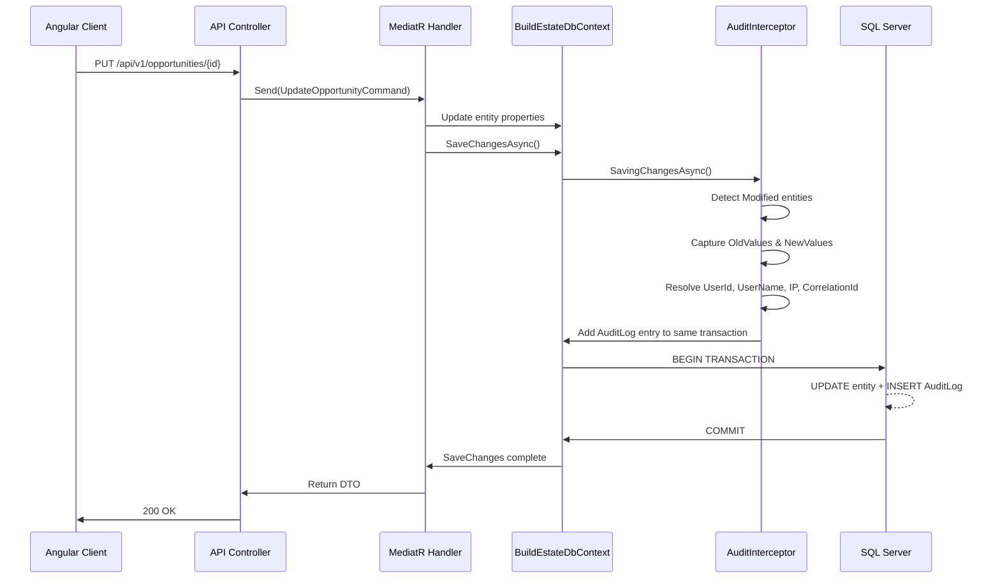

# Audit Framework

> **Estimated Reading Time:** 12 minutes

## WHY

Every enterprise application handling financial transactions, legal documents, and compliance workflows must answer one question under pressure: **"Who did what, when, and what changed?"**

In property development, this is not optional. Regulatory audits, dispute resolution, and internal investigations all depend on an immutable, queryable record of every mutation in the system. Without an audit trail:

- You cannot prove compliance with ISO 27001, GDPR, or AML regulations
- You cannot investigate data discrepancies or unauthorized changes
- You cannot generate the compliance reports that auditors require
- You cannot trace the history of a land opportunity through its entire lifecycle

BuildEstate Pro's audit framework solves this by intercepting every database write (create, update, delete) at the persistence layer, capturing a complete before/after snapshot, and writing it to an append-only `AuditLogs` table — all within the same database transaction as the original operation.

---

## WHAT

The audit framework is a **transparent, interceptor-based system** that records every mutation to any domain entity without requiring explicit logging calls in business logic. It consists of three layers:

1. **AuditInterceptor** — An EF Core `SaveChangesInterceptor` that hooks into every `SaveChangesAsync` call, detects entity state changes, and writes `AuditLog` records automatically
2. **AuditLog Entity** — The immutable persistence model that stores who, what, when, where, and what changed
3. **Audit Query Endpoints** — API controllers that expose the audit trail for both entity-specific views (per opportunity) and platform-wide admin views

### Data Captured Per Audit Entry

| Field | Purpose | Example |
|-------|---------|---------|
| `UserId` | Who performed the action | `"d4f2a1b3-..."` |
| `UserName` | Human-readable actor name | `"John Smith"` |
| `Action` | Type of mutation | `"Create"`, `"Update"`, `"Delete"` |
| `EntityName` | Which domain entity was affected | `"LandOpportunity"` |
| `EntityId` | The specific record's primary key | `"a1b2c3d4-..."` |
| `OldValues` | JSON snapshot of previous values | `{"Status":"Identified"}` |
| `NewValues` | JSON snapshot of new values | `{"Status":"DueDiligence"}` |
| `AffectedColumns` | Comma-separated list of changed fields | `"Status,UpdatedAt,UpdatedBy"` |
| `Timestamp` | UTC timestamp of the operation | `"2025-01-15T14:30:00Z"` |
| `IpAddress` | Client IP address | `"192.168.1.42"` |
| `CorrelationId` | Request correlation for distributed tracing | `"corr-abc123"` |



---

## HOW

### The AuditInterceptor — Automatic Capture

The interceptor extends EF Core's `SaveChangesInterceptor` and overrides `SavingChangesAsync`. It iterates every tracked entity that inherits from `BaseEntity`, detects its state (Added, Modified, Deleted), and produces an `AuditLog` record.

Key behaviours:
- **Create** — Records all non-null property values as `NewValues`
- **Update** — Records only modified properties as `OldValues`/`NewValues` with an `AffectedColumns` list
- **Delete** — Converts hard deletes to soft deletes (`IsDeleted = true`) and records all original values as `OldValues`
- **Metadata** — Stamps `CreatedAt`/`CreatedBy` on new entities and `UpdatedAt`/`UpdatedBy` on modified entities

```csharp
// File: src/BuildEstate.Infrastructure/Persistence/Interceptors/AuditInterceptor.cs

public sealed class AuditInterceptor : SaveChangesInterceptor
{
    private readonly ICurrentUserService _currentUserService;
    private readonly IHttpContextAccessor _httpContextAccessor;

    public AuditInterceptor(
        ICurrentUserService currentUserService,
        IHttpContextAccessor httpContextAccessor)
    {
        _currentUserService = currentUserService;
        _httpContextAccessor = httpContextAccessor;
    }

    public override ValueTask<InterceptionResult<int>> SavingChangesAsync(
        DbContextEventData eventData,
        InterceptionResult<int> result,
        CancellationToken cancellationToken = default)
    {
        if (eventData.Context is null)
            return base.SavingChangesAsync(eventData, result, cancellationToken);

        var context = eventData.Context;
        var userId = GetCurrentUserId();
        var userName = GetCurrentUserName();
        var utcNow = DateTime.UtcNow;
        var ipAddress = GetIpAddress();
        var correlationId = GetCorrelationId();

        var auditEntries = new List<AuditLog>();

        foreach (var entry in context.ChangeTracker.Entries<BaseEntity>().ToList())
        {
            switch (entry.State)
            {
                case EntityState.Added:
                    ProcessAdded(entry, userId, utcNow);
                    auditEntries.Add(CreateAuditLogForAdded(
                        entry, userId, userName, utcNow, ipAddress, correlationId));
                    break;

                case EntityState.Modified:
                    ProcessModified(entry, userId, utcNow);
                    auditEntries.Add(CreateAuditLogForModified(
                        entry, userId, userName, utcNow, ipAddress, correlationId));
                    break;

                case EntityState.Deleted:
                    ProcessDeleted(entry, userId, utcNow);
                    auditEntries.Add(CreateAuditLogForDeleted(
                        entry, userId, userName, utcNow, ipAddress, correlationId));
                    break;
            }
        }

        if (auditEntries.Count > 0)
            context.Set<AuditLog>().AddRange(auditEntries);

        return base.SavingChangesAsync(eventData, result, cancellationToken);
    }
}
```

### DI Registration — Wiring the Interceptor

The interceptor is registered as a **scoped** service (it depends on `ICurrentUserService` and `IHttpContextAccessor` which are per-request) and attached to the `DbContext` via `AddInterceptors`:

```csharp
// File: src/BuildEstate.Infrastructure/DependencyInjection.cs

// Register AuditInterceptor as scoped
services.AddScoped<AuditInterceptor>();

// Register BuildEstateDbContext with SQL Server and the audit interceptor
services.AddDbContext<BuildEstateDbContext>((serviceProvider, options) =>
{
    var auditInterceptor = serviceProvider.GetRequiredService<AuditInterceptor>();

    options.UseSqlServer(connectionString, sqlOptions =>
    {
        sqlOptions.MigrationsAssembly("BuildEstate.Infrastructure");
    });

    options.AddInterceptors(auditInterceptor);
});
```

### Querying Audit Data — Entity-Specific

The `OpportunityAuditController` provides a focused view of audit history for a single entity:

```csharp
// File: src/BuildEstate.API/Controllers/LandAcquisition/OpportunityAuditController.cs

[Route("api/v1/opportunities/{opportunityId:guid}/audit")]
public class OpportunityAuditController : BaseApiController
{
    private readonly BuildEstateDbContext _context;

    public OpportunityAuditController(BuildEstateDbContext context)
    {
        _context = context;
    }

    [HttpGet]
    [ProducesResponseType(StatusCodes.Status200OK)]
    public async Task<IActionResult> GetAuditByOpportunity(
        Guid opportunityId,
        CancellationToken cancellationToken)
    {
        var auditEntries = await _context.AuditLogs
            .AsNoTracking()
            .Where(a => a.EntityId == opportunityId.ToString())
            .OrderByDescending(a => a.Timestamp)
            .Take(50)
            .Select(a => new
            {
                a.Id,
                a.Action,
                a.UserName,
                a.Timestamp,
                a.EntityName,
                a.EntityId,
                ChangedFields = a.AffectedColumns ?? ""
            })
            .ToListAsync(cancellationToken);

        return Ok(new { success = true, data = auditEntries, errors = Array.Empty<string>() });
    }
}
```

### Querying Audit Data — Platform-Wide Admin

The `AuditLogsController` provides paginated, filterable access for SuperAdmin users:

```csharp
// File: src/BuildEstate.API/Controllers/Admin/AuditLogsController.cs

[Route("api/v1/audit-logs")]
[Authorize(Roles = "SuperAdmin")]
public class AuditLogsController : BaseApiController
{
    private readonly IAuditLogService _auditLogService;

    [HttpGet]
    [ProducesResponseType(StatusCodes.Status200OK)]
    [ProducesResponseType(StatusCodes.Status400BadRequest)]
    public async Task<IActionResult> GetAll(
        [FromQuery] string? actionType = null,
        [FromQuery] string? userId = null,
        [FromQuery] DateTime? dateRangeStart = null,
        [FromQuery] DateTime? dateRangeEnd = null,
        [FromQuery] int page = 1,
        [FromQuery] int pageSize = 25,
        CancellationToken cancellationToken = default)
    {
        var queryParams = new AuditLogQueryParams
        {
            ActionType = actionType,
            UserId = userId,
            DateRangeStart = dateRangeStart,
            DateRangeEnd = dateRangeEnd,
            Page = page,
            PageSize = pageSize
        };

        var result = await _auditLogService.QueryAsync(queryParams, cancellationToken);
        return Ok(new { items = result.Items, totalCount = result.TotalCount, ... });
    }
}
```

### Frontend — Displaying Audit Data

The frontend uses an `AuditService` in the Land Acquisition module to fetch per-opportunity audit trails and display them in an activity timeline:

```typescript
// File: client-app/src/app/features/land-acquisition/services/audit.service.ts

@Injectable({ providedIn: 'root' })
export class AuditService {
  private readonly baseUrl = '/api/v1/opportunities';

  constructor(private readonly http: HttpClient) {}

  getByOpportunity(opportunityId: string): Observable<IApiResponse<IAuditEntry[]>> {
    return this.http.get<IApiResponse<IAuditEntry[]>>(
      `${this.baseUrl}/${opportunityId}/audit`
    );
  }
}
```

The admin module has a dedicated audit log list with filtering by action, user, and date range:

```typescript
// File: client-app/src/app/features/admin/services/audit-logs.service.ts

@Injectable({ providedIn: 'root' })
export class AuditLogsService {
  private readonly http = inject(HttpClient);
  private readonly baseUrl = '/api/v1/audit-logs';

  getAuditLogs(params: IAuditLogsQueryParams): Observable<IPagedAuditLogsResponse> {
    let httpParams = new HttpParams()
      .set('page', params.page.toString())
      .set('pageSize', params.pageSize.toString());

    if (params.action) httpParams = httpParams.set('action', params.action);
    if (params.userId) httpParams = httpParams.set('userId', params.userId);
    if (params.startDate) httpParams = httpParams.set('startDate', params.startDate);
    if (params.endDate) httpParams = httpParams.set('endDate', params.endDate);

    return this.http.get<IPagedAuditLogsResponse>(this.baseUrl, { params: httpParams });
  }
}
```

---

## WHEN

Use the audit framework in these situations:

| Scenario | What Happens | You Need To Do |
|----------|-------------|----------------|
| Creating a new entity that extends `BaseEntity` | Audit entry is written automatically | Nothing — the interceptor handles it |
| Updating an existing entity | Old/new values captured automatically | Nothing — the interceptor handles it |
| Deleting an entity | Converted to soft delete, audit written | Nothing — the interceptor handles it |
| Adding a new module | Audit works automatically if entities extend `BaseEntity` | Ensure entities extend `BaseEntity` |
| Querying audit for a specific entity | Use entity-specific audit endpoint | Create a controller similar to `OpportunityAuditController` |
| Compliance export | Query the admin audit endpoint with date range filters | Use `AuditLogsController` GET with query params |

### When Audit Does NOT Apply

- Read-only queries (no state mutation, no audit entry)
- Seed data operations (system user context)
- Background service operations (captured under "System" user)

---

## WHERE

### Codebase Location

#### Backend — Interceptor & Entity

| Component | File Path |
|-----------|-----------|
| AuditInterceptor | `src/BuildEstate.Infrastructure/Persistence/Interceptors/AuditInterceptor.cs` |
| AuditLog Entity | `src/BuildEstate.Infrastructure/Persistence/Entities/AuditLog.cs` |
| AuditLog EF Configuration | `src/BuildEstate.Infrastructure/Persistence/Configurations/AuditLogConfiguration.cs` |
| DI Registration | `src/BuildEstate.Infrastructure/DependencyInjection.cs` |
| BaseEntity (audited base) | `src/BuildEstate.Domain/Common/BaseEntity.cs` |

#### Backend — Query Services & Controllers

| Component | File Path |
|-----------|-----------|
| AuditLogQueryService | `src/BuildEstate.Infrastructure/Persistence/Services/AuditLogQueryService.cs` |
| AuditLogService (immutable) | `src/BuildEstate.Infrastructure/Services/AuditLogService.cs` |
| IAuditLogQueryService | `src/BuildEstate.Application/Interfaces/IAuditLogQueryService.cs` |
| IAuditLogService | `src/BuildEstate.Application/Interfaces/IAuditLogService.cs` |
| OpportunityAuditController | `src/BuildEstate.API/Controllers/LandAcquisition/OpportunityAuditController.cs` |
| AuditLogsController (Admin) | `src/BuildEstate.API/Controllers/Admin/AuditLogsController.cs` |

#### Frontend — Services & Components

| Component | File Path |
|-----------|-----------|
| AuditService (Land Acquisition) | `client-app/src/app/features/land-acquisition/services/audit.service.ts` |
| IAuditEntry model | `client-app/src/app/features/land-acquisition/models/audit.model.ts` |
| AuditLogsService (Admin) | `client-app/src/app/features/admin/services/audit-logs.service.ts` |
| IAuditLogEntry model | `client-app/src/app/features/admin/models/audit-log.model.ts` |
| AuditLogListComponent | `client-app/src/app/features/admin/audit-logs/audit-log-list/audit-log-list.component.ts` |

#### Database

| Item | Details |
|------|---------|
| Table name | `AuditLogs` |
| Index: Timestamp | `IX_AuditLogs_Timestamp` — chronological queries |
| Index: Entity lookup | `IX_AuditLogs_EntityName_EntityId` — entity-specific audit |

---

## WHO

| Role | Responsibility |
|------|---------------|
| **Backend Developer** | Ensure new entities extend `BaseEntity`; create entity-specific audit endpoints when needed |
| **Frontend Developer** | Consume audit endpoints and display in timeline or table components |
| **SuperAdmin** | Access platform-wide audit logs via Admin panel |
| **Compliance Officer** | Export audit data for regulatory reviews |
| **Support Team** | Investigate data discrepancies using entity audit trails |

---

## WHAT NEXT

After understanding the audit framework:

1. Read [15-document-framework.md](./15-document-framework.md) — Document management integrates with audit (upload/delete actions are audited)
2. Read [16-state-machines.md](./16-state-machines.md) — Status transitions are the most common audited actions
3. Read [17-error-handling-framework.md](./17-error-handling-framework.md) — Exception handling interacts with correlation IDs used by the audit system
4. Read [07-clean-architecture-explained.md](./07-clean-architecture-explained.md) — Understanding layer boundaries helps you understand why the interceptor lives in Infrastructure
5. Read [11-security-framework.md](./11-security-framework.md) — The `ICurrentUserService` used by the interceptor comes from the security layer

---

## Integration Steps

Follow this checklist when enabling audit in a new module:

### Step 1: Ensure Entity Extends BaseEntity

```csharp
// Your entity MUST inherit from BaseEntity to be captured by the interceptor
public class YourNewEntity : BaseEntity
{
    public string Name { get; set; } = string.Empty;
    public YourEntityStatus Status { get; set; }
    // ... domain properties
}
```

### Step 2: Verify EF Configuration Exists

Create an `IEntityTypeConfiguration<YourNewEntity>` that maps the entity to a table. The audit interceptor works on any entity tracked by the `DbContext` that extends `BaseEntity`.

### Step 3: Create Entity-Specific Audit Endpoint (Optional)

If users need to view the audit trail for a specific entity instance (e.g., within a detail page), create a controller:

1. Create `src/BuildEstate.API/Controllers/{Module}/{Entity}AuditController.cs`
2. Route: `api/v1/{module-resource}/{entityId:guid}/audit`
3. Query `_context.AuditLogs` filtered by `EntityId`
4. Order by `Timestamp` descending, take latest N entries
5. Project to anonymous DTO (do not expose `OldValues`/`NewValues` raw JSON to non-admin users)

### Step 4: Create Frontend Service

1. Add a method to your module's service (or create a dedicated audit service)
2. Call `GET /api/v1/{resource}/{id}/audit`
3. Map response to your timeline component's input format

### Step 5: Display in UI

1. Add an "Activity" or "History" tab to your entity detail page
2. Use the shared `<app-activity-timeline>` component
3. Map `IAuditEntry` fields to timeline display (action → icon, timestamp → relative time, userName → actor)

### Step 6: Verify

1. Create, update, and delete an entity in your module
2. Query the audit endpoint — verify entries appear with correct `OldValues`/`NewValues`
3. Check that `AffectedColumns` only lists actually-changed properties

---

## Common Mistakes

### Mistake 1: Calling SaveChanges Synchronously

The `AuditInterceptor` explicitly throws `NotSupportedException` on synchronous `SavingChanges`. Always use `SaveChangesAsync`.

```csharp
// ❌ WRONG — throws NotSupportedException
await Task.Run(() => _context.SaveChanges());

// ✅ CORRECT — async all the way
await _context.SaveChangesAsync(cancellationToken);
```

### Mistake 2: Not Extending BaseEntity

If your entity does not extend `BaseEntity`, the interceptor will not detect it. You will have zero audit trail.

```csharp
// ❌ WRONG — audit interceptor ignores this entity
public class MyEntity
{
    public Guid Id { get; set; }
    public string Name { get; set; }
}

// ✅ CORRECT — interceptor automatically captures Create/Update/Delete
public class MyEntity : BaseEntity
{
    public string Name { get; set; }
}
```

### Mistake 3: Exposing Raw OldValues/NewValues to Non-Admin Users

The `OldValues` and `NewValues` JSON can contain sensitive data (PII, financial figures). Entity-specific endpoints should project only safe fields:

```csharp
// ❌ WRONG — leaks full JSON payloads to any authenticated user
.Select(a => new { a.OldValues, a.NewValues })

// ✅ CORRECT — project only metadata
.Select(a => new { a.Action, a.UserName, a.Timestamp, ChangedFields = a.AffectedColumns })
```

### Mistake 4: Modifying or Deleting Audit Records

The audit trail is **immutable by design**. Never expose update or delete operations on the `AuditLogs` table. The `AuditLogService` deliberately provides no `Update` or `Delete` methods. If you need to "correct" an audit entry, append a new corrective entry instead.

### Mistake 5: Forgetting CancellationToken

All audit query methods accept `CancellationToken`. Omitting it means long-running queries cannot be cancelled when the client disconnects.

```csharp
// ❌ WRONG — no cancellation support
var entries = await _context.AuditLogs.ToListAsync();

// ✅ CORRECT — respects client disconnection
var entries = await _context.AuditLogs.ToListAsync(cancellationToken);
```
