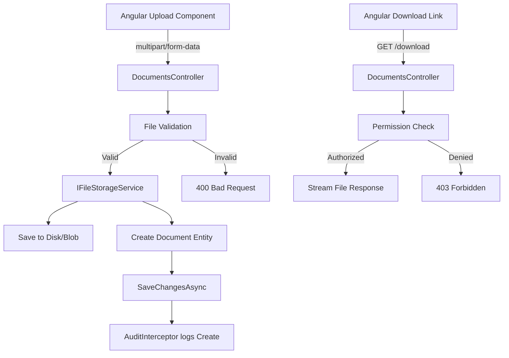

# Document Framework

> **Estimated Reading Time:** 10 minutes

## WHY

Property development generates a staggering volume of documents: title deeds, environmental reports, planning drawings, contracts, insurance certificates, compliance evidence, and more. Without a structured document management system:

- Documents get lost or misfiled, delaying critical business decisions
- Version confusion leads to teams working from outdated information
- Regulatory audits fail because evidence cannot be produced on demand
- Document access cannot be controlled, risking data protection violations

BuildEstate Pro's document framework provides upload, storage, retrieval, and lifecycle management for all documents attached to any business entity. It integrates with the audit framework (every upload/delete is logged) and the security framework (file access respects RBAC).

---

## WHAT

The document framework is a **file-attached-to-entity** system consisting of:

1. **Document Entity** — Metadata record stored in SQL Server (filename, type, size, uploader, entity association)
2. **File Storage Service** — Abstraction layer for physical file persistence (local disk in dev, Azure Blob in production)
3. **Upload Controller** — Multipart form upload endpoint with validation (type, size)
4. **Download Controller** — Streaming download endpoint with permission checks
5. **Frontend Upload Component** — Reusable drag-and-drop upload UI



### Supported Document Types

| Category | Extensions | Max Size |
|----------|-----------|----------|
| Legal Documents | `.pdf`, `.docx` | 25 MB |
| Reports | `.pdf`, `.xlsx`, `.csv` | 25 MB |
| Images | `.jpg`, `.jpeg`, `.png` | 10 MB |
| Drawings | `.pdf`, `.dwg` | 50 MB |
| Certificates | `.pdf` | 10 MB |

---

## HOW

### Backend — Document Entity

```csharp
// File: src/BuildEstate.Domain/Entities/LandAcquisition/OpportunityDocument.cs

public class OpportunityDocument : BaseEntity
{
    public Guid OpportunityId { get; set; }
    public string FileName { get; set; } = string.Empty;
    public string OriginalFileName { get; set; } = string.Empty;
    public string ContentType { get; set; } = string.Empty;
    public long FileSize { get; set; }
    public DocumentType DocType { get; set; }
    public string? Description { get; set; }
    public string FilePath { get; set; } = string.Empty;

    // Navigation
    public LandOpportunity Opportunity { get; set; } = null!;
}
```

### Backend — Upload Endpoint

```csharp
// File: src/BuildEstate.API/Controllers/LandAcquisition/DocumentsController.cs

[HttpPost("upload")]
[Authorize(Roles = "SuperAdmin,AcquisitionManager,AdminSupport")]
[RequestSizeLimit(52_428_800)] // 50 MB
public async Task<IActionResult> Upload(
    Guid opportunityId,
    [FromForm] IFormFile file,
    [FromForm] string docType,
    [FromForm] string? description,
    CancellationToken cancellationToken)
{
    // Validate file
    if (file.Length == 0)
        return BadRequest(new { success = false, errors = new[] { "File is empty." } });

    var allowedTypes = new[] { ".pdf", ".docx", ".xlsx", ".jpg", ".jpeg", ".png", ".csv" };
    var extension = Path.GetExtension(file.FileName).ToLowerInvariant();

    if (!allowedTypes.Contains(extension))
        return BadRequest(new { success = false, errors = new[] { $"File type '{extension}' is not allowed." } });

    // Save file
    var savedPath = await _fileStorageService.SaveAsync(file, cancellationToken);

    // Create document record
    var command = new CreateDocumentCommand
    {
        OpportunityId = opportunityId,
        FileName = Path.GetFileName(savedPath),
        OriginalFileName = file.FileName,
        ContentType = file.ContentType,
        FileSize = file.Length,
        DocType = Enum.Parse<DocumentType>(docType),
        Description = description,
        FilePath = savedPath
    };

    var result = await _mediator.Send(command, cancellationToken);
    return CreatedAtAction(nameof(Download), new { id = result.Id }, result);
}
```

### Backend — Download Endpoint

```csharp
// File: src/BuildEstate.API/Controllers/LandAcquisition/DocumentsController.cs

[HttpGet("{documentId:guid}/download")]
[Authorize]
public async Task<IActionResult> Download(
    Guid opportunityId,
    Guid documentId,
    CancellationToken cancellationToken)
{
    var document = await _context.OpportunityDocuments
        .AsNoTracking()
        .FirstOrDefaultAsync(d => d.Id == documentId && d.OpportunityId == opportunityId,
            cancellationToken);

    if (document is null)
        return NotFound();

    var stream = await _fileStorageService.GetAsync(document.FilePath, cancellationToken);
    return File(stream, document.ContentType, document.OriginalFileName);
}
```

### Frontend — Upload Component

```typescript
// File: client-app/src/app/shared/design-system/uploads/file-upload/file-upload.component.ts

@Component({
  selector: 'app-file-upload',
  standalone: true,
  changeDetection: ChangeDetectionStrategy.OnPush,
  template: `
    <div class="border-2 border-dashed border-base-300 rounded-lg p-6 text-center
                hover:border-primary transition-colors cursor-pointer"
         (drop)="onDrop($event)"
         (dragover)="onDragOver($event)"
         (click)="fileInput.click()">
      <span class="material-symbols-outlined text-4xl text-base-content/50">cloud_upload</span>
      <p class="mt-2 text-sm text-base-content/70">
        Drag & drop files here, or <span class="text-primary font-medium">browse</span>
      </p>
      <p class="text-xs text-base-content/50 mt-1">{{ acceptedTypesLabel }}</p>
      <input #fileInput type="file" class="hidden" [accept]="accept" (change)="onFileSelected($event)" />
    </div>
  `
})
export class FileUploadComponent {
  @Input() accept = '.pdf,.docx,.xlsx,.jpg,.jpeg,.png';
  @Input() maxSizeMb = 25;
  @Output() fileSelected = new EventEmitter<File>();

  get acceptedTypesLabel(): string {
    return `Max ${this.maxSizeMb}MB. Accepted: ${this.accept}`;
  }

  onFileSelected(event: Event): void { /* ... */ }
  onDrop(event: DragEvent): void { /* ... */ }
  onDragOver(event: DragEvent): void { event.preventDefault(); }
}
```

---

## WHEN

| Scenario | What to Do |
|----------|-----------|
| New module needs file uploads | Reuse `<app-file-upload>` component; create a module-specific Documents controller |
| New document type needed | Add value to `DocumentType` enum; update allowed extensions list in controller |
| Need version control | Store multiple documents with same `DocType` and reference original via `ReplacesDocumentId` |
| Need bulk download | Create a ZIP endpoint that streams multiple files (planned, not yet implemented) |

---

## WHERE

### Codebase Location

| Component | File Path |
|-----------|-----------|
| OpportunityDocument Entity | `src/BuildEstate.Domain/Entities/LandAcquisition/OpportunityDocument.cs` |
| DocumentType Enum | `src/BuildEstate.Domain/Enums/DocumentType.cs` |
| DocumentsController | `src/BuildEstate.API/Controllers/LandAcquisition/DocumentsController.cs` |
| IFileStorageService | `src/BuildEstate.Application/Interfaces/IFileStorageService.cs` |
| LocalFileStorageService | `src/BuildEstate.Infrastructure/Services/LocalFileStorageService.cs` |
| FileUploadComponent | `client-app/src/app/shared/design-system/uploads/file-upload/file-upload.component.ts` |
| DocumentService (frontend) | `client-app/src/app/features/land-acquisition/services/document.service.ts` |

---

## WHO

| Role | Responsibility |
|------|---------------|
| **Backend Developer** | Create document controllers for new modules; implement storage abstraction |
| **Frontend Developer** | Use `<app-file-upload>` component; build document list and download UI |
| **AcquisitionManager** | Upload and manage opportunity documents |
| **AdminSupport** | Delete documents when required |
| **SuperAdmin** | Full document access across all modules |

---

## WHAT NEXT

1. Read [16-state-machines.md](./16-state-machines.md) — Document uploads often trigger state transitions
2. Read [14-audit-framework.md](./14-audit-framework.md) — Every document upload/delete is audited
3. Read [11-security-framework.md](./11-security-framework.md) — File access is permission-controlled
4. Read [18-reusable-components.md](./18-reusable-components.md) — The `<app-file-upload>` component details

---

## Integration Steps

### Step 1: Create Domain Entity

Create a document entity for your module that extends `BaseEntity` with file metadata fields (FileName, ContentType, FileSize, FilePath, DocType).

### Step 2: Create EF Configuration

Map the entity to a table with appropriate indexes on the parent entity FK.

### Step 3: Create Controller

Create a controller with `Upload` (POST multipart) and `Download` (GET streaming) actions. Apply role-based authorization.

### Step 4: Reuse Frontend Component

Use `<app-file-upload>` in your detail page. Wire the `(fileSelected)` output to your service's upload method.

### Step 5: Display Document List

Show uploaded documents in a table with columns: Name, Type, Size, Uploaded By, Date, Actions (Download, Delete).

---

## Common Mistakes

### Mistake 1: Not Validating File Type Server-Side

Client-side validation is easily bypassed. Always validate file extension and content type on the server.

```csharp
// ❌ WRONG — trusting client-side validation only
[HttpPost("upload")]
public async Task<IActionResult> Upload(IFormFile file) { /* no validation */ }

// ✅ CORRECT — server-side validation
var extension = Path.GetExtension(file.FileName).ToLowerInvariant();
if (!allowedTypes.Contains(extension))
    return BadRequest(new { errors = new[] { $"Type '{extension}' not allowed." } });
```

### Mistake 2: Storing Files in the Database

Binary file data should never be stored in SQL Server columns. Use file system or blob storage; store only the path reference in the database.

```csharp
// ❌ WRONG — storing binary in DB
public byte[] FileContent { get; set; }

// ✅ CORRECT — store path reference
public string FilePath { get; set; } = string.Empty;
```

### Mistake 3: Exposing Internal File Paths to Clients

Never return the server-side file path in API responses. Return only the document ID and use the download endpoint.

```csharp
// ❌ WRONG — leaks server path
return Ok(new { filePath = "/uploads/docs/abc123.pdf" });

// ✅ CORRECT — return document ID for download endpoint
return Ok(new { id = document.Id, downloadUrl = $"/api/v1/.../documents/{document.Id}/download" });
```
