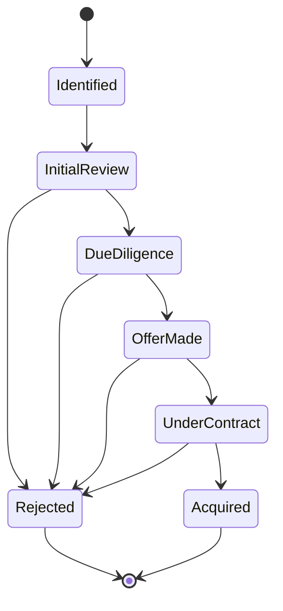
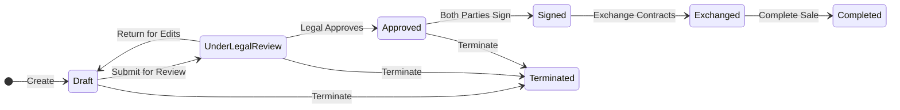

# State Machines

> **Estimated Reading Time:** 14 minutes

## WHY

In property development, business entities move through well-defined lifecycle stages. A land opportunity progresses from "Identified" through "Due Diligence" to "Acquired." An offer moves from "Under Review" to "Accepted" or "Rejected." These transitions are not arbitrary — specific business rules govern which transitions are valid.

Without state machine enforcement:

- Users could skip mandatory stages (e.g., marking an opportunity as "Acquired" without completing due diligence)
- Invalid data could corrupt the business workflow (e.g., accepting an already-rejected offer)
- Audit trails become meaningless if any status can be set at any time
- Multiple users could trigger conflicting transitions simultaneously

BuildEstate Pro implements state machines as dedicated domain services that validate every status transition before it is persisted.

---

## WHAT

A state machine in BuildEstate Pro is an **interface + implementation pair** that defines:

1. The set of valid states (modelled as a C# enum)
2. The allowed transitions between states (a dictionary mapping current state → list of valid target states)
3. A validation method that throws `InvalidStateTransitionException` when an illegal transition is attempted



### Implemented State Machines

| Entity | Interface | States | Key Transitions |
|--------|-----------|--------|-----------------|
| LandOpportunity | `IOpportunityStateMachine` | Identified, InitialReview, DueDiligence, OfferMade, UnderContract, Acquired, Rejected | Forward progression + Reject from any |
| Offer | `IOfferStateMachine` | UnderReview, Accepted, Rejected, CounterOffered, Withdrawn | Accept/Reject/Counter from UnderReview |
| DueDiligence | `IDueDiligenceStateMachine` | Pending, InProgress, Completed, Failed | Linear with fail branch |
| Contract | `IContractStateMachine` | Draft, UnderLegalReview, Approved, Signed, Exchanged, Completed, Terminated | Linear with termination |
| PlanningApplication | `IPlanningStatusStateMachine` | PreApplication, Submitted, Validated, UnderReview, CommitteeReview, Approved, ApprovedWithConditions, Refused, Appeal, Withdrawn | Complex branching |
| LegalCase | `ILegalCaseStateMachine` | Open, UnderReview, AwaitingDocuments, InProgress, Resolved, Closed, Escalated | Multi-path resolution |

---

## HOW

### Interface Definition (Domain Layer)

```csharp
// File: src/BuildEstate.Domain/Services/IOpportunityStateMachine.cs

public interface IOpportunityStateMachine
{
    bool CanTransition(OpportunityStatus currentStatus, OpportunityStatus targetStatus);
    void ValidateTransition(OpportunityStatus currentStatus, OpportunityStatus targetStatus);
    IReadOnlyList<OpportunityStatus> GetAllowedTransitions(OpportunityStatus currentStatus);
}
```

### Implementation (Infrastructure Layer)

```csharp
// File: src/BuildEstate.Infrastructure/Services/StateMachines/OpportunityStateMachine.cs

public sealed class OpportunityStateMachine : IOpportunityStateMachine
{
    private static readonly Dictionary<OpportunityStatus, List<OpportunityStatus>> _transitions = new()
    {
        [OpportunityStatus.Identified] = new() { OpportunityStatus.InitialReview, OpportunityStatus.Rejected },
        [OpportunityStatus.InitialReview] = new() { OpportunityStatus.DueDiligence, OpportunityStatus.Rejected },
        [OpportunityStatus.DueDiligence] = new() { OpportunityStatus.OfferMade, OpportunityStatus.Rejected },
        [OpportunityStatus.OfferMade] = new() { OpportunityStatus.UnderContract, OpportunityStatus.Rejected },
        [OpportunityStatus.UnderContract] = new() { OpportunityStatus.Acquired, OpportunityStatus.Rejected },
        [OpportunityStatus.Acquired] = new(),
        [OpportunityStatus.Rejected] = new()
    };

    public bool CanTransition(OpportunityStatus currentStatus, OpportunityStatus targetStatus)
    {
        return _transitions.TryGetValue(currentStatus, out var allowed) && allowed.Contains(targetStatus);
    }

    public void ValidateTransition(OpportunityStatus currentStatus, OpportunityStatus targetStatus)
    {
        if (!CanTransition(currentStatus, targetStatus))
        {
            throw new InvalidStateTransitionException(
                $"Cannot transition opportunity from '{currentStatus}' to '{targetStatus}'. " +
                $"Allowed transitions: {string.Join(", ", GetAllowedTransitions(currentStatus))}");
        }
    }

    public IReadOnlyList<OpportunityStatus> GetAllowedTransitions(OpportunityStatus currentStatus)
    {
        return _transitions.TryGetValue(currentStatus, out var allowed)
            ? allowed.AsReadOnly()
            : Array.Empty<OpportunityStatus>().ToList().AsReadOnly();
    }
}
```

### Usage in Command Handler

```csharp
// File: src/BuildEstate.Application/Features/LandAcquisition/Opportunities/Commands/TransitionStatus/TransitionOpportunityStatusCommandHandler.cs

public async Task<OpportunityDto> Handle(
    TransitionOpportunityStatusCommand request,
    CancellationToken cancellationToken)
{
    var opportunity = await _context.LandOpportunities
        .FirstOrDefaultAsync(o => o.Id == request.OpportunityId, cancellationToken)
        ?? throw new EntityNotFoundException("LandOpportunity", request.OpportunityId);

    // Validate transition using state machine
    _stateMachine.ValidateTransition(opportunity.Status, request.TargetStatus);

    // Apply transition
    opportunity.Status = request.TargetStatus;
    await _context.SaveChangesAsync(cancellationToken);

    return _mapper.Map<OpportunityDto>(opportunity);
}
```

### Frontend — Getting Allowed Transitions

The frontend queries allowed transitions to render only valid action buttons:

```typescript
// File: client-app/src/app/features/land-acquisition/services/opportunity.service.ts

getAllowedTransitions(opportunityId: string): Observable<IApiResponse<string[]>> {
  return this.http.get<IApiResponse<string[]>>(
    `${this.baseUrl}/${opportunityId}/allowed-transitions`
  );
}
```



---

## WHEN

| Scenario | Action |
|----------|--------|
| Adding a new entity with lifecycle stages | Create an interface in Domain/Services, implementation in Infrastructure/Services/StateMachines |
| Adding a new status to existing entity | Update the enum AND the transition dictionary |
| Need to allow a previously blocked transition | Add the target status to the source's allowed list |
| Frontend needs to show valid actions | Call the `allowed-transitions` endpoint |
| Testing state machines | Write unit tests for every valid and invalid transition |

---

## WHERE

### Codebase Location

| Component | File Path |
|-----------|-----------|
| IOpportunityStateMachine | `src/BuildEstate.Domain/Services/IOpportunityStateMachine.cs` |
| IOfferStateMachine | `src/BuildEstate.Domain/Services/IOfferStateMachine.cs` |
| IDueDiligenceStateMachine | `src/BuildEstate.Domain/Services/IDueDiligenceStateMachine.cs` |
| IContractStateMachine | `src/BuildEstate.Domain/Services/IContractStateMachine.cs` |
| IPlanningStatusStateMachine | `src/BuildEstate.Domain/Services/IPlanningStatusStateMachine.cs` |
| ILegalCaseStateMachine | `src/BuildEstate.Domain/Services/ILegalCaseStateMachine.cs` |
| OpportunityStateMachine impl | `src/BuildEstate.Infrastructure/Services/StateMachines/OpportunityStateMachine.cs` |
| InvalidStateTransitionException | `src/BuildEstate.Domain/Exceptions/InvalidStateTransitionException.cs` |
| OpportunityStatus Enum | `src/BuildEstate.Domain/Enums/OpportunityStatus.cs` |
| OfferStatus Enum | `src/BuildEstate.Domain/Enums/OfferStatus.cs` |
| ContractStatus Enum | `src/BuildEstate.Domain/Enums/ContractStatus.cs` |
| DueDiligenceStatus Enum | `src/BuildEstate.Domain/Enums/DueDiligenceStatus.cs` |

---

## WHO

| Role | Responsibility |
|------|---------------|
| **Domain Architect** | Define state machine interfaces and valid transitions |
| **Backend Developer** | Implement state machines; use in command handlers |
| **Frontend Developer** | Query allowed transitions; render valid action buttons only |
| **QA/Tester** | Test every valid and invalid transition path |

---

## WHAT NEXT

1. Read [17-error-handling-framework.md](./17-error-handling-framework.md) — `InvalidStateTransitionException` is caught by the global exception handler
2. Read [20-land-acquisition-deep-dive.md](./20-land-acquisition-deep-dive.md) — See state machines in action across the full module
3. Read [08-cqrs-and-mediatr.md](./08-cqrs-and-mediatr.md) — Command handlers are where transitions are validated
4. Read [14-audit-framework.md](./14-audit-framework.md) — Every status transition is recorded in the audit trail

---

## Integration Steps

### Step 1: Define the Enum

Create a status enum in `src/BuildEstate.Domain/Enums/` with all valid states.

### Step 2: Create the Interface

Add `I{Entity}StateMachine` in `src/BuildEstate.Domain/Services/` with `CanTransition`, `ValidateTransition`, and `GetAllowedTransitions` methods.

### Step 3: Implement the State Machine

Create the implementation in `src/BuildEstate.Infrastructure/Services/StateMachines/` with the transition dictionary.

### Step 4: Register in DI

Add `services.AddSingleton<I{Entity}StateMachine, {Entity}StateMachine>();` in `DependencyInjection.cs`.

### Step 5: Use in Command Handler

Inject the state machine into your transition command handler. Call `ValidateTransition` before applying the status change.

### Step 6: Expose Allowed Transitions API

Create a `GET /{resource}/{id}/allowed-transitions` endpoint that returns the list of valid target states.

---

## Common Mistakes

### Mistake 1: Bypassing the State Machine

Never set status directly without validation.

```csharp
// ❌ WRONG — no validation
opportunity.Status = OpportunityStatus.Acquired;
await _context.SaveChangesAsync();

// ✅ CORRECT — validate first
_stateMachine.ValidateTransition(opportunity.Status, OpportunityStatus.Acquired);
opportunity.Status = OpportunityStatus.Acquired;
await _context.SaveChangesAsync();
```

### Mistake 2: Hardcoding Transitions in the Frontend

The frontend should never decide which transitions are valid. Always query the backend.

```typescript
// ❌ WRONG — hardcoded in frontend
const canAcquire = currentStatus === 'UnderContract';

// ✅ CORRECT — query backend
this.opportunityService.getAllowedTransitions(id).subscribe(result => {
  this.allowedTransitions = result.data;
});
```

### Mistake 3: Forgetting Terminal States

Terminal states (Acquired, Rejected, Completed) must have empty allowed-transition lists. If you forget, the entity can be transitioned after completion.

```csharp
// ❌ WRONG — missing terminal state definition
// (falls through to default behavior)

// ✅ CORRECT — explicit empty list
[OpportunityStatus.Acquired] = new(),
[OpportunityStatus.Rejected] = new()
```
