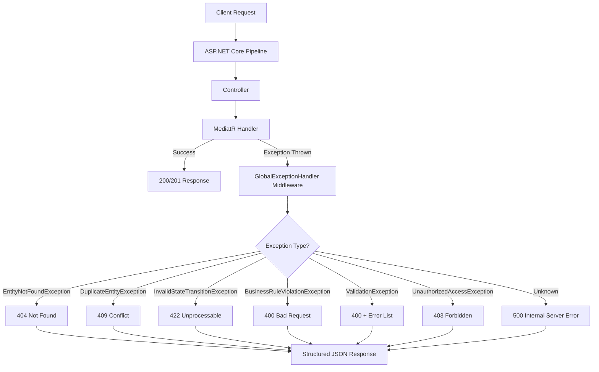

# Error Handling Framework

> **Estimated Reading Time:** 11 minutes

## WHY

Enterprise applications must handle errors gracefully across distributed layers — from database constraints through API boundaries to Angular components. Without a structured error handling strategy:

- Users see raw stack traces or cryptic HTTP 500 responses
- Developers cannot diagnose production issues because errors lack context
- Validation errors are inconsistently formatted across endpoints
- Domain exceptions (invalid state transitions, duplicate entities) produce generic error messages
- Frontend components crash or display blank screens on API failures

BuildEstate Pro's error handling framework provides a single global exception handler that intercepts all unhandled exceptions, classifies them by type, and returns structured, user-friendly error responses — while logging full diagnostic details server-side.

---

## WHAT

The framework consists of three layers:

1. **Backend Global Exception Handler** — ASP.NET Core middleware that catches all exceptions and maps them to appropriate HTTP status codes with structured error bodies
2. **Domain Exception Hierarchy** — Typed exceptions for common business scenarios (not found, duplicate, invalid transition, validation failure)
3. **Frontend HTTP Interceptor** — Angular interceptor that catches HTTP error responses and displays user-friendly toast notifications



### Structured Error Response Format

Every error response follows this consistent contract:

```json
{
  "success": false,
  "data": null,
  "errors": [
    "The opportunity 'Croydon Site' could not transition from 'Identified' to 'Acquired'."
  ],
  "statusCode": 422,
  "correlationId": "corr-abc123-def456"
}
```

---

## HOW

### Backend — Global Exception Handler Middleware

```csharp
// File: src/BuildEstate.API/Middleware/GlobalExceptionHandler.cs

public sealed class GlobalExceptionHandler : IExceptionHandler
{
    private readonly ILogger<GlobalExceptionHandler> _logger;

    public GlobalExceptionHandler(ILogger<GlobalExceptionHandler> logger)
    {
        _logger = logger;
    }

    public async ValueTask<bool> TryHandleAsync(
        HttpContext httpContext,
        Exception exception,
        CancellationToken cancellationToken)
    {
        var (statusCode, message) = exception switch
        {
            EntityNotFoundException ex => (StatusCodes.Status404NotFound, ex.Message),
            DuplicateEntityException ex => (StatusCodes.Status409Conflict, ex.Message),
            InvalidStateTransitionException ex => (StatusCodes.Status422UnprocessableEntity, ex.Message),
            BusinessRuleViolationException ex => (StatusCodes.Status400BadRequest, ex.Message),
            ApprovalRequiredException ex => (StatusCodes.Status403Forbidden, ex.Message),
            UnauthorizedAccessException => (StatusCodes.Status403Forbidden, "Access denied."),
            _ => (StatusCodes.Status500InternalServerError, "An unexpected error occurred.")
        };

        _logger.LogError(exception,
            "Unhandled exception {ExceptionType}: {Message}. CorrelationId: {CorrelationId}",
            exception.GetType().Name, exception.Message, GetCorrelationId(httpContext));

        httpContext.Response.StatusCode = statusCode;
        httpContext.Response.ContentType = "application/json";

        var response = new
        {
            success = false,
            data = (object?)null,
            errors = new[] { message },
            statusCode,
            correlationId = GetCorrelationId(httpContext)
        };

        await httpContext.Response.WriteAsJsonAsync(response, cancellationToken);
        return true;
    }

    private static string GetCorrelationId(HttpContext context)
    {
        return context.Request.Headers["X-Correlation-Id"].FirstOrDefault()
            ?? context.TraceIdentifier;
    }
}
```

### Domain Exceptions

```csharp
// File: src/BuildEstate.Domain/Exceptions/EntityNotFoundException.cs
public class EntityNotFoundException : DomainException
{
    public EntityNotFoundException(string entityName, object key)
        : base($"Entity '{entityName}' with key '{key}' was not found.") { }
}

// File: src/BuildEstate.Domain/Exceptions/InvalidStateTransitionException.cs
public class InvalidStateTransitionException : DomainException
{
    public InvalidStateTransitionException(string message) : base(message) { }
}

// File: src/BuildEstate.Domain/Exceptions/DuplicateEntityException.cs
public class DuplicateEntityException : DomainException
{
    public DuplicateEntityException(string entityName, string duplicateField, string value)
        : base($"A '{entityName}' with {duplicateField} '{value}' already exists.") { }
}
```

### Frontend — HTTP Error Interceptor

```typescript
// File: client-app/src/app/core/interceptors/error.interceptor.ts

export const errorInterceptor: HttpInterceptorFn = (req, next) => {
  const toastService = inject(ToastService);

  return next(req).pipe(
    catchError((error: HttpErrorResponse) => {
      let message = 'An unexpected error occurred.';

      if (error.error?.errors?.length > 0) {
        message = error.error.errors[0];
      }

      switch (error.status) {
        case 400:
          toastService.error(message);
          break;
        case 401:
          // Handled by auth interceptor (redirect to login)
          break;
        case 403:
          toastService.error('You do not have permission to perform this action.');
          break;
        case 404:
          toastService.error('The requested resource was not found.');
          break;
        case 409:
          toastService.warning('This record has been modified. Please refresh and try again.');
          break;
        case 422:
          toastService.error(message);
          break;
        default:
          toastService.error('Something went wrong. Please try again.');
      }

      return throwError(() => error);
    })
  );
};
```

### Validation Error Handling (FluentValidation Pipeline)

```csharp
// File: src/BuildEstate.Application/Behaviours/ValidationBehaviour.cs

public sealed class ValidationBehaviour<TRequest, TResponse>
    : IPipelineBehavior<TRequest, TResponse>
    where TRequest : IRequest<TResponse>
{
    private readonly IEnumerable<IValidator<TRequest>> _validators;

    public ValidationBehaviour(IEnumerable<IValidator<TRequest>> validators)
    {
        _validators = validators;
    }

    public async Task<TResponse> Handle(
        TRequest request,
        RequestHandlerDelegate<TResponse> next,
        CancellationToken cancellationToken)
    {
        if (!_validators.Any())
            return await next();

        var context = new ValidationContext<TRequest>(request);
        var results = await Task.WhenAll(
            _validators.Select(v => v.ValidateAsync(context, cancellationToken)));

        var failures = results
            .SelectMany(r => r.Errors)
            .Where(e => e != null)
            .ToList();

        if (failures.Count > 0)
            throw new ValidationException(failures);

        return await next();
    }
}
```

---

## WHEN

| Scenario | Exception to Use | HTTP Status |
|----------|------------------|-------------|
| Entity not found by ID | `EntityNotFoundException` | 404 |
| Duplicate entity (unique constraint) | `DuplicateEntityException` | 409 |
| Invalid state transition | `InvalidStateTransitionException` | 422 |
| Business rule violated | `BusinessRuleViolationException` | 400 |
| Approval required | `ApprovalRequiredException` | 403 |
| FluentValidation fails | `ValidationException` (auto via pipeline) | 400 |
| Optimistic concurrency conflict | `DbUpdateConcurrencyException` | 409 |
| Unexpected/unhandled | Any other exception | 500 |

---

## WHERE

### Codebase Location

| Component | File Path |
|-----------|-----------|
| GlobalExceptionHandler | `src/BuildEstate.API/Middleware/GlobalExceptionHandler.cs` |
| DomainException (base) | `src/BuildEstate.Domain/Exceptions/DomainException.cs` |
| EntityNotFoundException | `src/BuildEstate.Domain/Exceptions/EntityNotFoundException.cs` |
| InvalidStateTransitionException | `src/BuildEstate.Domain/Exceptions/InvalidStateTransitionException.cs` |
| DuplicateEntityException | `src/BuildEstate.Domain/Exceptions/DuplicateEntityException.cs` |
| BusinessRuleViolationException | `src/BuildEstate.Domain/Exceptions/BusinessRuleViolationException.cs` |
| ApprovalRequiredException | `src/BuildEstate.Domain/Exceptions/ApprovalRequiredException.cs` |
| ValidationBehaviour | `src/BuildEstate.Application/Behaviours/ValidationBehaviour.cs` |
| Frontend Error Interceptor | `client-app/src/app/core/interceptors/error.interceptor.ts` |
| ToastService | `client-app/src/app/core/services/toast.service.ts` |

---

## WHO

| Role | Responsibility |
|------|---------------|
| **Backend Developer** | Throw typed domain exceptions; never catch and swallow |
| **Frontend Developer** | Handle errors via interceptor; show user-friendly messages |
| **Support Team** | Use correlation IDs to trace errors in logs |
| **Architect** | Maintain exception hierarchy; review new exception types |

---

## WHAT NEXT

1. Read [14-audit-framework.md](./14-audit-framework.md) — Correlation IDs link audit entries to error logs
2. Read [16-state-machines.md](./16-state-machines.md) — `InvalidStateTransitionException` originates from state machines
3. Read [08-cqrs-and-mediatr.md](./08-cqrs-and-mediatr.md) — ValidationBehaviour runs in the MediatR pipeline
4. Read [28-debugging-guide.md](./28-debugging-guide.md) — Diagnosing errors layer by layer

---

## Integration Steps

### Step 1: Use Typed Exceptions in Handlers

Always throw the most specific domain exception. Never throw generic `Exception`.

### Step 2: Let Exceptions Propagate

Do not catch domain exceptions in controllers. The middleware handles them.

### Step 3: Include Context in Exception Messages

```csharp
throw new EntityNotFoundException("LandOpportunity", opportunityId);
// Produces: "Entity 'LandOpportunity' with key 'abc-123' was not found."
```

### Step 4: Frontend Error States

Every page that loads data should handle loading/error/empty states using the design system components.

---

## Common Mistakes

### Mistake 1: Catching Exceptions in Controllers

The global handler exists precisely so controllers don't need try/catch.

```csharp
// ❌ WRONG — redundant catch in controller
[HttpGet("{id}")]
public async Task<IActionResult> GetById(Guid id)
{
    try { var result = await _mediator.Send(new GetByIdQuery(id)); return Ok(result); }
    catch (Exception ex) { return StatusCode(500, ex.Message); }
}

// ✅ CORRECT — let middleware handle it
[HttpGet("{id}")]
public async Task<IActionResult> GetById(Guid id, CancellationToken ct)
{
    var result = await _mediator.Send(new GetByIdQuery(id), ct);
    return Ok(result);
}
```

### Mistake 2: Throwing Generic Exception

Generic exceptions produce HTTP 500 and leak no useful information.

```csharp
// ❌ WRONG
throw new Exception("Not found");

// ✅ CORRECT
throw new EntityNotFoundException("LandOpportunity", id);
```

### Mistake 3: Exposing Stack Traces to Clients

The middleware deliberately hides implementation details for non-domain exceptions. Never override this behaviour in production.

```csharp
// ❌ WRONG — leaks internal details
return StatusCode(500, new { error = ex.StackTrace });

// ✅ CORRECT — generic message + server-side logging
// (Handled automatically by GlobalExceptionHandler)
```
