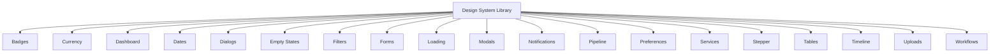

# Reusable Components

> **Estimated Reading Time:** 15 minutes

## WHY

BuildEstate Pro consists of 14 modules that share common UI patterns: data tables, status badges, modal dialogs, file uploads, form inputs, dashboards, and loading states. Without a shared component library:

- Each module re-implements the same patterns with subtle inconsistencies
- Bug fixes must be applied in multiple places
- Visual consistency degrades as the platform grows
- New module development takes longer because nothing is reusable
- Accessibility compliance becomes impossible to maintain across duplicated code

The Design System component library provides a single source of truth for all shared UI patterns, ensuring consistency, accessibility, and maintainability across the entire platform.

---

## WHAT

The component library lives at `client-app/src/app/shared/design-system/` and is organized by category. Every component uses:

- `standalone: true`
- `ChangeDetectionStrategy.OnPush`
- DaisyUI theme tokens (no hardcoded colours)
- WCAG 2.1 AA accessibility compliance
- Responsive design (desktop through mobile)



### Component Summary Table

| Category | Components | Purpose |
|----------|-----------|---------|
| **Badges** | StatusBadge, PriorityBadge, RiskBadge, StageBadge | Colour-coded status indicators |
| **Currency** | CurrencyDisplay, CurrencyInput | Formatted monetary values |
| **Dashboard** | KpiCard, MetricCard, ChartCard | Dashboard widget containers |
| **Dates** | DateDisplay, DatePicker, DateRangePicker | Date formatting and selection |
| **Dialogs** | ConfirmDialog, ConfirmDialogService | Confirmation prompts |
| **Empty States** | EmptyState | Guidance when no data exists |
| **Filters** | FilterBar, FilterChips | Search and filter controls |
| **Forms** | TextInput, Select, TextArea, Checkbox | Form field wrappers with validation |
| **Loading** | LoadingSpinner, LoadingOverlay, Skeleton | Loading state indicators |
| **Modals** | Modal, ModalService | Dialog containers |
| **Pipeline** | PipelineBoard, PipelineColumn | Kanban-style workflow boards |
| **Preferences** | ThemeSelector, FontScaleSelector | User display preferences |
| **Services** | ConfirmDialogService, ToastService | Programmatic UI services |
| **Stepper** | Stepper, StepperStep | Multi-step form wizard |
| **Tables** | DataTable | Sortable, filterable, paginated data grid |
| **Timeline** | ActivityTimeline | Chronological event display |
| **Uploads** | FileUpload | Drag-and-drop file upload |
| **Workflows** | WorkflowProgress | Status progression indicator |

---

## HOW

### Using a Component — Example: Status Badge

```typescript
// In your feature component template:
import { StatusBadgeComponent } from '@shared/design-system';

@Component({
  imports: [StatusBadgeComponent],
  template: `
    <app-status-badge
      [status]="opportunity.status"
      [category]="'opportunity'"
    />
  `
})
```

### Using a Component — Example: Data Table

```typescript
import { DataTableComponent } from '@shared/design-system';

@Component({
  imports: [DataTableComponent],
  template: `
    <app-data-table
      [columns]="columns"
      [data]="opportunities"
      [loading]="isLoading"
      [totalCount]="totalCount"
      [pageSize]="pageSize"
      [currentPage]="currentPage"
      (pageChange)="onPageChange($event)"
      (sortChange)="onSortChange($event)"
      (rowClick)="onRowClick($event)"
    />
  `
})
export class OpportunityListComponent {
  columns: ITableColumn[] = [
    { key: 'name', label: 'Name', sortable: true },
    { key: 'location', label: 'Location', sortable: true },
    { key: 'status', label: 'Status', sortable: true, type: 'badge' },
    { key: 'createdAt', label: 'Created', sortable: true, type: 'date' }
  ];
}
```

### Using a Component — Example: Confirm Dialog

```typescript
import { ConfirmDialogService } from '@shared/design-system';

@Component({ /* ... */ })
export class OpportunityDetailComponent {
  private confirmService = inject(ConfirmDialogService);

  async onDelete(): Promise<void> {
    const confirmed = await this.confirmService.confirm({
      title: 'Delete Opportunity',
      message: 'Are you sure you want to delete this opportunity? This action cannot be undone.',
      confirmText: 'Delete',
      cancelText: 'Cancel',
      variant: 'error'
    });

    if (confirmed) {
      this.store.dispatch(OpportunityActions.deleteOpportunity({ id: this.opportunityId }));
    }
  }
}
```

### Using a Component — Example: Empty State

```typescript
import { EmptyStateComponent } from '@shared/design-system';

@Component({
  imports: [EmptyStateComponent],
  template: `
    @if (opportunities.length === 0 && !isLoading) {
      <app-empty-state
        icon="landscape"
        title="No Opportunities Found"
        description="Create your first land opportunity to begin evaluating development sites."
        actionLabel="Create Opportunity"
        (actionClick)="onCreate()"
      />
    }
  `
})
```

---

## WHEN

| Scenario | What to Use |
|----------|-------------|
| Display entity status | `<app-status-badge>` |
| Show tabular data with sort/filter/page | `<app-data-table>` |
| Ask user to confirm destructive action | `ConfirmDialogService` |
| No data to display | `<app-empty-state>` |
| Data loading | `<app-loading-spinner>` or `<app-loading-overlay>` |
| File upload | `<app-file-upload>` |
| Multi-step form | `<app-stepper>` |
| Dashboard KPIs | `<app-kpi-card>` |
| Activity history | `<app-activity-timeline>` |
| Modal dialog | `<app-modal>` or `ModalService` |

---

## WHERE

### Codebase Location

| Category | Directory |
|----------|-----------|
| All components | `client-app/src/app/shared/design-system/` |
| Barrel export | `client-app/src/app/shared/design-system/index.ts` |
| Tokens CSS | `client-app/src/app/shared/design-system/design-system-tokens.css` |
| Badges | `client-app/src/app/shared/design-system/badges/` |
| Tables | `client-app/src/app/shared/design-system/tables/` |
| Forms | `client-app/src/app/shared/design-system/forms/` |
| Modals | `client-app/src/app/shared/design-system/modals/` |
| Dialogs | `client-app/src/app/shared/design-system/dialogs/` |
| Loading | `client-app/src/app/shared/design-system/loading/` |
| Uploads | `client-app/src/app/shared/design-system/uploads/` |
| Timeline | `client-app/src/app/shared/design-system/timeline/` |
| Pipeline | `client-app/src/app/shared/design-system/pipeline/` |
| Dashboard | `client-app/src/app/shared/design-system/dashboard/` |

---

## WHO

| Role | Responsibility |
|------|---------------|
| **Design System Architect** | Create and maintain shared components |
| **Feature Developer** | Consume shared components; never duplicate |
| **Code Reviewer** | Verify shared components are used; reject duplication |
| **Accessibility Auditor** | Verify all components meet WCAG 2.1 AA |

---

## WHAT NEXT

1. Read [19-module-pattern.md](./19-module-pattern.md) — How modules consume these components
2. Read [09-ngrx-and-state-management.md](./09-ngrx-and-state-management.md) — Components connect to the store via container components
3. Read [20-land-acquisition-deep-dive.md](./20-land-acquisition-deep-dive.md) — See components in real usage
4. Review `client-app/src/app/shared/design-system/index.ts` — Full export list

---

## Integration Steps

### Step 1: Import from Barrel Export

```typescript
import { StatusBadgeComponent, DataTableComponent, EmptyStateComponent } from '@shared/design-system';
```

### Step 2: Add to Component Imports Array

```typescript
@Component({
  standalone: true,
  imports: [StatusBadgeComponent, DataTableComponent, EmptyStateComponent]
})
```

### Step 3: Use in Template

Follow the input/output contract documented above for each component.

### Step 4: If a Component Doesn't Exist

1. Check if an existing component can be extended with a new `@Input()`
2. If not, create it in `shared/design-system/{category}/`
3. Add to barrel export
4. Document in component catalog

---

## Common Mistakes

### Mistake 1: Duplicating Shared Components in Feature Modules

```typescript
// ❌ WRONG — creating a feature-specific status badge
@Component({ selector: 'app-opportunity-status-badge' })
export class OpportunityStatusBadgeComponent { /* duplicates logic */ }

// ✅ CORRECT — use the shared one with category input
<app-status-badge [status]="status" [category]="'opportunity'" />
```

### Mistake 2: Hardcoding Colours

```html
<!-- ❌ WRONG — hardcoded colour -->
<span class="text-green-500">Active</span>

<!-- ✅ CORRECT — DaisyUI theme token -->
<span class="badge badge-success">Active</span>
```

### Mistake 3: Not Using OnPush Change Detection

Every shared component MUST use OnPush. If your component works with Default but breaks with OnPush, it has a reactivity bug.

```typescript
// ❌ WRONG — default change detection
@Component({ changeDetection: ChangeDetectionStrategy.Default })

// ✅ CORRECT — OnPush
@Component({ changeDetection: ChangeDetectionStrategy.OnPush })
```
