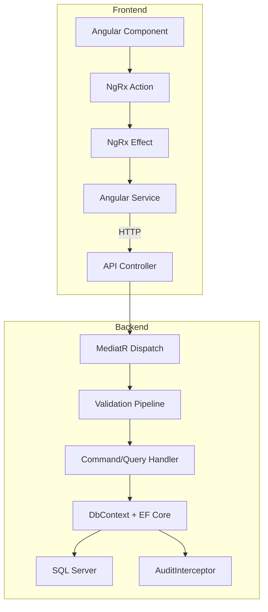
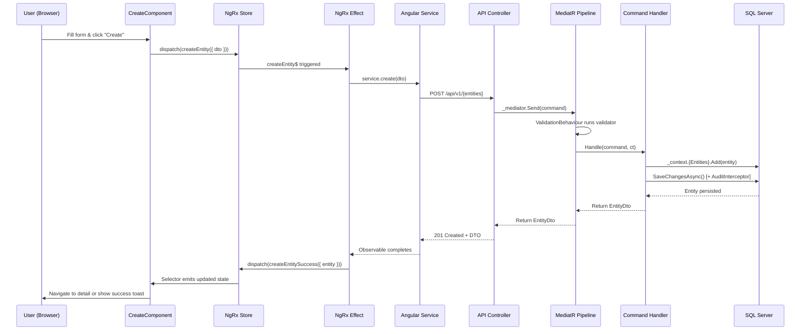

# Module Implementation Pattern

> **Estimated Reading Time:** 16 minutes

## WHY

BuildEstate Pro will grow to 14+ modules. Without a standardized implementation pattern, each module would follow different conventions, making the codebase inconsistent, harder to maintain, and expensive to extend. A consistent pattern means:

- New developers learn one pattern and apply it everywhere
- Code reviews are faster because structure is predictable
- Modules can be built in parallel by different teams
- Cross-cutting concerns (audit, search, notifications) integrate uniformly

---

## WHAT

Every module in BuildEstate Pro follows a full-stack pattern spanning four backend layers and a feature-based frontend structure. This document provides the canonical folder structure and traces a complete operation from Angular component through the entire stack.



---

## HOW

### Backend Folder Structure (3 Levels Deep)

```
src/
├── BuildEstate.Domain/
│   ├── Common/
│   │   ├── BaseEntity.cs
│   │   ├── IAuditableEntity.cs
│   │   └── IRepository.cs
│   ├── Entities/
│   │   └── {Module}/
│   │       ├── {Entity}.cs
│   │       └── {RelatedEntity}.cs
│   ├── Enums/
│   │   ├── {Entity}Status.cs
│   │   └── {Entity}Type.cs
│   ├── Exceptions/
│   │   └── {DomainException}.cs
│   └── Services/
│       └── I{Entity}StateMachine.cs
│
├── BuildEstate.Application/
│   ├── Features/
│   │   └── {Module}/
│   │       └── {Entity}/
│   │           ├── Commands/
│   │           │   ├── Create{Entity}/
│   │           │   │   ├── Create{Entity}Command.cs
│   │           │   │   ├── Create{Entity}CommandHandler.cs
│   │           │   │   └── Create{Entity}CommandValidator.cs
│   │           │   └── Update{Entity}/
│   │           │       ├── Update{Entity}Command.cs
│   │           │       ├── Update{Entity}CommandHandler.cs
│   │           │       └── Update{Entity}CommandValidator.cs
│   │           ├── Queries/
│   │           │   ├── Get{Entity}ById/
│   │           │   │   ├── Get{Entity}ByIdQuery.cs
│   │           │   │   └── Get{Entity}ByIdQueryHandler.cs
│   │           │   └── Get{Entities}/
│   │           │       ├── Get{Entities}Query.cs
│   │           │       └── Get{Entities}QueryHandler.cs
│   │           └── DTOs/
│   │               ├── {Entity}Dto.cs
│   │               ├── {Entity}DetailDto.cs
│   │               └── {Entity}ListItemDto.cs
│   ├── Behaviours/
│   │   └── ValidationBehaviour.cs
│   └── Interfaces/
│       └── I{Service}.cs
│
├── BuildEstate.Infrastructure/
│   ├── Persistence/
│   │   ├── Configurations/
│   │   │   └── {Entity}Configuration.cs
│   │   ├── Interceptors/
│   │   │   └── AuditInterceptor.cs
│   │   └── BuildEstateDbContext.cs
│   ├── Services/
│   │   └── StateMachines/
│   │       └── {Entity}StateMachine.cs
│   └── DependencyInjection.cs
│
└── BuildEstate.API/
    ├── Controllers/
    │   └── {Module}/
    │       └── {Entities}Controller.cs
    └── Middleware/
        └── GlobalExceptionHandler.cs
```

### Frontend Folder Structure (3 Levels Deep)

```
client-app/src/app/features/{module}/
├── pages/
│   ├── dashboard/
│   │   └── {module}-dashboard.component.ts
│   ├── list/
│   │   └── {entity}-list.component.ts
│   ├── detail/
│   │   └── {entity}-detail.component.ts
│   ├── create/
│   │   └── {entity}-create.component.ts
│   └── edit/
│       └── {entity}-edit.component.ts
├── components/
│   ├── {entity}-card/
│   │   └── {entity}-card.component.ts
│   └── {entity}-filters/
│       └── {entity}-filters.component.ts
├── services/
│   └── {entity}.service.ts
├── store/
│   ├── {entity}.actions.ts
│   ├── {entity}.reducer.ts
│   ├── {entity}.effects.ts
│   ├── {entity}.selectors.ts
│   └── {entity}.state.ts
├── models/
│   ├── {entity}.model.ts
│   └── {entity}-enums.ts
└── {module}.routes.ts
```

### Full Stack Trace — Create Operation (8 Steps)



### Full Stack Trace — Read/List Operation (7 Steps)

1. **Component** dispatches `loadEntities` action on init
2. **Effect** catches the action, calls the Angular service
3. **Service** sends `GET /api/v1/{entities}?page=1&pageSize=25`
4. **Controller** dispatches `GetEntitiesQuery` via MediatR
5. **Handler** queries EF Core with `.AsNoTracking()`, pagination, filtering, sorting
6. **Handler** returns paginated DTO list
7. **Effect** dispatches `loadEntitiesSuccess` → **Reducer** updates state → **Selector** emits to component

---

## WHEN

Use this pattern for every new module. The pattern applies whether you're building:

- Land Acquisition (already implemented — reference module)
- Planning & Approvals (implemented)
- Legal & Compliance (implemented)
- User Management (implemented)
- Any future module (Project Management, Construction, Finance, etc.)

---

## WHERE

### Codebase Location

| Pattern Element | Backend Location | Frontend Location |
|----------------|-----------------|-------------------|
| Domain Entity | `src/BuildEstate.Domain/Entities/{Module}/` | N/A |
| Status Enum | `src/BuildEstate.Domain/Enums/` | `features/{module}/models/{entity}-enums.ts` |
| State Machine | `src/BuildEstate.Domain/Services/` + `Infrastructure/Services/StateMachines/` | N/A |
| Commands | `src/BuildEstate.Application/Features/{Module}/{Entity}/Commands/` | N/A |
| Queries | `src/BuildEstate.Application/Features/{Module}/{Entity}/Queries/` | N/A |
| DTOs | `src/BuildEstate.Application/Features/{Module}/{Entity}/DTOs/` | `features/{module}/models/{entity}.model.ts` |
| Controller | `src/BuildEstate.API/Controllers/{Module}/` | N/A |
| NgRx Store | N/A | `features/{module}/store/` |
| Pages | N/A | `features/{module}/pages/` |
| Service | N/A | `features/{module}/services/` |

---

## WHO

| Role | Responsibility |
|------|---------------|
| **Module Developer** | Follow this pattern exactly for consistency |
| **Architect** | Ensure new modules adhere to the pattern |
| **Code Reviewer** | Reject PRs that deviate from the standard structure |
| **New Team Member** | Learn this pattern first; all modules follow it |

---

## WHAT NEXT

1. Read [20-land-acquisition-deep-dive.md](./20-land-acquisition-deep-dive.md) — See this pattern fully realized
2. Read [24-how-to-build-the-next-module.md](./24-how-to-build-the-next-module.md) — Step-by-step guide for building a new module
3. Read [08-cqrs-and-mediatr.md](./08-cqrs-and-mediatr.md) — Deep dive into command/query pattern
4. Read [09-ngrx-and-state-management.md](./09-ngrx-and-state-management.md) — Deep dive into state management

---

## Integration Steps

### Step 1: Create Domain Entities and Enums

Start in `BuildEstate.Domain`. Define your entity extending `BaseEntity` and create any status enums.

### Step 2: Create EF Configuration

Add `IEntityTypeConfiguration<YourEntity>` in Infrastructure. Add the `DbSet<>` to the DbContext.

### Step 3: Create CQRS Commands, Queries, Validators, Handlers

Follow the folder structure in Application. One class per file, one handler per command/query.

### Step 4: Create Controller

Thin controller in API layer. Dispatch via MediatR. Return appropriate HTTP status codes.

### Step 5: Create Frontend Service

One service per API resource. Typed observables. Base URL from environment.

### Step 6: Create NgRx Store

Actions, reducer, effects, selectors. Use `createFeature()` for concise setup.

### Step 7: Create Pages

Dashboard, List, Detail, Create, Edit. Use shared design system components.

### Step 8: Register Routes

Lazy-loaded routes with auth and role guards.

---

## Common Mistakes

### Mistake 1: Business Logic in Controllers

Controllers must only dispatch MediatR commands/queries. Never put business rules here.

```csharp
// ❌ WRONG — logic in controller
[HttpPost]
public async Task<IActionResult> Create(CreateDto dto)
{
    if (dto.Price < 0) return BadRequest("Price cannot be negative"); // NO
    var entity = new Entity { Name = dto.Name }; // NO
    _context.Add(entity); // NO
}

// ✅ CORRECT — thin controller
[HttpPost]
public async Task<IActionResult> Create(CreateCommand command, CancellationToken ct)
{
    var result = await _mediator.Send(command, ct);
    return CreatedAtAction(nameof(GetById), new { id = result.Id }, result);
}
```

### Mistake 2: API Calls Inside Components

Components should dispatch NgRx actions. Effects handle API calls.

```typescript
// ❌ WRONG — API call in component
ngOnInit() {
  this.http.get('/api/v1/entities').subscribe(data => this.items = data);
}

// ✅ CORRECT — dispatch action, subscribe to selector
ngOnInit() {
  this.store.dispatch(EntityActions.loadEntities());
}
items$ = this.store.select(selectAllEntities);
```

### Mistake 3: Skipping the Validation Pipeline

Every command must have a corresponding FluentValidation validator registered in DI.

```csharp
// ❌ WRONG — no validator exists
public class CreateEntityCommand : IRequest<EntityDto> { public string Name { get; set; } }
// Missing: CreateEntityCommandValidator

// ✅ CORRECT — validator registered
public class CreateEntityCommandValidator : AbstractValidator<CreateEntityCommand>
{
    public CreateEntityCommandValidator()
    {
        RuleFor(x => x.Name).NotEmpty().MaximumLength(200);
    }
}
```
