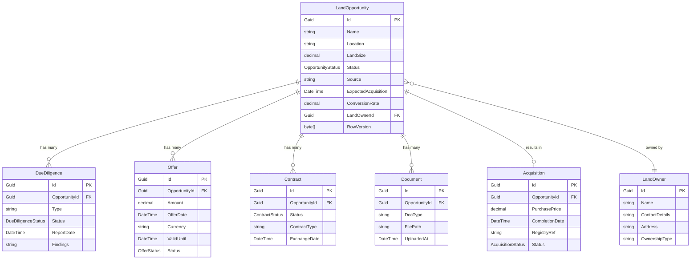
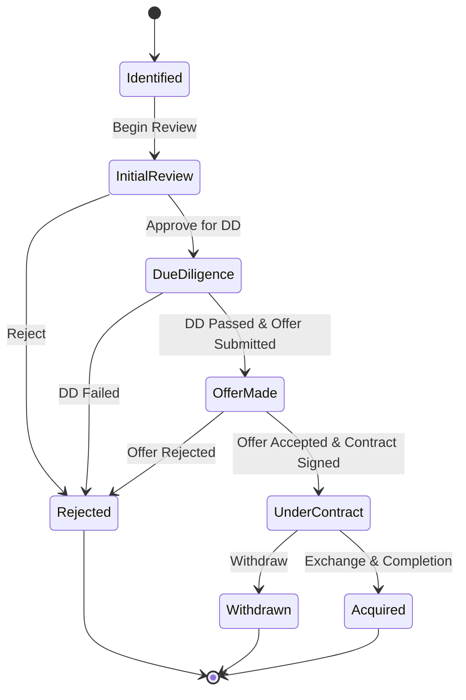
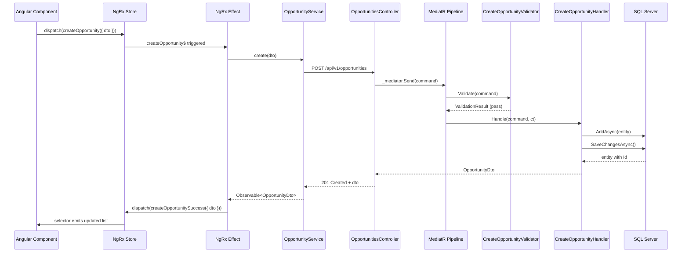

# Land Acquisition Module — Deep Dive

**Estimated Reading Time:** 20 minutes

---

## WHY

The Land Acquisition module is the foundation of BuildEstate Pro. Every property development project begins with securing land. This module manages the complete lifecycle from identifying a potential site through due diligence, offer negotiation, contract exchange, and final registration. Without a robust land acquisition workflow, no downstream module (Planning, Construction, Sales) can operate. Understanding this module in depth is essential because it establishes the architectural patterns — state machines, CQRS handlers, entity relationships, and full-stack request flows — that every subsequent module follows.

---

## WHAT

The Land Acquisition module is composed of seven core entities that model the business domain, a state machine controlling opportunity progression, and full-stack operations spanning Angular → API → MediatR → EF Core → SQL Server.

### Entity Relationship Diagram



### OpportunityStatus State Machine



### Create Opportunity — Full Request Flow



---

## HOW

### Backend — Creating an Opportunity (Command Handler)

```csharp
// src/BuildEstate.Application/Features/LandAcquisition/Opportunities/Commands/CreateOpportunity/CreateOpportunityCommandHandler.cs
public class CreateOpportunityCommandHandler 
    : IRequestHandler<CreateOpportunityCommand, OpportunityDto>
{
    private readonly IApplicationDbContext _context;
    private readonly IMapper _mapper;
    private readonly ICurrentUserService _currentUser;
    private readonly ILogger<CreateOpportunityCommandHandler> _logger;

    public CreateOpportunityCommandHandler(
        IApplicationDbContext context,
        IMapper mapper,
        ICurrentUserService currentUser,
        ILogger<CreateOpportunityCommandHandler> logger)
    {
        _context = context;
        _mapper = mapper;
        _currentUser = currentUser;
        _logger = logger;
    }

    public async Task<OpportunityDto> Handle(
        CreateOpportunityCommand request, 
        CancellationToken cancellationToken)
    {
        var entity = new LandOpportunity
        {
            Id = Guid.NewGuid(),
            Name = request.Name,
            Location = request.Location,
            LandSize = request.LandSize,
            Status = OpportunityStatus.Identified,
            Source = request.Source,
            ExpectedAcquisition = request.ExpectedAcquisition,
            CreatedBy = _currentUser.UserId,
            CreatedAt = DateTime.UtcNow
        };

        await _context.LandOpportunities.AddAsync(entity, cancellationToken);
        await _context.SaveChangesAsync(cancellationToken);

        _logger.LogInformation(
            "Opportunity {OpportunityId} created by {UserId}",
            entity.Id, _currentUser.UserId);

        return _mapper.Map<OpportunityDto>(entity);
    }
}
```

### Backend — Status Transition with State Machine Validation

```csharp
// src/BuildEstate.Application/Features/LandAcquisition/Opportunities/Commands/TransitionStatus/TransitionStatusCommandHandler.cs
public class TransitionStatusCommandHandler 
    : IRequestHandler<TransitionStatusCommand, OpportunityDto>
{
    private readonly IApplicationDbContext _context;
    private readonly IMapper _mapper;
    private readonly ILogger<TransitionStatusCommandHandler> _logger;

    private static readonly Dictionary<OpportunityStatus, OpportunityStatus[]> _allowedTransitions = new()
    {
        [OpportunityStatus.Identified] = new[] { OpportunityStatus.InitialReview },
        [OpportunityStatus.InitialReview] = new[] { OpportunityStatus.DueDiligence, OpportunityStatus.Rejected },
        [OpportunityStatus.DueDiligence] = new[] { OpportunityStatus.OfferMade, OpportunityStatus.Rejected },
        [OpportunityStatus.OfferMade] = new[] { OpportunityStatus.UnderContract, OpportunityStatus.Rejected },
        [OpportunityStatus.UnderContract] = new[] { OpportunityStatus.Acquired, OpportunityStatus.Withdrawn },
    };

    public async Task<OpportunityDto> Handle(
        TransitionStatusCommand request, 
        CancellationToken cancellationToken)
    {
        var entity = await _context.LandOpportunities
            .FirstOrDefaultAsync(o => o.Id == request.OpportunityId, cancellationToken)
            ?? throw new NotFoundException(nameof(LandOpportunity), request.OpportunityId);

        if (!_allowedTransitions.TryGetValue(entity.Status, out var allowed) ||
            !allowed.Contains(request.TargetStatus))
        {
            throw new InvalidStateTransitionException(
                entity.Status.ToString(), request.TargetStatus.ToString());
        }

        var oldStatus = entity.Status;
        entity.Status = request.TargetStatus;
        entity.UpdatedAt = DateTime.UtcNow;

        await _context.SaveChangesAsync(cancellationToken);

        _logger.LogInformation(
            "Opportunity {OpportunityId} transitioned from {OldStatus} to {NewStatus}",
            entity.Id, oldStatus, request.TargetStatus);

        return _mapper.Map<OpportunityDto>(entity);
    }
}
```

### Frontend — NgRx Effect for Loading Opportunities

```typescript
// client-app/src/app/features/land-acquisition/store/opportunities.effects.ts
import { Injectable, inject } from '@angular/core';
import { Actions, createEffect, ofType } from '@ngrx/effects';
import { OpportunityService } from '../services/opportunity.service';
import * as OpportunityActions from './opportunities.actions';
import { catchError, map, switchMap, of } from 'rxjs';

@Injectable()
export class OpportunityEffects {
  private readonly actions$ = inject(Actions);
  private readonly service = inject(OpportunityService);

  loadOpportunities$ = createEffect(() =>
    this.actions$.pipe(
      ofType(OpportunityActions.loadOpportunities),
      switchMap(({ params }) =>
        this.service.getAll(params).pipe(
          map(response => OpportunityActions.loadOpportunitiesSuccess({
            opportunities: response.data,
            pagination: response.pagination
          })),
          catchError(error => of(OpportunityActions.loadOpportunitiesFailure({
            error: error.message
          })))
        )
      )
    )
  );

  createOpportunity$ = createEffect(() =>
    this.actions$.pipe(
      ofType(OpportunityActions.createOpportunity),
      switchMap(({ dto }) =>
        this.service.create(dto).pipe(
          map(opportunity => OpportunityActions.createOpportunitySuccess({ opportunity })),
          catchError(error => of(OpportunityActions.createOpportunityFailure({
            error: error.message
          })))
        )
      )
    )
  );
}
```

---

## WHEN

- **Module selection:** First module to implement — establishes all patterns
- **Sprint planning:** Land Acquisition features span approximately 4 sprints (create, list, pipeline, detail, DD, offers, contracts, acquisition)
- **Status transitions:** Use the state machine whenever an opportunity moves forward in the pipeline
- **Approval workflows:** Triggered when opportunity reaches OfferMade status and requires Finance Director approval

---

## WHERE

### Codebase Location

| Layer | Path |
|-------|------|
| Domain Entities | `src/BuildEstate.Domain/Entities/LandAcquisition/` |
| Domain Enums | `src/BuildEstate.Domain/Enums/LandAcquisition/` |
| Commands & Queries | `src/BuildEstate.Application/Features/LandAcquisition/` |
| Validators | `src/BuildEstate.Application/Features/LandAcquisition/Opportunities/Commands/*/` |
| DTOs | `src/BuildEstate.Application/Features/LandAcquisition/Opportunities/DTOs/` |
| EF Configuration | `src/BuildEstate.Infrastructure/Persistence/Configurations/LandAcquisition/` |
| API Controllers | `src/BuildEstate.API/Controllers/LandAcquisition/` |
| Angular Feature | `client-app/src/app/features/land-acquisition/` |
| NgRx Store | `client-app/src/app/features/land-acquisition/store/` |
| Services | `client-app/src/app/features/land-acquisition/services/` |
| Models | `client-app/src/app/features/land-acquisition/models/` |
| Pages | `client-app/src/app/features/land-acquisition/pages/` |
| Components | `client-app/src/app/features/land-acquisition/components/` |

---

## WHO

| Role | Interaction |
|------|-------------|
| Acquisition Manager | Creates opportunities, manages pipeline, submits offers |
| Legal & Compliance Officer | Creates due diligence checks, uploads legal documents |
| Finance Director | Approves/rejects opportunities at offer stage |
| Valuation Analyst | Creates feasibility assessments, ROI analysis |
| Admin/Support | Creates acquisition records, manages land owner data |

---

## WHAT NEXT

- [Planning & Approvals Deep Dive](./21-planning-deep-dive.md) — Next module in the lifecycle after land is acquired
- [Legal & Compliance Deep Dive](./22-legal-compliance-deep-dive.md) — Cross-cutting legal support for land transactions
- [State Machines](./16-state-machines.md) — Underlying state machine framework used by OpportunityStatus
- [CQRS and MediatR](./08-cqrs-and-mediatr.md) — The command/query pattern this module implements
- [How to Build the Next Module](./24-how-to-build-the-next-module.md) — Use this module as a template

---

## Integration Steps

1. **Domain Layer** — Define `LandOpportunity`, `LandOwner`, `DueDiligence`, `Offer`, `Contract`, `Document`, `Acquisition` entities with required audit columns
2. **EF Configuration** — Create `LandOpportunityConfiguration` with indexes on Status, CreatedAt, LandOwnerId, and a composite index on Status + CreatedAt
3. **Migration** — Run `dotnet ef migrations add AddLandAcquisitionEntities`
4. **CQRS Layer** — Implement Create, Update, Delete, GetById, GetAll, TransitionStatus commands and queries
5. **Validators** — Create FluentValidation validators for each command (Name required, LandSize > 0, valid status transitions)
6. **Controller** — Create `OpportunitiesController` with thin MediatR dispatch
7. **Angular Service** — Create `OpportunityService` calling `/api/v1/opportunities`
8. **NgRx Store** — Define actions, reducer, effects, and selectors for opportunity state
9. **Pages** — Build Dashboard, List, Create, Detail, Edit, Pipeline pages
10. **Search Provider** — Register `LandOpportunitySearchProvider` with weighted fields

---

## Common Mistakes

### Mistake 1: Business Logic in the Controller

❌ **WRONG**

```csharp
[HttpPost("status")]
public async Task<IActionResult> ChangeStatus([FromBody] StatusDto dto)
{
    var opportunity = await _context.LandOpportunities.FindAsync(dto.Id);
    if (opportunity.Status == OpportunityStatus.Identified && 
        dto.NewStatus == OpportunityStatus.InitialReview)
    {
        opportunity.Status = dto.NewStatus;
        await _context.SaveChangesAsync();
    }
    return Ok(opportunity);
}
```

✅ **CORRECT**

```csharp
[HttpPatch("{id}/status")]
public async Task<IActionResult> TransitionStatus(
    Guid id,
    [FromBody] TransitionStatusCommand command,
    CancellationToken cancellationToken)
{
    command.OpportunityId = id;
    var result = await _mediator.Send(command, cancellationToken);
    return Ok(result);
}
```

### Mistake 2: Mutating NgRx State Directly

❌ **WRONG**

```typescript
on(OpportunityActions.createOpportunitySuccess, (state, { opportunity }) => {
  state.opportunities.push(opportunity); // MUTATING STATE!
  return state;
})
```

✅ **CORRECT**

```typescript
on(OpportunityActions.createOpportunitySuccess, (state, { opportunity }) => ({
  ...state,
  opportunities: [...state.opportunities, opportunity],
  loading: false,
  error: null
}))
```

### Mistake 3: Forgetting CancellationToken

❌ **WRONG**

```csharp
public async Task<OpportunityDto> Handle(CreateOpportunityCommand request)
{
    var entity = _mapper.Map<LandOpportunity>(request);
    await _context.LandOpportunities.AddAsync(entity);
    await _context.SaveChangesAsync();
    return _mapper.Map<OpportunityDto>(entity);
}
```

✅ **CORRECT**

```csharp
public async Task<OpportunityDto> Handle(
    CreateOpportunityCommand request, 
    CancellationToken cancellationToken)
{
    var entity = _mapper.Map<LandOpportunity>(request);
    await _context.LandOpportunities.AddAsync(entity, cancellationToken);
    await _context.SaveChangesAsync(cancellationToken);
    return _mapper.Map<OpportunityDto>(entity);
}
```
