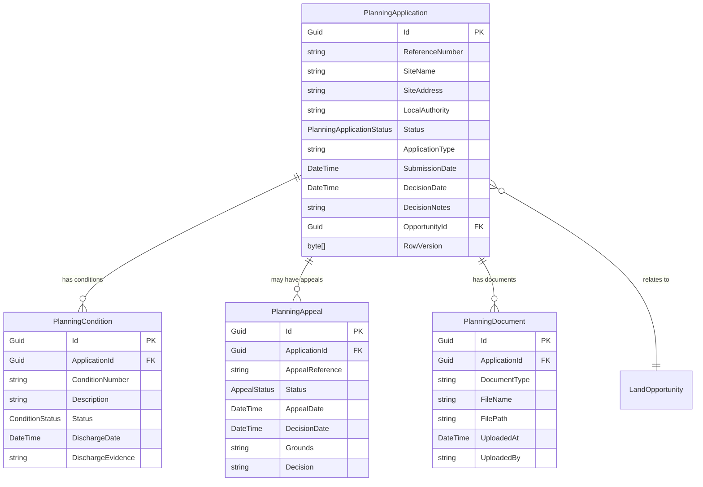
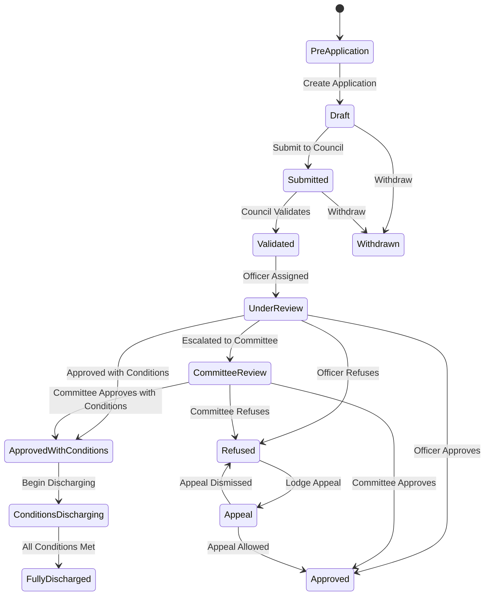
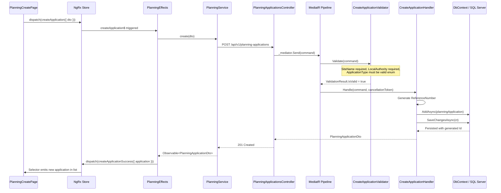

# Planning & Approvals Module — Deep Dive

**Estimated Reading Time:** 18 minutes

---

## WHY

After land is acquired, the next critical step is obtaining planning permission from local authorities. The Planning & Approvals module manages the entire lifecycle of planning applications — from pre-application enquiries through committee reviews, conditional approvals, and appeals. Without planning permission, no construction can begin. This module is the gateway between land ownership and value creation. It handles complex state transitions, multi-party interactions (councils, consultants, objectors), and strict regulatory timelines that directly impact project profitability.

---

## WHAT

The Planning & Approvals module manages four core entities: `PlanningApplication`, `PlanningCondition`, `PlanningAppeal`, and `PlanningDocument`. Each application progresses through a defined state machine, with conditions that must be discharged before construction starts, and an appeal pathway if permission is refused.

### Entity Relationship Diagram



### PlanningApplicationStatus State Machine



### Create Application — Full Stack Trace



---

## HOW

### Backend — Create Planning Application Handler

```csharp
// src/BuildEstate.Application/Features/PlanningApprovals/Commands/CreateApplication/CreateApplicationCommandHandler.cs
public class CreateApplicationCommandHandler 
    : IRequestHandler<CreateApplicationCommand, PlanningApplicationDto>
{
    private readonly IApplicationDbContext _context;
    private readonly IMapper _mapper;
    private readonly ICurrentUserService _currentUser;
    private readonly IReferenceNumberGenerator _referenceGenerator;

    public CreateApplicationCommandHandler(
        IApplicationDbContext context,
        IMapper mapper,
        ICurrentUserService currentUser,
        IReferenceNumberGenerator referenceGenerator)
    {
        _context = context;
        _mapper = mapper;
        _currentUser = currentUser;
        _referenceGenerator = referenceGenerator;
    }

    public async Task<PlanningApplicationDto> Handle(
        CreateApplicationCommand request,
        CancellationToken cancellationToken)
    {
        var referenceNumber = await _referenceGenerator
            .GenerateAsync("PLAN", cancellationToken);

        var application = new PlanningApplication
        {
            Id = Guid.NewGuid(),
            ReferenceNumber = referenceNumber,
            SiteName = request.SiteName,
            SiteAddress = request.SiteAddress,
            LocalAuthority = request.LocalAuthority,
            ApplicationType = request.ApplicationType,
            Status = PlanningApplicationStatus.Draft,
            OpportunityId = request.OpportunityId,
            CreatedAt = DateTime.UtcNow,
            CreatedBy = _currentUser.UserId
        };

        await _context.PlanningApplications.AddAsync(application, cancellationToken);
        await _context.SaveChangesAsync(cancellationToken);

        return _mapper.Map<PlanningApplicationDto>(application);
    }
}
```

### Backend — Discharge Condition Handler

```csharp
// src/BuildEstate.Application/Features/PlanningApprovals/Commands/DischargeCondition/DischargeConditionCommandHandler.cs
public class DischargeConditionCommandHandler 
    : IRequestHandler<DischargeConditionCommand, PlanningConditionDto>
{
    private readonly IApplicationDbContext _context;
    private readonly IMapper _mapper;
    private readonly ILogger<DischargeConditionCommandHandler> _logger;

    public async Task<PlanningConditionDto> Handle(
        DischargeConditionCommand request,
        CancellationToken cancellationToken)
    {
        var condition = await _context.PlanningConditions
            .Include(c => c.Application)
            .FirstOrDefaultAsync(c => c.Id == request.ConditionId, cancellationToken)
            ?? throw new NotFoundException(nameof(PlanningCondition), request.ConditionId);

        if (condition.Status == ConditionStatus.Discharged)
            throw new BusinessRuleException("Condition is already discharged.");

        condition.Status = ConditionStatus.Discharged;
        condition.DischargeDate = DateTime.UtcNow;
        condition.DischargeEvidence = request.Evidence;
        condition.UpdatedAt = DateTime.UtcNow;

        // Check if all conditions are now discharged
        var allDischarged = await _context.PlanningConditions
            .Where(c => c.ApplicationId == condition.ApplicationId && c.Id != condition.Id)
            .AllAsync(c => c.Status == ConditionStatus.Discharged, cancellationToken);

        if (allDischarged)
        {
            condition.Application.Status = PlanningApplicationStatus.FullyDischarged;
            _logger.LogInformation(
                "All conditions discharged for application {ApplicationId}",
                condition.ApplicationId);
        }

        await _context.SaveChangesAsync(cancellationToken);
        return _mapper.Map<PlanningConditionDto>(condition);
    }
}
```

### Frontend — Planning Application Service

```typescript
// client-app/src/app/features/planning-approvals/services/planning.service.ts
import { Injectable, inject } from '@angular/core';
import { HttpClient, HttpParams } from '@angular/common/http';
import { Observable } from 'rxjs';
import { environment } from '../../../../environments/environment';
import { 
  PlanningApplicationDto, 
  CreatePlanningApplicationDto,
  PlanningConditionDto,
  PlanningAppealDto,
  PaginatedResponse,
  ListParams 
} from '../models/planning.models';

@Injectable({ providedIn: 'root' })
export class PlanningService {
  private readonly http = inject(HttpClient);
  private readonly baseUrl = `${environment.apiUrl}/planning-applications`;

  getAll(params: ListParams): Observable<PaginatedResponse<PlanningApplicationDto>> {
    let httpParams = new HttpParams()
      .set('pageNumber', params.pageNumber.toString())
      .set('pageSize', params.pageSize.toString());

    if (params.status) httpParams = httpParams.set('status', params.status);
    if (params.search) httpParams = httpParams.set('search', params.search);

    return this.http.get<PaginatedResponse<PlanningApplicationDto>>(
      this.baseUrl, { params: httpParams }
    );
  }

  create(dto: CreatePlanningApplicationDto): Observable<PlanningApplicationDto> {
    return this.http.post<PlanningApplicationDto>(this.baseUrl, dto);
  }

  dischargeCondition(
    applicationId: string, 
    conditionId: string, 
    evidence: string
  ): Observable<PlanningConditionDto> {
    return this.http.patch<PlanningConditionDto>(
      `${this.baseUrl}/${applicationId}/conditions/${conditionId}/discharge`,
      { evidence }
    );
  }

  submitAppeal(
    applicationId: string, 
    appeal: { grounds: string; appealDate: string }
  ): Observable<PlanningAppealDto> {
    return this.http.post<PlanningAppealDto>(
      `${this.baseUrl}/${applicationId}/appeals`,
      appeal
    );
  }
}
```

---

## WHEN

- **After Land Acquisition:** Planning applications are created once land ownership is confirmed or under contract
- **Council Timelines:** Standard applications have an 8-week determination period; major applications 13 weeks
- **Condition Discharge:** Must happen before any construction work begins on site
- **Appeals:** Must be lodged within 6 months of refusal (written reps) or 6 months (hearing/inquiry)
- **Pre-application:** Encouraged for major developments to establish principle before formal submission

---

## WHERE

### Codebase Location

| Layer | Path |
|-------|------|
| Domain Entities | `src/BuildEstate.Domain/Entities/PlanningApprovals/` |
| Domain Enums | `src/BuildEstate.Domain/Enums/PlanningApprovals/` |
| Commands | `src/BuildEstate.Application/Features/PlanningApprovals/Commands/` |
| Queries | `src/BuildEstate.Application/Features/PlanningApprovals/Queries/` |
| DTOs | `src/BuildEstate.Application/Features/PlanningApprovals/DTOs/` |
| Validators | `src/BuildEstate.Application/Features/PlanningApprovals/Commands/*/` |
| EF Configuration | `src/BuildEstate.Infrastructure/Persistence/Configurations/PlanningApprovals/` |
| API Controller | `src/BuildEstate.API/Controllers/PlanningApprovals/` |
| Angular Feature | `client-app/src/app/features/planning-approvals/` |
| NgRx Store | `client-app/src/app/features/planning-approvals/store/` |
| Services | `client-app/src/app/features/planning-approvals/services/` |
| Pages | `client-app/src/app/features/planning-approvals/pages/` |

---

## WHO

| Role | Responsibility |
|------|---------------|
| Planning Manager | Creates and manages planning applications, liaises with council |
| Acquisition Manager | Links opportunities to planning applications |
| Legal & Compliance Officer | Reviews S106 agreements and legal conditions |
| Project Manager | Monitors planning timeline impact on project schedule |
| Admin/Support | Uploads documents, tracks correspondence |

---

## WHAT NEXT

- [Legal & Compliance Deep Dive](./22-legal-compliance-deep-dive.md) — Legal support for S106 agreements and planning conditions
- [Land Acquisition Deep Dive](./20-land-acquisition-deep-dive.md) — The upstream module that feeds planning applications
- [State Machines](./16-state-machines.md) — How PlanningApplicationStatus transitions are enforced
- [How to Build the Next Module](./24-how-to-build-the-next-module.md) — Follow this pattern for new modules

---

## Integration Steps

1. **Domain Entities** — Create `PlanningApplication`, `PlanningCondition`, `PlanningAppeal`, `PlanningDocument` in `src/BuildEstate.Domain/Entities/PlanningApprovals/`
2. **Enums** — Define `PlanningApplicationStatus`, `ConditionStatus`, `AppealStatus`
3. **EF Configuration** — Configure relationships, indexes on ReferenceNumber (unique), Status, OpportunityId, LocalAuthority
4. **Migration** — `dotnet ef migrations add AddPlanningApprovals`
5. **CQRS** — Create, Submit, Validate, ChangeStatus, AddCondition, DischargeCondition, SubmitAppeal commands
6. **Validators** — SiteName required, ReferenceNumber auto-generated, valid status transitions only
7. **Controller** — `PlanningApplicationsController` with nested condition and appeal routes
8. **Angular Service** — `PlanningService` with typed DTOs
9. **NgRx Store** — Actions, reducer, effects, selectors for planning state
10. **Pages** — Dashboard, List, Detail (with Conditions, Appeals, Documents tabs), Create, Edit

---

## Common Mistakes

### Mistake 1: Allowing Invalid Status Transitions

❌ **WRONG**

```csharp
public async Task<IActionResult> ChangeStatus(Guid id, [FromBody] string newStatus)
{
    var app = await _context.PlanningApplications.FindAsync(id);
    app.Status = Enum.Parse<PlanningApplicationStatus>(newStatus);
    await _context.SaveChangesAsync();
    return Ok();
}
```

✅ **CORRECT**

```csharp
public async Task<PlanningApplicationDto> Handle(
    TransitionApplicationStatusCommand request,
    CancellationToken cancellationToken)
{
    var app = await _context.PlanningApplications
        .FirstOrDefaultAsync(a => a.Id == request.ApplicationId, cancellationToken)
        ?? throw new NotFoundException(nameof(PlanningApplication), request.ApplicationId);

    var allowedTransitions = PlanningStateMachine.GetAllowedTransitions(app.Status);
    if (!allowedTransitions.Contains(request.TargetStatus))
    {
        throw new InvalidStateTransitionException(
            app.Status.ToString(), request.TargetStatus.ToString());
    }

    app.Status = request.TargetStatus;
    app.UpdatedAt = DateTime.UtcNow;
    await _context.SaveChangesAsync(cancellationToken);

    return _mapper.Map<PlanningApplicationDto>(app);
}
```

### Mistake 2: Not Checking All Conditions Before Marking Fully Discharged

❌ **WRONG**

```csharp
// Just discharge the condition without checking others
condition.Status = ConditionStatus.Discharged;
application.Status = PlanningApplicationStatus.FullyDischarged; // Wrong! Other conditions may exist
await _context.SaveChangesAsync(cancellationToken);
```

✅ **CORRECT**

```csharp
condition.Status = ConditionStatus.Discharged;
condition.DischargeDate = DateTime.UtcNow;

// Check ALL sibling conditions
var allOthersDischarged = await _context.PlanningConditions
    .Where(c => c.ApplicationId == condition.ApplicationId && c.Id != condition.Id)
    .AllAsync(c => c.Status == ConditionStatus.Discharged, cancellationToken);

if (allOthersDischarged)
{
    application.Status = PlanningApplicationStatus.FullyDischarged;
}

await _context.SaveChangesAsync(cancellationToken);
```
