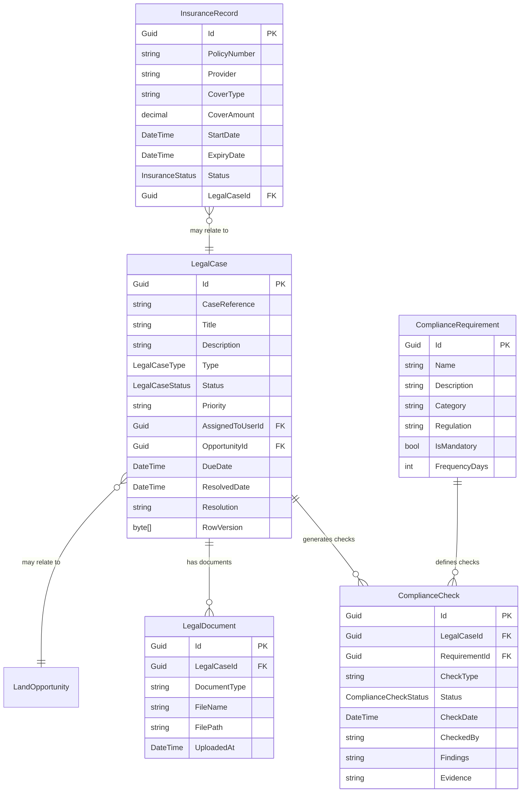
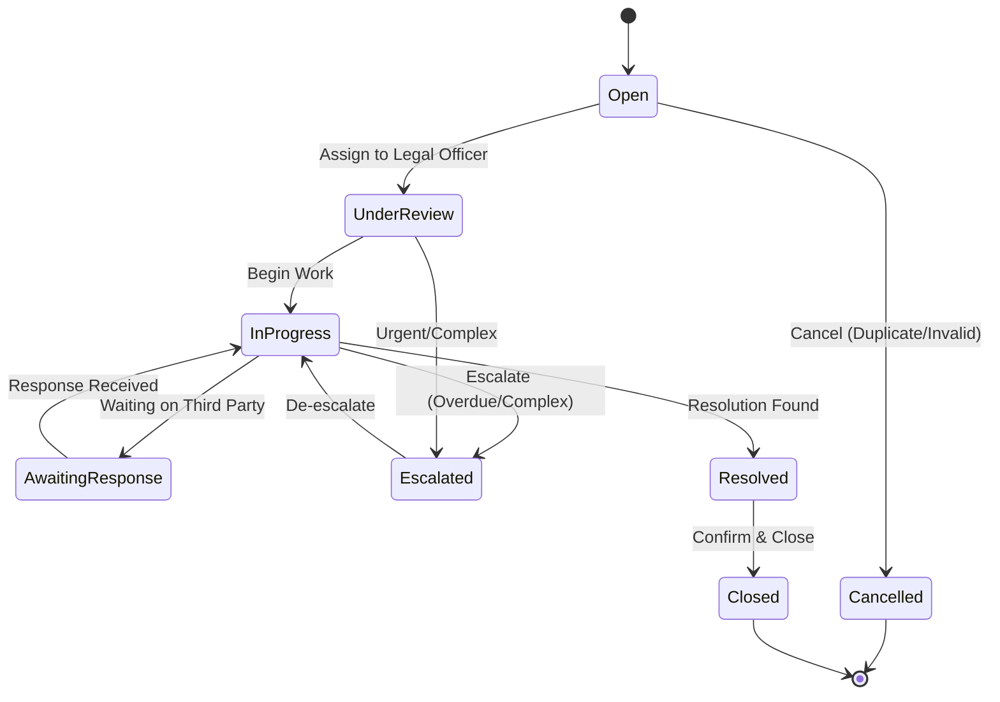
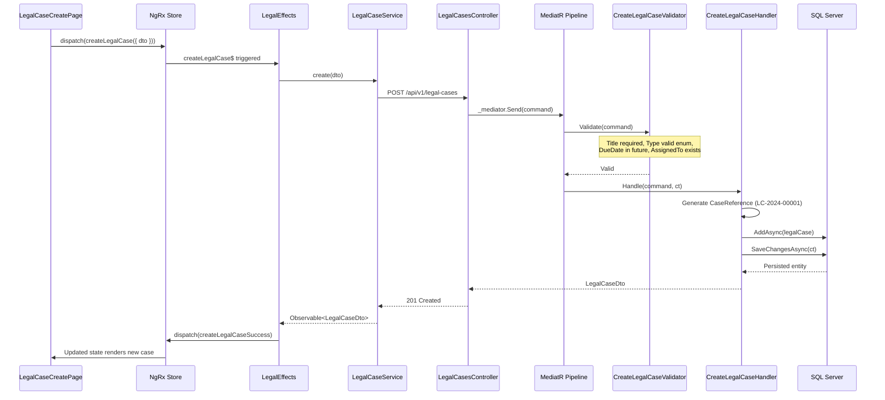

# Legal & Compliance Module — Deep Dive

**Estimated Reading Time:** 18 minutes

---

## WHY

Property development is one of the most heavily regulated industries. Every land transaction requires title verification, every construction phase requires compliance certification, and every financial decision requires audit evidence. The Legal & Compliance module is a cross-cutting concern that supports all other modules — from land acquisition contracts through planning S106 agreements to construction health & safety certifications. A single compliance failure can halt a project, trigger penalties, or expose the company to legal liability. This module ensures BuildEstate Pro maintains an immutable audit trail, tracks all legal cases, and verifies regulatory compliance across the platform.

---

## WHAT

The Legal & Compliance module manages four core entities: `LegalCase` (tracking active legal matters), `ComplianceCheck` (recording regulatory verifications), `ComplianceRequirement` (defining what must be checked), and `InsuranceRecord` (tracking insurance coverage). Each legal case follows a defined lifecycle from creation through resolution or escalation.

### Entity Relationship Diagram



### LegalCaseStatus State Machine



### Create Legal Case — Full Stack Trace



---

## HOW

### Backend — Create Legal Case Command Handler

```csharp
// src/BuildEstate.Application/Features/LegalCompliance/Commands/CreateLegalCase/CreateLegalCaseCommandHandler.cs
public class CreateLegalCaseCommandHandler 
    : IRequestHandler<CreateLegalCaseCommand, LegalCaseDto>
{
    private readonly IApplicationDbContext _context;
    private readonly IMapper _mapper;
    private readonly ICurrentUserService _currentUser;
    private readonly ICaseReferenceGenerator _referenceGenerator;
    private readonly ILogger<CreateLegalCaseCommandHandler> _logger;

    public CreateLegalCaseCommandHandler(
        IApplicationDbContext context,
        IMapper mapper,
        ICurrentUserService currentUser,
        ICaseReferenceGenerator referenceGenerator,
        ILogger<CreateLegalCaseCommandHandler> logger)
    {
        _context = context;
        _mapper = mapper;
        _currentUser = currentUser;
        _referenceGenerator = referenceGenerator;
        _logger = logger;
    }

    public async Task<LegalCaseDto> Handle(
        CreateLegalCaseCommand request,
        CancellationToken cancellationToken)
    {
        var caseReference = await _referenceGenerator
            .GenerateAsync("LC", cancellationToken);

        var legalCase = new LegalCase
        {
            Id = Guid.NewGuid(),
            CaseReference = caseReference,
            Title = request.Title,
            Description = request.Description,
            Type = request.Type,
            Status = LegalCaseStatus.Open,
            Priority = request.Priority,
            AssignedToUserId = request.AssignedToUserId,
            OpportunityId = request.OpportunityId,
            DueDate = request.DueDate,
            CreatedAt = DateTime.UtcNow,
            CreatedBy = _currentUser.UserId
        };

        await _context.LegalCases.AddAsync(legalCase, cancellationToken);
        await _context.SaveChangesAsync(cancellationToken);

        _logger.LogInformation(
            "Legal case {CaseReference} created for opportunity {OpportunityId} by {UserId}",
            caseReference, request.OpportunityId, _currentUser.UserId);

        return _mapper.Map<LegalCaseDto>(legalCase);
    }
}
```

### Backend — Record Compliance Check

```csharp
// src/BuildEstate.Application/Features/LegalCompliance/Commands/RecordComplianceCheck/RecordComplianceCheckCommandHandler.cs
public class RecordComplianceCheckCommandHandler 
    : IRequestHandler<RecordComplianceCheckCommand, ComplianceCheckDto>
{
    private readonly IApplicationDbContext _context;
    private readonly IMapper _mapper;
    private readonly ICurrentUserService _currentUser;

    public async Task<ComplianceCheckDto> Handle(
        RecordComplianceCheckCommand request,
        CancellationToken cancellationToken)
    {
        var legalCase = await _context.LegalCases
            .FirstOrDefaultAsync(c => c.Id == request.LegalCaseId, cancellationToken)
            ?? throw new NotFoundException(nameof(LegalCase), request.LegalCaseId);

        var requirement = await _context.ComplianceRequirements
            .FirstOrDefaultAsync(r => r.Id == request.RequirementId, cancellationToken)
            ?? throw new NotFoundException(nameof(ComplianceRequirement), request.RequirementId);

        var check = new ComplianceCheck
        {
            Id = Guid.NewGuid(),
            LegalCaseId = request.LegalCaseId,
            RequirementId = request.RequirementId,
            CheckType = requirement.Category,
            Status = request.Passed 
                ? ComplianceCheckStatus.Passed 
                : ComplianceCheckStatus.Failed,
            CheckDate = DateTime.UtcNow,
            CheckedBy = _currentUser.UserId,
            Findings = request.Findings,
            Evidence = request.Evidence,
            CreatedAt = DateTime.UtcNow,
            CreatedBy = _currentUser.UserId
        };

        await _context.ComplianceChecks.AddAsync(check, cancellationToken);
        await _context.SaveChangesAsync(cancellationToken);

        return _mapper.Map<ComplianceCheckDto>(check);
    }
}
```

### Frontend — Legal Case NgRx Actions and Reducer

```typescript
// client-app/src/app/features/legal-compliance/store/legal.actions.ts
import { createAction, props } from '@ngrx/store';
import { LegalCaseDto, CreateLegalCaseDto, ComplianceCheckDto } from '../models/legal.models';

export const loadLegalCases = createAction(
  '[Legal] Load Legal Cases',
  props<{ params: { pageNumber: number; pageSize: number; status?: string } }>()
);

export const loadLegalCasesSuccess = createAction(
  '[Legal] Load Legal Cases Success',
  props<{ cases: LegalCaseDto[]; totalCount: number }>()
);

export const loadLegalCasesFailure = createAction(
  '[Legal] Load Legal Cases Failure',
  props<{ error: string }>()
);

export const createLegalCase = createAction(
  '[Legal] Create Legal Case',
  props<{ dto: CreateLegalCaseDto }>()
);

export const createLegalCaseSuccess = createAction(
  '[Legal] Create Legal Case Success',
  props<{ legalCase: LegalCaseDto }>()
);

export const escalateCase = createAction(
  '[Legal] Escalate Case',
  props<{ caseId: string; reason: string }>()
);

export const escalateCaseSuccess = createAction(
  '[Legal] Escalate Case Success',
  props<{ legalCase: LegalCaseDto }>()
);

export const recordComplianceCheck = createAction(
  '[Legal] Record Compliance Check',
  props<{ caseId: string; dto: { requirementId: string; passed: boolean; findings: string; evidence: string } }>()
);

export const recordComplianceCheckSuccess = createAction(
  '[Legal] Record Compliance Check Success',
  props<{ check: ComplianceCheckDto }>()
);
```

```typescript
// client-app/src/app/features/legal-compliance/store/legal.reducer.ts
import { createReducer, on } from '@ngrx/store';
import * as LegalActions from './legal.actions';
import { LegalCaseDto, ComplianceCheckDto } from '../models/legal.models';

export interface LegalState {
  cases: LegalCaseDto[];
  selectedCase: LegalCaseDto | null;
  complianceChecks: ComplianceCheckDto[];
  totalCount: number;
  loading: boolean;
  error: string | null;
}

const initialState: LegalState = {
  cases: [],
  selectedCase: null,
  complianceChecks: [],
  totalCount: 0,
  loading: false,
  error: null,
};

export const legalReducer = createReducer(
  initialState,
  on(LegalActions.loadLegalCases, (state) => ({
    ...state,
    loading: true,
    error: null,
  })),
  on(LegalActions.loadLegalCasesSuccess, (state, { cases, totalCount }) => ({
    ...state,
    cases,
    totalCount,
    loading: false,
  })),
  on(LegalActions.loadLegalCasesFailure, (state, { error }) => ({
    ...state,
    loading: false,
    error,
  })),
  on(LegalActions.createLegalCaseSuccess, (state, { legalCase }) => ({
    ...state,
    cases: [legalCase, ...state.cases],
    totalCount: state.totalCount + 1,
  })),
  on(LegalActions.escalateCaseSuccess, (state, { legalCase }) => ({
    ...state,
    cases: state.cases.map(c => c.id === legalCase.id ? legalCase : c),
    selectedCase: state.selectedCase?.id === legalCase.id ? legalCase : state.selectedCase,
  })),
  on(LegalActions.recordComplianceCheckSuccess, (state, { check }) => ({
    ...state,
    complianceChecks: [...state.complianceChecks, check],
  }))
);
```

---

## WHEN

- **Land Acquisition Phase:** Legal cases created for title searches, contract review, and land registry
- **Planning Phase:** Compliance checks for S106 agreements, environmental regulations
- **Construction Phase:** Health & safety compliance, building regulations verification
- **Sales Phase:** Conveyancing compliance, consumer protection
- **Ongoing:** Insurance renewal tracking, regulatory change monitoring
- **Escalation:** When a case exceeds its SLA due date or involves significant financial risk

---

## WHERE

### Codebase Location

| Layer | Path |
|-------|------|
| Domain Entities | `src/BuildEstate.Domain/Entities/LegalCompliance/` |
| Domain Enums | `src/BuildEstate.Domain/Enums/LegalCompliance/` |
| Commands | `src/BuildEstate.Application/Features/LegalCompliance/Commands/` |
| Queries | `src/BuildEstate.Application/Features/LegalCompliance/Queries/` |
| DTOs | `src/BuildEstate.Application/Features/LegalCompliance/DTOs/` |
| EF Configuration | `src/BuildEstate.Infrastructure/Persistence/Configurations/LegalCompliance/` |
| API Controller | `src/BuildEstate.API/Controllers/LegalCompliance/` |
| Angular Feature | `client-app/src/app/features/legal-compliance/` |
| NgRx Store | `client-app/src/app/features/legal-compliance/store/` |
| Services | `client-app/src/app/features/legal-compliance/services/` |
| Pages | `client-app/src/app/features/legal-compliance/pages/` |

---

## WHO

| Role | Responsibility |
|------|---------------|
| Legal & Compliance Officer | Creates cases, records checks, manages documents, escalates issues |
| Acquisition Manager | Requests legal reviews for land transactions |
| Planning Manager | Requests compliance verification for planning conditions |
| Finance Director | Reviews legal cost implications, approves settlements |
| Admin/Support | Uploads documents, tracks insurance renewal dates |

---

## WHAT NEXT

- [User Management Deep Dive](./23-user-management-deep-dive.md) — Role-based access controlling who can view/edit legal cases
- [Land Acquisition Deep Dive](./20-land-acquisition-deep-dive.md) — Primary consumer of legal services
- [Audit Framework](./14-audit-framework.md) — How compliance actions are permanently recorded
- [Security Framework](./11-security-framework.md) — Access control for sensitive legal data

---

## Integration Steps

1. **Domain Entities** — Create `LegalCase`, `ComplianceCheck`, `ComplianceRequirement`, `InsuranceRecord`, `LegalDocument`
2. **Enums** — Define `LegalCaseStatus`, `LegalCaseType`, `ComplianceCheckStatus`, `InsuranceStatus`
3. **EF Configuration** — Indexes on CaseReference (unique), Status, AssignedToUserId, OpportunityId, DueDate
4. **Migration** — `dotnet ef migrations add AddLegalCompliance`
5. **CQRS** — CreateCase, EscalateCase, ResolveCase, RecordComplianceCheck, CreateInsuranceRecord
6. **Validators** — Title required (max 200 chars), DueDate must be future, valid Type enum
7. **Controller** — `LegalCasesController` with nested compliance-check and document routes
8. **Angular Service** — `LegalCaseService` with all CRUD + status transition methods
9. **NgRx Store** — Full state management for cases, checks, and insurance records
10. **Pages** — Dashboard, Case List, Case Detail, Create Case, Compliance Checklist, Insurance Register

---

## Common Mistakes

### Mistake 1: Exposing Sensitive Legal Data Without Permission Check

❌ **WRONG**

```csharp
[HttpGet("{id}")]
public async Task<IActionResult> GetById(Guid id, CancellationToken ct)
{
    var legalCase = await _context.LegalCases
        .Include(c => c.Documents)
        .FirstOrDefaultAsync(c => c.Id == id, ct);
    return Ok(legalCase); // No auth check, exposes domain entity directly
}
```

✅ **CORRECT**

```csharp
[HttpGet("{id}")]
[Authorize(Policy = "CanViewLegalCases")]
public async Task<IActionResult> GetById(Guid id, CancellationToken cancellationToken)
{
    var query = new GetLegalCaseByIdQuery { CaseId = id };
    var result = await _mediator.Send(query, cancellationToken);
    return Ok(result); // Returns DTO, not domain entity; auth policy enforced
}
```

### Mistake 2: Not Validating Compliance Check Against Existing Requirements

❌ **WRONG**

```csharp
// Just creates a check without verifying the requirement exists or is applicable
var check = new ComplianceCheck
{
    RequirementId = request.RequirementId, // Could be invalid or irrelevant
    Status = ComplianceCheckStatus.Passed,
    CheckDate = DateTime.UtcNow
};
await _context.ComplianceChecks.AddAsync(check);
await _context.SaveChangesAsync();
```

✅ **CORRECT**

```csharp
// Verify requirement exists and is applicable
var requirement = await _context.ComplianceRequirements
    .FirstOrDefaultAsync(r => r.Id == request.RequirementId, cancellationToken)
    ?? throw new NotFoundException(nameof(ComplianceRequirement), request.RequirementId);

if (!requirement.IsMandatory && string.IsNullOrEmpty(request.Findings))
{
    throw new BusinessRuleException(
        "Non-mandatory checks must include findings when recorded.");
}

var check = new ComplianceCheck
{
    Id = Guid.NewGuid(),
    RequirementId = requirement.Id,
    CheckType = requirement.Category,
    Status = request.Passed ? ComplianceCheckStatus.Passed : ComplianceCheckStatus.Failed,
    CheckDate = DateTime.UtcNow,
    CheckedBy = _currentUser.UserId,
    Findings = request.Findings,
    Evidence = request.Evidence,
    CreatedAt = DateTime.UtcNow,
    CreatedBy = _currentUser.UserId
};

await _context.ComplianceChecks.AddAsync(check, cancellationToken);
await _context.SaveChangesAsync(cancellationToken);
```
