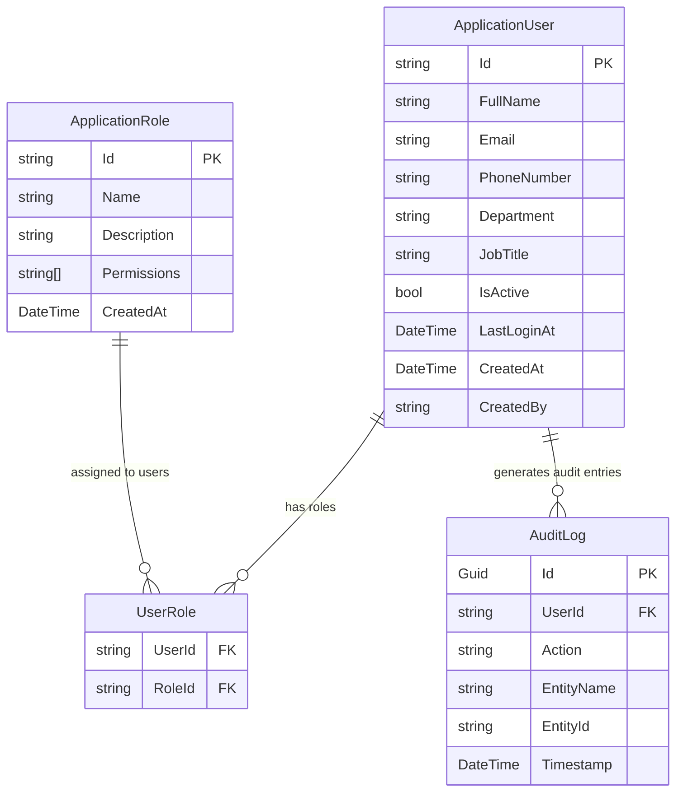
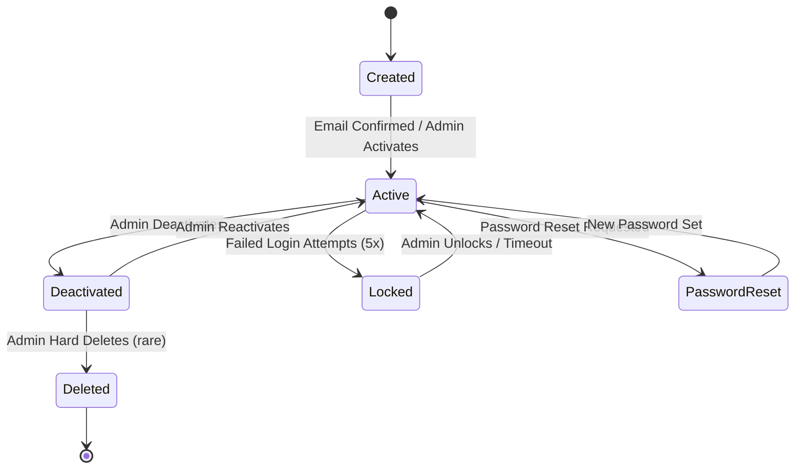
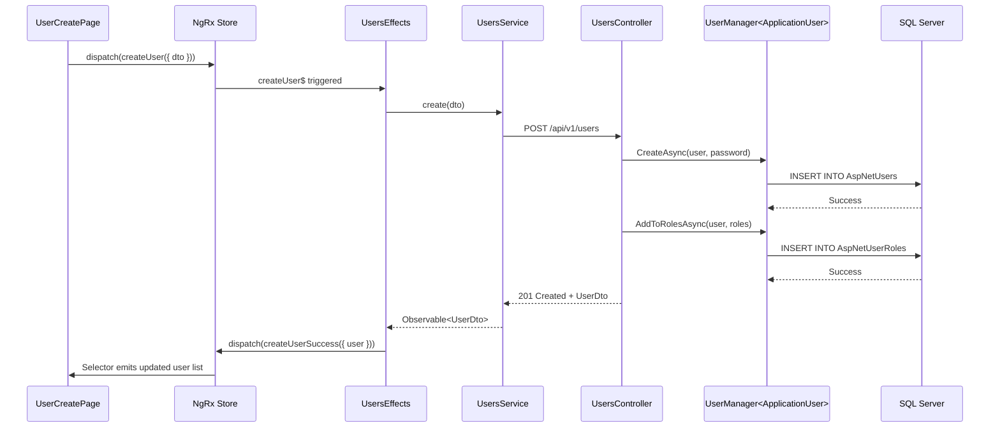

# User Management Module — Deep Dive

**Estimated Reading Time:** 16 minutes

---

## WHY

BuildEstate Pro is a multi-role enterprise platform where data sensitivity varies dramatically between modules. The User Management module controls who can access what, when, and how. It governs user creation, role assignment, password management, account activation/deactivation, and bulk operations. Without proper user management, the platform cannot enforce its security policies, audit trail requirements, or role-based workflows. This module uses ASP.NET Identity as its foundation, extended with custom roles, claims, and policies that map directly to business capabilities.

---

## WHAT

The User Management module centres on two ASP.NET Identity entities extended for BuildEstate Pro: `ApplicationUser` and `ApplicationRole`. It provides full CRUD for users, role assignment, password reset, account lifecycle management (activate/deactivate), and bulk operations. Only users with SuperAdmin role can access this module.

### User Management Architecture



### User Lifecycle State Machine



### Create User — Full Stack Trace



---

## HOW

### Backend — Users Controller (Create User)

```csharp
// src/BuildEstate.API/Controllers/Admin/UsersController.cs
[ApiController]
[Route("api/v1/users")]
[Authorize(Roles = "SuperAdmin")]
public class UsersController : ControllerBase
{
    private readonly UserManager<ApplicationUser> _userManager;
    private readonly ILogger<UsersController> _logger;

    public UsersController(
        UserManager<ApplicationUser> userManager,
        ILogger<UsersController> logger)
    {
        _userManager = userManager;
        _logger = logger;
    }

    [HttpPost]
    public async Task<IActionResult> Create(
        [FromBody] CreateUserDto dto,
        CancellationToken cancellationToken)
    {
        var user = new ApplicationUser
        {
            UserName = dto.Email,
            Email = dto.Email,
            FullName = dto.FullName,
            PhoneNumber = dto.PhoneNumber,
            Department = dto.Department,
            JobTitle = dto.JobTitle,
            IsActive = true,
            CreatedAt = DateTime.UtcNow,
            EmailConfirmed = true // Admin-created users are pre-confirmed
        };

        var result = await _userManager.CreateAsync(user, dto.Password);
        if (!result.Succeeded)
        {
            return BadRequest(new { errors = result.Errors.Select(e => e.Description) });
        }

        if (dto.Roles?.Any() == true)
        {
            await _userManager.AddToRolesAsync(user, dto.Roles);
        }

        _logger.LogInformation(
            "User {UserId} ({Email}) created by admin",
            user.Id, user.Email);

        return CreatedAtAction(nameof(GetById), new { id = user.Id }, MapToDto(user, dto.Roles));
    }

    [HttpPatch("{id}/deactivate")]
    public async Task<IActionResult> Deactivate(string id, CancellationToken cancellationToken)
    {
        var user = await _userManager.FindByIdAsync(id);
        if (user == null) return NotFound();

        user.IsActive = false;
        user.UpdatedAt = DateTime.UtcNow;
        await _userManager.UpdateAsync(user);

        _logger.LogInformation("User {UserId} deactivated", id);
        return NoContent();
    }
}
```

### Backend — Role Assignment and Password Reset

```csharp
// src/BuildEstate.API/Controllers/Admin/UsersController.cs (continued)
[HttpPatch("{id}/roles")]
public async Task<IActionResult> AssignRoles(
    string id,
    [FromBody] AssignRolesDto dto,
    CancellationToken cancellationToken)
{
    var user = await _userManager.FindByIdAsync(id);
    if (user == null) return NotFound();

    var currentRoles = await _userManager.GetRolesAsync(user);
    await _userManager.RemoveFromRolesAsync(user, currentRoles);
    await _userManager.AddToRolesAsync(user, dto.Roles);

    // Invalidate existing tokens on role change (security requirement)
    await _userManager.UpdateSecurityStampAsync(user);

    _logger.LogInformation(
        "User {UserId} roles changed from [{OldRoles}] to [{NewRoles}]",
        id, string.Join(", ", currentRoles), string.Join(", ", dto.Roles));

    return NoContent();
}

[HttpPost("{id}/reset-password")]
public async Task<IActionResult> ResetPassword(
    string id,
    [FromBody] ResetPasswordDto dto,
    CancellationToken cancellationToken)
{
    var user = await _userManager.FindByIdAsync(id);
    if (user == null) return NotFound();

    var token = await _userManager.GeneratePasswordResetTokenAsync(user);
    var result = await _userManager.ResetPasswordAsync(user, token, dto.NewPassword);

    if (!result.Succeeded)
    {
        return BadRequest(new { errors = result.Errors.Select(e => e.Description) });
    }

    // Force re-login after password reset
    await _userManager.UpdateSecurityStampAsync(user);

    _logger.LogInformation("Password reset for user {UserId} by admin", id);
    return NoContent();
}
```

### Frontend — Users Service with Bulk Operations

```typescript
// client-app/src/app/features/admin/services/users.service.ts
import { Injectable, inject } from '@angular/core';
import { HttpClient, HttpParams } from '@angular/common/http';
import { Observable } from 'rxjs';
import { environment } from '../../../../environments/environment';
import { UserDto, CreateUserDto, PaginatedResponse } from '../models/user.models';

@Injectable({ providedIn: 'root' })
export class UsersService {
  private readonly http = inject(HttpClient);
  private readonly baseUrl = `${environment.apiUrl}/users`;

  getAll(params: {
    pageNumber: number;
    pageSize: number;
    search?: string;
    role?: string;
    isActive?: boolean;
  }): Observable<PaginatedResponse<UserDto>> {
    let httpParams = new HttpParams()
      .set('pageNumber', params.pageNumber.toString())
      .set('pageSize', params.pageSize.toString());

    if (params.search) httpParams = httpParams.set('search', params.search);
    if (params.role) httpParams = httpParams.set('role', params.role);
    if (params.isActive !== undefined) {
      httpParams = httpParams.set('isActive', params.isActive.toString());
    }

    return this.http.get<PaginatedResponse<UserDto>>(this.baseUrl, { params: httpParams });
  }

  create(dto: CreateUserDto): Observable<UserDto> {
    return this.http.post<UserDto>(this.baseUrl, dto);
  }

  assignRoles(userId: string, roles: string[]): Observable<void> {
    return this.http.patch<void>(`${this.baseUrl}/${userId}/roles`, { roles });
  }

  resetPassword(userId: string, newPassword: string): Observable<void> {
    return this.http.post<void>(
      `${this.baseUrl}/${userId}/reset-password`,
      { newPassword }
    );
  }

  deactivate(userId: string): Observable<void> {
    return this.http.patch<void>(`${this.baseUrl}/${userId}/deactivate`, {});
  }

  activate(userId: string): Observable<void> {
    return this.http.patch<void>(`${this.baseUrl}/${userId}/activate`, {});
  }

  bulkDeactivate(userIds: string[]): Observable<void> {
    return this.http.post<void>(`${this.baseUrl}/bulk/deactivate`, { userIds });
  }

  bulkDelete(userIds: string[]): Observable<void> {
    return this.http.post<void>(`${this.baseUrl}/bulk/delete`, { userIds });
  }
}
```

---

## WHEN

- **Project Setup:** First users created during initial platform deployment
- **Onboarding:** New team members added when they join the project
- **Role Changes:** When staff responsibilities change (promotion, transfer)
- **Offboarding:** Accounts deactivated when staff leave (never hard deleted for audit trail)
- **Security Incidents:** Password resets forced after suspected compromise
- **Bulk Operations:** Used during team restructuring or project phase transitions

---

## WHERE

### Codebase Location

| Layer | Path |
|-------|------|
| Identity Entities | `src/BuildEstate.Domain/Entities/Identity/` |
| Identity Configuration | `src/BuildEstate.Infrastructure/Identity/` |
| Users Controller | `src/BuildEstate.API/Controllers/Admin/UsersController.cs` |
| Auth Controller | `src/BuildEstate.API/Controllers/Auth/AuthController.cs` |
| Roles Controller | `src/BuildEstate.API/Controllers/Admin/RolesController.cs` |
| Angular Admin Feature | `client-app/src/app/features/admin/` |
| User Pages | `client-app/src/app/features/admin/pages/users/` |
| Role Pages | `client-app/src/app/features/admin/pages/roles/` |
| Admin Store | `client-app/src/app/features/admin/store/` |
| Admin Services | `client-app/src/app/features/admin/services/` |
| Auth Guards | `client-app/src/app/core/guards/` |
| Auth Service | `client-app/src/app/core/services/auth.service.ts` |

---

## WHO

| Role | Capability |
|------|-----------|
| SuperAdmin | Full user CRUD, role management, bulk operations, audit log access |
| Admin/Support | Limited user creation (within their department) |
| All Roles | Can view their own profile and change their own password |

---

## WHAT NEXT

- [Security Framework](./11-security-framework.md) — JWT authentication and authorization architecture
- [Audit Framework](./14-audit-framework.md) — How user actions are permanently logged
- [Land Acquisition Deep Dive](./20-land-acquisition-deep-dive.md) — Uses role-based access from this module
- [Code Review Checklist](./27-code-review-checklist.md) — Security review items for user management

---

## Integration Steps

1. **ASP.NET Identity** — Configure `ApplicationUser` extending `IdentityUser` with custom properties (FullName, Department, JobTitle, IsActive)
2. **ApplicationRole** — Extend `IdentityRole` with Description and Permissions array
3. **DbContext** — Register Identity with `AddIdentity<ApplicationUser, ApplicationRole>()`
4. **Seed Roles** — Seed standard roles: SuperAdmin, AcquisitionManager, LegalComplianceOfficer, PlanningManager, ProjectManager, FinanceDirector, AdminSupport
5. **Controllers** — Create UsersController, RolesController, AuthController under `/Admin/`
6. **Guards** — Create `authGuard`, `roleGuard`, `adminGuard` in Angular
7. **Auth Service** — JWT token management, refresh token rotation, login/logout
8. **Admin Pages** — User List (server-paginated), User Create, User Detail, Role Management
9. **Bulk Operations** — Activate, Deactivate, Delete with confirmation dialogs
10. **Profile Page** — Self-service password change and profile viewing

---

## Common Mistakes

### Mistake 1: Not Invalidating Tokens After Role Change

❌ **WRONG**

```csharp
[HttpPatch("{id}/roles")]
public async Task<IActionResult> AssignRoles(string id, [FromBody] AssignRolesDto dto)
{
    var user = await _userManager.FindByIdAsync(id);
    var currentRoles = await _userManager.GetRolesAsync(user);
    await _userManager.RemoveFromRolesAsync(user, currentRoles);
    await _userManager.AddToRolesAsync(user, dto.Roles);
    return NoContent(); // User still has old role claims in their JWT!
}
```

✅ **CORRECT**

```csharp
[HttpPatch("{id}/roles")]
public async Task<IActionResult> AssignRoles(string id, [FromBody] AssignRolesDto dto)
{
    var user = await _userManager.FindByIdAsync(id);
    var currentRoles = await _userManager.GetRolesAsync(user);
    await _userManager.RemoveFromRolesAsync(user, currentRoles);
    await _userManager.AddToRolesAsync(user, dto.Roles);

    // Force token invalidation — user must re-authenticate to get new claims
    await _userManager.UpdateSecurityStampAsync(user);

    _logger.LogInformation(
        "User {UserId} roles updated, security stamp refreshed", id);
    return NoContent();
}
```

### Mistake 2: Exposing User Passwords or Security Data in DTOs

❌ **WRONG**

```typescript
export interface UserDto {
  id: string;
  email: string;
  fullName: string;
  passwordHash: string;      // NEVER expose password hash!
  securityStamp: string;     // NEVER expose security stamp!
  concurrencyStamp: string;  // NEVER expose internal stamps!
}
```

✅ **CORRECT**

```typescript
export interface UserDto {
  id: string;
  email: string;
  fullName: string;
  phoneNumber: string | null;
  department: string | null;
  jobTitle: string | null;
  roles: string[];
  isActive: boolean;
  lastLoginAt: string | null;
  createdAt: string;
}
```
