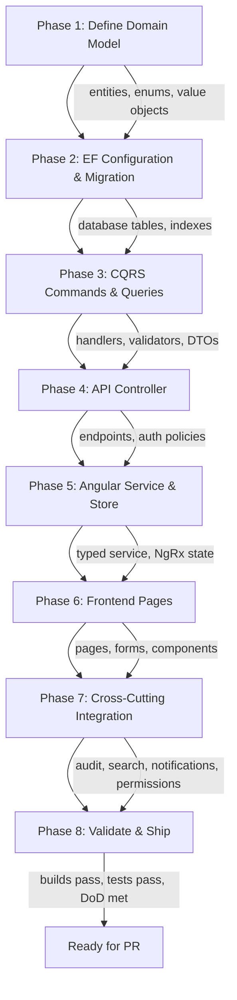
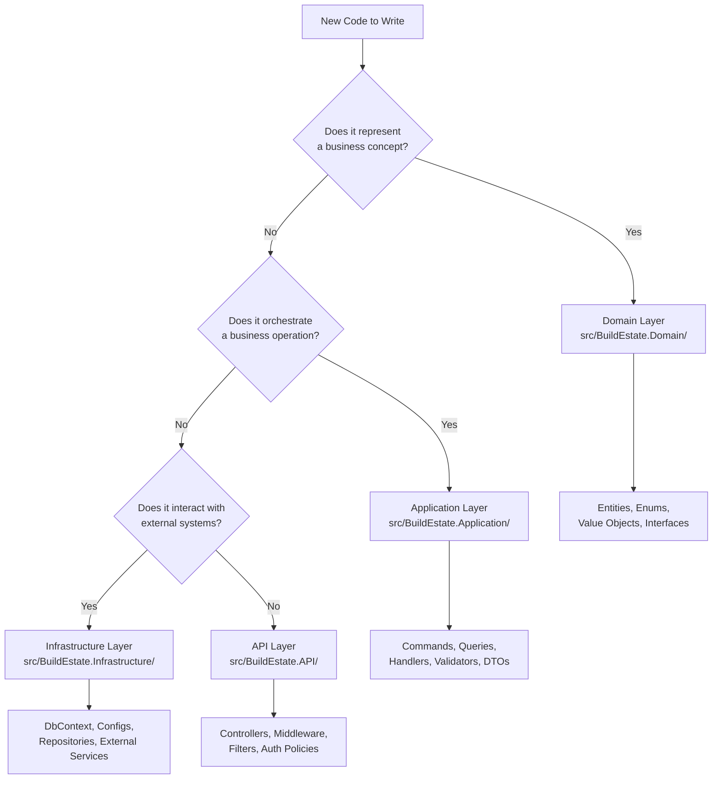
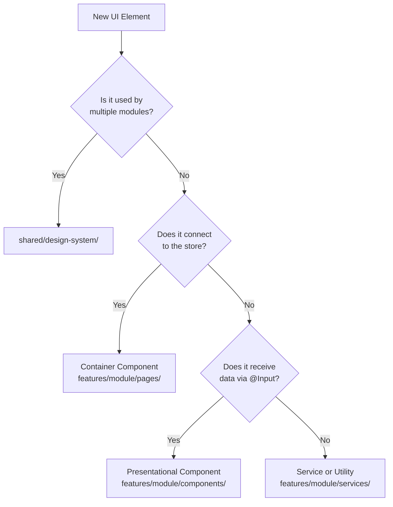

# How to Build the Next Module — Step-by-Step Playbook

**Estimated Reading Time:** 18 minutes

---

## WHY

BuildEstate Pro has 14 core modules to implement. Each module must follow the same architectural patterns established by Land Acquisition. This playbook provides a repeatable, verified process that any developer can follow to build a new module from scratch. It eliminates guesswork, ensures consistency, and guarantees that every module meets the Definition of Done before merging. Following this playbook means the 5th module feels as natural to build as the 2nd.

---

## WHAT

Building a new module is an 8-phase process. Each phase has clear inputs, outputs, and validation criteria. The phases are sequential — you cannot skip ahead without completing the previous phase.

### Module Build Process Overview



### Decision Tree — Where Does This Code Go?



### Decision Tree — Frontend Component Type



---

## HOW

### Phase 1: Define Domain Model

Create entities in `src/BuildEstate.Domain/Entities/{ModuleName}/`

```csharp
// src/BuildEstate.Domain/Entities/Construction/ConstructionStage.cs
namespace BuildEstate.Domain.Entities.Construction;

public class ConstructionStage : BaseAuditableEntity
{
    public Guid Id { get; set; }
    public string Name { get; set; } = string.Empty;
    public string Description { get; set; } = string.Empty;
    public Guid ProjectId { get; set; }
    public ConstructionStageStatus Status { get; set; }
    public int SortOrder { get; set; }
    public decimal PercentComplete { get; set; }
    public DateTime? StartDate { get; set; }
    public DateTime? CompletionDate { get; set; }
    public byte[] RowVersion { get; set; } = Array.Empty<byte>();

    // Navigation properties
    public virtual ICollection<SiteInspection> Inspections { get; set; } = new List<SiteInspection>();
    public virtual ICollection<SnaggingItem> SnaggingItems { get; set; } = new List<SnaggingItem>();
}
```

**Checklist:**
- [ ] Entity inherits from `BaseAuditableEntity` (CreatedAt, CreatedBy, UpdatedAt, UpdatedBy, IsDeleted)
- [ ] `Guid Id` as primary key
- [ ] `byte[] RowVersion` for concurrency
- [ ] Status enum defined with all valid states
- [ ] Navigation properties for relationships
- [ ] No business logic in entity (keep it anemic for CQRS)

### Phase 2: Create EF Configuration & Migration

```csharp
// src/BuildEstate.Infrastructure/Persistence/Configurations/Construction/ConstructionStageConfiguration.cs
public class ConstructionStageConfiguration : IEntityTypeConfiguration<ConstructionStage>
{
    public void Configure(EntityTypeBuilder<ConstructionStage> builder)
    {
        builder.ToTable("ConstructionStages");
        builder.HasKey(x => x.Id);

        builder.Property(x => x.Name).IsRequired().HasMaxLength(200);
        builder.Property(x => x.Description).HasMaxLength(2000);
        builder.Property(x => x.Status).IsRequired();
        builder.Property(x => x.PercentComplete).HasPrecision(5, 2);
        builder.Property(x => x.RowVersion).IsRowVersion();

        // Indexes
        builder.HasIndex(x => x.ProjectId);
        builder.HasIndex(x => x.Status);
        builder.HasIndex(x => new { x.ProjectId, x.SortOrder });

        // Relationships
        builder.HasMany(x => x.Inspections)
            .WithOne(i => i.Stage)
            .HasForeignKey(i => i.StageId)
            .OnDelete(DeleteBehavior.Restrict);

        // Query filter for soft delete
        builder.HasQueryFilter(x => !x.IsDeleted);
    }
}
```

Then run:
```bash
dotnet ef migrations add AddConstructionStages --project src/BuildEstate.Infrastructure --startup-project src/BuildEstate.API
dotnet ef database update --project src/BuildEstate.Infrastructure --startup-project src/BuildEstate.API
```

### Phase 3: Implement CQRS Commands/Queries

**Command:**
```csharp
// src/BuildEstate.Application/Features/Construction/Commands/CreateStage/CreateStageCommand.cs
public record CreateStageCommand : IRequest<ConstructionStageDto>
{
    public string Name { get; init; } = string.Empty;
    public string Description { get; init; } = string.Empty;
    public Guid ProjectId { get; init; }
    public DateTime? StartDate { get; init; }
}
```

**Validator:**
```csharp
public class CreateStageCommandValidator : AbstractValidator<CreateStageCommand>
{
    public CreateStageCommandValidator()
    {
        RuleFor(x => x.Name)
            .NotEmpty().WithMessage("Stage name is required")
            .MaximumLength(200).WithMessage("Stage name cannot exceed 200 characters");

        RuleFor(x => x.ProjectId)
            .NotEmpty().WithMessage("Project is required");

        RuleFor(x => x.StartDate)
            .GreaterThan(DateTime.UtcNow.Date)
            .When(x => x.StartDate.HasValue)
            .WithMessage("Start date must be in the future");
    }
}
```

### Phase 4: Create API Controller

```csharp
// src/BuildEstate.API/Controllers/Construction/ConstructionStagesController.cs
[ApiController]
[Route("api/v1/construction-stages")]
[Authorize(Policy = "CanManageConstruction")]
public class ConstructionStagesController : ControllerBase
{
    private readonly IMediator _mediator;

    public ConstructionStagesController(IMediator mediator) => _mediator = mediator;

    [HttpPost]
    public async Task<IActionResult> Create(
        [FromBody] CreateStageCommand command,
        CancellationToken cancellationToken)
    {
        var result = await _mediator.Send(command, cancellationToken);
        return CreatedAtAction(nameof(GetById), new { id = result.Id }, result);
    }

    [HttpGet("{id:guid}")]
    public async Task<IActionResult> GetById(Guid id, CancellationToken cancellationToken)
    {
        var result = await _mediator.Send(new GetStageByIdQuery { Id = id }, cancellationToken);
        return Ok(result);
    }

    [HttpGet]
    public async Task<IActionResult> GetAll(
        [FromQuery] GetStagesQuery query,
        CancellationToken cancellationToken)
    {
        var result = await _mediator.Send(query, cancellationToken);
        return Ok(result);
    }
}
```

### Phase 5: Build Angular Service & Store

```typescript
// client-app/src/app/features/construction/services/construction-stage.service.ts
@Injectable({ providedIn: 'root' })
export class ConstructionStageService {
  private readonly http = inject(HttpClient);
  private readonly baseUrl = `${environment.apiUrl}/construction-stages`;

  getAll(params: ListParams): Observable<PaginatedResponse<ConstructionStageDto>> {
    const httpParams = new HttpParams()
      .set('pageNumber', params.pageNumber.toString())
      .set('pageSize', params.pageSize.toString());
    return this.http.get<PaginatedResponse<ConstructionStageDto>>(this.baseUrl, { params: httpParams });
  }

  create(dto: CreateStageDto): Observable<ConstructionStageDto> {
    return this.http.post<ConstructionStageDto>(this.baseUrl, dto);
  }
}
```

### Phase 6–8: Build Pages, Integrate Cross-Cutting, Validate

Phases 6–8 follow naturally from the patterns above. Build list/detail/create pages, integrate audit logging, register search provider, add notification triggers, verify builds pass, and run tests.

---

## WHEN

- **Start of each sprint:** Choose the next module from the recommended build order
- **After Land Acquisition is stable:** All patterns are established — subsequent modules are faster
- **Parallel development:** Frontend and backend can begin simultaneously once DTOs are agreed
- **Cross-cutting integration:** Do this LAST within a module — it depends on core CRUD being complete

---

## WHERE

### Codebase Location

| Layer | Path Pattern |
|-------|-------------|
| Domain | `src/BuildEstate.Domain/Entities/{ModuleName}/` |
| Enums | `src/BuildEstate.Domain/Enums/{ModuleName}/` |
| Application | `src/BuildEstate.Application/Features/{ModuleName}/` |
| Infrastructure | `src/BuildEstate.Infrastructure/Persistence/Configurations/{ModuleName}/` |
| API | `src/BuildEstate.API/Controllers/{ModuleName}/` |
| Angular Feature | `client-app/src/app/features/{module-name}/` |
| Angular Store | `client-app/src/app/features/{module-name}/store/` |
| Angular Services | `client-app/src/app/features/{module-name}/services/` |
| Angular Pages | `client-app/src/app/features/{module-name}/pages/` |
| Angular Components | `client-app/src/app/features/{module-name}/components/` |
| Angular Models | `client-app/src/app/features/{module-name}/models/` |

---

## WHO

| Role | Responsibility in Module Build |
|------|-------------------------------|
| Backend Developer | Phases 1–4 (Domain, EF, CQRS, API) |
| Frontend Developer | Phases 5–6 (Service, Store, Pages) |
| Full-Stack Developer | All phases |
| Tech Lead | Phase 7 review, Phase 8 validation |
| QA Engineer | Phase 8 (test execution, exploratory testing) |

---

## WHAT NEXT

- [Definition of Done](./25-definition-of-done.md) — Checklist that must pass before any module ships
- [Common Mistakes](./26-common-mistakes.md) — Pitfalls to avoid during module development
- [Testing Strategy](./29-testing-strategy.md) — How to test each phase of the module
- [Module Pattern](./19-module-pattern.md) — The established module pattern explained
- [Future Roadmap](./31-future-roadmap.md) — Which module to build next

---

## Integration Steps

1. **Create folder structure** — Backend domain, application, infrastructure, API folders; Frontend feature folder with services, store, pages, components, models subfolders
2. **Define entities and enums** — Start with the aggregate root entity and its status enum
3. **Configure EF Core** — Fluent API configuration with indexes, constraints, query filters
4. **Run migration** — Generate and apply database migration
5. **Build CQRS layer** — Commands, queries, handlers, validators, DTOs with AutoMapper profiles
6. **Create controller** — Thin controller with authorization policies
7. **Build Angular service** — Typed HTTP service matching API contract
8. **Create NgRx store** — Actions, reducer, effects, selectors
9. **Build pages** — Dashboard, List, Detail, Create, Edit
10. **Integrate cross-cutting** — Audit logging, search provider, notifications, permissions

---

## Common Mistakes

### Mistake 1: Skipping the Validator

❌ **WRONG**

```csharp
// No validator — invalid data reaches the handler
public class CreateStageCommandHandler : IRequestHandler<CreateStageCommand, StageDto>
{
    public async Task<StageDto> Handle(CreateStageCommand request, CancellationToken ct)
    {
        // If request.Name is null or empty, we get a DB constraint violation
        var entity = new ConstructionStage { Name = request.Name };
        await _context.ConstructionStages.AddAsync(entity, ct);
        await _context.SaveChangesAsync(ct); // SqlException!
        return _mapper.Map<StageDto>(entity);
    }
}
```

✅ **CORRECT**

```csharp
// Validator runs BEFORE handler via MediatR pipeline
public class CreateStageCommandValidator : AbstractValidator<CreateStageCommand>
{
    public CreateStageCommandValidator()
    {
        RuleFor(x => x.Name).NotEmpty().MaximumLength(200);
        RuleFor(x => x.ProjectId).NotEmpty();
    }
}

// Handler can trust input is already validated
public class CreateStageCommandHandler : IRequestHandler<CreateStageCommand, StageDto>
{
    public async Task<StageDto> Handle(CreateStageCommand request, CancellationToken ct)
    {
        var entity = new ConstructionStage
        {
            Id = Guid.NewGuid(),
            Name = request.Name, // Guaranteed non-empty, max 200 chars
            ProjectId = request.ProjectId,
            Status = ConstructionStageStatus.NotStarted,
            CreatedAt = DateTime.UtcNow,
            CreatedBy = _currentUser.UserId
        };
        await _context.ConstructionStages.AddAsync(entity, ct);
        await _context.SaveChangesAsync(ct);
        return _mapper.Map<StageDto>(entity);
    }
}
```

### Mistake 2: Registering Routes Without Lazy Loading

❌ **WRONG**

```typescript
// Eagerly imported — increases initial bundle size
import { ConstructionDashboardComponent } from './features/construction/pages/dashboard.component';

export const routes: Routes = [
  { path: 'construction', component: ConstructionDashboardComponent }
];
```

✅ **CORRECT**

```typescript
// Lazy loaded — only downloads when user navigates to this route
export const routes: Routes = [
  {
    path: 'construction',
    loadChildren: () => import('./features/construction/construction.routes')
      .then(m => m.CONSTRUCTION_ROUTES),
    canActivate: [authGuard, roleGuard],
    data: { roles: ['ProjectManager', 'SiteManager', 'SuperAdmin'] }
  }
];
```
