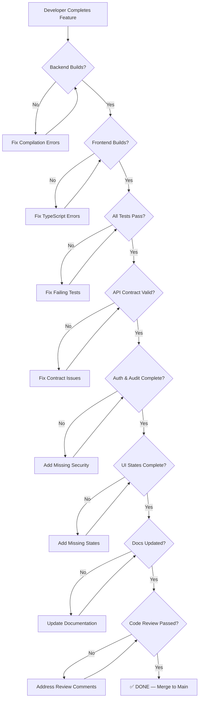

# Definition of Done

**Estimated Reading Time:** 8 minutes

---

## WHY

A feature is only "done" when it meets every quality standard simultaneously. Without a clear Definition of Done (DoD), developers ship incomplete work — tests pass but audit logging is missing, the UI renders but accessibility fails, the API works but authorization is absent. The DoD prevents this by establishing an unambiguous checklist that must be satisfied before any feature is merged to main. It protects the team from accumulating invisible technical debt.

---

## WHAT

The Definition of Done is organized into 8 categories, each containing specific pass/fail criteria. Every item must be verified before a pull request is approved.

### DoD Workflow



---

## HOW

### Category 1: Backend Build & Tests

```csharp
// Verification command
// dotnet build should produce 0 errors, 0 warnings (treat warnings as errors)
// dotnet test should produce 0 failures

[Fact]
public async Task CreateStage_WithValidData_ReturnsCreatedDto()
{
    // Arrange
    var command = new CreateStageCommand { Name = "Foundations", ProjectId = _projectId };

    // Act
    var result = await _handler.Handle(command, CancellationToken.None);

    // Assert
    result.Should().NotBeNull();
    result.Name.Should().Be("Foundations");
    result.Status.Should().Be(ConstructionStageStatus.NotStarted);
}
```

- [ ] `dotnet build` passes with 0 errors
- [ ] `dotnet test` passes with 0 failures
- [ ] All command handler tests written and green
- [ ] All validator tests written and green
- [ ] State transition tests cover valid and invalid paths

### Category 2: Frontend Build & Tests

```typescript
// Verification command
// npx tsc --noEmit should produce 0 errors
// ng test --watch=false should produce 0 failures

describe('constructionReducer', () => {
  it('should add stage on createStageSuccess', () => {
    const stage: ConstructionStageDto = { id: '1', name: 'Foundations', status: 'NotStarted' };
    const action = createStageSuccess({ stage });
    const state = constructionReducer(initialState, action);

    expect(state.stages.length).toBe(1);
    expect(state.stages[0].name).toBe('Foundations');
  });
});
```

- [ ] `npx tsc --noEmit` passes with 0 errors
- [ ] `ng test --watch=false` passes with 0 failures
- [ ] Component tests exist for complex interactions
- [ ] Reducer tests cover all action handlers
- [ ] No `any` types in TypeScript

### Category 3: API Contract & Validation

- [ ] All endpoints return correct HTTP status codes (200, 201, 204, 400, 401, 403, 404, 409)
- [ ] All commands have FluentValidation validators
- [ ] Validation errors return structured error response
- [ ] Pagination supported on all list endpoints
- [ ] Search, filter, sort supported where applicable
- [ ] DTOs are separate from domain entities (never expose domain directly)
- [ ] RowVersion used for optimistic concurrency on updates

### Category 4: Authorization & Audit

- [ ] `[Authorize]` attribute on every controller
- [ ] Policy-based authorization on sensitive endpoints
- [ ] Role-based route guards on all Angular routes
- [ ] Audit log entries created for every create, update, delete
- [ ] Audit entries include: who, what, when, old values, new values
- [ ] Unauthorized requests return 403 (not 500 or empty)

### Category 5: UI States

- [ ] Loading state shown during async operations
- [ ] Empty state with guidance when no data exists
- [ ] Error state with user-friendly message on failure
- [ ] Success toast/notification on successful operations
- [ ] Confirmation dialog on destructive actions (delete, deactivate)
- [ ] Form validation messages displayed on blur/submit
- [ ] Unsaved changes warning if navigating away from dirty form

### Category 6: Documentation

- [ ] API endpoints documented (Swagger/OpenAPI)
- [ ] Help article exists for the feature
- [ ] Component catalog updated if new shared components created
- [ ] Search module registration document updated
- [ ] Release notes drafted

### Category 7: Code Review

- [ ] No business logic in controllers
- [ ] No business logic in Angular components
- [ ] Single Responsibility maintained
- [ ] No N+1 queries
- [ ] CancellationToken passed through all async chains
- [ ] No hardcoded strings (use constants or enums)
- [ ] OnPush change detection on all components

### Category 8: Search & Discoverability

- [ ] Search provider registered implementing `ISearchProvider`
- [ ] Search fields defined with appropriate weights
- [ ] Navigation route verified (search result links to correct detail page)
- [ ] Permission filtering applied server-side

---

## WHEN

- **Before creating a PR:** Developer self-checks against this DoD
- **During code review:** Reviewer verifies DoD compliance
- **Before merge:** Final sign-off confirms all categories pass
- **Sprint review:** Demonstrate that shipped features meet DoD
- **Retrospective:** Review any DoD items that were missed and add preventive measures

---

## WHERE

### Codebase Location

| Artifact | Path |
|----------|------|
| Backend Tests | `tests/BuildEstate.Application.Tests/` |
| Frontend Tests | `client-app/src/app/**/*.spec.ts` |
| Validator Tests | `tests/BuildEstate.Application.Tests/Validators/` |
| Integration Tests | `tests/BuildEstate.API.IntegrationTests/` |
| This Document | `docs/academy/25-definition-of-done.md` |
| Tasks Spec | `.kiro/specs/*/tasks.md` |

---

## WHO

| Role | DoD Responsibility |
|------|-------------------|
| Developer | Self-verify all 8 categories before PR |
| Code Reviewer | Independently verify categories 1-4, 7 |
| QA Engineer | Verify categories 5, 6 |
| Tech Lead | Final sign-off on architecture compliance |
| Product Owner | Verify business requirements met |

---

## WHAT NEXT

- [Code Review Checklist](./27-code-review-checklist.md) — Detailed pass/fail items for reviewers
- [Testing Strategy](./29-testing-strategy.md) — How to write tests that satisfy the DoD
- [Common Mistakes](./26-common-mistakes.md) — Pitfalls that cause DoD failures
- [Production Readiness](./30-production-readiness.md) — Extended checklist for production deployment

---

## Integration Steps

1. **Copy checklist** — Copy this DoD into your PR description template
2. **Automate what you can** — CI pipeline runs `dotnet build`, `dotnet test`, `npx tsc --noEmit`, `ng test`
3. **Manual verification** — UI states, accessibility, and documentation require human review
4. **Block merges** — Configure branch protection to require passing CI and code review approval
5. **Track debt** — If any DoD item is deliberately skipped (with justification), log it as tech debt

---

## Common Mistakes

### Mistake 1: Marking "Done" Without Running Tests

❌ **WRONG**

```
PR Description: "Feature complete, all code written"
Status: Ready for merge
Tests: "Will add later"
```

✅ **CORRECT**

```
PR Description: "Feature complete with all DoD items verified"
CI Status: ✅ Build passing, ✅ 47 tests passing, ✅ 0 TypeScript errors
Checklist: All 8 categories checked and evidenced
```

### Mistake 2: Skipping Empty/Error States in the UI

❌ **WRONG**

```typescript
// Component only handles the happy path
@Component({ template: `
  <table>
    <tr *ngFor="let item of items">
      <td>{{ item.name }}</td>
    </tr>
  </table>
` })
export class StageListComponent {
  items = this.store.select(selectStages);
}
```

✅ **CORRECT**

```typescript
@Component({ template: `
  @if (loading()) {
    <app-loading-spinner />
  } @else if (error()) {
    <app-error-state [message]="error()!" (retry)="reload()" />
  } @else if (items().length === 0) {
    <app-empty-state
      title="No Construction Stages"
      description="Create your first stage to begin tracking construction progress."
      actionLabel="Create Stage"
      (action)="navigateToCreate()" />
  } @else {
    <app-data-table [data]="items()" [columns]="columns" />
  }
` })
export class StageListComponent {
  loading = this.store.selectSignal(selectLoading);
  error = this.store.selectSignal(selectError);
  items = this.store.selectSignal(selectStages);
}
```
