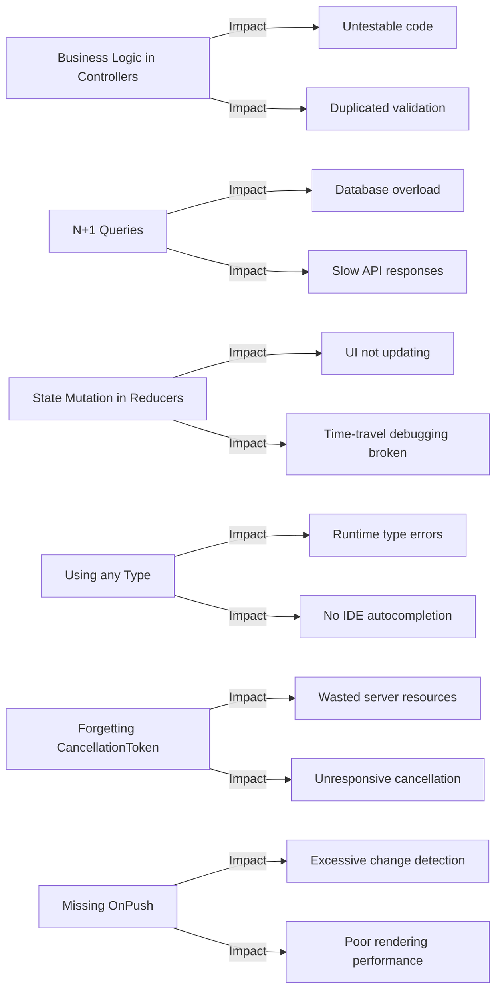

# Common Mistakes & Anti-Patterns

**Estimated Reading Time:** 12 minutes

---

## WHY

Every codebase accumulates technical debt when developers repeat the same mistakes. By documenting the most common anti-patterns found during BuildEstate Pro code reviews, we help developers avoid them proactively. Each mistake listed here has been observed in real implementations and directly impacts either performance, security, maintainability, or correctness. Learning these patterns saves hours of debugging and prevents production incidents.

---

## WHAT

This document catalogues 6 critical anti-patterns observed across the BuildEstate Pro codebase. Each includes a clear explanation of why it's harmful, a before/after code comparison, and the specific impact if left unaddressed.

### Anti-Pattern Impact Map



---

## HOW

### Anti-Pattern 1: Business Logic in Controllers

**Why it's harmful:** Controllers should be thin dispatchers. When business logic lives in controllers, it becomes untestable without spinning up the full HTTP pipeline, duplicated across endpoints, and impossible to reuse from background jobs or event handlers.

❌ **WRONG**

```csharp
[HttpPost]
public async Task<IActionResult> CreateOpportunity([FromBody] CreateOpportunityDto dto)
{
    // Business validation in controller!
    if (await _context.LandOpportunities.AnyAsync(o => o.Name == dto.Name))
        return Conflict("Opportunity with this name already exists");

    // Entity construction in controller!
    var entity = new LandOpportunity
    {
        Id = Guid.NewGuid(),
        Name = dto.Name,
        Location = dto.Location,
        Status = OpportunityStatus.Identified,
        CreatedAt = DateTime.UtcNow,
        CreatedBy = User.FindFirst(ClaimTypes.NameIdentifier)?.Value
    };

    // Persistence in controller!
    _context.LandOpportunities.Add(entity);
    await _context.SaveChangesAsync();

    // Notification logic in controller!
    await _notificationService.NotifyAsync(
        "New opportunity created", entity.Name);

    return CreatedAtAction(nameof(GetById), new { id = entity.Id }, entity);
}
```

✅ **CORRECT**

```csharp
[HttpPost]
public async Task<IActionResult> CreateOpportunity(
    [FromBody] CreateOpportunityCommand command,
    CancellationToken cancellationToken)
{
    var result = await _mediator.Send(command, cancellationToken);
    return CreatedAtAction(nameof(GetById), new { id = result.Id }, result);
}
```

All business logic lives in the handler, validated by FluentValidation, testable in isolation.

---

### Anti-Pattern 2: N+1 Queries in EF Core

**Why it's harmful:** Each iteration of a loop triggers a separate SQL query. With 100 opportunities, you get 101 queries instead of 1-2. This causes exponential database load, violates the 300ms API response target, and degrades under production traffic.

❌ **WRONG**

```csharp
public async Task<List<OpportunityWithOwnerDto>> GetAllAsync(CancellationToken ct)
{
    var opportunities = await _context.LandOpportunities.ToListAsync(ct);
    var result = new List<OpportunityWithOwnerDto>();

    foreach (var opp in opportunities)
    {
        // N+1: Each iteration executes a separate SQL query!
        var owner = await _context.LandOwners.FindAsync(opp.LandOwnerId);
        result.Add(new OpportunityWithOwnerDto
        {
            Name = opp.Name,
            OwnerName = owner?.Name ?? "Unknown"
        });
    }

    return result;
}
```

✅ **CORRECT**

```csharp
public async Task<List<OpportunityWithOwnerDto>> GetAllAsync(CancellationToken ct)
{
    return await _context.LandOpportunities
        .AsNoTracking()
        .Include(o => o.LandOwner) // Single JOIN query
        .Select(o => new OpportunityWithOwnerDto
        {
            Name = o.Name,
            OwnerName = o.LandOwner != null ? o.LandOwner.Name : "Unknown"
        })
        .ToListAsync(ct);
}
```

Alternative with projection (even better — only selects needed columns):

```csharp
public async Task<List<OpportunityWithOwnerDto>> GetAllAsync(CancellationToken ct)
{
    return await _context.LandOpportunities
        .AsNoTracking()
        .Select(o => new OpportunityWithOwnerDto
        {
            Id = o.Id,
            Name = o.Name,
            Location = o.Location,
            OwnerName = o.LandOwner!.Name
        })
        .ToListAsync(ct);
}
```

---

### Anti-Pattern 3: State Mutation in NgRx Reducers

**Why it's harmful:** NgRx relies on immutable state. Mutating state objects directly means change detection doesn't detect differences, selectors don't re-emit, components don't re-render, and time-travel debugging (Redux DevTools) breaks completely.

❌ **WRONG**

```typescript
on(OpportunityActions.loadOpportunitiesSuccess, (state, { opportunities }) => {
  state.opportunities = opportunities; // MUTATION! Breaks NgRx contract
  state.loading = false;
  return state; // Same reference — selectors won't fire
})

on(OpportunityActions.updateOpportunitySuccess, (state, { opportunity }) => {
  const index = state.opportunities.findIndex(o => o.id === opportunity.id);
  state.opportunities[index] = opportunity; // MUTATION of array element!
  return state;
})
```

✅ **CORRECT**

```typescript
on(OpportunityActions.loadOpportunitiesSuccess, (state, { opportunities }) => ({
  ...state, // New state object (immutable)
  opportunities: [...opportunities], // New array reference
  loading: false,
  error: null
}))

on(OpportunityActions.updateOpportunitySuccess, (state, { opportunity }) => ({
  ...state,
  opportunities: state.opportunities.map(o =>
    o.id === opportunity.id ? { ...opportunity } : o // New object for updated item
  ),
  selectedOpportunity: state.selectedOpportunity?.id === opportunity.id
    ? { ...opportunity }
    : state.selectedOpportunity
}))
```

---

### Anti-Pattern 4: Using `any` Type in TypeScript

**Why it's harmful:** The `any` type disables TypeScript's entire type system for that value. You lose autocomplete, compile-time error detection, refactoring safety, and documentation. Bugs that TypeScript would catch at compile time become runtime errors in production.

❌ **WRONG**

```typescript
export class OpportunityService {
  getAll(params: any): Observable<any> {
    return this.http.get<any>(`${this.baseUrl}`, { params });
  }

  create(dto: any): Observable<any> {
    return this.http.post<any>(this.baseUrl, dto);
  }
}

// In component — no type safety at all
this.service.getAll({}).subscribe((data: any) => {
  this.items = data.results; // Could be data.data, data.items — no one knows
  this.total = data.count;   // Is it count? totalCount? total?
});
```

✅ **CORRECT**

```typescript
export interface OpportunityListParams {
  pageNumber: number;
  pageSize: number;
  status?: OpportunityStatus;
  search?: string;
  sortBy?: string;
  sortDirection?: 'asc' | 'desc';
}

export interface PaginatedResponse<T> {
  data: T[];
  pagination: {
    pageNumber: number;
    pageSize: number;
    totalCount: number;
    totalPages: number;
  };
}

export class OpportunityService {
  getAll(params: OpportunityListParams): Observable<PaginatedResponse<OpportunityDto>> {
    const httpParams = new HttpParams()
      .set('pageNumber', params.pageNumber.toString())
      .set('pageSize', params.pageSize.toString());
    return this.http.get<PaginatedResponse<OpportunityDto>>(this.baseUrl, { params: httpParams });
  }

  create(dto: CreateOpportunityDto): Observable<OpportunityDto> {
    return this.http.post<OpportunityDto>(this.baseUrl, dto);
  }
}
```

---

### Anti-Pattern 5: Forgetting CancellationToken

**Why it's harmful:** Without CancellationToken, the server continues processing a request even after the client disconnects. In a real scenario: user navigates away, browser cancels the HTTP request, but the server keeps running expensive database queries, file operations, or external API calls — wasting resources and potentially holding database locks.

❌ **WRONG**

```csharp
public class GetOpportunitiesQueryHandler : IRequestHandler<GetOpportunitiesQuery, PagedResult<OpportunityDto>>
{
    public async Task<PagedResult<OpportunityDto>> Handle(GetOpportunitiesQuery request)
    {
        // No CancellationToken — cannot be cancelled!
        var count = await _context.LandOpportunities.CountAsync();
        var items = await _context.LandOpportunities
            .Skip((request.Page - 1) * request.PageSize)
            .Take(request.PageSize)
            .ToListAsync(); // No cancellation token passed to EF Core

        return new PagedResult<OpportunityDto>
        {
            Data = _mapper.Map<List<OpportunityDto>>(items),
            TotalCount = count
        };
    }
}
```

✅ **CORRECT**

```csharp
public class GetOpportunitiesQueryHandler : IRequestHandler<GetOpportunitiesQuery, PagedResult<OpportunityDto>>
{
    public async Task<PagedResult<OpportunityDto>> Handle(
        GetOpportunitiesQuery request,
        CancellationToken cancellationToken)
    {
        var count = await _context.LandOpportunities
            .CountAsync(cancellationToken);

        var items = await _context.LandOpportunities
            .AsNoTracking()
            .Skip((request.Page - 1) * request.PageSize)
            .Take(request.PageSize)
            .ToListAsync(cancellationToken);

        return new PagedResult<OpportunityDto>
        {
            Data = _mapper.Map<List<OpportunityDto>>(items),
            TotalCount = count
        };
    }
}
```

---

### Anti-Pattern 6: Not Using OnPush Change Detection

**Why it's harmful:** Angular's default change detection runs on EVERY browser event (click, keypress, mousemove, timer, HTTP response) for EVERY component in the tree. With 50+ components on a dashboard page, this means thousands of unnecessary checks per second. OnPush tells Angular to only check a component when its inputs change or an observable emits.

❌ **WRONG**

```typescript
@Component({
  selector: 'app-opportunity-card',
  // No changeDetection specified — uses Default strategy
  // Angular checks this component on EVERY event in the entire app
  template: `
    <div class="card">
      <h3>{{ opportunity.name }}</h3>
      <p>{{ opportunity.location }}</p>
      <span class="badge">{{ opportunity.status }}</span>
    </div>
  `
})
export class OpportunityCardComponent {
  @Input() opportunity!: OpportunityDto;
}
```

✅ **CORRECT**

```typescript
@Component({
  selector: 'app-opportunity-card',
  standalone: true,
  changeDetection: ChangeDetectionStrategy.OnPush,
  // Only re-checked when @Input() reference changes
  template: `
    <div class="card">
      <h3>{{ opportunity.name }}</h3>
      <p>{{ opportunity.location }}</p>
      <app-status-badge [status]="opportunity.status" />
    </div>
  `
})
export class OpportunityCardComponent {
  @Input() opportunity!: OpportunityDto;
}
```

---

## WHEN

- **Code review:** Check every PR against these 6 patterns
- **Pair programming:** Flag patterns in real-time during pairing sessions
- **Onboarding:** New developers read this before writing their first feature
- **Retrospectives:** Track which anti-patterns keep appearing and reinforce training
- **Refactoring sprints:** Allocate time to fix existing instances of these patterns

---

## WHERE

### Codebase Location

| Anti-Pattern | Where to Check |
|-------------|---------------|
| Business logic in controllers | `src/BuildEstate.API/Controllers/` |
| N+1 queries | `src/BuildEstate.Application/Features/*/Queries/` |
| State mutation | `client-app/src/app/features/*/store/*.reducer.ts` |
| `any` type | `client-app/src/app/**/*.ts` |
| Missing CancellationToken | `src/BuildEstate.Application/Features/*/Handlers/` |
| Missing OnPush | `client-app/src/app/**/*.component.ts` |

---

## WHO

| Role | Action |
|------|--------|
| All Developers | Memorize these patterns, self-check before PR |
| Code Reviewers | Use as checklist during review |
| Tech Lead | Enforce zero-tolerance for these patterns |
| AI Coding Agents | Reference these patterns when generating code |

---

## WHAT NEXT

- [Code Review Checklist](./27-code-review-checklist.md) — Formal review criteria incorporating these patterns
- [Testing Strategy](./29-testing-strategy.md) — Tests that catch these patterns early
- [Definition of Done](./25-definition-of-done.md) — DoD items that prevent these patterns
- [Debugging Guide](./28-debugging-guide.md) — How to diagnose when these patterns cause issues

---

## Integration Steps

1. **Add to PR template** — Include "Anti-patterns checked" section in PR description
2. **Configure linting** — ESLint rules to catch `any` type usage
3. **Static analysis** — Configure `strict` TypeScript mode to prevent type erosion
4. **Code review automation** — Flag controllers with more than 5 lines of logic
5. **Performance monitoring** — Track query counts per request to catch N+1 patterns

---

## Common Mistakes

### Meta-Mistake 1: Assuming "It Works" Means "It's Correct"

❌ **WRONG** mentality:

```
"The feature works in development, so it's fine."
"I tested it with 3 records and it was fast."
"TypeScript compiled, so the types are correct."
```

✅ **CORRECT** mentality:

```
"Does this work with 100,000 records?"
"Is this testable in isolation?"
"Will the next developer understand this?"
"Does this follow the established patterns?"
```

### Meta-Mistake 2: Fixing Symptoms Instead of Root Causes

❌ **WRONG**

```typescript
// "The component isn't updating, so I'll force change detection"
constructor(private cdr: ChangeDetectorRef) {}

ngOnInit() {
  this.store.select(selectOpportunities).subscribe(data => {
    this.items = data;
    this.cdr.detectChanges(); // Band-aid for broken state management
  });
}
```

✅ **CORRECT**

```typescript
// Fix the root cause: use signals/async pipe with OnPush
items = this.store.selectSignal(selectOpportunities);
// Or use async pipe in template: *ngFor="let item of items$ | async"
```
