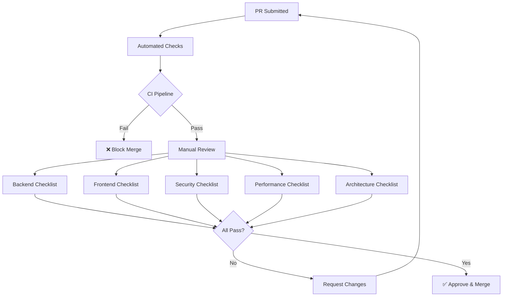

# Code Review Checklist

**Estimated Reading Time:** 10 minutes

---

## WHY

Code reviews are the last line of defence before code reaches the main branch. A review without a checklist is inconsistent — some reviewers catch security issues but miss performance problems, others spot architectural violations but overlook accessibility gaps. This checklist standardizes what every reviewer must verify, ensuring consistent quality regardless of who reviews the PR. It transforms code review from an opinion-based activity into an evidence-based verification process.

---

## WHAT

The checklist is organized into 5 categories: Backend, Frontend, Security, Performance, and Architecture. Each item is pass/fail — no partial credit. A PR cannot be approved until all applicable items pass.

### Code Review Flow



---

## HOW

### Backend Checklist (C# / ASP.NET Core)

```csharp
// Example of what a reviewer should look for:
// ✅ Thin controller — dispatches to MediatR only
[HttpPost]
public async Task<IActionResult> Create(
    [FromBody] CreateOpportunityCommand command,
    CancellationToken cancellationToken)
{
    var result = await _mediator.Send(command, cancellationToken);
    return CreatedAtAction(nameof(GetById), new { id = result.Id }, result);
}
```

| # | Check Item | Pass/Fail |
|---|-----------|-----------|
| B1 | Controllers are thin (MediatR dispatch only, no business logic) | ☐ |
| B2 | CancellationToken passed to all async methods | ☐ |
| B3 | FluentValidation validator exists for every command | ☐ |
| B4 | DTOs used at API boundary (no domain entity exposure) | ☐ |
| B5 | `[Authorize]` attribute present on controller or action | ☐ |
| B6 | Structured logging with meaningful properties (no string interpolation) | ☐ |
| B7 | No `Task.Result`, `.Wait()`, or `Task.Run()` for I/O | ☐ |
| B8 | Proper error handling (domain exceptions, not generic catch-all) | ☐ |

### Frontend Checklist (Angular / TypeScript)

```typescript
// Example of what a reviewer should look for:
// ✅ OnPush + standalone + typed inputs
@Component({
  standalone: true,
  changeDetection: ChangeDetectionStrategy.OnPush,
  imports: [CommonModule, StatusBadgeComponent]
})
export class OpportunityCardComponent {
  @Input() opportunity!: OpportunityDto; // Strongly typed, no 'any'
  @Output() statusChange = new EventEmitter<OpportunityStatus>();
}
```

| # | Check Item | Pass/Fail |
|---|-----------|-----------|
| F1 | `ChangeDetectionStrategy.OnPush` on all components | ☐ |
| F2 | `standalone: true` declared on all components | ☐ |
| F3 | No `any` type anywhere (strict TypeScript) | ☐ |
| F4 | NgRx state is immutable (spread operators, no mutation) | ☐ |
| F5 | Loading, empty, and error states handled in templates | ☐ |
| F6 | Observables properly unsubscribed (async pipe, takeUntilDestroyed, DestroyRef) | ☐ |
| F7 | No business logic in templates (use pipes or component methods) | ☐ |
| F8 | Reactive Forms with typed FormGroup (no template-driven forms) | ☐ |

### Security Checklist

| # | Check Item | Pass/Fail |
|---|-----------|-----------|
| S1 | Authorization policy on every endpoint | ☐ |
| S2 | Route guards (authGuard, roleGuard) on all Angular routes | ☐ |
| S3 | Input validation on both client AND server | ☐ |
| S4 | No sensitive data in URLs (use POST body or headers) | ☐ |
| S5 | No hardcoded secrets or connection strings | ☐ |
| S6 | File upload validates type, size, and content | ☐ |
| S7 | Audit trail entry for every create/update/delete | ☐ |
| S8 | Error messages don't expose internal implementation | ☐ |

### Performance Checklist

| # | Check Item | Pass/Fail |
|---|-----------|-----------|
| P1 | `.AsNoTracking()` on all read-only queries | ☐ |
| P2 | No N+1 queries (use Include or projections) | ☐ |
| P3 | Pagination on all list endpoints | ☐ |
| P4 | Lazy-loaded Angular routes (no eager imports) | ☐ |
| P5 | Database indexes on frequently queried columns | ☐ |
| P6 | No unnecessary API calls (check if data already in store) | ☐ |
| P7 | Debounce on search inputs (300ms minimum) | ☐ |

### Architecture Checklist

| # | Check Item | Pass/Fail |
|---|-----------|-----------|
| A1 | Clean Architecture layers respected (no upward dependencies) | ☐ |
| A2 | CQRS separation maintained (commands mutate, queries read) | ☐ |
| A3 | Single Responsibility (each class/component has one reason to change) | ☐ |
| A4 | Feature folder structure followed | ☐ |
| A5 | Shared components used where applicable (no duplication) | ☐ |
| A6 | State machine used for status transitions (no arbitrary status changes) | ☐ |
| A7 | Domain events or notifications triggered for key business actions | ☐ |

---

## WHEN

- **Every PR:** Reviewer runs through all applicable sections
- **Self-review:** Developer checks their own code before requesting review
- **Architecture review:** Tech Lead uses Architecture section for design reviews
- **Security audit:** Security team uses Security section for periodic audits

---

## WHERE

### Codebase Location

| Review Area | Where to Look |
|------------|---------------|
| Controllers | `src/BuildEstate.API/Controllers/` |
| Handlers | `src/BuildEstate.Application/Features/` |
| Validators | `src/BuildEstate.Application/Features/**/Commands/*/` |
| Components | `client-app/src/app/features/**/components/` |
| Reducers | `client-app/src/app/features/**/store/*.reducer.ts` |
| Services | `client-app/src/app/features/**/services/` |
| Guards | `client-app/src/app/core/guards/` |
| EF Configurations | `src/BuildEstate.Infrastructure/Persistence/Configurations/` |

---

## WHO

| Role | Usage |
|------|-------|
| Code Reviewer | Primary user — verify all items before approving |
| Developer | Self-review before submitting PR |
| Tech Lead | Enforce checklist compliance, resolve disputes |
| QA Engineer | Verify frontend checklist items F5 (UI states) |
| Security Champion | Deep dive into Security section |

---

## WHAT NEXT

- [Common Mistakes](./26-common-mistakes.md) — Detailed examples of what to reject
- [Definition of Done](./25-definition-of-done.md) — Broader quality criteria beyond code review
- [Testing Strategy](./29-testing-strategy.md) — Ensuring tests cover review criteria
- [Debugging Guide](./28-debugging-guide.md) — When reviewed code still has issues

---

## Integration Steps

1. **PR Template** — Add this checklist to your GitHub/GitLab PR template
2. **Required reviewers** — Configure branch protection to require at least 1 reviewer
3. **CI gates** — Automate B7, F1, F2, F3, P4 via linting rules
4. **Review rotation** — Rotate reviewers so everyone learns the full checklist
5. **Metrics** — Track which items are most frequently failed to target training

---

## Common Mistakes

### Mistake 1: Rubber-Stamping PRs

❌ **WRONG**

```
Reviewer: "LGTM 👍" (after 30 seconds of scrolling)
```

✅ **CORRECT**

```
Reviewer: "Reviewed against checklist:
- B1-B8: ✅ All pass
- F1: ⚠️ OpportunityCardComponent missing OnPush
- S3: ✅ Server validation present
- P2: ❌ Found N+1 in GetOpportunitiesHandler line 42
Please fix F1 and P2 before I can approve."
```

### Mistake 2: Reviewing Style Instead of Substance

❌ **WRONG**

```
Reviewer: "Can you rename this variable from 'opp' to 'opportunity'?"
(While missing that the controller has 50 lines of business logic)
```

✅ **CORRECT**

```
Reviewer: "Critical: Lines 15-65 contain business logic that should be in a handler.
Also: B2 — CancellationToken not passed to SaveChangesAsync on line 58.
Also: S1 — No [Authorize] attribute on this controller."
```
