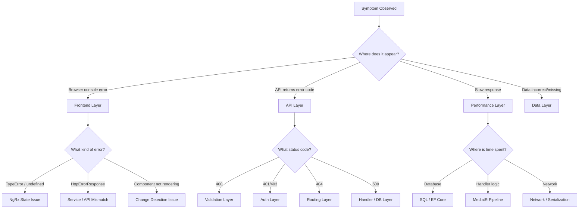

# Debugging Guide

**Estimated Reading Time:** 14 minutes

---

## WHY

BuildEstate Pro is a full-stack application with 6 distinct layers: SQL Server, EF Core, MediatR Pipeline, ASP.NET Core API, Angular Components, and NgRx State. When something goes wrong, the issue could originate at any layer. Without a systematic debugging approach, developers waste hours guessing where the problem lives. This guide provides a structured symptom → diagnostic → resolution flow for each layer, enabling rapid root cause identification.

---

## WHAT

Each layer has characteristic symptoms that point to specific categories of problems. By matching the symptom pattern to the correct layer, you can jump directly to the appropriate diagnostic tool and resolve issues efficiently.

### Debugging Layer Map



---

## HOW

### Layer 1: SQL Server

**Symptom:** Slow queries, timeout exceptions, deadlocks, constraint violations

**Diagnostic Steps:**

```csharp
// Enable EF Core SQL logging in Development
// In Program.cs or DbContext configuration:
optionsBuilder
    .UseSqlServer(connectionString)
    .LogTo(Console.WriteLine, LogLevel.Information)
    .EnableSensitiveDataLogging() // Shows parameter values (DEV ONLY!)
    .EnableDetailedErrors();
```

**Common Issues & Resolutions:**

| Symptom | Diagnostic | Resolution |
|---------|-----------|------------|
| Timeout on list queries | Check execution plan in SSMS | Add missing index |
| Constraint violation on save | Check unique index definition | Validate uniqueness before insert |
| Deadlock detected | Check lock ordering | Use `AsNoTracking()` for reads |
| Connection pool exhausted | Check for undisposed DbContext | Ensure Scoped lifetime |

```csharp
// Diagnostic: Check if index exists for common query pattern
// In SSMS:
// SELECT * FROM sys.indexes WHERE object_id = OBJECT_ID('LandOpportunities')
// If missing, add via migration:
builder.HasIndex(x => new { x.Status, x.CreatedAt })
    .HasDatabaseName("IX_LandOpportunities_Status_CreatedAt");
```

---

### Layer 2: EF Core

**Symptom:** Unexpected nulls, tracking conflicts, incorrect data returned, migration failures

**Diagnostic Steps:**

```csharp
// Debug tracking issues
var trackedEntities = _context.ChangeTracker.Entries()
    .Select(e => new
    {
        Entity = e.Entity.GetType().Name,
        State = e.State.ToString(),
        Id = e.Property("Id").CurrentValue
    })
    .ToList();

_logger.LogDebug("Tracked entities: {@TrackedEntities}", trackedEntities);
```

**Common Issues & Resolutions:**

| Symptom | Diagnostic | Resolution |
|---------|-----------|------------|
| Entity null after save | Check if query filter excludes it | Verify `IsDeleted` flag |
| Concurrency exception | Check RowVersion mismatch | Reload entity, apply changes, retry |
| Navigation property null | Check if Include was used | Add `.Include()` or use projection |
| Migration fails | Check pending model changes | `dotnet ef migrations list` |

```csharp
// Diagnostic: Concurrency conflict resolution
try
{
    await _context.SaveChangesAsync(cancellationToken);
}
catch (DbUpdateConcurrencyException ex)
{
    var entry = ex.Entries.Single();
    var currentValues = entry.CurrentValues;
    var databaseValues = await entry.GetDatabaseValuesAsync(cancellationToken);

    _logger.LogWarning(
        "Concurrency conflict for {EntityType} {EntityId}. " +
        "Client version: {ClientVersion}, DB version: {DbVersion}",
        entry.Entity.GetType().Name,
        entry.Property("Id").CurrentValue,
        currentValues["RowVersion"],
        databaseValues?["RowVersion"]);

    throw; // Let it propagate as 409 Conflict
}
```

---

### Layer 3: MediatR Pipeline

**Symptom:** Validation errors not surfacing, handler not executing, incorrect pipeline order

**Diagnostic Steps:**

```csharp
// Add diagnostic pipeline behavior to log every request
public class LoggingBehavior<TRequest, TResponse> 
    : IPipelineBehavior<TRequest, TResponse>
    where TRequest : IRequest<TResponse>
{
    private readonly ILogger<LoggingBehavior<TRequest, TResponse>> _logger;

    public async Task<TResponse> Handle(
        TRequest request,
        RequestHandlerDelegate<TResponse> next,
        CancellationToken cancellationToken)
    {
        var requestName = typeof(TRequest).Name;
        _logger.LogInformation("Processing {RequestName}: {@Request}", requestName, request);

        var stopwatch = Stopwatch.StartNew();
        var response = await next();
        stopwatch.Stop();

        _logger.LogInformation(
            "Completed {RequestName} in {ElapsedMs}ms",
            requestName, stopwatch.ElapsedMilliseconds);

        return response;
    }
}
```

**Common Issues & Resolutions:**

| Symptom | Diagnostic | Resolution |
|---------|-----------|------------|
| Validator not running | Check DI registration | Register in `AddValidatorsFromAssembly()` |
| Handler not found | Check handler implements correct interface | Verify `IRequestHandler<TCommand, TResponse>` |
| Pipeline timeout | Log before/after each behavior | Identify slow behavior in chain |

---

### Layer 4: ASP.NET Core API

**Symptom:** 400/401/403/404/500 responses, incorrect routing, missing headers

**Diagnostic Steps:**

```csharp
// Check what the client is actually sending
// Add request logging middleware:
app.Use(async (context, next) =>
{
    var logger = context.RequestServices.GetRequiredService<ILogger<Program>>();
    logger.LogDebug(
        "Request: {Method} {Path} | Auth: {IsAuthenticated} | User: {User}",
        context.Request.Method,
        context.Request.Path,
        context.User.Identity?.IsAuthenticated,
        context.User.Identity?.Name);
    await next();
});
```

**Common Issues & Resolutions:**

| Symptom | Diagnostic | Resolution |
|---------|-----------|------------|
| 404 on valid route | Check route attribute vs URL | Verify `[Route("api/v1/...")]` matches |
| 401 Unauthorized | Check JWT token expiry | Refresh token or re-authenticate |
| 403 Forbidden | Check user roles vs policy | Verify role assignment in Identity |
| 400 Bad Request | Check validation errors in response body | Fix request payload |
| 415 Unsupported Media | Check Content-Type header | Send `application/json` |

---

### Layer 5: Angular Components

**Symptom:** Component not rendering, data not displaying, events not firing

**Diagnostic Steps:**

```typescript
// Debug component lifecycle
export class OpportunityListComponent implements OnInit, OnDestroy {
  private readonly destroyRef = inject(DestroyRef);

  ngOnInit(): void {
    console.log('[OpportunityList] ngOnInit — dispatching load');
    this.store.dispatch(loadOpportunities({ params: this.defaultParams }));

    this.store.select(selectOpportunities).pipe(
      takeUntilDestroyed(this.destroyRef),
      tap(data => console.log('[OpportunityList] Data received:', data?.length, 'items'))
    ).subscribe();
  }

  ngOnDestroy(): void {
    console.log('[OpportunityList] ngOnDestroy — cleaning up');
  }
}
```

**Common Issues & Resolutions:**

| Symptom | Diagnostic | Resolution |
|---------|-----------|------------|
| Component blank | Check `*ngIf` / `@if` conditions | Verify data is loaded and not null |
| Data stale | Check if OnPush + input reference changed | Pass new object reference |
| Event not firing | Check `@Output()` binding in parent | Verify `(eventName)="handler($event)"` |
| Route not loading | Check lazy loading path | Verify `loadChildren` path is correct |

---

### Layer 6: NgRx State

**Symptom:** Action dispatched but state doesn't update, selectors return stale data, effects not triggering

**Diagnostic Steps:**

```typescript
// Install Redux DevTools browser extension
// In app.config.ts:
provideStore(reducers, {
  runtimeChecks: {
    strictStateImmutability: true,   // Throws on state mutation
    strictActionImmutability: true,  // Throws on action mutation
    strictStateSerializability: true,
    strictActionSerializability: true,
  }
}),
provideStoreDevtools({
  maxAge: 50,
  logOnly: environment.production,
  autoPause: true
})
```

**Common Issues & Resolutions:**

| Symptom | Diagnostic | Resolution |
|---------|-----------|------------|
| State not updating | Check Redux DevTools for action | Verify reducer handles action |
| Selector returns undefined | Check state shape in DevTools | Verify selector path matches state |
| Effect not firing | Check `ofType()` action matches | Verify action type string is exact |
| Infinite loop | Check if effect dispatches triggering action | Add `{ dispatch: false }` or break cycle |

```typescript
// Diagnostic: Trace selector emissions
this.store.select(selectOpportunities).pipe(
  tap(data => {
    console.group('[NgRx Debug] selectOpportunities');
    console.log('Count:', data?.length);
    console.log('First item:', data?.[0]);
    console.groupEnd();
  })
).subscribe();
```

---

## WHEN

- **During development:** Use these diagnostics when a feature isn't behaving as expected
- **Bug reports:** Start from the symptom layer and work inward
- **Performance issues:** Start at Layer 1 (SQL) since database is usually the bottleneck
- **UI issues:** Start at Layer 6 (NgRx) since state management drives the UI
- **Integration issues:** Start at Layer 4 (API) since it's the boundary between frontend and backend

---

## WHERE

### Codebase Location

| Diagnostic Tool | Path |
|----------------|------|
| EF Core logging config | `src/BuildEstate.API/Program.cs` |
| MediatR pipeline behaviors | `src/BuildEstate.Application/Common/Behaviors/` |
| Exception middleware | `src/BuildEstate.API/Middleware/` |
| NgRx DevTools config | `client-app/src/app/app.config.ts` |
| Angular interceptors | `client-app/src/app/core/interceptors/` |
| Environment config | `client-app/src/environments/` |

---

## WHO

| Role | Primary Debug Layers |
|------|---------------------|
| Backend Developer | Layers 1-4 (SQL, EF, MediatR, API) |
| Frontend Developer | Layers 5-6 (Angular, NgRx) |
| Full-Stack Developer | All layers |
| DevOps / Support | Layer 1 (SQL) + Layer 4 (API logs) |

---

## WHAT NEXT

- [Testing Strategy](./29-testing-strategy.md) — Prevent bugs before they need debugging
- [Common Mistakes](./26-common-mistakes.md) — The bugs you're probably debugging
- [Production Readiness](./30-production-readiness.md) — Logging and monitoring setup
- [CQRS and MediatR](./08-cqrs-and-mediatr.md) — Understanding the MediatR pipeline

---

## Integration Steps

1. **Enable structured logging** — Configure Serilog or built-in logging with correlation IDs
2. **Install Redux DevTools** — Browser extension for NgRx state inspection
3. **Configure EF Core logging** — `EnableSensitiveDataLogging()` in development only
4. **Add health check endpoint** — `/health` endpoint for quick connectivity verification
5. **Set up error tracking** — Application Insights or similar for production error aggregation

---

## Common Mistakes

### Mistake 1: Debugging Production Issues Without Correlation IDs

❌ **WRONG**

```
Log: "Error processing request"
Log: "Database connection failed"
// Which user? Which request? Which endpoint? No way to correlate.
```

✅ **CORRECT**

```csharp
// Correlation ID propagated through all layers:
_logger.LogError(
    "Error processing request {CorrelationId} for user {UserId} on {Endpoint}: {Error}",
    correlationId, userId, endpoint, ex.Message);

// Frontend sends correlation ID in header:
// X-Correlation-ID: 3f7a9b2c-1234-5678-abcd-ef0123456789
```

### Mistake 2: Using Console.log in Production Angular Code

❌ **WRONG**

```typescript
export class OpportunityListComponent {
  ngOnInit() {
    console.log('loading...'); // Left in production code!
    console.log('data:', this.data); // Exposes data in browser console
  }
}
```

✅ **CORRECT**

```typescript
export class OpportunityListComponent {
  private readonly logger = inject(LoggerService); // Custom service

  ngOnInit() {
    if (!environment.production) {
      this.logger.debug('OpportunityList initialized');
    }
    // Or use environment-aware logging that's stripped in production builds
  }
}
```
