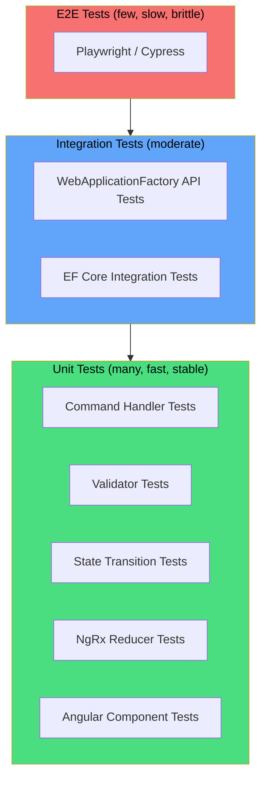

# Testing Strategy

**Estimated Reading Time:** 14 minutes

---

## WHY

BuildEstate Pro manages financial transactions, legal compliance, and regulatory data. A bug in a status transition could allow an unverified land purchase. A validation gap could accept invalid financial data. An authorization flaw could expose confidential legal documents. Comprehensive testing is not optional — it's a business requirement. Testing gives confidence that the system behaves correctly under all conditions, not just the happy path demonstrated during development.

---

## WHAT

The testing strategy covers 5 test types across the full stack: Command Handler Tests, Validator Tests, State Transition Tests, Angular Component Tests, and NgRx Reducer Tests. Each type targets a specific layer of the application with specific coverage expectations.

### Testing Pyramid



---

## HOW

### 1. Command Handler Test (xUnit + Moq + FluentAssertions)

**Pattern:** Arrange → Act → Assert (AAA)

**Naming Convention:** `MethodName_Scenario_ExpectedResult`

```csharp
// tests/BuildEstate.Application.Tests/Features/LandAcquisition/CreateOpportunityCommandHandlerTests.cs
using FluentAssertions;
using Moq;
using Xunit;

public class CreateOpportunityCommandHandlerTests
{
    private readonly Mock<IApplicationDbContext> _contextMock;
    private readonly Mock<IMapper> _mapperMock;
    private readonly Mock<ICurrentUserService> _currentUserMock;
    private readonly Mock<ILogger<CreateOpportunityCommandHandler>> _loggerMock;
    private readonly CreateOpportunityCommandHandler _handler;

    public CreateOpportunityCommandHandlerTests()
    {
        _contextMock = new Mock<IApplicationDbContext>();
        _mapperMock = new Mock<IMapper>();
        _currentUserMock = new Mock<ICurrentUserService>();
        _loggerMock = new Mock<ILogger<CreateOpportunityCommandHandler>>();

        _currentUserMock.Setup(x => x.UserId).Returns("test-user-id");

        var mockDbSet = new Mock<DbSet<LandOpportunity>>();
        _contextMock.Setup(x => x.LandOpportunities).Returns(mockDbSet.Object);

        _handler = new CreateOpportunityCommandHandler(
            _contextMock.Object,
            _mapperMock.Object,
            _currentUserMock.Object,
            _loggerMock.Object);
    }

    [Fact]
    public async Task Handle_WithValidCommand_CreatesOpportunityWithIdentifiedStatus()
    {
        // Arrange
        var command = new CreateOpportunityCommand
        {
            Name = "Croydon Development Site",
            Location = "London",
            LandSize = 2.5m,
            Source = "Agent Referral"
        };

        _mapperMock
            .Setup(m => m.Map<OpportunityDto>(It.IsAny<LandOpportunity>()))
            .Returns(new OpportunityDto { Id = Guid.NewGuid(), Name = command.Name });

        // Act
        var result = await _handler.Handle(command, CancellationToken.None);

        // Assert
        result.Should().NotBeNull();
        result.Name.Should().Be("Croydon Development Site");

        _contextMock.Verify(
            x => x.LandOpportunities.AddAsync(
                It.Is<LandOpportunity>(o =>
                    o.Status == OpportunityStatus.Identified &&
                    o.Name == "Croydon Development Site" &&
                    o.CreatedBy == "test-user-id"),
                It.IsAny<CancellationToken>()),
            Times.Once);

        _contextMock.Verify(
            x => x.SaveChangesAsync(It.IsAny<CancellationToken>()),
            Times.Once);
    }

    [Fact]
    public async Task Handle_WithValidCommand_SetsCreatedAtToUtcNow()
    {
        // Arrange
        var command = new CreateOpportunityCommand
        {
            Name = "Test Site",
            Location = "Manchester",
            LandSize = 1.0m
        };

        LandOpportunity capturedEntity = null!;
        _contextMock.Setup(x => x.LandOpportunities.AddAsync(
            It.IsAny<LandOpportunity>(), It.IsAny<CancellationToken>()))
            .Callback<LandOpportunity, CancellationToken>((e, _) => capturedEntity = e);

        _mapperMock
            .Setup(m => m.Map<OpportunityDto>(It.IsAny<LandOpportunity>()))
            .Returns(new OpportunityDto());

        // Act
        var before = DateTime.UtcNow;
        await _handler.Handle(command, CancellationToken.None);
        var after = DateTime.UtcNow;

        // Assert
        capturedEntity.CreatedAt.Should().BeOnOrAfter(before);
        capturedEntity.CreatedAt.Should().BeOnOrBefore(after);
    }
}
```

### 2. Validator Test

```csharp
// tests/BuildEstate.Application.Tests/Validators/CreateOpportunityCommandValidatorTests.cs
public class CreateOpportunityCommandValidatorTests
{
    private readonly CreateOpportunityCommandValidator _validator;

    public CreateOpportunityCommandValidatorTests()
    {
        _validator = new CreateOpportunityCommandValidator();
    }

    [Fact]
    public void Validate_WithEmptyName_ReturnsValidationError()
    {
        // Arrange
        var command = new CreateOpportunityCommand
        {
            Name = "",
            Location = "London",
            LandSize = 1.0m
        };

        // Act
        var result = _validator.Validate(command);

        // Assert
        result.IsValid.Should().BeFalse();
        result.Errors.Should().ContainSingle(e =>
            e.PropertyName == "Name" &&
            e.ErrorMessage.Contains("required"));
    }

    [Fact]
    public void Validate_WithNegativeLandSize_ReturnsValidationError()
    {
        // Arrange
        var command = new CreateOpportunityCommand
        {
            Name = "Valid Name",
            Location = "London",
            LandSize = -5.0m
        };

        // Act
        var result = _validator.Validate(command);

        // Assert
        result.IsValid.Should().BeFalse();
        result.Errors.Should().Contain(e =>
            e.PropertyName == "LandSize" &&
            e.ErrorMessage.Contains("greater than"));
    }

    [Theory]
    [InlineData("Valid Name", "London", 1.5, true)]
    [InlineData("", "London", 1.5, false)]
    [InlineData("Name", "", 1.5, false)]
    [InlineData("Name", "London", 0, false)]
    [InlineData("Name", "London", -1, false)]
    public void Validate_WithVariousInputs_ReturnsExpectedValidity(
        string name, string location, decimal size, bool expectedValid)
    {
        var command = new CreateOpportunityCommand
        {
            Name = name,
            Location = location,
            LandSize = size
        };

        var result = _validator.Validate(command);

        result.IsValid.Should().Be(expectedValid);
    }
}
```

### 3. State Transition Test

```csharp
// tests/BuildEstate.Application.Tests/StateMachine/OpportunityStateMachineTests.cs
public class OpportunityStateMachineTests
{
    [Theory]
    [InlineData(OpportunityStatus.Identified, OpportunityStatus.InitialReview, true)]
    [InlineData(OpportunityStatus.InitialReview, OpportunityStatus.DueDiligence, true)]
    [InlineData(OpportunityStatus.InitialReview, OpportunityStatus.Rejected, true)]
    [InlineData(OpportunityStatus.DueDiligence, OpportunityStatus.OfferMade, true)]
    [InlineData(OpportunityStatus.OfferMade, OpportunityStatus.UnderContract, true)]
    [InlineData(OpportunityStatus.UnderContract, OpportunityStatus.Acquired, true)]
    // Invalid transitions
    [InlineData(OpportunityStatus.Identified, OpportunityStatus.Acquired, false)]
    [InlineData(OpportunityStatus.Rejected, OpportunityStatus.OfferMade, false)]
    [InlineData(OpportunityStatus.Acquired, OpportunityStatus.Identified, false)]
    [InlineData(OpportunityStatus.DueDiligence, OpportunityStatus.Identified, false)]
    public void IsValidTransition_ReturnsExpectedResult(
        OpportunityStatus from,
        OpportunityStatus to,
        bool expectedValid)
    {
        // Act
        var result = OpportunityStateMachine.IsValidTransition(from, to);

        // Assert
        result.Should().Be(expectedValid);
    }

    [Fact]
    public void GetAllowedTransitions_FromIdentified_ReturnsOnlyInitialReview()
    {
        var allowed = OpportunityStateMachine.GetAllowedTransitions(OpportunityStatus.Identified);

        allowed.Should().ContainSingle()
            .Which.Should().Be(OpportunityStatus.InitialReview);
    }
}
```

### 4. Angular Component Test

```typescript
// client-app/src/app/features/land-acquisition/components/opportunity-card.component.spec.ts
import { ComponentFixture, TestBed } from '@angular/core/testing';
import { OpportunityCardComponent } from './opportunity-card.component';
import { OpportunityDto, OpportunityStatus } from '../models/opportunity.models';

describe('OpportunityCardComponent', () => {
  let component: OpportunityCardComponent;
  let fixture: ComponentFixture<OpportunityCardComponent>;

  const mockOpportunity: OpportunityDto = {
    id: '123',
    name: 'Test Opportunity',
    location: 'London',
    status: OpportunityStatus.Identified,
    landSize: 2.5,
    source: 'Agent',
    createdAt: '2024-01-15T10:00:00Z'
  };

  beforeEach(async () => {
    await TestBed.configureTestingModule({
      imports: [OpportunityCardComponent]
    }).compileComponents();

    fixture = TestBed.createComponent(OpportunityCardComponent);
    component = fixture.componentInstance;
    component.opportunity = mockOpportunity;
    fixture.detectChanges();
  });

  it('should display opportunity name', () => {
    const nameElement = fixture.nativeElement.querySelector('[data-testid="opportunity-name"]');
    expect(nameElement.textContent).toContain('Test Opportunity');
  });

  it('should display location', () => {
    const locationElement = fixture.nativeElement.querySelector('[data-testid="opportunity-location"]');
    expect(locationElement.textContent).toContain('London');
  });

  it('should emit statusChange when transition button clicked', () => {
    spyOn(component.statusChange, 'emit');
    const button = fixture.nativeElement.querySelector('[data-testid="transition-btn"]');

    button?.click();
    fixture.detectChanges();

    if (button) {
      expect(component.statusChange.emit).toHaveBeenCalled();
    }
  });

  it('should apply correct badge class for status', () => {
    const badge = fixture.nativeElement.querySelector('.badge');
    expect(badge.classList).toContain('badge-info'); // Identified = info
  });
});
```

### 5. NgRx Reducer Test

```typescript
// client-app/src/app/features/land-acquisition/store/opportunities.reducer.spec.ts
import { opportunitiesReducer, initialState, OpportunityState } from './opportunities.reducer';
import * as Actions from './opportunities.actions';
import { OpportunityDto, OpportunityStatus } from '../models/opportunity.models';

describe('OpportunitiesReducer', () => {
  const mockOpportunity: OpportunityDto = {
    id: '1',
    name: 'Test Site',
    location: 'London',
    status: OpportunityStatus.Identified,
    landSize: 3.0,
    source: 'Direct',
    createdAt: '2024-01-01T00:00:00Z'
  };

  it('should return initial state on unknown action', () => {
    const action = { type: 'UNKNOWN' };
    const state = opportunitiesReducer(undefined, action);
    expect(state).toEqual(initialState);
  });

  it('should set loading to true on loadOpportunities', () => {
    const action = Actions.loadOpportunities({ params: { pageNumber: 1, pageSize: 10 } });
    const state = opportunitiesReducer(initialState, action);

    expect(state.loading).toBe(true);
    expect(state.error).toBeNull();
  });

  it('should populate opportunities on loadOpportunitiesSuccess', () => {
    const opportunities = [mockOpportunity];
    const action = Actions.loadOpportunitiesSuccess({
      opportunities,
      pagination: { pageNumber: 1, pageSize: 10, totalCount: 1, totalPages: 1 }
    });

    const state = opportunitiesReducer(initialState, action);

    expect(state.opportunities).toEqual(opportunities);
    expect(state.loading).toBe(false);
    expect(state.error).toBeNull();
  });

  it('should set error on loadOpportunitiesFailure', () => {
    const action = Actions.loadOpportunitiesFailure({ error: 'Network error' });
    const state = opportunitiesReducer(initialState, action);

    expect(state.loading).toBe(false);
    expect(state.error).toBe('Network error');
  });

  it('should add opportunity on createOpportunitySuccess without mutating original', () => {
    const existingState: OpportunityState = {
      ...initialState,
      opportunities: [mockOpportunity]
    };

    const newOpportunity: OpportunityDto = { ...mockOpportunity, id: '2', name: 'New Site' };
    const action = Actions.createOpportunitySuccess({ opportunity: newOpportunity });
    const state = opportunitiesReducer(existingState, action);

    expect(state.opportunities.length).toBe(2);
    expect(existingState.opportunities.length).toBe(1); // Original not mutated
  });
});
```

---

## WHEN

- **Before PR:** All tests must pass before submitting for review
- **During CI:** Automated test run blocks merge on failure
- **After refactoring:** Run full test suite to verify no regressions
- **New feature:** Write tests alongside implementation (TDD encouraged)
- **Bug fix:** Write a failing test that reproduces the bug FIRST, then fix

---

## WHERE

### Codebase Location

| Test Type | Path |
|-----------|------|
| Handler Tests | `tests/BuildEstate.Application.Tests/Features/` |
| Validator Tests | `tests/BuildEstate.Application.Tests/Validators/` |
| State Machine Tests | `tests/BuildEstate.Application.Tests/StateMachine/` |
| Integration Tests | `tests/BuildEstate.API.IntegrationTests/` |
| Angular Tests | `client-app/src/app/**/*.spec.ts` |
| NgRx Tests | `client-app/src/app/features/**/store/*.spec.ts` |

---

## WHO

| Role | Testing Responsibility |
|------|----------------------|
| Backend Developer | Handler tests, validator tests, state transition tests |
| Frontend Developer | Component tests, reducer tests, selector tests |
| QA Engineer | Integration tests, E2E tests, exploratory testing |
| Tech Lead | Coverage review, test quality review |

---

## WHAT NEXT

- [Definition of Done](./25-definition-of-done.md) — Testing requirements within the DoD
- [Common Mistakes](./26-common-mistakes.md) — Patterns that need test coverage
- [Debugging Guide](./28-debugging-guide.md) — When tests pass but behavior is wrong
- [Production Readiness](./30-production-readiness.md) — Performance testing requirements

---

## Integration Steps

1. **Set up test projects** — `dotnet new xunit` for backend, Angular CLI generates `.spec.ts` files
2. **Install packages** — xUnit, Moq, FluentAssertions, Microsoft.EntityFrameworkCore.InMemory
3. **Configure CI** — Run `dotnet test` and `ng test --watch=false --browsers=ChromeHeadless`
4. **Coverage thresholds** — Configure minimum 90% for validators, 80% for handlers
5. **Test naming enforcement** — `MethodName_Scenario_ExpectedResult` pattern in all tests

---

## Coverage Expectations

| Layer | Minimum Coverage | Rationale |
|-------|-----------------|-----------|
| Validators | 100% | Every validation rule must be verified |
| Command Handlers | 90% | All business logic paths |
| State Transitions | 100% | Every valid and invalid transition |
| API Controllers | 80% | Integration tests cover routing |
| Angular Components | 70% | Critical interactions and rendering |
| NgRx Reducers | 100% | Every action handler |
| NgRx Selectors | 80% | Derived state calculations |

---

## Common Mistakes

### Mistake 1: Testing Implementation Instead of Behavior

❌ **WRONG**

```csharp
[Fact]
public async Task Handle_CallsAddAsyncOnce()
{
    // This tests HOW it works, not WHAT it does
    await _handler.Handle(command, CancellationToken.None);
    _contextMock.Verify(x => x.LandOpportunities.AddAsync(
        It.IsAny<LandOpportunity>(), default), Times.Once);
}
```

✅ **CORRECT**

```csharp
[Fact]
public async Task Handle_WithValidCommand_ReturnsOpportunityWithIdentifiedStatus()
{
    // This tests WHAT the behavior produces — the business outcome
    var result = await _handler.Handle(command, CancellationToken.None);

    result.Should().NotBeNull();
    result.Status.Should().Be(OpportunityStatus.Identified);
    result.Name.Should().Be(command.Name);
}
```

### Mistake 2: Shared State Between Tests

❌ **WRONG**

```typescript
describe('OpportunityReducer', () => {
  let sharedState: OpportunityState; // Shared mutable state!

  it('test 1', () => {
    sharedState = opportunitiesReducer(sharedState, action1);
    expect(sharedState.loading).toBe(true);
  });

  it('test 2 — DEPENDS on test 1 running first!', () => {
    sharedState = opportunitiesReducer(sharedState, action2);
    expect(sharedState.opportunities.length).toBe(1);
  });
});
```

✅ **CORRECT**

```typescript
describe('OpportunityReducer', () => {
  it('should set loading on load action', () => {
    const state = opportunitiesReducer(initialState, loadAction);
    expect(state.loading).toBe(true);
  });

  it('should add opportunity on success', () => {
    const state = opportunitiesReducer(initialState, successAction);
    expect(state.opportunities.length).toBe(1);
  });
  // Each test is independent — runs in any order
});
```
