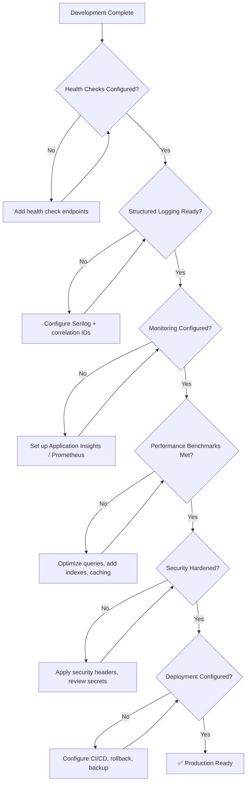

# Production Readiness Checklist

**Estimated Reading Time:** 10 minutes

---

## WHY

Moving from development to production is not just a deployment — it's a commitment to availability, performance, security, and operational excellence. BuildEstate Pro handles sensitive financial data, legal documents, and compliance records for real estate developers. Downtime costs money. Data loss triggers legal liability. Slow performance drives user abandonment. This checklist ensures every deployment meets enterprise standards before real users interact with the system.

---

## WHAT

Production readiness is verified across 6 categories: Health Checks, Structured Logging, Monitoring & Alerting, Performance Benchmarks, Security Hardening, and Deployment Configuration. Each category has specific, measurable criteria.

### Production Readiness Flow



---

## HOW

### 1. Health Checks

```csharp
// src/BuildEstate.API/Program.cs
builder.Services.AddHealthChecks()
    .AddSqlServer(
        connectionString,
        name: "database",
        timeout: TimeSpan.FromSeconds(5),
        tags: new[] { "ready" })
    .AddCheck<StorageHealthCheck>("file-storage", tags: new[] { "ready" })
    .AddCheck<ExternalApiHealthCheck>("external-apis", tags: new[] { "ready" });

app.MapHealthChecks("/health", new HealthCheckOptions
{
    Predicate = _ => true,
    ResponseWriter = UIResponseWriter.WriteHealthCheckUIResponse
});

app.MapHealthChecks("/health/live", new HealthCheckOptions
{
    Predicate = _ => false // Just confirms the app is running
});

app.MapHealthChecks("/health/ready", new HealthCheckOptions
{
    Predicate = check => check.Tags.Contains("ready")
});
```

**Checklist:**
- [ ] `/health/live` — Application process is running
- [ ] `/health/ready` — All dependencies accessible (DB, storage, external APIs)
- [ ] Database connectivity check with 5-second timeout
- [ ] File storage accessibility check
- [ ] External API reachability check (Land Registry, etc.)
- [ ] Health endpoints unauthenticated (load balancer can reach them)
- [ ] Health check UI configured for operations team

### 2. Structured Logging

```csharp
// Serilog configuration for production
Log.Logger = new LoggerConfiguration()
    .MinimumLevel.Information()
    .MinimumLevel.Override("Microsoft", LogEventLevel.Warning)
    .MinimumLevel.Override("System", LogEventLevel.Warning)
    .Enrich.FromLogContext()
    .Enrich.WithCorrelationId()
    .Enrich.WithEnvironmentName()
    .Enrich.WithMachineName()
    .WriteTo.Console(new JsonFormatter())
    .WriteTo.ApplicationInsights(
        telemetryConfiguration,
        TelemetryConverter.Traces)
    .CreateLogger();
```

**Checklist:**
- [ ] Correlation ID on every request (propagated through all layers)
- [ ] Structured properties (not string interpolation)
- [ ] Log levels appropriate (Info for business events, Error for failures)
- [ ] No sensitive data in logs (no passwords, tokens, PII)
- [ ] Log rotation configured (prevent disk fill)
- [ ] Centralized log aggregation (Application Insights, ELK, or similar)
- [ ] Request/response logging for API calls (development only, not production)

### 3. Monitoring & Alerting

**Checklist:**
- [ ] Request duration tracked per endpoint
- [ ] Error rate monitored (alert if >1% for 5 minutes)
- [ ] Database query duration tracked
- [ ] Active user sessions monitored
- [ ] Memory usage alerts (>80% threshold)
- [ ] CPU usage alerts (>90% for 2+ minutes)
- [ ] Disk space alerts (<10% remaining)
- [ ] Failed login attempt rate monitored
- [ ] Health check failure alerts (immediate)

### 4. Performance Benchmarks

```csharp
// Performance targets — verified via load testing
// Tool: k6, JMeter, or NBomber

// Benchmark test example:
[Fact]
public async Task GetOpportunities_With1000Records_CompletesUnder300ms()
{
    // Arrange: seed 1000 records
    var stopwatch = Stopwatch.StartNew();

    // Act
    var result = await _client.GetAsync("/api/v1/opportunities?pageSize=25");

    // Assert
    stopwatch.Stop();
    stopwatch.ElapsedMilliseconds.Should().BeLessThan(300);
    result.StatusCode.Should().Be(HttpStatusCode.OK);
}
```

**Checklist:**
- [ ] API responses < 300ms at P95 (with production-scale data)
- [ ] List endpoints < 200ms with pagination
- [ ] Search queries < 300ms across all modules
- [ ] Dashboard load < 500ms (aggregated data)
- [ ] File upload < 2s for files up to 10MB
- [ ] Concurrent user support: 100+ simultaneous users
- [ ] Database queries: no query exceeds 100ms individually
- [ ] Angular bundle size < 500KB initial load (gzipped)

### 5. Security Hardening

```csharp
// Security headers middleware
app.Use(async (context, next) =>
{
    context.Response.Headers.Append("X-Content-Type-Options", "nosniff");
    context.Response.Headers.Append("X-Frame-Options", "DENY");
    context.Response.Headers.Append("X-XSS-Protection", "1; mode=block");
    context.Response.Headers.Append("Strict-Transport-Security",
        "max-age=31536000; includeSubDomains");
    context.Response.Headers.Append("Content-Security-Policy",
        "default-src 'self'; script-src 'self'");
    context.Response.Headers.Append("Referrer-Policy", "strict-origin-when-cross-origin");
    context.Response.Headers.Append("Permissions-Policy",
        "camera=(), microphone=(), geolocation=()");
    await next();
});
```

**Checklist:**
- [ ] HTTPS only (HTTP redirects to HTTPS)
- [ ] Security headers configured (see above)
- [ ] CORS restricted to known origins
- [ ] Rate limiting on authentication endpoints (5 attempts per minute)
- [ ] JWT expiry set to 60 minutes
- [ ] Refresh token rotation enabled
- [ ] Connection strings in environment variables / Key Vault
- [ ] No secrets in source code or configuration files
- [ ] Account lockout after 5 failed attempts
- [ ] SQL injection protection (parameterized queries via EF Core)
- [ ] XSS protection (output encoding, CSP headers)

### 6. Deployment Configuration

**Checklist:**
- [ ] CI/CD pipeline configured (build → test → deploy)
- [ ] Blue-green or rolling deployment strategy
- [ ] Database migration runs automatically during deployment
- [ ] Rollback procedure documented and tested
- [ ] Backup strategy: daily full backup + hourly transaction log
- [ ] Disaster recovery plan with RTO < 4 hours, RPO < 1 hour
- [ ] Environment-specific configuration (Dev, Staging, Production)
- [ ] Feature flags for gradual rollout (optional)
- [ ] SSL/TLS certificates auto-renewal configured

---

## WHEN

- **Before first production deployment:** Complete all 6 categories
- **Before each release:** Verify performance benchmarks still met
- **Quarterly:** Security audit against hardening checklist
- **After incidents:** Review and strengthen relevant category

---

## WHERE

### Codebase Location

| Configuration | Path |
|--------------|------|
| Health Checks | `src/BuildEstate.API/Program.cs` |
| Logging Config | `src/BuildEstate.API/appsettings.Production.json` |
| Security Headers | `src/BuildEstate.API/Middleware/SecurityHeadersMiddleware.cs` |
| CORS Config | `src/BuildEstate.API/Program.cs` |
| Performance Tests | `tests/BuildEstate.Performance/` |
| Deployment Config | `.github/workflows/` or `azure-pipelines.yml` |

---

## WHO

| Role | Responsibility |
|------|---------------|
| DevOps Engineer | Health checks, monitoring, deployment pipeline |
| Backend Developer | Structured logging, performance optimization |
| Security Champion | Security hardening, vulnerability scanning |
| Tech Lead | Final sign-off on production readiness |
| Operations Team | Monitoring dashboard, alert response |

---

## WHAT NEXT

- [Future Roadmap](./31-future-roadmap.md) — What's deployed next
- [Debugging Guide](./28-debugging-guide.md) — Diagnosing production issues
- [Testing Strategy](./29-testing-strategy.md) — Performance testing approach
- [Security Framework](./11-security-framework.md) — Detailed security architecture

---

## Integration Steps

1. **Add health check packages** — `AspNetCore.HealthChecks.SqlServer`, `AspNetCore.HealthChecks.UI`
2. **Configure Serilog** — `Serilog.AspNetCore`, `Serilog.Sinks.ApplicationInsights`
3. **Set up Application Insights** — Azure portal + NuGet package
4. **Run load tests** — k6 scripts against staging environment
5. **Security scan** — Run OWASP ZAP against staging API
6. **Deploy to staging** — Verify all health checks pass before promoting to production

---

## Common Mistakes

### Mistake 1: No Health Checks — Load Balancer Can't Detect Failures

❌ **WRONG**

```csharp
// No health check endpoints configured
// Load balancer has no way to know if the app is healthy
// Sends traffic to crashed instances
app.MapControllers();
app.Run();
```

✅ **CORRECT**

```csharp
// Health checks configured — load balancer routes traffic intelligently
builder.Services.AddHealthChecks()
    .AddSqlServer(connectionString, name: "database", tags: new[] { "ready" });

app.MapHealthChecks("/health/live");  // Process alive
app.MapHealthChecks("/health/ready"); // Dependencies accessible
app.MapControllers();
app.Run();
```

### Mistake 2: Logging Sensitive Data

❌ **WRONG**

```csharp
_logger.LogInformation("User login: email={Email}, password={Password}",
    request.Email, request.Password); // NEVER log passwords!

_logger.LogInformation("Payment processed: card={CardNumber}, amount={Amount}",
    payment.CardNumber, payment.Amount); // NEVER log card numbers!
```

✅ **CORRECT**

```csharp
_logger.LogInformation("User login attempt for {Email}", request.Email);
// Password is never logged

_logger.LogInformation(
    "Payment {PaymentId} processed: amount={Amount}, last4={Last4}",
    payment.Id, payment.Amount, payment.CardNumber[^4..]); // Only last 4 digits
```
