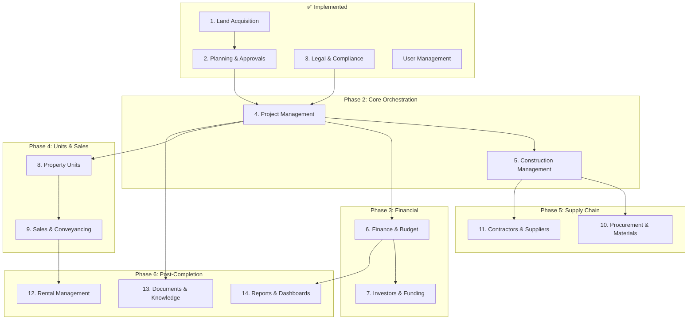
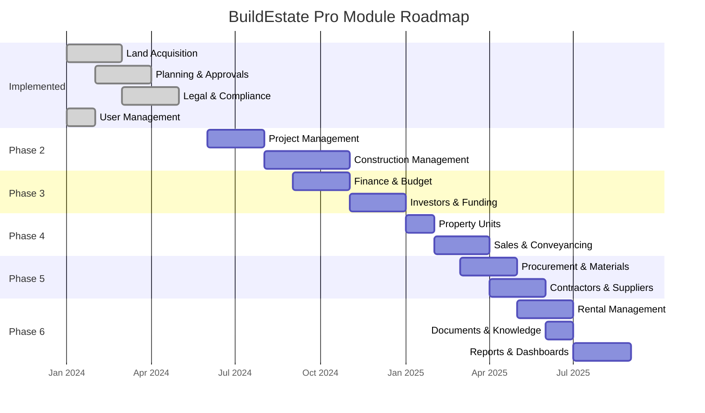

# Future Roadmap — Module Implementation Order

**Estimated Reading Time:** 10 minutes

---

## WHY

BuildEstate Pro has 14 core modules. Building them in the wrong order creates dependency nightmares — a Sales module without Property Units has nothing to sell, a Finance module without Projects has nothing to budget for. The recommended order maximizes value delivery at each stage, ensures data flows downstream correctly, and minimizes cross-module rework. Each module builds upon the data and patterns established by previous modules.

---

## WHAT

The 14 modules are organized by dependency and business value. Modules 1-3 (Land Acquisition, Planning & Approvals, Legal & Compliance) are already implemented and establish the foundation. The remaining 11 modules are recommended in a specific sequence based on data dependencies and business priority.

### Module Dependency Graph



### Implementation Timeline



---

## HOW

### Module 4: Project Management (Core Orchestration)

**Purpose:** Orchestrates all activities across modules with milestones, tasks, risks, and timelines.

**Shared Data Consumed:** Opportunities (Land Acquisition), Applications (Planning), Legal Cases (Legal)

**Interface Contracts:**
```csharp
// Exposes
public interface IProjectService
{
    Task<ProjectDto> GetByIdAsync(Guid projectId, CancellationToken ct);
    Task<IReadOnlyList<MilestoneDto>> GetMilestonesAsync(Guid projectId, CancellationToken ct);
    Task<ProjectSummaryDto> GetSummaryAsync(Guid projectId, CancellationToken ct);
}

// Consumes
// - IOpportunityService (from Land Acquisition)
// - IPlanningApplicationService (from Planning)
// - ILegalCaseService (from Legal & Compliance)
```

**Extension Points:** Custom task types, configurable milestone templates, third-party project tool sync

---

### Module 5: Construction Management

**Purpose:** Tracks physical project delivery through stages, inspections, and snagging.

**Shared Data Consumed:** Projects (Project Management), Planning conditions (Planning)

**Interface Contracts:**
```typescript
// Angular service contract
interface ConstructionService {
  getStages(projectId: string): Observable<ConstructionStageDto[]>;
  updateProgress(stageId: string, percent: number): Observable<ConstructionStageDto>;
  createInspection(stageId: string, dto: CreateInspectionDto): Observable<InspectionDto>;
  createSnaggingItem(stageId: string, dto: CreateSnaggingDto): Observable<SnaggingItemDto>;
}
```

**Extension Points:** IoT sensor integration, drone survey data, BIM model linking

---

### Module 6: Finance & Budget Control

**Purpose:** Tracks project budgets, actual costs, invoices, and cash flow forecasting.

**Shared Data Consumed:** Projects (PM), Contracts (Land Acquisition), Purchase Orders (Procurement)

**Interface Contracts:**
```csharp
public interface IFinanceService
{
    Task<BudgetSummaryDto> GetProjectBudgetAsync(Guid projectId, CancellationToken ct);
    Task<CashFlowForecastDto> GetCashFlowAsync(Guid projectId, CancellationToken ct);
    Task<decimal> GetTotalCommittedCostAsync(Guid projectId, CancellationToken ct);
}
```

**Extension Points:** Multi-currency support, accounting system integration (Xero, Sage), bank feed import

---

### Module 7: Investors & Funding

**Purpose:** Manages investor profiles, funding commitments, drawdowns, and return calculations.

**Shared Data Consumed:** Projects (PM), Budgets (Finance), Sales Revenue (Sales)

**Extension Points:** Investor portal, automated return calculations, fund structure management

---

### Module 8: Property Units

**Purpose:** Manages individual units (flats, houses, commercial) within development projects.

**Shared Data Consumed:** Projects (PM), Construction stages (Construction), Planning applications (Planning)

**Extension Points:** Floor plan integration, virtual tour embedding, unit comparison tools

---

### Module 9: Sales & Conveyancing

**Purpose:** Manages the end-to-end sales process from lead to key handover.

**Shared Data Consumed:** Property Units, Projects, Legal Cases, Finance

**Extension Points:** Portal integration, mortgage broker APIs, solicitor case management sync

---

### Module 10: Procurement & Materials

**Purpose:** Controls purchasing, supplier management, and delivery tracking.

**Shared Data Consumed:** Projects (PM), Construction stages, Budgets (Finance)

**Extension Points:** Supplier portal, automated reordering, materials waste tracking

---

### Module 11: Contractors & Suppliers

**Purpose:** Manages contractor database, performance reviews, and payment applications.

**Shared Data Consumed:** Projects (PM), Purchase Orders (Procurement), Finance

**Extension Points:** Contractor self-service portal, certification verification API, payment automation

---

### Module 12: Rental Management

**Purpose:** Manages retained rental properties post-completion.

**Shared Data Consumed:** Property Units, Projects, Finance

**Extension Points:** Tenant portal, automated rent reminders, maintenance contractor dispatch

---

### Module 13: Documents & Knowledge

**Purpose:** Enhanced document management with version control, templates, and knowledge base.

**Shared Data Consumed:** All modules (cross-cutting document repository)

**Extension Points:** OCR for scanned documents, AI document classification, e-signature integration

---

### Module 14: Reports & Dashboards

**Purpose:** Executive dashboards and operational reports across all modules.

**Shared Data Consumed:** All modules (read-only aggregation)

**Extension Points:** Custom report builder, scheduled report delivery, data export API

---

## WHEN

- **Quarterly planning:** Select next module(s) based on business priority
- **Sprint planning:** Break selected module into 4-6 week implementation plan
- **Dependency check:** Before starting a module, verify all upstream modules are stable
- **Stakeholder alignment:** Business teams confirm module priority each quarter

---

## WHERE

### Codebase Location

| Module | Backend Path | Frontend Path |
|--------|-------------|---------------|
| Project Management | `src/BuildEstate.Domain/Entities/ProjectManagement/` | `client-app/src/app/features/project-management/` |
| Construction | `src/BuildEstate.Domain/Entities/Construction/` | `client-app/src/app/features/construction/` |
| Finance | `src/BuildEstate.Domain/Entities/Finance/` | `client-app/src/app/features/finance/` |
| Investors | `src/BuildEstate.Domain/Entities/Investors/` | `client-app/src/app/features/investors/` |
| Property Units | `src/BuildEstate.Domain/Entities/PropertyUnits/` | `client-app/src/app/features/property-units/` |
| Sales | `src/BuildEstate.Domain/Entities/Sales/` | `client-app/src/app/features/sales/` |
| Procurement | `src/BuildEstate.Domain/Entities/Procurement/` | `client-app/src/app/features/procurement/` |
| Contractors | `src/BuildEstate.Domain/Entities/Contractors/` | `client-app/src/app/features/contractors/` |
| Rental | `src/BuildEstate.Domain/Entities/Rental/` | `client-app/src/app/features/rental/` |
| Documents | `src/BuildEstate.Domain/Entities/Documents/` | `client-app/src/app/features/documents/` |
| Reports | `src/BuildEstate.Domain/Entities/Reports/` | `client-app/src/app/features/reports/` |

---

## WHO

| Role | Decision |
|------|---------|
| Product Owner | Prioritizes module order based on business value |
| Tech Lead | Validates dependency order and technical feasibility |
| Architecture Board | Approves interface contracts between modules |
| Development Team | Estimates effort and identifies risks |

---

## WHAT NEXT

- [How to Build the Next Module](./24-how-to-build-the-next-module.md) — Step-by-step playbook for implementation
- [Definition of Done](./25-definition-of-done.md) — Quality criteria for each module
- [Learning Path](./00-learning-path.md) — Navigate the full academy documentation
- [Module Pattern](./19-module-pattern.md) — Established patterns each module follows

---

## Integration Steps

1. **Review dependencies** — Confirm upstream modules are complete and stable
2. **Define interface contracts** — Agree on the service interfaces consumed and exposed
3. **Follow the playbook** — Use [How to Build the Next Module](./24-how-to-build-the-next-module.md)
4. **Register search provider** — Every entity must be globally searchable
5. **Update this roadmap** — Mark module as implemented once DoD is met

---

## Common Mistakes

### Mistake 1: Building a Module Before Its Dependencies Are Stable

❌ **WRONG**

```
Sprint Plan: "Build Sales & Conveyancing module"
Status of Property Units module: "In progress, 60% complete"
Problem: Sales has nothing to sell — Property Unit IDs don't exist yet
```

✅ **CORRECT**

```
Sprint Plan: "Build Sales & Conveyancing module"
Prerequisite check:
  - Property Units: ✅ Complete and deployed
  - Project Management: ✅ Complete and deployed
  - Finance (for price tracking): ✅ Complete and deployed
Decision: Safe to proceed — all data sources available
```

### Mistake 2: Not Defining Interface Contracts Before Starting

❌ **WRONG**

```csharp
// Construction module directly queries Project Management's DbContext
var project = await _projectDbContext.Projects.FindAsync(projectId);
// Tight coupling — if PM changes its schema, Construction breaks
```

✅ **CORRECT**

```csharp
// Construction module uses a defined interface
public class CreateStageCommandHandler : IRequestHandler<CreateStageCommand, StageDto>
{
    private readonly IProjectService _projectService; // Interface contract

    public async Task<StageDto> Handle(CreateStageCommand request, CancellationToken ct)
    {
        // Verify project exists via interface — decoupled
        var project = await _projectService.GetByIdAsync(request.ProjectId, ct)
            ?? throw new NotFoundException(nameof(Project), request.ProjectId);

        // Continue with stage creation...
    }
}
```
