# BuildEstate Pro Design System — Executive Summary

## What We Built

BuildEstate Pro is an enterprise platform managing the full lifecycle of real estate development — from land acquisition through construction, sales, and long-term asset management. It serves 14 business modules and 12 distinct user roles.

The **Design System** is the unified component library that powers the entire frontend. Instead of each module building its own buttons, tables, forms, and dialogs, every team draws from one governed set of building blocks. The result: a platform that looks, feels, and behaves like a single product — no matter which module a user navigates to.

---

## Why It Matters

### Before: Ad-Hoc Component Patterns

| Problem | Impact |
|---------|--------|
| Each module implemented its own tables, modals, and forms | Inconsistent user experience across modules |
| No shared accessibility standards | Compliance risk (WCAG, equality legislation) |
| Colour values hardcoded throughout | Dark mode impossible, branding changes expensive |
| No governance over component creation | Duplicated code, 3x maintenance cost |
| Different loading states per developer | Users confused by varying feedback patterns |

### After: Governed Design System

| Solution | Impact |
|----------|--------|
| Single component library with barrel export | Import once, use everywhere |
| WCAG 2.1 AA compliance built into every component | Legal compliance, inclusive for all users |
| DaisyUI theme tokens exclusively | Theme switch in 100ms, brand changes in minutes |
| Search-before-create governance | Zero duplication, predictable maintenance |
| Consistent loading, empty, and error states | Users always know what's happening |

---

## Key Numbers

| Metric | Value |
|--------|-------|
| Components delivered | 49 |
| Unit & integration tests | 188 |
| Property-based correctness proofs | 28 |
| Form controls with ControlValueAccessor | 12 |
| Supported themes | 4 (Light, Dark, Corporate, Business) |
| Font scale modes | 3 (Small, Regular, Large) |
| Responsive breakpoints | 4 (Mobile, Tablet, Laptop, Desktop) |
| Accessibility standard | WCAG 2.1 AA |
| Build errors | 0 |
| Modules served | 14 |

---

## Business Value

### Development Speed

New pages are assembled from existing building blocks. A developer creating a new list page imports `app-data-table`, `app-filter-bar`, `app-empty-state`, and `app-loading-overlay` — production-ready in hours rather than days.

### Consistency

Every table sorts the same way. Every modal traps focus the same way. Every form validates with the same patterns. Users learn one interaction model and carry it across all 14 modules.

### Accessibility Compliance

WCAG 2.1 AA is not an afterthought. Keyboard navigation, screen reader support, focus management, reduced motion, and colour contrast are engineered into the component layer. Feature developers inherit compliance automatically.

### Theme & Display Flexibility

Four themes available at launch. Three font scale modes for users who prefer compact or enlarged interfaces. All controlled at runtime — no page reload, no code changes.

### Reduced Risk

28 property-based tests mathematically prove that critical invariants hold for thousands of random inputs. This catches edge cases traditional example-based tests miss.

---

## Architecture at a Glance

```mermaid
graph TD
    subgraph "Feature Modules (14)"
        LA[Land Acquisition]
        PM[Project Management]
        FIN[Finance]
        SALES[Sales]
        CON[Construction]
        DOTS[...]
    end

    subgraph "Design System Layer"
        DS[shared/design-system/]
        IDX[index.ts — Barrel Export]
        TOK[design-system-tokens.css]
    end

    subgraph "Component Categories"
        MOD[Modals]
        TBL[Tables]
        FLT[Filters]
        FRM[Forms — 12 Controls]
        CUR[Currency]
        DTE[Dates]
        UPL[File Upload]
        BDG[Badges — 4 Types]
        DLG[Confirmation Dialogs]
        LDG[Loading — 6 Variants]
        EMP[Empty States]
        DSH[KPI Cards]
        TML[Timeline]
        STP[Stepper]
        PPL[Pipeline]
        APR[Approval Panel]
        NTF[Notifications]
    end

    subgraph "Services & State"
        THE[ThemeEngine]
        FSC[FontScaleService]
        DPS[DisplayPreferenceService]
        NGX[NgRx Preferences Store]
    end

    LA --> IDX
    PM --> IDX
    FIN --> IDX
    SALES --> IDX
    CON --> IDX
    DOTS --> IDX

    IDX --> MOD
    IDX --> TBL
    IDX --> FLT
    IDX --> FRM
    IDX --> CUR
    IDX --> DTE
    IDX --> UPL
    IDX --> BDG
    IDX --> DLG
    IDX --> LDG
    IDX --> EMP
    IDX --> DSH
    IDX --> TML
    IDX --> STP
    IDX --> PPL
    IDX --> APR
    IDX --> NTF

    IDX --> THE
    IDX --> FSC
    IDX --> DPS
    DPS --> NGX
```

---

## The Vision: One System, 14 Modules

Every module in BuildEstate Pro — from Land Acquisition to Reports & Dashboards — consumes the same design system. When a component improves, all 14 modules benefit simultaneously. When accessibility standards tighten, one fix propagates everywhere.

This is not a component library. This is the **visual contract** between BuildEstate Pro and its users.

---

## What's Next

- Component storybook / playground (PreviewLab already ships as a starting point)
- Design token export for Figma sync
- Additional themes based on client branding requirements
- Performance budgets per component bundle
- Automated accessibility regression testing in CI

---

*Document prepared by the BuildEstate Pro Architecture Team — July 2025*
