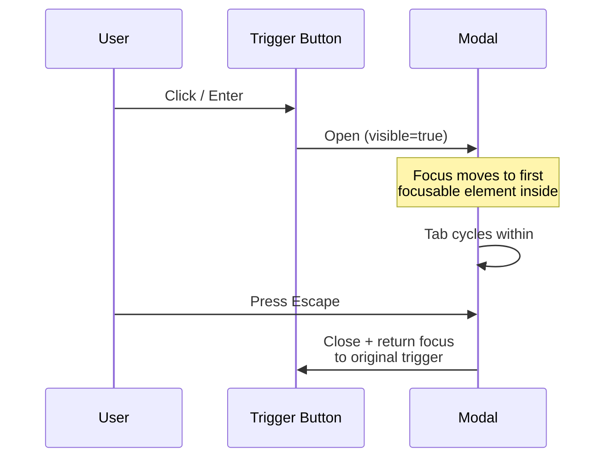
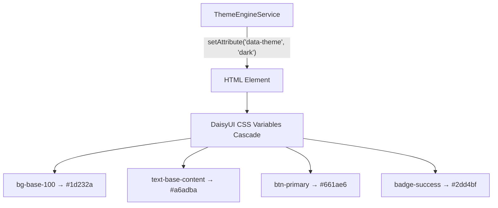

# BuildEstate Pro Design System — Accessibility & UX

## Compliance Standard

**WCAG 2.1 Level AA** — every component in the design system meets this standard. Accessibility is not a feature flag or an optional layer; it is built into the component architecture itself.

---

## Keyboard Navigation Patterns

Every interactive element in the design system is operable without a mouse.

### Navigation Patterns by Component

| Component | Tab | Enter/Space | Escape | Arrow Keys |
|-----------|-----|-------------|--------|------------|
| Modal | Cycles within (trapped) | Activates focused button | Closes modal | — |
| Data Table | Moves between headers, rows, actions | Toggles sort on header; activates action | — | — |
| Filter Bar | Moves between filter controls | Opens dropdown / applies filter | Closes open dropdown | Navigates dropdown options |
| Form Controls | Moves between fields | Toggles (checkbox/radio/toggle) | — | — |
| Select/Dropdown | Focuses control | Opens dropdown | Closes dropdown | Navigates options |
| Date Picker | Focuses input | Opens calendar popup | Closes calendar | Navigates days in calendar |
| Confirm Dialog | Cycles between buttons (trapped) | Activates focused button | Cancels (dismiss) | — |
| File Upload | Focuses drop zone | Opens file browser | — | — |
| Badge | Not focusable (informational) | — | — | — |
| Loading Button | Focuses button | Activates (when not loading) | — | — |

### Focus Trap Implementation

Modals and confirmation dialogs implement true focus traps using Angular CDK's `A11yModule`:

```
┌─────────────────────────────────┐
│  Modal Content                  │
│                                 │
│  [Tab] → First focusable        │
│  [Tab] → Second focusable       │
│  [Tab] → Last focusable         │
│  [Tab] → ↺ Back to first        │
│                                 │
│  [Shift+Tab] → ↻ Reverse cycle  │
│  [Escape] → Close modal         │
└─────────────────────────────────┘
```

---

## Screen Reader Support

### ARIA Attributes by Component Type

**Modals:**
```html
<div role="dialog" aria-modal="true" aria-labelledby="modal-title-123">
  <h2 id="modal-title-123">Create Opportunity</h2>
  <!-- content -->
</div>
```

**Form Controls:**
```html
<div>
  <label id="label-456" for="input-456">Site Name</label>
  <input
    id="input-456"
    aria-describedby="help-456 error-456"
    aria-invalid="true"
    aria-required="true" />
  <span id="help-456">The official name for this land opportunity</span>
  <span id="error-456" role="alert">Site name is required</span>
</div>
```

**Badges:**
```html
<span role="status" aria-label="Status: Active" class="badge badge-success">
  Active
</span>
```

**Loading States:**
```html
<div aria-busy="true" aria-label="Loading opportunities...">
  <app-skeleton-table></app-skeleton-table>
</div>
```

**Data Table Headers:**
```html
<th scope="col" aria-sort="ascending" tabindex="0">
  Name ▲
</th>
```

**Confirm Dialog:**
```html
<div role="alertdialog" aria-modal="true" aria-labelledby="confirm-title" aria-describedby="confirm-message">
  <h3 id="confirm-title">Delete Opportunity</h3>
  <p id="confirm-message">This action cannot be undone.</p>
</div>
```

---

## Focus Management

### Modal Open/Close Flow



### Rules

1. **On open:** Focus moves to the first focusable element inside the modal
2. **During open:** Tab/Shift+Tab cycles within the modal (focus trap)
3. **On close:** Focus returns to the element that triggered the modal
4. **Dynamic content:** When form errors appear, focus is not stolen — `role="alert"` announces to screen readers without disrupting position

---

## Reduced Motion Support

When the user has `prefers-reduced-motion: reduce` active in their OS settings:

| Component | Normal Behaviour | Reduced Motion Behaviour |
|-----------|-----------------|--------------------------|
| Modal | Scale + fade animation (200ms) | Instant appear/disappear |
| Skeleton loaders | Shimmer animation (gradient sweep) | Static grey placeholder |
| Loading spinner | Continuous rotation | Static icon or opacity pulse |
| Badge appearance | Subtle fade-in | Instant render |
| Filter chip add/remove | Slide animation | Instant add/remove |
| Theme transition | 100ms cross-fade | Instant switch |

**Implementation:**

```css
@media (prefers-reduced-motion: reduce) {
  *, *::before, *::after {
    animation-duration: 0.01ms !important;
    animation-iteration-count: 1 !important;
    transition-duration: 0.01ms !important;
  }
}
```

All animations in the design system respect this media query. No exceptions.

---

## Touch Targets

On viewports below 768px (tablet and mobile), all interactive elements meet minimum touch target requirements:

| Element | Minimum Size | Implementation |
|---------|-------------|----------------|
| Buttons | 44×44px | `min-h-[44px] min-w-[44px]` |
| Table row actions | 44×44px | Padding expanded on mobile |
| Filter controls | 44×44px | Larger tap zones on mobile |
| Toggle switch | 44×44px | Touch area extends beyond visual |
| Checkbox/Radio | 44×44px | Clickable label area |
| Close buttons (modal) | 44×44px | Icon button with padding |
| File upload drop zone | Full width × 120px | Large drop area |

**Spacing:** Adjacent touch targets have at least 8px gap to prevent accidental activation.

---

## Skip Navigation

The first focusable element on every page is a skip navigation link:

```html
<a href="#main-content" class="sr-only focus:not-sr-only focus:absolute focus:top-2 focus:left-2 focus:z-[9999] focus:bg-primary focus:text-primary-content focus:p-2 focus:rounded">
  Skip to main content
</a>

<!-- ... navigation, header, sidebar ... -->

<main id="main-content" tabindex="-1">
  <!-- Page content -->
</main>
```

This allows keyboard users to bypass repetitive navigation and jump directly to the page content.

---

## Colour Contrast Governance

### How It Works

All colours come from DaisyUI theme tokens. These tokens are pre-validated for WCAG contrast ratios across all supported themes.

| Requirement | Minimum Ratio | Where Applied |
|-------------|--------------|---------------|
| Normal text (< 18px) | 4.5:1 | `text-base-content` on `bg-base-100` |
| Large text (≥ 18px or 14px bold) | 3:1 | Headings, large labels |
| Non-text UI (icons, borders) | 3:1 | Icons, focus rings, badge borders |
| Focus indicators | 3:1 | `ring-2 ring-offset-2` utilities |

### Why DaisyUI Tokens Guarantee Compliance

DaisyUI themes are designed with contrast in mind. By exclusively using semantic classes (`text-base-content`, `bg-base-100`, `badge-success`), we inherit the theme's contrast guarantees. This is why hardcoded colours are banned — a developer using `#666` might pass contrast in light mode but fail in dark mode.

### Colour Never Carries Meaning Alone

Every colour-coded element is paired with a text label or icon:

```html
<!-- Badge: colour + text label -->
<span class="badge badge-error">Critical</span>

<!-- Status: colour + icon + text -->
<span class="text-warning">⚠ Pending Review</span>

<!-- Form error: red border + error icon + error text -->
<input class="input-error" aria-invalid="true" />
<span class="text-error">⚠ This field is required</span>
```

---

## Font Scale System

Three display modes allow users to choose their preferred information density:

| Mode | Scale | Use Case |
|------|-------|----------|
| Small | 0.85x | Power users who want maximum data density |
| Regular | 1.0x | Default — balanced readability and density |
| Large | 1.2x | Users who prefer larger text for readability |

### What Scales

- Font size (`--ds-font-size-base`)
- Line height (`--ds-line-height-base`)
- Spacing unit (`--ds-spacing-unit`)
- Table row height (`--ds-table-row-height`)
- Input height (`--ds-input-height`)

### How It Works

```mermaid
graph LR
    UI[User selects "Large"]
    UI --> SVC[FontScaleService]
    SVC -->|setAttribute| HTML["&lt;html data-scale='large'&gt;"]
    SVC -->|setProperty| CSS["--ds-font-size-base: 1.2rem"]
    CSS --> ALL[All components scale instantly]
```

No page reload. No component re-render. Pure CSS cascade.

---

## Theme Engine

### Supported Themes

| Theme | Data Attribute | Character |
|-------|---------------|-----------|
| Light | `data-theme="light"` | Clean, bright, high contrast |
| Dark | `data-theme="dark"` | Reduced eye strain, dark backgrounds |
| Corporate | `data-theme="corporate"` | Professional blue, boardroom-ready |
| Business | `data-theme="business"` | Neutral, focused on content |

### How Themes Apply



Every component automatically adapts because they only reference semantic tokens — never raw colour values.

### Theme Persistence

1. User selects theme in Preferences page
2. `DisplayPreferenceService` applies immediately via `ThemeEngine`
3. Preference saved to `PUT /api/v1/user-preferences` in background
4. On next login: preference loaded and applied before first paint

---

## Accessibility Testing Approach

### Automated (Built into Tests)

- Property tests verify ARIA attributes for random input combinations
- Property test 25: Badge ARIA labels always include category context
- Property test 27: Loading states always set `aria-busy="true"`
- Form accessibility property tests verify label/control binding

### Manual (Required for Full Compliance)

Full WCAG 2.1 AA validation requires:

- Keyboard-only navigation testing (no mouse for entire workflow)
- Screen reader testing (NVDA on Windows, VoiceOver on macOS)
- High contrast mode testing (Windows High Contrast)
- 200% browser zoom testing (no content loss)
- Reduced motion testing (OS-level preference enabled)

> **Note:** Automated tests provide a strong baseline, but full accessibility compliance ultimately requires manual testing with assistive technologies and expert accessibility review.

---

*Accessibility is not a checkbox. It's a commitment to every user who interacts with BuildEstate Pro.*
