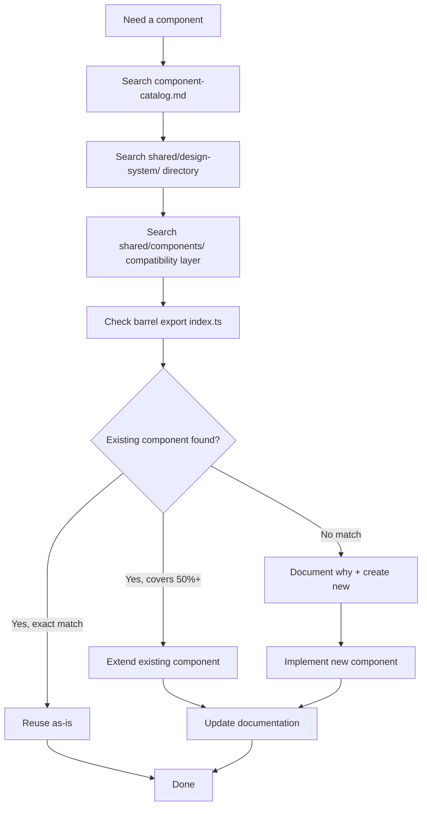

# BuildEstate Pro Design System — Governance & Process

## Why Governance Matters

A design system without governance is just a folder of components. Over time, developers create duplicates, patterns drift, and the "system" becomes a graveyard of abandoned abstractions.

BuildEstate Pro serves 14 modules. Without governance, each module would evolve its own table component, its own modal, its own badge pattern. The governance framework prevents this — ensuring one system serves all modules consistently.

---

## The Core Rule: Search Before Create

Before writing a single line of component code, developers must prove they've searched the existing library:



**Evidence required in PR:** Which components were reviewed and why they don't satisfy the requirement.

---

## Component Creation Workflow

### Step 1: Search the Library

| Source | What to Check |
|--------|---------------|
| `docs/frontend/component-catalog.md` | Authoritative list of all 49 components |
| `shared/design-system/` directory | Implementation files |
| `shared/components/` | Compatibility layer re-exports |
| `design-system/index.ts` | Barrel export (public API) |

### Step 2: Extension Assessment

If an existing component covers ≥50% of the requirement:

- **Extend it** with new `@Input()` properties
- Add configuration inputs for variations (size, mode, variant)
- Do NOT create a new component

**Exception:** Extension would break more than 3 existing consumers or violate single responsibility.

### Step 3: Placement Decision

| Scenario | Location |
|----------|----------|
| Generic UI (not domain-specific) | `shared/design-system/{category}/` |
| Used by 2+ modules | `shared/design-system/{category}/` |
| Domain-specific, single module only | Feature module (temporary) |
| Second module needs it | Migrate to `shared/design-system/` immediately |

### Step 4: Implement

Every new design system component must:

- [ ] Use `standalone: true`
- [ ] Use `ChangeDetectionStrategy.OnPush`
- [ ] Accept data via `@Input()` only
- [ ] Emit events via `@Output()` only
- [ ] Include ARIA attributes
- [ ] Use DaisyUI + Tailwind CSS exclusively
- [ ] Use Material Symbols Outlined for icons
- [ ] Include JSDoc with `@example` on public APIs
- [ ] Implement `ControlValueAccessor` if it's a form control

### Step 5: Document

Before the component is considered complete:

1. Add entry to `docs/frontend/component-catalog.md`
2. Add full documentation to `docs/frontend/component-library.md`
3. Add barrel export to `design-system/index.ts`

---

## PR Review Checklist

Every pull request that introduces or modifies a component must answer these questions:

| # | Question | Required Evidence |
|---|----------|-------------------|
| 1 | Was the Component Library searched? | List of components reviewed |
| 2 | Does an overlapping component exist? | Comparison of input/output contracts |
| 3 | If overlap exists, why can't it be extended? | Technical justification (max 3 sentences) |
| 4 | Is WCAG 2.1 AA compliance met? | Keyboard nav, ARIA, contrast documented |
| 5 | Does it render at all 4 breakpoints? | Desktop, Laptop, Tablet, Mobile confirmed |
| 6 | Does it render in Light and Dark themes? | Both verified |
| 7 | Is documentation updated? | Catalog + library + barrel export |
| 8 | Are property-based tests included? | For universal invariants |

---

## Rejection Criteria

A PR **must be rejected** if any of the following apply:

| Violation | Reason |
|-----------|--------|
| No library search evidence | Governance bypass — potential duplication |
| Duplicates existing component's contract | Wasted work + maintenance burden |
| Missing accessibility compliance | Legal risk + user exclusion |
| Documentation not updated | Component invisible to other developers |
| Hardcoded colour values | Breaks theming, dark mode |
| Missing `OnPush` change detection | Performance risk at scale |
| Does not render at all breakpoints | Broken for subset of users |
| Does not work in both Light and Dark | Theme-unaware component |

---

## Migration Strategy

### The Compatibility Layer Approach

When the design system was introduced, existing feature modules already imported from `shared/components/`. Rather than a disruptive migration, we used a re-export strategy:

```
Phase 1: Build new components in shared/design-system/
Phase 2: Update shared/components/index.ts to re-export from new locations
Phase 3: Existing imports continue working (no breaking changes)
Phase 4: New features import directly from shared/design-system/
Phase 5: Gradually update old imports in subsequent PRs
```

**Result:** Zero downtime. Zero breaking changes. Gradual migration.

### Migration on Second Use

When a component initially lives in a feature module and a second module needs it:

1. Move component to `shared/design-system/{category}/`
2. Update all existing imports
3. Add to barrel export
4. Add to catalog and documentation
5. All in the same PR — no "I'll do it later" allowed

---

## Documentation Requirements Per Component

Every component must have documentation at three levels:

### Level 1: Catalog Entry (`component-catalog.md`)

Quick reference: selector, purpose (1 sentence), file path.

```markdown
| CurrencyDisplayComponent | `<app-currency>` | GBP currency display/edit with formatting | `currency/currency-display/` |
```

### Level 2: Library Reference (`component-library.md`)

Full documentation: purpose, all inputs, all outputs, usage example, accessibility notes, theme behaviour.

### Level 3: Inline JSDoc

```typescript
/**
 * Displays and optionally edits currency values with GBP formatting.
 *
 * Supports display, edit, and readonly modes. In edit mode, implements
 * ControlValueAccessor for Reactive Forms integration.
 *
 * @example
 * <!-- Display mode -->
 * <app-currency [value]="1250000" mode="display" />
 *
 * @example
 * <!-- Edit mode with form binding -->
 * <app-currency formControlName="price" mode="edit" [decimalPrecision]="2" />
 */
@Component({ ... })
export class CurrencyDisplayComponent { ... }
```

---

## Steering Files

The design system is governed by steering files that enforce rules during AI-assisted development:

| Steering File | What It Enforces |
|---------------|-----------------|
| `component-library-rules.md` | Search-before-create, extension preference, no duplication |
| `component-review-checklist.md` | Full pre-implementation and PR review checklist |
| `frontend-reusable-components.md` | Library-first development, future module compatibility |
| `FRONTEND-ARCHITECTURE-REVIEW-BOARD.md` | Architecture scoring, rejection criteria |
| `accessibility-and-display-preferences.md` | WCAG 2.1 AA standards, ARIA requirements |
| `frontend-standards.md` | OnPush, TypeScript strict, no `any`, naming conventions |

These files are consulted automatically during development, creating a "governance guardrail" that prevents architectural drift.

---

## Definition of Done Alignment

A design system component is **done** when:

- [ ] Implementation complete (standalone, OnPush, accessible)
- [ ] Unit tests passing
- [ ] Property-based tests for universal invariants (where applicable)
- [ ] Renders correctly at all 4 breakpoints
- [ ] Renders correctly in Light + Dark themes
- [ ] Catalog entry added
- [ ] Library documentation added
- [ ] Barrel export updated
- [ ] JSDoc on public API
- [ ] PR review checklist completed
- [ ] No rejection criteria triggered

---

## Governance in Practice

### Scenario: Developer Needs a "Risk Badge"

1. **Search:** Checks catalog → finds `StatusBadgeComponent`, `PriorityBadgeComponent`, `StageBadgeComponent`
2. **Assess:** Existing badges share `BaseBadgeComponent` abstract class. A risk badge is the same pattern with different map entries.
3. **Decision:** Create `RiskBadgeComponent` extending `BaseBadgeComponent` (shares 90% of logic)
4. **Implement:** New component with risk-specific `badgeMap`
5. **Document:** Catalog entry + library docs + barrel export
6. **Test:** Property tests inherited from badge system + risk-specific map tests

Total effort: ~30 minutes. No duplication. Full documentation. Consistent API.

### Scenario: Developer Creates a One-Off Table in a Feature Module

1. **PR Review:** Reviewer asks — "Why not use `app-data-table`?"
2. **Developer:** "I needed custom row templates"
3. **Reviewer:** "app-data-table supports custom cell templates via column type configuration. Please use it."
4. **Outcome:** PR rejected with reference to existing component documentation.

This is governance working correctly — preventing duplication before it enters the codebase.

---

*The goal is not to slow developers down. The goal is to make the right thing the easy thing.*
